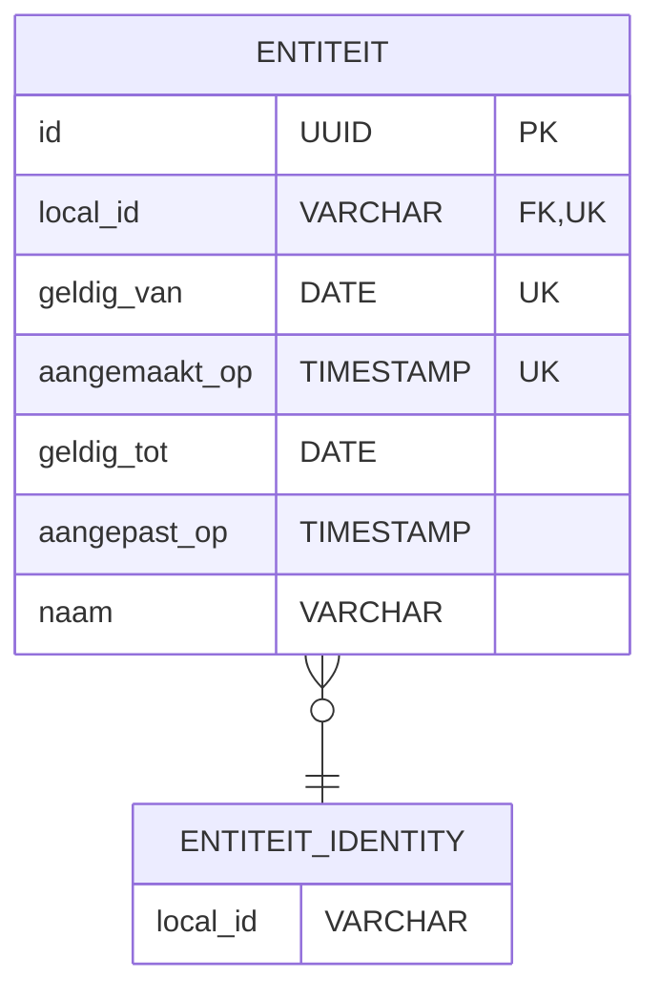
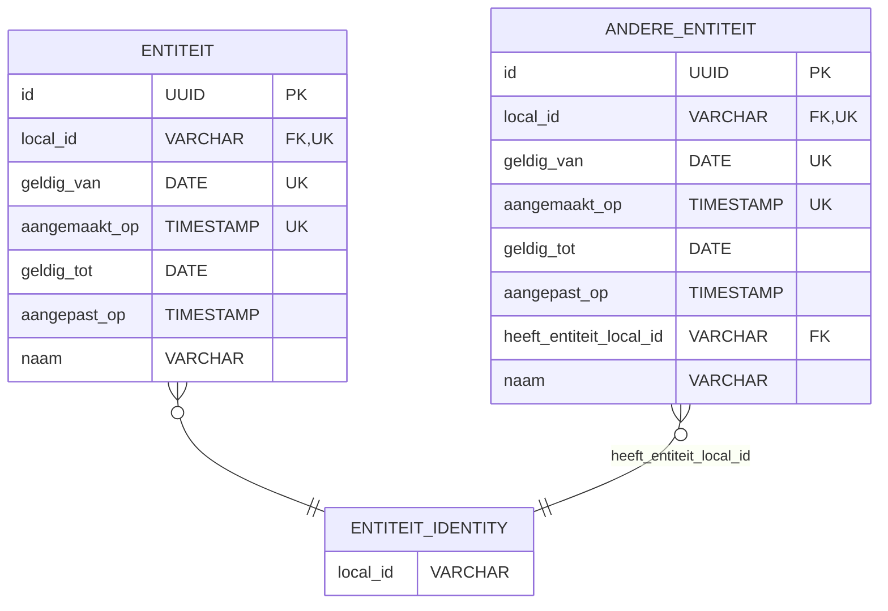

# RIE-IEPR Datamodel
## Databank

Op [IDENTIFICATIE](./IDENTIFICATIE.md) hebben we het gehad over de identificatie van entiteiten en versies. In deze sectie gaan we dieper in op hoe deze identificatie wordt geïmplementeerd in de databank.

[TOC]

### Comments
De databank zal gebruik maken van comments om de URIs van tabellen en kolommen te documenteren. Dit zal naast documentatiedoeleinden ook gebruikt worden
bij de transformatie van het applicatief datamodel naar de gold layer (context).

### Identiteitstabellen
Een identiteitstabel (identity table) is een tabel die gebruikt wordt om de unieke entiteiten te identificeren.
Voor tabellen met versionering zal er een identity tabel bestaan die **stabiel** is en enkel de lokale identifier bevat. Deze tabel zal gebruikt worden om relaties te leggen tussen verschillende entiteiten, zonder dat we ons zorgen moeten maken over de versie van de entiteit.
Deze identity table kan ook data bevatten dat niet verandert tussen versies. Bijvoorbeeld in een register is het van belang dat we niet-wijzigende data zoals de naam van een emissiepunt niet in de versie tabel staat, maar in de identity tabel. Op deze manier kunnen we altijd de naam van een emissiepunt opvragen zonder dat we ons zorgen moeten maken over welke versie we moeten gebruiken.

Op de versietabel zelf gebruiken we **geen** samengestelde primaire sleutel op `local_id`, `geldig_van` en `aangemaakt_op`, maar een surrogaatsleutel `id` (UUID). De combinatie van `local_id`, `geldig_van` en `aangemaakt_op` blijft wel de versie functioneel identificeren (zie [IDENTIFICATIE.md](./IDENTIFICATIE.md)) en wordt afgedwongen via een unieke sleutel (UK) op de versietabel.

Bij relaties zal de referentie steeds naar de identity tabel zijn, zodat we niet moeten zorgen over welke versie van de entiteit we moeten gebruiken bij het leggen van relaties.
Voor open-einde geldigheid gebruiken we in de databank consequent de sentinelwaarde `9999-12-31` in plaats van `NULL` voor `geldig_tot`.

