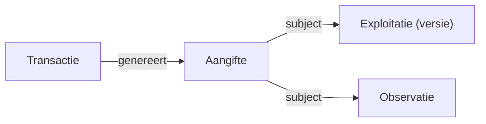

# RIE-IEPR Datamodel
## Transactiegegevens

[TOC]

```mermaid
flowchart LR
    AANGIFTE["Aangifte"]
    TRANSACTIE["Transactie"]
    EXPLOITATIE["Exploitatie (versie)"]
    OBSERVATIE["Observatie"]
    
    TRANSACTIE -->|genereert| AANGIFTE
    AANGIFTE -->|subject| EXPLOITATIE
    AANGIFTE -->|subject| OBSERVATIE
```