# RIE-IEPR Datamodel
## Datastructuur Processen
In deze documentatie gebruiken we de Engelse termen voor relaties.

[TOC]

> Gouden regel: Processen zijn het skelet dat alles aan elkaar hangt. Alles onder het hoofdproces van een exploitatie is visueel zichtbaar (buiten mogelijk meetprocessen). Al de rest zijn referenties naar data dat in het proces gebruikt is of selecteerbaar is al "onderdeel" om toe te voegen.

### Exploitatie locatie

#### Klaarzetten van een exploitatie locatie
> UC: Uit het VKBO halen we vestigingen die we willen klaarzetten als exploitatie locaties. We willen deze locaties kunnen gebruiken bij het aanmaken van een exploitatie.

1. Voeg een exploitatie locatie toe

*Voorstelling in data*
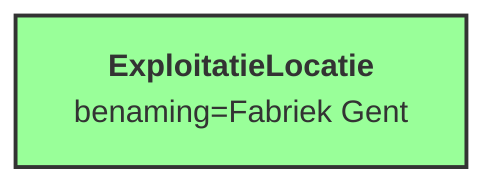

### Exploitatie

#### Toevoegen van een exploitatie op een bepaalde locatie

1. Voeg een exploitatielocatie toe*
2. Voeg een exploitatie toe op deze locatie
3. Voeg een proces toe die de exploitatie implementeert

Nota: de exploitatie location kan ook al bestaan (van een andere exploitatie of ingeladen van de vestigingen uit het VKBO).

*Voorstelling in data*
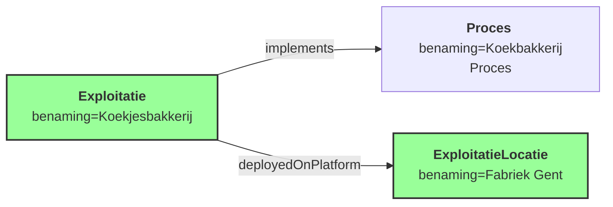

*Voorstelling in UI*\
Leeg proces

:warning: **Visueel geven we enkel processen weer die onder het hoofdproces van de exploitatie hangen.
We kunnen wel verbindingen hebben met het hoofdproces, maar visueel geven we dit niet weer!**

### Proces

#### Toevoegen van een proces
*We gaan ervan uit dat we hier een proces/activiteit willen toevoegen dat geen installatie, emissiepunt of iets anders
representeert*

*Voorbeeld*
> UC: de gebruiker wil duiding geven dat alvorens iets naar een installatie gaat het eerst nagekeken wordt voor verontreinigende stoffen. Hiervoor wil de gebruiker een proces toevoegen dat deze controle representeert.

1. Voeg een proces toe (zonder typering)
2. Voeg het proces als child toe van het proces dat de exploitatie implementeert

*Voorstelling in data*
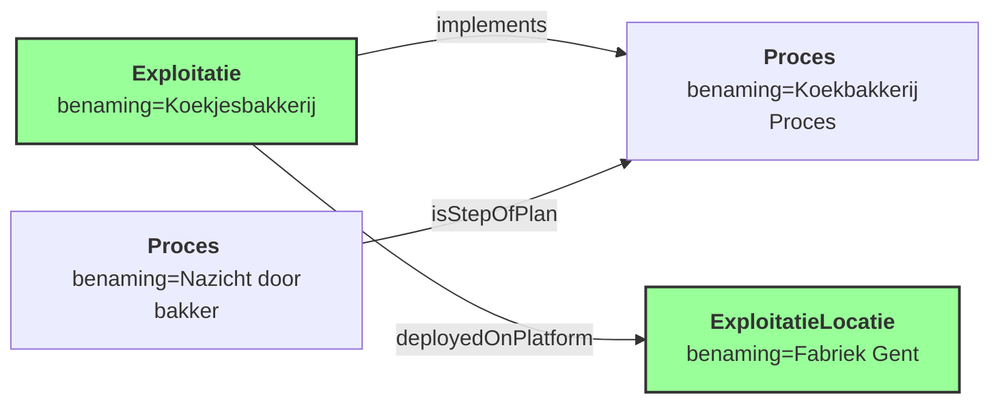

*Voorstelling in UI*
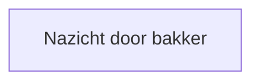

#### Verbinden van processen
*Er vanuitgaande dat de twee processen al bestaan*

1. Maak een nieuw proces aan van het type "TRANSPORT" dat de link tussen de twee processen representeert

*Voorstelling in data VOOR het verbinden van processen*
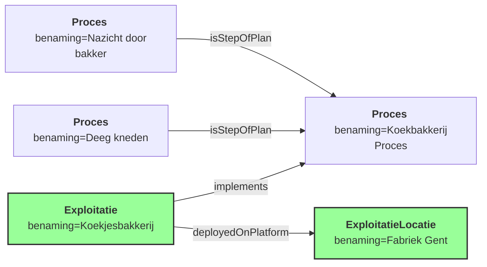

*Voorstelling in UI VOOR het verbinden van processen*
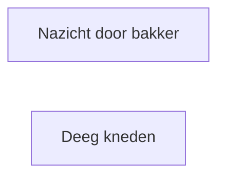

*Voorstelling in data NA het verbinden van processen*
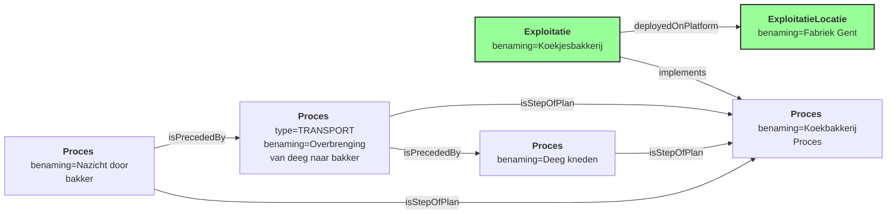

*Voorstelling in UI NA het verbinden van processen*
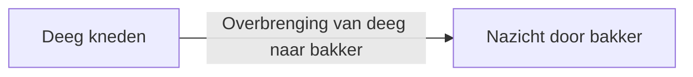

#### Toevoegen van een subproces
1. Voeg een proces toe (zonder typering)
2. Voeg het proces als child toe van het parent proces

*Voorstelling in data*
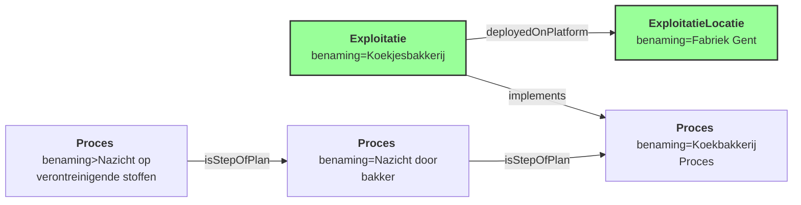

*Voorstelling in UI*
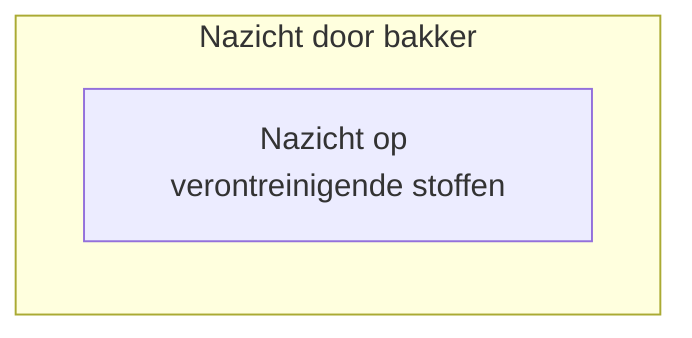

### Proces Variabelen
Proces variabelen geven de effectieve stoffen weer die binnen en buiten een proces gaan. Ze kunnen gebruikt worden om de emissies en onttrekkingen van een proces te representeren, maar ook om de input en output van een proces te representeren.
Een variabele kan hergebruikt worden als invoer en uitvoer op verschillende processen op voorwaarde dat het logischerwijs om dezelfde stof gaat!

#### Toevoegen van een proces variabele op een emissie

> UC: de gebruiker wil aangeven dat CO2 en NOx de stoffen zijn die naar een emissiepunt gaan.

1. Voeg een proces variabele toe met de juiste stof (b.v. CO2)
2. Voeg de proces variabele toe als INPUT en OUTPUT van het proces dat naar een emissiepunt gaat.

*Voorstelling in data*
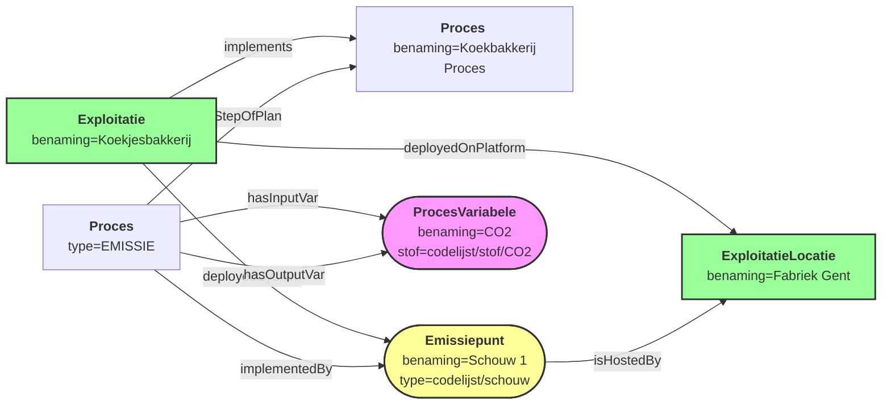

#### Toevoegen van een proces variabele op een installatie

> UC: de gebruiker wil aangeven dat er bepaalde stoffen binnen een installatie gaan of eruit komen. Bijvoorbeeld dat er CO2 uit een oven komt en dat er aardgas binnen gaat.

NOTA: Net zoals een overbrenging kan dit impliciet afgeleid worden en hangt de invoer af van de use case.

*Voorstelling in data*
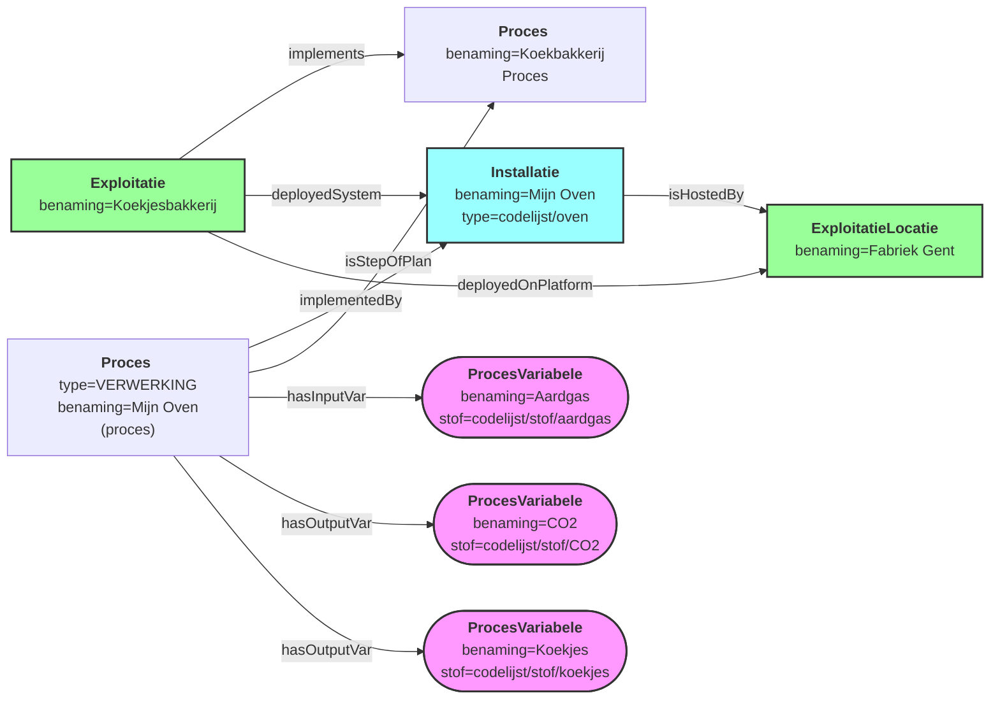

#### Toevoegen van een proces variabele op een overbrenging

> UC: de gebruiker wil aangeven dat er een overbrenging is van een stof tussen twee installaties of processen.

NOTA: De implementatie in data is gelijkaardig aan het toevoegen van een proces variabele op een emissie. In de UI kan er echter gekozen worden om
dit impliciet af te leiden uit bijvoorbeeld het voorgaande proces en de output variabelen van dat proces.

Bij een overbrenging gaan we ervan uit dat:
- Invoer van de overbrenging = output van het voorgaande proces
- Uitvoer van de overbrenging = invoer van het volgende proces

Of transitief: Invoer overbrenging = Uitvoer overbrenging = Uitvoer van het voorgaande proces = invoer van het volgende proces

### Installatie
Merk op dat de data use cases in deze sectie toepasbaar zijn voor:
- Installaties
- Emissiepunten
- Onttrekkingspunten

We gaan hier echter iets specifieker in op installaties met het verwante proces.

#### Toevoegen van een installatie
*Geen rekeninghoudend met versiebeheer*

1. Voeg een installatie toe
2. Voeg een proces toe die de installatie implementeert met typering "VERWERKING" en dezelfde* naam als de installatie
3. Voeg de installatie toe als een deployed system van de exploitatie
4. Zorg dat de installatie gehost wordt door de exploitatie locatie

*Voorstelling in data*
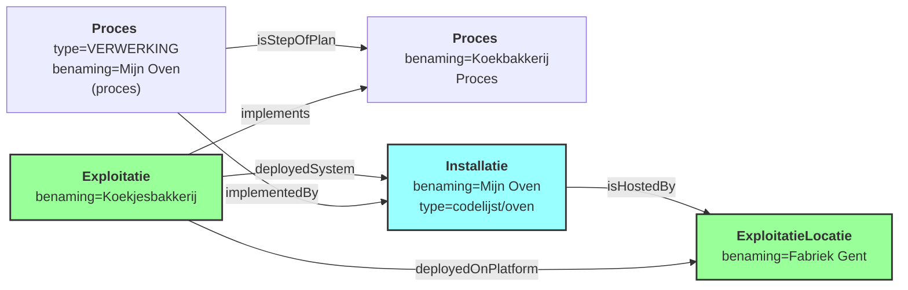

*Voorstelling in UI*
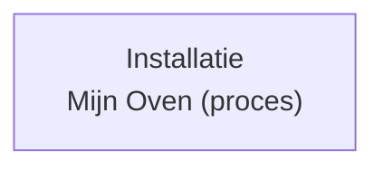

#### Klaarzetten van een installatie
*Door de Vlaamse Overheid uit GPBV*

1. Voeg een installatie toe
2. Voeg de installatie als een deployed system van de exploitatie
3. Zorg dat de installatie gehost wordt door exploitatie locatie

De visuele weergave hangt dus af van het ontbrekende proces. Omdat we nog geen proces hebben maken we de link aan maar nog niet de visuele link
met het gehele proces.

*Voorstelling in data*
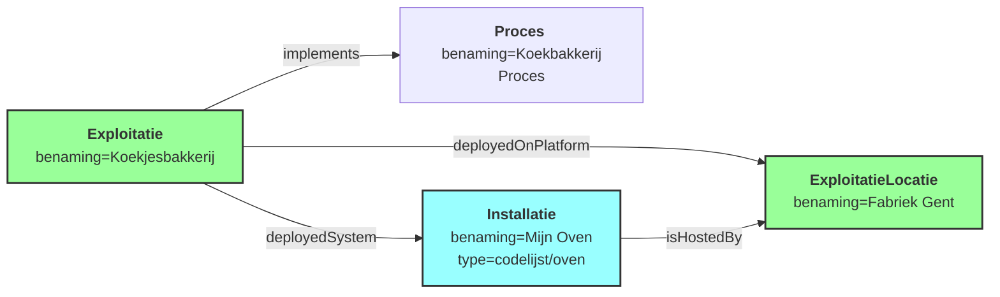

*Voorstelling in UI*\
Leeg proces, maar installatie selecteerbaar rechts

#### Aanpassen van een installatie
*Ervan uitgaande dat dit een nieuwe versie is - zie [VERSIONERING](./VERSIONERING.md) voor meer details*

1. Voeg een nieuwe versie van de installatie toe
2. Voeg een nieuwe versie van de exploitatie toe
3. Voeg een nieuwe versie van het proces toe geimplementeerd door de exploitatie*

*Processen die de installatie implementeren moeten geen nieuwe versie krijgen.

*Voorstelling in data*
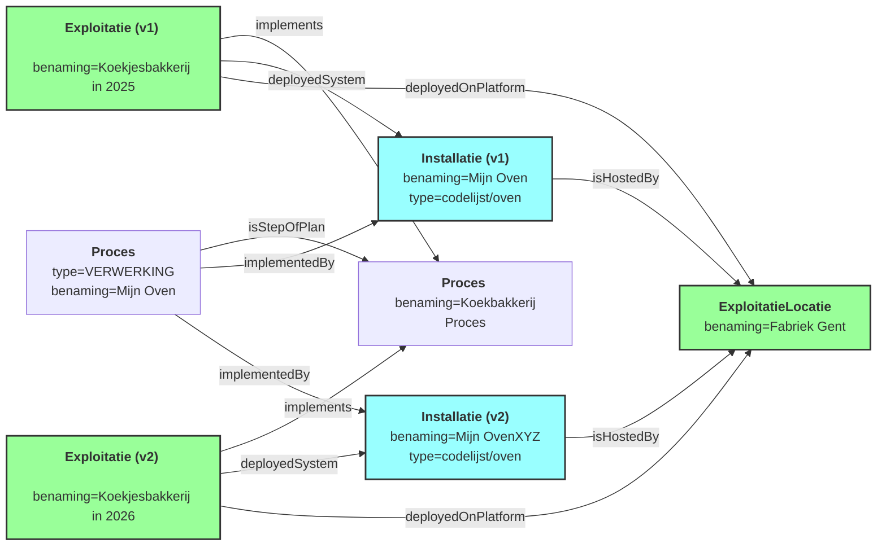

#### Een installatie binnen een installatie
*Assumpties:*
- We hebben al een installatie die klaarstaat en verbonden is met een proces
- We willen een nieuwe installatie toevoegen die binnen deze installatie valt (voorbeeld: een menger binnen een Thermomix)

1. Voeg een nieuwe installatie toe
2. Zet de nieuwe installatie als subSystem van de installatie die al klaarstaat
3. Maak een nieuw proces aan van het type "VERWERKING" dat de nieuwe installatie implementeert
4. Verbind het proces dat de nieuwe installatie implementeert als een step/onderdeel van het proces dat de bovenliggende installatie implementeert
5. Gelijkaardige stappen als installatie (link exploitatie, hosten op locatie, ...)

*Voorbeeld in data VOOR het toevoegen van een installatie binnen een installatie*
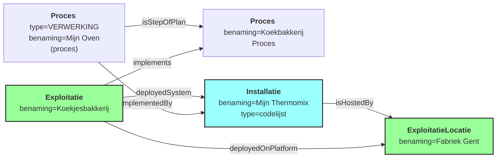

*Voorbeeld in data NA het toevoegen van een installatie binnen een installatie*
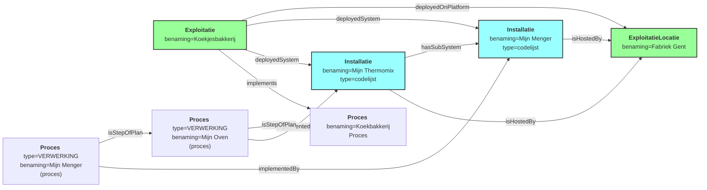

*Voorstelling in UI*
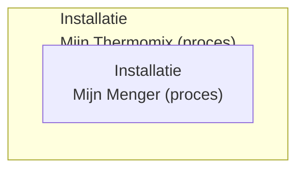

#### Rubrieken op een installatie
Rubrieken worden niet op de installatie zelf gezet maar op het proces dat de installatie implementeert.

Visueel niet weergegeven als apart element maar eventueel wel als een label.

*Voorstelling in data*
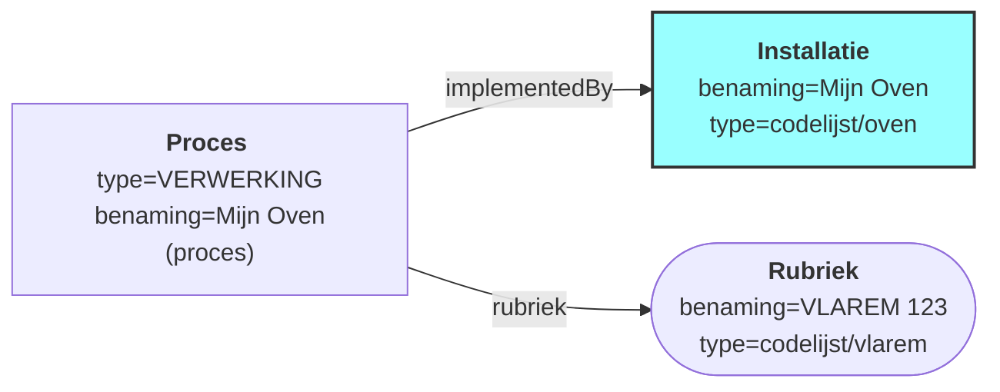

#### Installatie eigenschappen
*Voorbeelden*
- Capaciteit
- Rendement
- Techniek (zuiveringstechniek, verbrandingstechniek, ...)

Visueel niet weergegeven als apart element maar eventueel wel als een label.

*Voorstelling in data*
```mermaid
flowchart LR

    classDef data fill:#f9f,stroke:#333,stroke-width:2px;
    classDef emission fill:#ff9,stroke:#333,stroke-width:2px; 
    classDef installatie fill:#9ff,stroke:#333,stroke-width:2px;
    classDef data fill:#f9f,stroke:#333,stroke-width:2px;
    classDef emission fill:#ff9,stroke:#333,stroke-width:2px;
    classDef exploitatie fill:#9f9,stroke:#333,stroke-width:2px;
    
    PROCES1["<b>Proces</b> <br> type=VERWERKING <br> benaming=Mijn Oven (proces)"]
    INSTALLATIE1["<b>Installatie</b> <br> benaming=Mijn Oven <br> type=codelijst/oven"]
    INSTALLATIEEIGENSCHAP1(["<b>InstallatieEigenschap</b><br>benaming=Capaciteit<br>type=codelijst/installatieeigenschap"])
    
    PROCES1 -->|"implementedBy"| INSTALLATIE1
    INSTALLATIE1 -->|"hasProperty"| INSTALLATIEEIGENSCHAP1
    
    class INSTALLATIE1 installatie;
    class EXPLOITATIE1,EXPLOITATIE_LOCATIE1 exploitatie;
```

### Emissiepunten
Een emissiepunt heeft steeds een proces van het type "EMISSIE" dat het emissiepunt implementeert. De visuele weergave van een emissiepunt zal dus afhangen van dit proces en niet van het emissiepunt zelf.

Op deze manier kunnen we ook emissiepunten klaarzetten zonder dat ze al verbonden zijn met een proces. We kunnen dan later het proces toevoegen en verbinden met andere processen.

#### Toevoegen van een emissiepunt
1. Voeg een emissiepunt toe
2. Voeg een proces toe die het emissiepunt implementeert met typering "EMISSIE"
3. Voeg het emissiepunt toe als een deployed system van de exploitatie
4. Zorg dat het emissiepunt gehost wordt door de exploitatie locatie

De data is dus zeer gelijkaardig aan het toevoegen van een installatie maar met andere proces typeringen.
Ook hier zal de visuele weergave afhangen van het proces "EMISSIE" en niet het emissiepunt zelf.

*Voorstelling in data*
```mermaid
flowchart LR

    classDef data fill:#f9f,stroke:#333,stroke-width:2px;
    classDef emission fill:#ff9,stroke:#333,stroke-width:2px; 
    classDef installatie fill:#9ff,stroke:#333,stroke-width:2px;
    classDef data fill:#f9f,stroke:#333,stroke-width:2px;
    classDef emission fill:#ff9,stroke:#333,stroke-width:2px;
    classDef exploitatie fill:#9f9,stroke:#333,stroke-width:2px;

    EXPLOITATIE_LOCATIE1["<b>ExploitatieLocatie</b> <br> benaming=Fabriek Gent"]
    EXPLOITATIE1["<b>Exploitatie</b> <br> benaming=Koekjesbakkerij"]
    PROCES_PARENT["<b>Proces</b> <br> benaming=Koekbakkerij Proces"]
    EMISSIEPUNT1(["<b>Emissiepunt</b> <br> benaming=Schouw 1 <br> type=codelijst/schouw"])
    PROCES_EMISSIE1["<b>Proces</b> <br> type=EMISSIE"]
    
    EXPLOITATIE1 -->|"implements"| PROCES_PARENT
    EXPLOITATIE1 -->|"deployedSystem"| EMISSIEPUNT1
    EXPLOITATIE1 -->|"deployedOnPlatform"| EXPLOITATIE_LOCATIE1
    EMISSIEPUNT1 -->|"isHostedBy"| EXPLOITATIE_LOCATIE1
    PROCES_EMISSIE1 -->|"implementedBy"| EMISSIEPUNT1
    PROCES_EMISSIE1 -->|"isStepOfPlan"| PROCES_PARENT
    
    class EMISSIEPUNT1 emission;
    class EXPLOITATIE1,EXPLOITATIE_LOCATIE1 exploitatie;
```

*Voorstelling in UI*
```mermaid
flowchart LR

    classDef data fill:#f9f,stroke:#333,stroke-width:2px;
    classDef emission fill:#ff9,stroke:#333,stroke-width:2px; 
    classDef installatie fill:#9ff,stroke:#333,stroke-width:2px;
    classDef data fill:#f9f,stroke:#333,stroke-width:2px;
    classDef emission fill:#ff9,stroke:#333,stroke-width:2px;

    EMISSIEPUNT1(["Emissiepunt<br>Schouw 1"])
    
    class EMISSIEPUNT1 emission;
```

#### Klaarzetten van een emissiepunt
*Door de Vlaamse Overheid uit IMJV1.0*
1. Voeg een emissiepunt toe
2. Voeg het emissiepunt als een deployed system van de exploitatie
3. Zorg dat het emissiepunt gehost wordt door exploitatie locatie

#### Verbinden van een emissiepunt aan een ander proces
*Assumpties*
- We hebben al een proces dat een installatie implementeert (voorbeeld)
- We hebben al een emissiepunt dat klaarstaat en verbonden is met een "EMISSIE" proces

1. Voeg een nieuw proces transport toe van het type "TRANSPORT" dat de overbrenging van de stof van het proces dat de installatie implementeert naar het proces dat het emissiepunt implementeert representeert

*Voorstelling in data VOOR het verbinden van processen*
```mermaid
flowchart LR

    classDef data fill:#f9f,stroke:#333,stroke-width:2px;
    classDef emission fill:#ff9,stroke:#333,stroke-width:2px; 
    classDef installatie fill:#9ff,stroke:#333,stroke-width:2px;
    classDef data fill:#f9f,stroke:#333,stroke-width:2px;
    classDef emission fill:#ff9,stroke:#333,stroke-width:2px;
    classDef exploitatie fill:#9f9,stroke:#333,stroke-width:2px;

    EXPLOITATIE_LOCATIE1["<b>ExploitatieLocatie</b> <br> benaming=Fabriek Gent"]
    EXPLOITATIE1["<b>Exploitatie</b> <br> benaming=Koekjesbakkerij"]
    PROCES_PARENT["<b>Proces</b> <br> benaming=Koekbakkerij Proces"]
    EMISSIEPUNT1(["<b>Emissiepunt</b> <br> benaming=Schouw 1 <br> type=codelijst/schouw"])
    PROCES_EMISSIE1["<b>Proces</b> <br> type=EMISSIE"]
    INSTALLATIE1["<b>Installatie</b> <br> benaming=Mijn Oven <br> type=codelijst/oven"]
    PROCES_INSTALLATIE1["<b>Proces</b> <br> type=VERWERKING <br> benaming=Mijn Oven (proces)"]

    EXPLOITATIE1 -->|"implements"| PROCES_PARENT
    EXPLOITATIE1 -->|"deployedSystem"| EMISSIEPUNT1
    EXPLOITATIE1 -->|"deployedSystem"| INSTALLATIE1
    EXPLOITATIE1 -->|"deployedOnPlatform"| EXPLOITATIE_LOCATIE1
    EMISSIEPUNT1 -->|"isHostedBy"| EXPLOITATIE_LOCATIE1
    INSTALLATIE1 -->|"isHostedBy"| EXPLOITATIE_LOCATIE1
    PROCES_EMISSIE1 -->|"implementedBy"| EMISSIEPUNT1
    PROCES_EMISSIE1 -->|"isStepOfPlan"| PROCES_PARENT
    PROCES_INSTALLATIE1 -->|"implementedBy"| INSTALLATIE1
    PROCES_INSTALLATIE1 -->|"isStepOfPlan"| PROCES_PARENT
    
    class INSTALLATIE1 installatie;
    class EMISSIEPUNT1 emission;
    class EXPLOITATIE1,EXPLOITATIE_LOCATIE1 exploitatie;
```

*Voorstelling in UI VOOR het verbinden van processen*
```mermaid
flowchart LR

    classDef data fill:#f9f,stroke:#333,stroke-width:2px;
    classDef emission fill:#ff9,stroke:#333,stroke-width:2px; 
    classDef installatie fill:#9ff,stroke:#333,stroke-width:2px;
    classDef data fill:#f9f,stroke:#333,stroke-width:2px;
    classDef emission fill:#ff9,stroke:#333,stroke-width:2px;

    EMISSIEPUNT1(["Emissiepunt<br>Schouw 1"])
    INSTALLATIE1["Installatie<br>Mijn Oven"]
    
    class EMISSIEPUNT1 emission;
    class INSTALLATIE1 installatie;
```

*Voorstelling in data NA het verbinden van processen*
```mermaid
flowchart LR

    classDef data fill:#f9f,stroke:#333,stroke-width:2px;
    classDef emission fill:#ff9,stroke:#333,stroke-width:2px; 
    classDef installatie fill:#9ff,stroke:#333,stroke-width:2px;
    classDef data fill:#f9f,stroke:#333,stroke-width:2px;
    classDef emission fill:#ff9,stroke:#333,stroke-width:2px;
    classDef exploitatie fill:#9f9,stroke:#333,stroke-width:2px;

    EXPLOITATIE_LOCATIE1["<b>ExploitatieLocatie</b> <br> benaming=Fabriek Gent"]
    EXPLOITATIE1["<b>Exploitatie</b> <br> benaming=Koekjesbakkerij"]
    PROCES_PARENT["<b>Proces</b> <br> benaming=Koekbakkerij Proces"]
    EMISSIEPUNT1(["<b>Emissiepunt</b> <br> benaming=Schouw 1 <br> type=codelijst/schouw"])
    PROCES_EMISSIE1["<b>Proces</b> <br> type=EMISSIE"]
    INSTALLATIE1["<b>Installatie</b> <br> benaming=Mijn Oven <br> type=codelijst/oven"]
    PROCES_INSTALLATIE1["<b>Proces</b> <br> type=VERWERKING <br> benaming=Mijn Oven (proces)"]
    PROCES_TRANSPORT1["<b>Proces</b> <br> type=TRANSPORT <br> benaming=Transport CO2 van Oven naar Schouw"]

    EXPLOITATIE1 -->|"implements"| PROCES_PARENT
    EXPLOITATIE1 -->|"deployedSystem"| EMISSIEPUNT1
    EXPLOITATIE1 -->|"deployedSystem"| INSTALLATIE1
    EXPLOITATIE1 -->|"deployedOnPlatform"| EXPLOITATIE_LOCATIE1
    EMISSIEPUNT1 -->|"isHostedBy"| EXPLOITATIE_LOCATIE1
    INSTALLATIE1 -->|"isHostedBy"| EXPLOITATIE_LOCATIE1
    PROCES_EMISSIE1 -->|"implementedBy"| EMISSIEPUNT1
    PROCES_EMISSIE1 -->|"isStepOfPlan"| PROCES_PARENT
    PROCES_INSTALLATIE1 -->|"implementedBy"| INSTALLATIE1
    PROCES_INSTALLATIE1 -->|"isStepOfPlan"| PROCES_PARENT
    PROCES_TRANSPORT1 -->|"isStepOfPlan"| PROCES_PARENT
    PROCES_EMISSIE1 -->|"isPrecededBy"| PROCES_TRANSPORT1
    PROCES_TRANSPORT1 -->|"isPrecededBy"| PROCES_INSTALLATIE1

    class INSTALLATIE1 installatie;
    class EMISSIEPUNT1 emission;
    class EXPLOITATIE1,EXPLOITATIE_LOCATIE1 exploitatie;
```

*Voorstelling in UI NA het verbinden van processen*
```mermaid
flowchart LR

    classDef data fill:#f9f,stroke:#333,stroke-width:2px;
    classDef emission fill:#ff9,stroke:#333,stroke-width:2px; 
    classDef installatie fill:#9ff,stroke:#333,stroke-width:2px;
    classDef data fill:#f9f,stroke:#333,stroke-width:2px;
    classDef emission fill:#ff9,stroke:#333,stroke-width:2px;

    EMISSIEPUNT1(["Emissiepunt<br>Schouw 1"])
    INSTALLATIE1["Installatie<br>Mijn Oven"]
    
    class EMISSIEPUNT1 emission;
    class INSTALLATIE1 installatie;
    INSTALLATIE1 --> EMISSIEPUNT1
```

#### Abstract emissiepunt op een geheel proces
> UC: De gebruiker wil lekverliezen rapporteren van 'het geheel'

1. Maak een proces aan het van het type "EMISSIE"
2. Maak een abstract emissiepunt aan met een typering wat voor soort abstractie
3. Maak een verbinding met het hoofdproces dat de exploitatie implementeert en het proces van type "EMISSIE" zonder een nieuw proces aan te maken

Visueel geven we dit niet weer.

*Voorstelling in data*
```mermaid
flowchart LR

    classDef data fill:#f9f,stroke:#333,stroke-width:2px;
    classDef emission fill:#ff9,stroke:#333,stroke-width:2px; 
    classDef installatie fill:#9ff,stroke:#333,stroke-width:2px;
    classDef data fill:#f9f,stroke:#333,stroke-width:2px;
    classDef emission fill:#ff9,stroke:#333,stroke-width:2px;
    classDef exploitatie fill:#9f9,stroke:#333,stroke-width:2px;

    EXPLOITATIE_LOCATIE1["<b>ExploitatieLocatie</b> <br> benaming=Fabriek Gent"]
    EXPLOITATIE1["<b>Exploitatie</b> <br> benaming=Koekjesbakkerij"]
    PROCES_PARENT["<b>Proces</b> <br> benaming=Koekbakkerij Proces"]
    INSTALLATIE1["<b>Installatie</b> <br> benaming=Mijn Oven <br> type=codelijst/oven"]
    PROCES_INSTALLATIE1["<b>Proces</b> <br> type=VERWERKING <br> benaming=Mijn Oven (proces)"]
    PROCES_ABSTRACT_EMISSIE["<b>Proces</b> <br> type=EMISSIE"]
    EMISSIEPUNT1(["<b>Emissiepunt</b> <br> type=codelijst/gebouw <br> benaming=Mijn gehele fabriek <br> type=codelijst/emissiepunt/??"])
    
    EXPLOITATIE1 -->|"implements"| PROCES_PARENT
    EXPLOITATIE1 -->|"deployedSystem"| EMISSIEPUNT1
    EXPLOITATIE1 -->|"deployedSystem"| INSTALLATIE1
    EXPLOITATIE1 -->|"deployedOnPlatform"| EXPLOITATIE_LOCATIE1
    EMISSIEPUNT1 -->|"isHostedBy"| EXPLOITATIE_LOCATIE1
    INSTALLATIE1 -->|"isHostedBy"| EXPLOITATIE_LOCATIE1
    PROCES_INSTALLATIE1 -->|"implementedBy"| INSTALLATIE1
    PROCES_INSTALLATIE1 -->|"isStepOfPlan"| PROCES_PARENT
    PROCES_ABSTRACT_EMISSIE -->|"isPrecededBy"| PROCES_PARENT
    PROCES_ABSTRACT_EMISSIE -->|"implementedBy"| EMISSIEPUNT1
    
    class INSTALLATIE1 installatie;
    class EMISSIEPUNT1 emission;
    class EXPLOITATIE1,EXPLOITATIE_LOCATIE1 exploitatie;
```

*Voorstelling in UI*
```mermaid
flowchart LR

    classDef data fill:#f9f,stroke:#333,stroke-width:2px;
    classDef emission fill:#ff9,stroke:#333,stroke-width:2px; 
    classDef installatie fill:#9ff,stroke:#333,stroke-width:2px;
    classDef data fill:#f9f,stroke:#333,stroke-width:2px;
    classDef emission fill:#ff9,stroke:#333,stroke-width:2px;

    INSTALLATIE1["Installatie<br>Mijn Oven"]
    
    class INSTALLATIE1 installatie;
```
(maar we hebben nu wel een "emissiepunt" dat we kunnen selecteren bij de operationele gegevens)

### Onttrekkingspunten
Onttrekkingspunten zijn gelijkaardig aan emissiepunten, maar de stap is visueel "uit" een punt ipv. naar een punt.

#### Verbinden van een onttrekkingspunt aan een ander proces
*Assumpties*
- We hebben al een proces dat een installatie implementeert (voorbeeld)
- We hebben al een onttrekkingspunt dat klaarstaat en verbonden is met een "VERBRUIK" proces

*Voorstelling in data VOOR het verbinden van processen*
```mermaid
flowchart LR

    classDef data fill:#f9f,stroke:#333,stroke-width:2px;
    classDef emission fill:#ff9,stroke:#333,stroke-width:2px; 
    classDef installatie fill:#9ff,stroke:#333,stroke-width:2px;
    classDef data fill:#f9f,stroke:#333,stroke-width:2px;
    classDef emission fill:#ff9,stroke:#333,stroke-width:2px;
    classDef exploitatie fill:#9f9,stroke:#333,stroke-width:2px;

    EXPLOITATIE_LOCATIE1["<b>ExploitatieLocatie</b> <br> benaming=Fabriek Gent"]
    EXPLOITATIE1["<b>Exploitatie</b> <br> benaming=Koekjesbakkerij"]
    PROCES_PARENT["<b>Proces</b> <br> benaming=Koekbakkerij Proces"]
    ONTTREKKINGSPUNT1(["<b>Onttrekkingspunt</b> <br> benaming=Waterput 1 <br> type=codelijst/onttrekkingspunt"])
    PROCES_VERBRUIK1["<b>Proces</b> <br> type=VERBRUIK"]
    INSTALLATIE1["<b>Installatie</b> <br> benaming=Mijn Oven <br> type=codelijst/oven"]
    PROCES_INSTALLATIE1["<b>Proces</b> <br> type=VERWERKING <br> benaming=Mijn Oven (proces)"]
    
    EXPLOITATIE1 -->|"implements"| PROCES_PARENT
    EXPLOITATIE1 -->|"deployedSystem"| ONTTREKKINGSPUNT1
    EXPLOITATIE1 -->|"deployedSystem"| INSTALLATIE1
    EXPLOITATIE1 -->|"deployedOnPlatform"| EXPLOITATIE_LOCATIE1
    EMISSIEPUNT1 -->|"isHostedBy"| EXPLOITATIE_LOCATIE1
    INSTALLATIE1 -->|"isHostedBy"| EXPLOITATIE_LOCATIE1
    PROCES_VERBRUIK1 -->|"implementedBy"| ONTTREKKINGSPUNT1
    PROCES_VERBRUIK1 -->|"isStepOfPlan"| PROCES_PARENT
    PROCES_INSTALLATIE1 -->|"implementedBy"| INSTALLATIE1
    PROCES_INSTALLATIE1 -->|"isStepOfPlan"| PROCES_PARENT
    
    class INSTALLATIE1 installatie;
    class ONTTREKKINGSPUNT1 emission;
    class EXPLOITATIE1,EXPLOITATIE_LOCATIE1 exploitatie;
```

*Voorstelling in UI VOOR het verbinden van processen*
```mermaid
flowchart LR

    classDef data fill:#f9f,stroke:#333,stroke-width:2px;
    classDef emission fill:#ff9,stroke:#333,stroke-width:2px; 
    classDef installatie fill:#9ff,stroke:#333,stroke-width:2px;
    classDef data fill:#f9f,stroke:#333,stroke-width:2px;
    classDef emission fill:#ff9,stroke:#333,stroke-width:2px;

    ONTTREKKINGSPUNT1(["Onttrekkingspunt<br>Waterput 1"])
    INSTALLATIE1["Installatie<br>Mijn Oven"]
    
    class ONTTREKKINGSPUNT1 emission;
    class INSTALLATIE1 installatie;
```

*Voorstelling in data NA het verbinden van processen*
```mermaid
flowchart LR

    classDef data fill:#f9f,stroke:#333,stroke-width:2px;
    classDef emission fill:#ff9,stroke:#333,stroke-width:2px; 
    classDef installatie fill:#9ff,stroke:#333,stroke-width:2px;
    classDef data fill:#f9f,stroke:#333,stroke-width:2px;
    classDef emission fill:#ff9,stroke:#333,stroke-width:2px;
    classDef exploitatie fill:#9f9,stroke:#333,stroke-width:2px;

    EXPLOITATIE_LOCATIE1["<b>ExploitatieLocatie</b> <br> benaming=Fabriek Gent"]
    EXPLOITATIE1["<b>Exploitatie</b> <br> benaming=Koekjesbakkerij"]
    PROCES_PARENT["<b>Proces</b> <br> benaming=Koekbakkerij Proces"]
    ONTTREKKINGSPUNT1(["<b>Onttrekkingspunt</b> <br> benaming=Waterput 1 <br> type=codelijst/onttrekkingspunt"])
    PROCES_VERBRUIK1["<b>Proces</b> <br> type=VERBRUIK"]
    INSTALLATIE1["<b>Installatie</b> <br> benaming=Mijn Oven <br> type=codelijst/oven"]
    PROCES_INSTALLATIE1["<b>Proces</b> <br> type=VERWERKING <br> benaming=Mijn Oven (proces)"]
    
    EXPLOITATIE1 -->|"implements"| PROCES_PARENT
    EXPLOITATIE1 -->|"deployedSystem"| ONTTREKKINGSPUNT1
    EXPLOITATIE1 -->|"deployedSystem"| INSTALLATIE1
    EXPLOITATIE1 -->|"deployedOnPlatform"| EXPLOITATIE_LOCATIE1
    ONTTREKKINGSPUNT1 -->|"isHostedBy"| EXPLOITATIE_LOCATIE1
    INSTALLATIE1 -->|"isHostedBy"| EXPLOITATIE_LOCATIE1
    PROCES_VERBRUIK1 -->|"implementedBy"| ONTTREKKINGSPUNT1
    PROCES_VERBRUIK1 -->|"isStepOfPlan"| PROCES_PARENT
    PROCES_INSTALLATIE1 -->|"implementedBy"| INSTALLATIE1
    PROCES_INSTALLATIE1 -->|"isStepOfPlan"| PROCES_PARENT
    PROCES_INSTALLATIE1 -->|"isPrecededBy"| PROCES_VERBRUIK1
    
    class INSTALLATIE1 installatie;
    class ONTTREKKINGSPUNT1 emission;
    class EXPLOITATIE1,EXPLOITATIE_LOCATIE1 exploitatie;
```

*Voorstelling in UI NA het verbinden van processen*
```mermaid
flowchart LR

    classDef data fill:#f9f,stroke:#333,stroke-width:2px;
    classDef emission fill:#ff9,stroke:#333,stroke-width:2px;
    classDef installatie fill:#9ff,stroke:#333,stroke-width:2px;
    classDef data fill:#f9f,stroke:#333,stroke-width:2px;
    classDef emission fill:#ff9,stroke:#333,stroke-width:2px;

    ONTTREKKINGSPUNT1(["Onttrekkingspunt<br>Waterput 1"])
    INSTALLATIE1["Installatie<br>Mijn Oven"]

    class ONTTREKKINGSPUNT1 emission;
    class INSTALLATIE1 installatie;
    ONTTREKKINGSPUNT1 --> INSTALLATIE1
```

### Meetpunt
Een meetpunt is altijd gekoppeld aan een proces met typering MEET dat het meetpunt implementeert. De visuele weergave van een meetpunt zal dus afhangen van dit proces en niet van het meetpunt zelf.
De typeringen van een meetpunt zijn meestal "controleinrichting" of "meetinrichting" en bevatten op zichzelf eigenschappen.

Naast eigenschappen hebben meetpunten ook objecten als onderliggende data:
- Filter(s)
- Meet instrumenten (debietmeter, peillint, ...)
Dit wordt verder gedocumenteerd in de sectie "Filter"

#### Toevoegen van een meetpunt op een installatie
1. Voeg een meetpunt toe
2. Voeg een proces toe die het meetpunt implementeert met typering "MEET"
3. Voeg het meetpunt toe als een deployed system van de exploitatie
4. Zorg dat het meetpunt gehost wordt door de exploitatie locatie
5. Zet het meetproces als ONDERDEEL VAN het proces dat je wil meten

*Voorstelling in data VOOR het toevoegen van een meetpunt*
```mermaid
flowchart LR

    classDef data fill:#f9f,stroke:#333,stroke-width:2px;
    classDef emission fill:#ff9,stroke:#333,stroke-width:2px; 
    classDef installatie fill:#9ff,stroke:#333,stroke-width:2px;
    classDef data fill:#f9f,stroke:#333,stroke-width:2px;
    classDef emission fill:#ff9,stroke:#333,stroke-width:2px;
    classDef exploitatie fill:#9f9,stroke:#333,stroke-width:2px;

    EXPLOITATIE_LOCATIE1["<b>ExploitatieLocatie</b> <br> benaming=Fabriek Gent"]
    EXPLOITATIE1["<b>Exploitatie</b> <br> benaming=Koekjesbakkerij"]
    PROCES_PARENT["<b>Proces</b> <br> benaming=Koekbakkerij Proces"]
    INSTALLATIE1["<b>Installatie</b> <br> benaming=Mijn Oven <br> type=codelijst/oven"]
    PROCES_INSTALLATIE1["<b>Proces</b> <br> type=VERWERKING <br> benaming=Mijn Oven (proces)"]
    
    EXPLOITATIE1 -->|"implements"| PROCES_PARENT
    EXPLOITATIE1 -->|"deployedSystem"| INSTALLATIE1
    EXPLOITATIE1 -->|"deployedOnPlatform"| EXPLOITATIE_LOCATIE1
    INSTALLATIE1 -->|"isHostedBy"| EXPLOITATIE_LOCATIE1
    PROCES_INSTALLATIE1 -->|"implementedBy"| INSTALLATIE1
    PROCES_INSTALLATIE1 -->|"isStepOfPlan"| PROCES_PARENT
    
    class INSTALLATIE1 installatie;
    class EMISSIEPUNT1 emission;
    class EXPLOITATIE1,EXPLOITATIE_LOCATIE1 exploitatie;
```

*Voorstelling in data NA het toevoegen van een meetpunt*
```mermaid
flowchart LR

    classDef data fill:#f9f,stroke:#333,stroke-width:2px;
    classDef emission fill:#ff9,stroke:#333,stroke-width:2px; 
    classDef installatie fill:#9ff,stroke:#333,stroke-width:2px;
    classDef data fill:#f9f,stroke:#333,stroke-width:2px;
    classDef emission fill:#ff9,stroke:#333,stroke-width:2px;
    classDef exploitatie fill:#9f9,stroke:#333,stroke-width:2px;
    classDef meet fill:#00f,stroke:#333,stroke-width:2px,color:#fff;

    EXPLOITATIE_LOCATIE1["<b>ExploitatieLocatie</b> <br> benaming=Fabriek Gent"]
    EXPLOITATIE1["<b>Exploitatie</b> <br> benaming=Koekjesbakkerij"]
    PROCES_PARENT["<b>Proces</b> <br> benaming=Koekbakkerij Proces"]
    INSTALLATIE1["<b>Installatie</b> <br> benaming=Mijn Oven <br> type=codelijst/oven"]
    PROCES_INSTALLATIE1["<b>Proces</b> <br> type=VERWERKING <br> benaming=Mijn Oven (proces)"]
    PROCES_MEET1["<b>Proces</b> <br> type=MEET"]
    MEETPUNT1(["<b>Meetpunt</b> <br> benaming=Mijn Oven Meetpunt <br> type=codelijst/meetpunt"])
    
    EXPLOITATIE1 -->|"implements"| PROCES_PARENT
    EXPLOITATIE1 -->|"deployedSystem"| INSTALLATIE1
    EXPLOITATIE1 -->|"deployedSystem"| MEETPUNT1
    EXPLOITATIE1 -->|"deployedOnPlatform"| EXPLOITATIE_LOCATIE1
    INSTALLATIE1 -->|"isHostedBy"| EXPLOITATIE_LOCATIE1
    MEETPUNT1 -->|"isHostedBy"| EXPLOITATIE_LOCATIE1
    PROCES_INSTALLATIE1 -->|"implementedBy"| INSTALLATIE1
    PROCES_INSTALLATIE1 -->|"isStepOfPlan"| PROCES_PARENT
    
    PROCES_MEET1 -->|"isStepOfPlan"| PROCES_INSTALLATIE1
    PROCES_MEET1 -->|"implementedBy"| MEETPUNT1
    
    class INSTALLATIE1 installatie;
    class MEETPUNT1 meet;
    class EXPLOITATIE1,EXPLOITATIE_LOCATIE1 exploitatie;
```

#### Toevoegen van een meetpunt op een emissie(punt)
1. Voeg een meetpunt toe
2. Voeg een proces toe die het meetpunt implementeert met typering "MEET"
3. Voeg het meetpunt toe als een deployed system van de exploitatie
4. Zorg dat het meetpunt gehost wordt door de exploitatie locatie
5. Zet het meetproces als ONDERDEEL VAN het proces dat je wil meten (EMISSIE

*Voorstelling in data VOOR het toevoegen van een meetpunt*
```mermaid
flowchart LR

    classDef data fill:#f9f,stroke:#333,stroke-width:2px;
    classDef emission fill:#ff9,stroke:#333,stroke-width:2px;
    classDef installatie fill:#9ff,stroke:#333,stroke-width:2px;
    classDef data fill:#f9f,stroke:#333,stroke-width:2px;
    classDef emission fill:#ff9,stroke:#333,stroke-width:2px;
    classDef exploitatie fill:#9f9,stroke:#333,stroke-width:2px;

    EXPLOITATIE_LOCATIE1["<b>ExploitatieLocatie</b> <br> benaming=Fabriek Gent"]
    EXPLOITATIE1["<b>Exploitatie</b> <br> benaming=Koekjesbakkerij"]
    PROCES_PARENT["<b>Proces</b> <br> benaming=Koekbakkerij Proces"]
    INSTALLATIE1["<b>Installatie</b> <br> benaming=Mijn Oven <br> type=codelijst/oven"]
    PROCES_INSTALLATIE1["<b>Proces</b> <br> type=VERWERKING <br> benaming=Mijn Oven (proces)"]

    EXPLOITATIE1 -->|"implements"| PROCES_PARENT
    EXPLOITATIE1 -->|"deployedSystem"| EMISSIEPUNT1
    EXPLOITATIE1 -->|"deployedSystem"| INSTALLATIE1
    EXPLOITATIE1 -->|"deployedOnPlatform"| EXPLOITATIE_LOCATIE1
    INSTALLATIE1 -->|"isHostedBy"| EXPLOITATIE_LOCATIE1
    PROCES_INSTALLATIE1 -->|"implementedBy"| INSTALLATIE1
    PROCES_INSTALLATIE1 -->|"isStepOfPlan"| PROCES_PARENT

    class INSTALLATIE1 installatie;
    class EXPLOITATIE1,EXPLOITATIE_LOCATIE1 exploitatie;
    
    EMISSIEPUNT1(["<b>Emissiepunt</b> <br> benaming=Schouw 1 <br> type=codelijst/schouw"])
    PROCES_EMISSIE1["<b>Proces</b> <br> type=EMISSIE"]
    PROCES_EMISSIE1 -->|"implementedBy"| EMISSIEPUNT1
    PROCES_EMISSIE1 -->|"isStepOfPlan"| PROCES_PARENT
    PROCES_EMISSIE1 -->|"isPrecededBy"| PROCES_INSTALLATIE1
    
    class EMISSIEPUNT1 emission;
```

*Voorstelling in data NA het toevoegen van een meetpunt*
```mermaid
flowchart LR

    classDef data fill:#f9f,stroke:#333,stroke-width:2px;
    classDef emission fill:#ff9,stroke:#333,stroke-width:2px;
    classDef installatie fill:#9ff,stroke:#333,stroke-width:2px;
    classDef data fill:#f9f,stroke:#333,stroke-width:2px;
    classDef emission fill:#ff9,stroke:#333,stroke-width:2px;
    classDef exploitatie fill:#9f9,stroke:#333,stroke-width:2px;
    classDef meet fill:#00f,stroke:#333,stroke-width:2px,color:#fff;

    EXPLOITATIE_LOCATIE1["<b>ExploitatieLocatie</b> <br> benaming=Fabriek Gent"]
    EXPLOITATIE1["<b>Exploitatie</b> <br> benaming=Koekjesbakkerij"]
    PROCES_PARENT["<b>Proces</b> <br> benaming=Koekbakkerij Proces"]
    INSTALLATIE1["<b>Installatie</b> <br> benaming=Mijn Oven <br> type=codelijst/oven"]
    PROCES_INSTALLATIE1["<b>Proces</b> <br> type=VERWERKING <br> benaming=Mijn Oven (proces)"]
    PROCES_MEET1["<b>Proces</b> <br> type=MEET"]
    MEETPUNT1(["<b>Meetpunt</b> <br> benaming=Schouw 1 meetpunt <br> type=codelijst/meetpunt"])

    EXPLOITATIE1 -->|"implements"| PROCES_PARENT
    EXPLOITATIE1 -->|"deployedSystem"| EMISSIEPUNT1
    EXPLOITATIE1 -->|"deployedSystem"| INSTALLATIE1
    EXPLOITATIE1 -->|"deployedSystem"| MEETPUNT1
    EXPLOITATIE1 -->|"deployedOnPlatform"| EXPLOITATIE_LOCATIE1
    INSTALLATIE1 -->|"isHostedBy"| EXPLOITATIE_LOCATIE1
    MEETPUNT1 -->|"isHostedBy"| EXPLOITATIE_LOCATIE1
    PROCES_INSTALLATIE1 -->|"implementedBy"| INSTALLATIE1
    PROCES_INSTALLATIE1 -->|"isStepOfPlan"| PROCES_PARENT

    PROCES_MEET1 -->|"isStepOfPlan"| PROCES_EMISSIE1
    PROCES_MEET1 -->|"implementedBy"| MEETPUNT1

    class INSTALLATIE1 installatie;
    class MEETPUNT1 meet;
    class EXPLOITATIE1,EXPLOITATIE_LOCATIE1 exploitatie;

    EMISSIEPUNT1(["<b>Emissiepunt</b> <br> benaming=Schouw 1 <br> type=codelijst/schouw"])
    PROCES_EMISSIE1["<b>Proces</b> <br> type=EMISSIE"]
    PROCES_EMISSIE1 -->|"implementedBy"| EMISSIEPUNT1
    PROCES_EMISSIE1 -->|"isStepOfPlan"| PROCES_PARENT
    PROCES_EMISSIE1 -->|"isPrecededBy"| PROCES_INSTALLATIE1

    class EMISSIEPUNT1 emission;
```

#### Toevoegen van een meetpunt op het geheel
Dit is gelijkaardig als "emissiepunt op een geheel proces".

## Use case 1: Crematorium

*Voorbeeld in UI*
```mermaid
---
config:
  layout: elk
  theme: default
---
flowchart LR
    classDef data fill:#f9f,stroke:#333,stroke-width:2px;
    classDef emission fill:#ff9,stroke:#333,stroke-width:2px;
    classDef installatie fill:#9ff,stroke:#333,stroke-width:2px;
    classDef data fill:#f9f,stroke:#333,stroke-width:2px;
    classDef emission fill:#ff9,stroke:#333,stroke-width:2px;
    classDef exploitatie fill:#9f9,stroke:#333,stroke-width:2px;
    classDef meet fill:#00f,stroke:#333,stroke-width:2px,color:#fff;

    STOOKINSTALLATIE1[Installatie<br>Directe Stookinstallatie 1]
    STOOKINSTALLATIE2[Installatie<br>Directe Stookinstallatie 2]
    STOOKINSTALLATIE3[Installatie<br>Directe Stookinstallatie 3]
    STOOKINSTALLATIE4[Installatie<br>Directe Stookinstallatie 4]

    STOOKINSTALLATIE5[Installatie<br>Stookinstallatie 5]
    STOOKINSTALLATIE6[Installatie<br>Stookinstallatie 6]

    SCHOUW1([Emissiepunt<br>Schouw 1])
    SCHOUW2([Emissiepunt<br>Schouw 2])
    SCHOUW3([Emissiepunt<br>Schouw 3])
    SCHOUW4([Emissiepunt<br>Schouw 4])

    STOOKINSTALLATIE1 --> SCHOUW1
    STOOKINSTALLATIE2 --> SCHOUW1
    STOOKINSTALLATIE3 --> SCHOUW2
    STOOKINSTALLATIE4 --> SCHOUW2
    STOOKINSTALLATIE5 --> SCHOUW3
    STOOKINSTALLATIE6 --> SCHOUW4
    
    class STOOKINSTALLATIE1,STOOKINSTALLATIE2,STOOKINSTALLATIE3,STOOKINSTALLATIE4,STOOKINSTALLATIE5,STOOKINSTALLATIE6 installatie;
    class SCHOUW1,SCHOUW2,SCHOUW3,SCHOUW4 emission;
```

*Voorbeeld in data*

*Stap 1: Exploitatie, locatie en schema*
```mermaid
---
config:
  layout: elk
  theme: default
---
flowchart LR

    classDef data fill:#f9f,stroke:#333,stroke-width:2px;
    classDef emission fill:#ff9,stroke:#333,stroke-width:2px;
    classDef installatie fill:#9ff,stroke:#333,stroke-width:2px;
    classDef data fill:#f9f,stroke:#333,stroke-width:2px;
    classDef emission fill:#ff9,stroke:#333,stroke-width:2px;
    classDef exploitatie fill:#9f9,stroke:#333,stroke-width:2px;

    EXPLOITATIE_LOCATIE1["<b>ExploitatieLocatie</b> <br> benaming=Crematorium Gent"]
    EXPLOITATIE1["<b>Exploitatie</b> <br> benaming=Crematorium"]
    PROCES_PARENT["<b>Proces</b> <br> benaming=Crematorium Proces"]

    EXPLOITATIE1 -->|"implements"| PROCES_PARENT
    EXPLOITATIE1 -->|"deployedOnPlatform"| EXPLOITATIE_LOCATIE1

    class SCHOUW1,SCHOUW2,SCHOUW3,SCHOUW4 emission;
    class STOOKINSTALLATIE1,STOOKINSTALLATIE2,STOOKINSTALLATIE3,STOOKINSTALLATIE4,STOOKINSTALLATIE5,STOOKINSTALLATIE6 installatie;
    class EXPLOITATIE1,EXPLOITATIE_LOCATIE1 exploitatie;
```

*Stap 2: Installaties*
```mermaid
---
config:
  layout: elk
  theme: default
---
flowchart LR

    classDef data fill:#f9f,stroke:#333,stroke-width:2px;
    classDef emission fill:#ff9,stroke:#333,stroke-width:2px; 
    classDef installatie fill:#9ff,stroke:#333,stroke-width:2px;
    classDef data fill:#f9f,stroke:#333,stroke-width:2px;
    classDef emission fill:#ff9,stroke:#333,stroke-width:2px;
    classDef exploitatie fill:#9f9,stroke:#333,stroke-width:2px;

    EXPLOITATIE_LOCATIE1["<b>ExploitatieLocatie</b> <br> benaming=Crematorium Gent"]
    EXPLOITATIE1["<b>Exploitatie</b> <br> benaming=Crematorium"]
    PROCES_PARENT["<b>Proces</b> <br> benaming=Crematorium Proces"]

    STOOKINSTALLATIE1["<b>Installatie</b> <br> benaming=Directe Stookinstallatie 1 <br> type=codelijst/stookinstallatie"]
    STOOKINSTALLATIE2["<b>Installatie</b> <br> benaming=Directe Stookinstallatie 2 <br> type=codelijst/stookinstallatie"]
    STOOKINSTALLATIE3["<b>Installatie</b> <br> benaming=Directe Stookinstallatie 3 <br> type=codelijst/stookinstallatie"]
    STOOKINSTALLATIE4["<b>Installatie</b> <br> benaming=Directe Stookinstallatie 4 <br> type=codelijst/stookinstallatie"]

    STOOKINSTALLATIE5["<b>Installatie</b> <br> benaming=Stookinstallatie 5 <br> type=codelijst/stookinstallatie"]
    STOOKINSTALLATIE6["<b>Installatie</b> <br> benaming=Stookinstallatie 6 <br> type=codelijst/stookinstallatie"]

    PROCES_INSTALLATIE1["<b>Proces</b> <br> type=VERWERKING <br> benaming=Stookproces 1"]
    PROCES_INSTALLATIE2["<b>Proces</b> <br> type=VERWERKING <br> benaming=Stookproces 2"]
    PROCES_INSTALLATIE3["<b>Proces</b> <br> type=VERWERKING <br> benaming=Stookproces 3"]
    PROCES_INSTALLATIE4["<b>Proces</b> <br> type=VERWERKING <br> benaming=Stookproces 4"]
    PROCES_INSTALLATIE5["<b>Proces</b> <br> type=VERWERKING <br> benaming=Stookproces 5"]
    PROCES_INSTALLATIE6["<b>Proces</b> <br> type=VERWERKING <br> benaming=Stookproces 6"]
    
    PROCES_INSTALLATIE1 -->|"isStepOfPlan"| PROCES_PARENT
    PROCES_INSTALLATIE2 -->|"isStepOfPlan"| PROCES_PARENT
    PROCES_INSTALLATIE3 -->|"isStepOfPlan"| PROCES_PARENT
    PROCES_INSTALLATIE4 -->|"isStepOfPlan"| PROCES_PARENT
    PROCES_INSTALLATIE5 -->|"isStepOfPlan"| PROCES_PARENT
    PROCES_INSTALLATIE6 -->|"isStepOfPlan"| PROCES_PARENT
    EXPLOITATIE1 -->|"implements"| PROCES_PARENT
    EXPLOITATIE1 -->|"deployedSystem"| STOOKINSTALLATIE1
    EXPLOITATIE1 -->|"deployedSystem"| STOOKINSTALLATIE2
    EXPLOITATIE1 -->|"deployedSystem"| STOOKINSTALLATIE3
    EXPLOITATIE1 -->|"deployedSystem"| STOOKINSTALLATIE4
    EXPLOITATIE1 -->|"deployedSystem"| STOOKINSTALLATIE5
    EXPLOITATIE1 -->|"deployedSystem"| STOOKINSTALLATIE6
    EXPLOITATIE1 -->|"deployedOnPlatform"| EXPLOITATIE_LOCATIE1
    
    STOOKINSTALLATIE1 -->|"isHostedBy"| EXPLOITATIE_LOCATIE1
    STOOKINSTALLATIE2 -->|"isHostedBy"| EXPLOITATIE_LOCATIE1
    STOOKINSTALLATIE3 -->|"isHostedBy"| EXPLOITATIE_LOCATIE1
    STOOKINSTALLATIE4 -->|"isHostedBy"| EXPLOITATIE_LOCATIE1
    STOOKINSTALLATIE5 -->|"isHostedBy"| EXPLOITATIE_LOCATIE1
    STOOKINSTALLATIE6 -->|"isHostedBy"| EXPLOITATIE_LOCATIE1
    
    PROCES_INSTALLATIE1 -->|"implementedBy"| STOOKINSTALLATIE1
    PROCES_INSTALLATIE2 -->|"implementedBy"| STOOKINSTALLATIE2
    PROCES_INSTALLATIE3 -->|"implementedBy"| STOOKINSTALLATIE3
    PROCES_INSTALLATIE4 -->|"implementedBy"| STOOKINSTALLATIE4
    PROCES_INSTALLATIE5 -->|"implementedBy"| STOOKINSTALLATIE5
    PROCES_INSTALLATIE6 -->|"implementedBy"| STOOKINSTALLATIE6
    
    class SCHOUW1,SCHOUW2,SCHOUW3,SCHOUW4 emission;
    class STOOKINSTALLATIE1,STOOKINSTALLATIE2,STOOKINSTALLATIE3,STOOKINSTALLATIE4,STOOKINSTALLATIE5,STOOKINSTALLATIE6 installatie;
    class EXPLOITATIE1,EXPLOITATIE_LOCATIE1 exploitatie;
```

*Stap 3: Emissiepunten*
```mermaid
---
config:
  layout: elk
  theme: default
---
flowchart LR

    classDef data fill:#f9f,stroke:#333,stroke-width:2px;
    classDef emission fill:#ff9,stroke:#333,stroke-width:2px; 
    classDef installatie fill:#9ff,stroke:#333,stroke-width:2px;
    classDef data fill:#f9f,stroke:#333,stroke-width:2px;
    classDef emission fill:#ff9,stroke:#333,stroke-width:2px;
    classDef exploitatie fill:#9f9,stroke:#333,stroke-width:2px;

    EXPLOITATIE_LOCATIE1["<b>ExploitatieLocatie</b> <br> benaming=Crematorium Gent"]
    EXPLOITATIE1["<b>Exploitatie</b> <br> benaming=Crematorium"]
    PROCES_PARENT["<b>Proces</b> <br> benaming=Crematorium Proces"]

    STOOKINSTALLATIE1["<b>Installatie</b> <br> benaming=Directe Stookinstallatie 1 <br> type=codelijst/stookinstallatie"]
    STOOKINSTALLATIE2["<b>Installatie</b> <br> benaming=Directe Stookinstallatie 2 <br> type=codelijst/stookinstallatie"]
    STOOKINSTALLATIE3["<b>Installatie</b> <br> benaming=Directe Stookinstallatie 3 <br> type=codelijst/stookinstallatie"]
    STOOKINSTALLATIE4["<b>Installatie</b> <br> benaming=Directe Stookinstallatie 4 <br> type=codelijst/stookinstallatie"]

    STOOKINSTALLATIE5["<b>Installatie</b> <br> benaming=Stookinstallatie 5 <br> type=codelijst/stookinstallatie"]
    STOOKINSTALLATIE6["<b>Installatie</b> <br> benaming=Stookinstallatie 6 <br> type=codelijst/stookinstallatie"]

    SCHOUW1(["<b>Emissiepunt</b> <br> benaming=Schouw 1 <br> type=codelijst/schouw"])
    SCHOUW2(["<b>Emissiepunt</b> <br> benaming=Schouw 2 <br> type=codelijst/schouw"])
    SCHOUW3(["<b>Emissiepunt</b> <br> benaming=Schouw 3 <br> type=codelijst/schouw"])
    SCHOUW4(["<b>Emissiepunt</b> <br> benaming=Schouw 4 <br> type=codelijst/schouw"])

    PROCES_INSTALLATIE1["<b>Proces</b> <br> type=VERWERKING <br> benaming=Stookproces 1"]
    PROCES_INSTALLATIE2["<b>Proces</b> <br> type=VERWERKING <br> benaming=Stookproces 2"]
    PROCES_INSTALLATIE3["<b>Proces</b> <br> type=VERWERKING <br> benaming=Stookproces 3"]
    PROCES_INSTALLATIE4["<b>Proces</b> <br> type=VERWERKING <br> benaming=Stookproces 4"]
    PROCES_INSTALLATIE5["<b>Proces</b> <br> type=VERWERKING <br> benaming=Stookproces 5"]
    PROCES_INSTALLATIE6["<b>Proces</b> <br> type=VERWERKING <br> benaming=Stookproces 6"]
    
    PROCES_EMISSIE1["<b>Proces</b> <br> type=EMISSIE <br> benaming=Emissieproces 1"]
    PROCES_EMISSIE2["<b>Proces</b> <br> type=EMISSIE <br> benaming=Emissieproces 2"]
    PROCES_EMISSIE3["<b>Proces</b> <br> type=EMISSIE <br> benaming=Emissieproces 3"]
    PROCES_EMISSIE4["<b>Proces</b> <br> type=EMISSIE <br> benaming=Emissieproces 4"]
    
    PROCES_INSTALLATIE1 -->|"isStepOfPlan"| PROCES_PARENT
    PROCES_INSTALLATIE2 -->|"isStepOfPlan"| PROCES_PARENT
    PROCES_INSTALLATIE3 -->|"isStepOfPlan"| PROCES_PARENT
    PROCES_INSTALLATIE4 -->|"isStepOfPlan"| PROCES_PARENT
    PROCES_INSTALLATIE5 -->|"isStepOfPlan"| PROCES_PARENT
    PROCES_INSTALLATIE6 -->|"isStepOfPlan"| PROCES_PARENT
    PROCES_EMISSIE1 -->|"isStepOfPlan"| PROCES_PARENT
    PROCES_EMISSIE2 -->|"isStepOfPlan"| PROCES_PARENT
    PROCES_EMISSIE3 -->|"isStepOfPlan"| PROCES_PARENT
    PROCES_EMISSIE4 -->|"isStepOfPlan"| PROCES_PARENT
    EXPLOITATIE1 -->|"implements"| PROCES_PARENT
    EXPLOITATIE1 -->|"deployedSystem"| SCHOUW1
    EXPLOITATIE1 -->|"deployedSystem"| SCHOUW2
    EXPLOITATIE1 -->|"deployedSystem"| SCHOUW3
    EXPLOITATIE1 -->|"deployedSystem"| SCHOUW4
    EXPLOITATIE1 -->|"deployedSystem"| STOOKINSTALLATIE1
    EXPLOITATIE1 -->|"deployedSystem"| STOOKINSTALLATIE2
    EXPLOITATIE1 -->|"deployedSystem"| STOOKINSTALLATIE3
    EXPLOITATIE1 -->|"deployedSystem"| STOOKINSTALLATIE4
    EXPLOITATIE1 -->|"deployedSystem"| STOOKINSTALLATIE5
    EXPLOITATIE1 -->|"deployedSystem"| STOOKINSTALLATIE6
    EXPLOITATIE1 -->|"deployedOnPlatform"| EXPLOITATIE_LOCATIE1
    
    SCHOUW1 -->|"isHostedBy"| EXPLOITATIE_LOCATIE1
    SCHOUW2 -->|"isHostedBy"| EXPLOITATIE_LOCATIE1
    SCHOUW3 -->|"isHostedBy"| EXPLOITATIE_LOCATIE1
    SCHOUW4 -->|"isHostedBy"| EXPLOITATIE_LOCATIE1
    STOOKINSTALLATIE1 -->|"isHostedBy"| EXPLOITATIE_LOCATIE1
    STOOKINSTALLATIE2 -->|"isHostedBy"| EXPLOITATIE_LOCATIE1
    STOOKINSTALLATIE3 -->|"isHostedBy"| EXPLOITATIE_LOCATIE1
    STOOKINSTALLATIE4 -->|"isHostedBy"| EXPLOITATIE_LOCATIE1
    STOOKINSTALLATIE5 -->|"isHostedBy"| EXPLOITATIE_LOCATIE1
    STOOKINSTALLATIE6 -->|"isHostedBy"| EXPLOITATIE_LOCATIE1
    
    PROCES_INSTALLATIE1 -->|"implementedBy"| STOOKINSTALLATIE1
    PROCES_INSTALLATIE2 -->|"implementedBy"| STOOKINSTALLATIE2
    PROCES_INSTALLATIE3 -->|"implementedBy"| STOOKINSTALLATIE3
    PROCES_INSTALLATIE4 -->|"implementedBy"| STOOKINSTALLATIE4
    PROCES_INSTALLATIE5 -->|"implementedBy"| STOOKINSTALLATIE5
    PROCES_INSTALLATIE6 -->|"implementedBy"| STOOKINSTALLATIE6
    PROCES_EMISSIE1 -->|"implementedBy"| SCHOUW1
    PROCES_EMISSIE2 -->|"implementedBy"| SCHOUW2
    PROCES_EMISSIE3 -->|"implementedBy"| SCHOUW3
    PROCES_EMISSIE4 -->|"implementedBy"| SCHOUW4
    
    class SCHOUW1,SCHOUW2,SCHOUW3,SCHOUW4 emission;
    class STOOKINSTALLATIE1,STOOKINSTALLATIE2,STOOKINSTALLATIE3,STOOKINSTALLATIE4,STOOKINSTALLATIE5,STOOKINSTALLATIE6 installatie;
    class EXPLOITATIE1,EXPLOITATIE_LOCATIE1 exploitatie;
```

*Stap 4: Relaties tussen installaties en emissiepunten*
```mermaid
---
config:
  layout: elk
  theme: default
---
flowchart LR

    classDef data fill:#f9f,stroke:#333,stroke-width:2px;
    classDef emission fill:#ff9,stroke:#333,stroke-width:2px; 
    classDef installatie fill:#9ff,stroke:#333,stroke-width:2px;
    classDef data fill:#f9f,stroke:#333,stroke-width:2px;
    classDef emission fill:#ff9,stroke:#333,stroke-width:2px;
    classDef exploitatie fill:#9f9,stroke:#333,stroke-width:2px;

    EXPLOITATIE_LOCATIE1["<b>ExploitatieLocatie</b> <br> benaming=Crematorium Gent"]
    EXPLOITATIE1["<b>Exploitatie</b> <br> benaming=Crematorium"]
    PROCES_PARENT["<b>Proces</b> <br> benaming=Crematorium Proces"]

    STOOKINSTALLATIE1["<b>Installatie</b> <br> benaming=Directe Stookinstallatie 1 <br> type=codelijst/stookinstallatie"]
    STOOKINSTALLATIE2["<b>Installatie</b> <br> benaming=Directe Stookinstallatie 2 <br> type=codelijst/stookinstallatie"]
    STOOKINSTALLATIE3["<b>Installatie</b> <br> benaming=Directe Stookinstallatie 3 <br> type=codelijst/stookinstallatie"]
    STOOKINSTALLATIE4["<b>Installatie</b> <br> benaming=Directe Stookinstallatie 4 <br> type=codelijst/stookinstallatie"]

    STOOKINSTALLATIE5["<b>Installatie</b> <br> benaming=Stookinstallatie 5 <br> type=codelijst/stookinstallatie"]
    STOOKINSTALLATIE6["<b>Installatie</b> <br> benaming=Stookinstallatie 6 <br> type=codelijst/stookinstallatie"]

    SCHOUW1(["<b>Emissiepunt</b> <br> benaming=Schouw 1 <br> type=codelijst/schouw"])
    SCHOUW2(["<b>Emissiepunt</b> <br> benaming=Schouw 2 <br> type=codelijst/schouw"])
    SCHOUW3(["<b>Emissiepunt</b> <br> benaming=Schouw 3 <br> type=codelijst/schouw"])
    SCHOUW4(["<b>Emissiepunt</b> <br> benaming=Schouw 4 <br> type=codelijst/schouw"])

    PROCES_INSTALLATIE1["<b>Proces</b> <br> type=VERWERKING <br> benaming=Stookproces 1"]
    PROCES_INSTALLATIE2["<b>Proces</b> <br> type=VERWERKING <br> benaming=Stookproces 2"]
    PROCES_INSTALLATIE3["<b>Proces</b> <br> type=VERWERKING <br> benaming=Stookproces 3"]
    PROCES_INSTALLATIE4["<b>Proces</b> <br> type=VERWERKING <br> benaming=Stookproces 4"]
    PROCES_INSTALLATIE5["<b>Proces</b> <br> type=VERWERKING <br> benaming=Stookproces 5"]
    PROCES_INSTALLATIE6["<b>Proces</b> <br> type=VERWERKING <br> benaming=Stookproces 6"]
    
    PROCES_EMISSIE1["<b>Proces</b> <br> type=EMISSIE <br> benaming=Emissieproces 1"]
    PROCES_EMISSIE2["<b>Proces</b> <br> type=EMISSIE <br> benaming=Emissieproces 2"]
    PROCES_EMISSIE3["<b>Proces</b> <br> type=EMISSIE <br> benaming=Emissieproces 3"]
    PROCES_EMISSIE4["<b>Proces</b> <br> type=EMISSIE <br> benaming=Emissieproces 4"]
    
    PROCES_TRANSPORT_EMISSIE1["<b>Proces</b> <br> type=TRANSPORT"]
    PROCES_TRANSPORT_EMISSIE2["<b>Proces</b> <br> type=TRANSPORT"]
    PROCES_TRANSPORT_EMISSIE3["<b>Proces</b> <br> type=TRANSPORT"]
    PROCES_TRANSPORT_EMISSIE4["<b>Proces</b> <br> type=TRANSPORT"]
    PROCES_TRANSPORT_EMISSIE5["<b>Proces</b> <br> type=TRANSPORT"]
    PROCES_TRANSPORT_EMISSIE6["<b>Proces</b> <br> type=TRANSPORT"]
    
    PROCES_INSTALLATIE1 -->|"isStepOfPlan"| PROCES_PARENT
    PROCES_INSTALLATIE2 -->|"isStepOfPlan"| PROCES_PARENT
    PROCES_INSTALLATIE3 -->|"isStepOfPlan"| PROCES_PARENT
    PROCES_INSTALLATIE4 -->|"isStepOfPlan"| PROCES_PARENT
    PROCES_INSTALLATIE5 -->|"isStepOfPlan"| PROCES_PARENT
    PROCES_INSTALLATIE6 -->|"isStepOfPlan"| PROCES_PARENT
    PROCES_EMISSIE1 -->|"isStepOfPlan"| PROCES_PARENT
    PROCES_EMISSIE2 -->|"isStepOfPlan"| PROCES_PARENT
    PROCES_EMISSIE3 -->|"isStepOfPlan"| PROCES_PARENT
    PROCES_EMISSIE4 -->|"isStepOfPlan"| PROCES_PARENT
    PROCES_TRANSPORT_EMISSIE1 -->|"isStepOfPlan"| PROCES_PARENT
    PROCES_TRANSPORT_EMISSIE2 -->|"isStepOfPlan"| PROCES_PARENT
    PROCES_TRANSPORT_EMISSIE3 -->|"isStepOfPlan"| PROCES_PARENT
    PROCES_TRANSPORT_EMISSIE4 -->|"isStepOfPlan"| PROCES_PARENT
    PROCES_TRANSPORT_EMISSIE5 -->|"isStepOfPlan"| PROCES_PARENT
    PROCES_TRANSPORT_EMISSIE6 -->|"isStepOfPlan"| PROCES_PARENT
    EXPLOITATIE1 -->|"implements"| PROCES_PARENT
    EXPLOITATIE1 -->|"deployedSystem"| SCHOUW1
    EXPLOITATIE1 -->|"deployedSystem"| SCHOUW2
    EXPLOITATIE1 -->|"deployedSystem"| SCHOUW3
    EXPLOITATIE1 -->|"deployedSystem"| SCHOUW4
    EXPLOITATIE1 -->|"deployedSystem"| STOOKINSTALLATIE1
    EXPLOITATIE1 -->|"deployedSystem"| STOOKINSTALLATIE2
    EXPLOITATIE1 -->|"deployedSystem"| STOOKINSTALLATIE3
    EXPLOITATIE1 -->|"deployedSystem"| STOOKINSTALLATIE4
    EXPLOITATIE1 -->|"deployedSystem"| STOOKINSTALLATIE5
    EXPLOITATIE1 -->|"deployedSystem"| STOOKINSTALLATIE6
    EXPLOITATIE1 -->|"deployedOnPlatform"| EXPLOITATIE_LOCATIE1
    
    SCHOUW1 -->|"isHostedBy"| EXPLOITATIE_LOCATIE1
    SCHOUW2 -->|"isHostedBy"| EXPLOITATIE_LOCATIE1
    SCHOUW3 -->|"isHostedBy"| EXPLOITATIE_LOCATIE1
    SCHOUW4 -->|"isHostedBy"| EXPLOITATIE_LOCATIE1
    STOOKINSTALLATIE1 -->|"isHostedBy"| EXPLOITATIE_LOCATIE1
    STOOKINSTALLATIE2 -->|"isHostedBy"| EXPLOITATIE_LOCATIE1
    STOOKINSTALLATIE3 -->|"isHostedBy"| EXPLOITATIE_LOCATIE1
    STOOKINSTALLATIE4 -->|"isHostedBy"| EXPLOITATIE_LOCATIE1
    STOOKINSTALLATIE5 -->|"isHostedBy"| EXPLOITATIE_LOCATIE1
    STOOKINSTALLATIE6 -->|"isHostedBy"| EXPLOITATIE_LOCATIE1

    PROCES_TRANSPORT_EMISSIE1 -->|"isPrecededBy"| PROCES_INSTALLATIE1
    PROCES_TRANSPORT_EMISSIE2 -->|"isPrecededBy"| PROCES_INSTALLATIE2
    PROCES_TRANSPORT_EMISSIE3 -->|"isPrecededBy"| PROCES_INSTALLATIE3
    PROCES_TRANSPORT_EMISSIE4 -->|"isPrecededBy"| PROCES_INSTALLATIE4
    PROCES_TRANSPORT_EMISSIE5 -->|"isPrecededBy"| PROCES_INSTALLATIE5
    PROCES_TRANSPORT_EMISSIE6 -->|"isPrecededBy"| PROCES_INSTALLATIE6
    
    PROCES_EMISSIE1 -->|"isPrecededBy"| PROCES_TRANSPORT_EMISSIE1
    PROCES_EMISSIE1 -->|"isPrecededBy"| PROCES_TRANSPORT_EMISSIE2
    PROCES_EMISSIE2 -->|"isPrecededBy"| PROCES_TRANSPORT_EMISSIE3
    PROCES_EMISSIE2 -->|"isPrecededBy"| PROCES_TRANSPORT_EMISSIE4
    PROCES_EMISSIE3 -->|"isPrecededBy"| PROCES_TRANSPORT_EMISSIE5
    PROCES_EMISSIE4 -->|"isPrecededBy"| PROCES_TRANSPORT_EMISSIE6
    
    PROCES_INSTALLATIE1 -->|"implementedBy"| STOOKINSTALLATIE1
    PROCES_INSTALLATIE2 -->|"implementedBy"| STOOKINSTALLATIE2
    PROCES_INSTALLATIE3 -->|"implementedBy"| STOOKINSTALLATIE3
    PROCES_INSTALLATIE4 -->|"implementedBy"| STOOKINSTALLATIE4
    PROCES_INSTALLATIE5 -->|"implementedBy"| STOOKINSTALLATIE5
    PROCES_INSTALLATIE6 -->|"implementedBy"| STOOKINSTALLATIE6
    PROCES_EMISSIE1 -->|"implementedBy"| SCHOUW1
    PROCES_EMISSIE2 -->|"implementedBy"| SCHOUW2
    PROCES_EMISSIE3 -->|"implementedBy"| SCHOUW3
    PROCES_EMISSIE4 -->|"implementedBy"| SCHOUW4
    
    class SCHOUW1,SCHOUW2,SCHOUW3,SCHOUW4 emission;
    class STOOKINSTALLATIE1,STOOKINSTALLATIE2,STOOKINSTALLATIE3,STOOKINSTALLATIE4,STOOKINSTALLATIE5,STOOKINSTALLATIE6 installatie;
    class EXPLOITATIE1,EXPLOITATIE_LOCATIE1 exploitatie;
```

### Filter en Meetinstrument
Filter(s) en meetinstrument(en) zijn systemen net zoals emissiepunt, installatie, ... omdat ze dezelfde attributen hebben als andere systemen.
Echter zijn ze niet visueel weergegeven als apart structureel element en hebben dus enkel de `hasSubSystem` relatie vanuit het bovenliggende systeem.

> **Waarom geen systeemeigenschappen?**: Omdat deze meer verbonden zijn met de operationele gegevens zijn deze noodzakelijk als aparte systemen. We moeten bijvoorbeeld aangeven dat iets gemeten is a.h.v. een bepaald meetinstrument met zijn eigen serienummer, etc...
