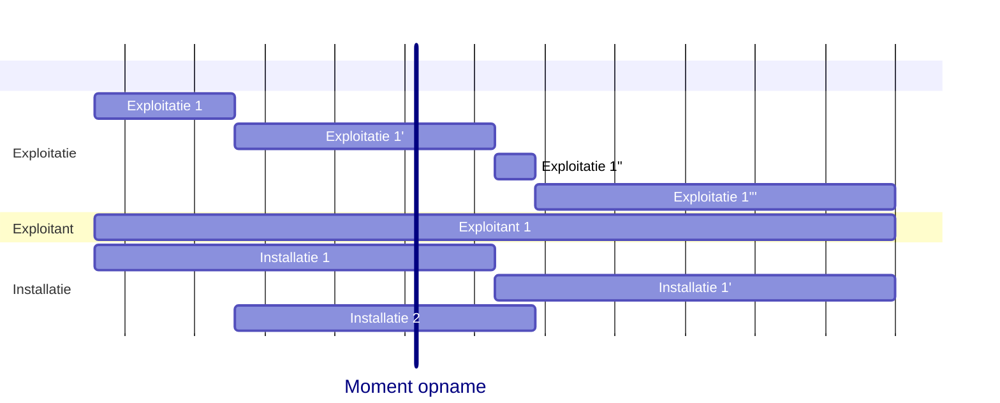
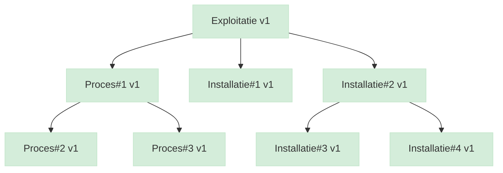
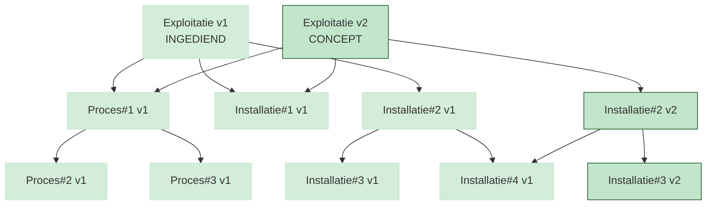
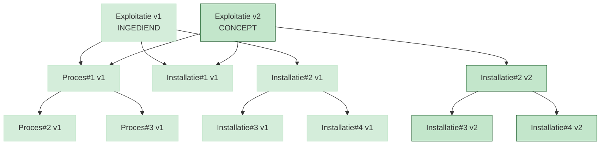
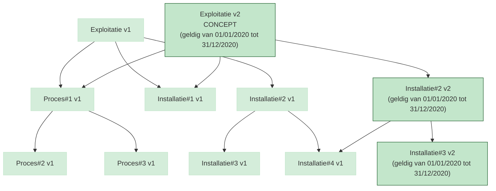
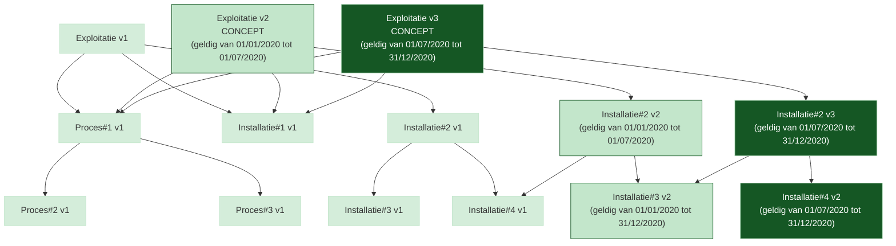

# RIE-IEPR Datamodel
## Versionering

> De business analyse staat op: https://www.milieuinfo.be/confluence/display/BIVS/Vereisten+mbt+versiebeheer+van+data

[TOC]

Versiebeheer wordt geregeld aan de hand van vijf attributen:
- `<local_id>`: een lokale identifier die uniek is binnen een bepaalde context (bv. een unieke installatie of exploitatie)
- `aangemaakt_op`: een timestamp die aangeeft wanneer een record is aangemaakt
- `gewijzigd_op`: een timestamp die aangeeft wanneer een record voor het laatst is gewijzigd
- `geldig_van`: een geldigheidsdatum (zonder tijd) die aangeeft vanaf wanneer een record geldig is
- `geldig_tot`: een geldigheidsdatum (zonder tijd) die aangeeft tot wanneer een record geldig is. Als er geen functionele einddatum is, is `geldig_tot` `NULL` (open einde).

Lees meer over de implicatie tot identificatie in [IDENTIFICATIE.md](./IDENTIFICATIE.md). Niet alle bovenstaande attributen zijn ook
onderdeel van de identificatie van een versie.

> Technisch heeft elke versietabel een eigen surrogaatsleutel `id` (UUID) als primaire sleutel. De combinatie van `local_id`, `geldig_van` en `aangemaakt_op` is **geen** primaire sleutel meer, maar wordt afgedwongen via een unieke sleutel (UK). Zie [DATABANK.md](./DATABANK.md) voor de implementatie.



[TOC]

### Ingediende Versie
Een versie kan twee voornamelijke states hebben die los staan van de 'status' (actief, inactief, ...):
1. INGEDIEND
2. NIET_INGEDIEND

Omdat we ook de "indiening" (de metadata die aangeeft wie, wat, wanneer indient) willen bijhouden zal deze status aangegeven worden a.h.v. de al-dan niet aanwezigheid van een relatie naar bijhorende aangifte.

#### Transactie vs Aangifte
Een transactie is de activiteit die leidt tot het aanmaken van een of meerdere aangiftes (van start tot controle en beoordeling van de plichtige).
Een aangifte is een succesvol ingediend document of set van documenten dat een plichtige indient bij de overheid.

> Waarom transacties bijhouden in plaats van enkel aangiftes?

_Mits een aangifte ook opgedeeld kan zijn kan de vraag bestaan waarom we deze transactie bijhouden. Het verschil zit hem in de aangifte: een aangifte wordt pas gemaakt op het moment dat deze alle controles doorloopt. Als er iets faalt in de transactie zullen er geen aangiftes gemaakt worden. Het record dat de transactie opgestart is zal echter wel nog bewaard worden (de poging tot indienen)._ 

#### Een nieuwe entiteit (nog niet ingediend)
Er wordt een nieuwe versie van een record gemaakt, maar deze is nog niet ingediend. Deze versie is dus nog niet zichtbaar voor de externe afnemer(s) en kan nog aangepast worden door de gebruiker.
Alle aanpassingen, structureel en inhoudelijk zullen nog geen wijziging aan deze versie maken.

#### Een entiteit indienen
De versie (die wordt ingediend) wordt zichtbaar voor de externe afnemer(s) en kan niet meer aangepast worden door de gebruiker. Alle aanpassingen, structureel en inhoudelijk zullen een nieuwe versie maken.

#### Een ingediende entiteit aanpassen
Er wordt een nieuwe versie van een record gemaakt, omdat de ingediende versie niet meer aangepast kan worden. Deze nieuwe versie zal dezelfde geldigheidsperiode hebben als de vorige versie, maar met een nieuwe `aangemaakt_op` timestamp. De vorige versie zal nog steeds bestaan, maar er zal een nieuwe versie worden toegevoegd die aangeeft dat deze versie is aangepast:

### Zoeken van een record
#### Huidige versie geldig op vandaag

> UC: Een gebruiker wil de huidige versie van een installatie opvragen.

_Pseudo SQL:_
```sql
SELECT * FROM installatie
WHERE local_id = :local_id
AND geldig_van <= CURRENT_DATE
AND (geldig_tot IS NULL OR geldig_tot >= CURRENT_DATE)
ORDER BY aangemaakt_op DESC LIMIT 1
```
We definiëren de huidige versie van een record als de versie die geldig is op het moment van de query. Dit betekent dat we moeten zoeken naar de versie waarvan de `geldig_van` kleiner of gelijk is aan de huidige datum en waarvan de `geldig_tot` groter of gelijk is aan de huidige datum. Open-einde geldigheid wordt voorgesteld door `NULL`. We sorteren op `aangemaakt_op` in aflopende volgorde om ervoor te zorgen dat we de meest recente versie krijgen als er meerdere versies geldig zijn op hetzelfde moment.

#### Versie geldig op een bepaalde datum

> UC: Een gebruiker wil rapporteren op een installatie die geldig was op 01/01/2020.

_Pseudo SQL:_
```sql
SELECT * FROM installatie
WHERE local_id = :local_id
AND geldig_van <= '2020-01-01'
AND (geldig_tot IS NULL OR geldig_tot >= '2020-01-01')
ORDER BY aangemaakt_op DESC LIMIT 1
```
We definiëren de versie van een record geldig op een bepaalde datum als de versie waarvan de `geldig_van` kleiner of gelijk is aan die datum en waarvan de `geldig_tot` groter of gelijk is aan die datum. Ook hier staat `NULL` voor een open einde. We sorteren op `aangemaakt_op` in aflopende volgorde om ervoor te zorgen dat we de meest recente versie krijgen als er meerdere versies geldig zijn op hetzelfde moment.

#### Versie geldig op moment van aangifte

> UC: Een gebruiker heeft op 10 januari 2021 een aangifte ingediend op een installatie over metingen gemaakt op 31 december het jaar ervoor, maar inmiddels heeft hij deze installatie gecorrigeerd. De VMM wil de versie van de installatie zoals deze ingediend is.

_Pseudo SQL:_
```sql
SELECT * FROM installatie
WHERE local_id = :local_id
AND geldig_van <= '2020-12-31'
AND (geldig_tot IS NULL OR geldig_tot >= '2020-12-31')
AND aangemaakt_op <= '2021-01-10'
ORDER BY aangemaakt_op DESC LIMIT 1
```
We voegen een extra filter toe op `aangemaakt_op` om ervoor te zorgen dat we de versie van de installatie krijgen zoals deze was op het moment van de aangifte. We zoeken naar de versie waarvan de `geldig_van` kleiner of gelijk is aan de datum van de metingen, waarvan de `geldig_tot` groter of gelijk aan die datum en waarvan de `aangemaakt_op` kleiner of gelijk is aan de datum van de aangifte. Voor records zonder functionele einddatum is `geldig_tot` `NULL`. We sorteren op `aangemaakt_op` in aflopende volgorde om ervoor te zorgen dat we de meest recente versie krijgen als er meerdere versies geldig zijn op hetzelfde moment.

#### Installatie en subsystemen geldig op een bepaalde datum
> UC: Een gebruiker wil rapporteren op een installatie en haar subsystemen die geldig waren op 01/01/2020.

_Pseudo SQL:_
```sql
SELECT * FROM installatie i
JOIN installatie_subsysteem is ON is.local_id_installatie = i.local_id
WHERE i.local_id = :local_id
AND i.geldig_van <= '2020-01-01'
AND (i.geldig_tot IS NULL OR i.geldig_tot >= '2020-01-01')
AND is.geldig_van <= '2020-01-01'
AND (is.geldig_tot IS NULL OR is.geldig_tot >= '2020-01-01')
ORDER BY i.aangemaakt_op DESC, is.aangemaakt_op DESC LIMIT 1
```

We moeten hier rekening houden met de geldigheidsperiode van zowel de installatie als haar subsystemen.

### Inhoudelijke wijzigingen en correcties
Onder inhoudelijke wijzigingen verstaan we aanpassingen aan de inhoud van een record, zoals het wijzigen van de naam van een installatie. Onder inhoudelijke correcties verstaan we aanpassingen aan de inhoud van een record waarbij de geldigheidsperiode niet wijzigt, zoals het corrigeren van een fout in de naam van een installatie. In beide gevallen zal er een nieuwe versie van het record worden aangemaakt, maar bij een inhoudelijke wijziging zal ook de geldigheidsperiode wijzigen, terwijl deze bij een inhoudelijke correctie hetzelfde blijft.

#### Aanmaak nieuwe entiteit

> UC: Een gebruiker wil een nieuwe installatie aanmaken.

Onder een nieuwe entiteit verstaan we een record (Installatie, Emissiepunt, ...) dat nog nooit eerder is aangemaakt
en dus ook nog geen `local_id` heeft. Bij het aanmaken van een nieuwe entiteit wordt er een nieuwe `local_id` gegenereerd en worden de volgende attributen ingesteld:
- `aangemaakt_op`: de huidige timestamp
- `gewijzigd_op`: NULL
- `geldig_van`: de datum die de gebruiker ingeeft als geldigheidsdatum van het record
- `geldig_tot`: `NULL` (*)

\* later komt er een scenario waarbij de `geldig_tot` ook al bij aanmaak expliciet op een andere datum wordt ingesteld.

#### Inhoudelijke aanpassingen bestaande entiteit

> UC: Een gebruiker wil de naam van een bestaande installatie wijzigen.

Elke aanpassing bij een entiteit met versionering (bv. de naam van een installatie wijzigen) zal
een nieuwe versie van die entiteit creëren. De `local_id` blijft behouden. Onder 'inhoudelijke aanpassing' verstaan we een wijziging van de inhoud van een record, maar niet van de geldigheidsperiode
of de relaties met andere entiteiten.

Een nieuwe rij zal worden toegevoegd met de volgende attributen:
- `aangemaakt_op`: de huidige timestamp
- `gewijzigd_op`: NULL
- `geldig_van`: de datum die de gebruiker ingeeft als geldigheidsdatum van het record
- `geldig_tot`: `NULL`

De vorige versie van het record waarop een aanpassing gemaakt wordt, zal worden bijgewerkt met de volgende attributen:
- `gewijzigd_op`: de huidige timestamp
- `geldig_tot`: de `geldig_van` van de nieuwe versie

Het afsluiten van de vorige versie gebeurt pas wanneer de nieuwe versie succesvol wordt ingediend. Zolang de nieuwe versie een concept is, behoudt de vorige ingediende versie haar open einde (`geldig_tot` = `NULL`). Een nieuwe versie mag dezelfde `geldig_van` hebben als de vorige versie; de vorige versie krijgt dan een lege geldigheidsperiode.

#### Inhoudelijke correctie van een bestaande entiteit

> UC: Een gebruiker wil de naam retroactief wijzigen van een bestaande installatie.

Onder 'inhoudelijke correctie' verstaan we een wijziging van de inhoud van een record waarbij de geldigheidsperiode van het record niet wijzigt.
Dit kan bijvoorbeeld zijn wanneer er een fout is gemaakt bij het aanmaken van een record. Er moet traceerbaarheid zijn dat deze fout ooit gemaakt is,
dus mag de bestaande versie van het record niet worden aangepast, maar moet er een nieuwe versie worden aangemaakt met dezelfde geldigheidsperiode als de vorige versie.

Een nieuwe rij zal worden toegevoegd met de volgende attributen:
- `aangemaakt_op`: de huidige timestamp
- `gewijzigd_op`: NULL
- `geldig_van`: dezelfde datum als de vorige versie van het record
- `geldig_tot`: dezelfde datum (of `NULL`) als de vorige versie van het record

De vorige versie van het record waarop een correctie gemaakt wordt **zal niet wijzigen**.

#### Inhoudelijke correctie van een bestaande entiteit waarbij de geldigheidsperiode wijzigt

> UC: Een gebruiker maakt 'Installatie X' aan met een geldigheidsperiode van 01/01/2020 tot 31/12/2020 en naam 'Schouw 1'. Achteraf blijkt dat
> de naam van de installatie eigenlijk 'Schouw 2' had moeten zijn van 01/01/2020 tot 30/06/2020 en 'Schouw 3' van 01/07/2020 tot 31/12/2020. De gebruiker wil deze correctie doorvoeren.

In dit geval gaat het om een inhoudelijke correctie waarbij ook de geldigheidsperiode wijzigt. Omdat er in dit geval ook een wijziging is aan de geldigheidsperiode, zullen er twee nieuwe versies aangemaakt moeten worden.

Eerste nieuwe versie:
- `aangemaakt_op`: de huidige timestamp
- `gewijzigd_op`: NULL
- `geldig_van`: '01/01/2020'
- `geldig_tot`: '30/06/2020'

Tweede nieuwe versie:
- `aangemaakt_op`: de huidige timestamp
- `gewijzigd_op`: NULL
- `geldig_van`: '01/07/2020'
- `geldig_tot`: '31/12/2020'

De vorige versie van het record waarop een correctie gemaakt wordt **zal niet wijzigen**.

#### Wijziging geldigheidsperiode bestaande entiteit
Aanpassingen aan de geldigheidsperiode van een record kunnen **niet zomaar** worden doorgevoerd en moeten steeds een reden hebben. Een voorbeeld
van een reden om de `geldig_tot` te wijzigen is de status van een installatie wijzigen naar 'inactief'. In dit geval gaat het
om een inhoudelijke wijzigingen van een record en zal er dus een nieuwe versie aangemaakt worden (later een meer concreet voorbeeld).

Aanpassingen om de `geldig_van` te wijzigen kunnen voorvallen wanneer er een fout is gemaakt bij het aanmaken van een record. Ook in dit geval
mogen we niet zomaar de `geldig_van` aanpassen, maar moet er een nieuwe versie worden aangemaakt (zie 'correctie').

### Structurele wijzigingen en correcties
Onder structurele wijzigingen verstaan we aanpassingen aan de structuur van een entiteit, zoals het toevoegen of verwijderen van relaties. 

MANY_TO_MANY relaties hebben steeds volgende attributen:
- `local_id_entiteit_1`: de `local_id` van de eerste entiteit
- `local_id_entiteit_2`: de `local_id` van de tweede entiteit
- `aangemaakt_op`: een timestamp die aangeeft wanneer een relatie is aangemaakt
- `gewijzigd_op`: een timestamp die aangeeft wanneer een relatie voor het laatst is aangepast
- `geldig_van`: een geldigheidsdatum (zonder tijd) die aangeeft vanaf wanneer een relatie geldig is
- `geldig_tot`: een geldigheidsdatum (zonder tijd) die aangeeft tot wanneer een relatie geldig is
- `deleted`: een boolean die aangeeft of een relatie verwijderd is (soft delete)

#### Toevoegen van relaties (MANY_TO_ONE/ONE_TO_ONE)

> UC: Een gebruiker wil een filter koppelen aan een enkele installatie.

We maken een onderscheid tussen TO_MANY en TO_ONE relaties. Bij een TO_ONE beschouwen we het toevoegen van een nieuwe relatie als een inhoudelijke wijziging.

#### Toevoegen van relaties (MANY_TO_MANY)

> UC: Een gebruiker wil aan een bestaande exploitatie een nieuwe contactpersoon toevoegen.

Bij een MANY_TO_MANY, waarbij we veronderstellen met een aparte join table te werken, zal het toevoegen van een nieuwe relatie geen inhoudelijke wijziging zijn, maar een structurele wijziging.
We hebben hier gekozen om net zoals bij entiteiten een geldigheidsperiode van begin en einddatum te voorzien op de relaties, omdat we willen vermijden dat er bij elke wijziging van een van de twee versies ook de relatie moet worden aangepast. We willen immers dat relaties automatisch doorstromen naar nieuwe versies van de entiteiten.

Voorbeeld in de join-tabel `exploitatie_contactpersoon` (nieuwe relatie toegevoegd):

| local_id_entiteit_1 (Exploitatie) | local_id_entiteit_2 (Contactpersoon) | aangemaakt_op        | gewijzigd_op | geldig_van | geldig_tot | deleted |
| --- | --- | --- | --- | --- | --- | --- |
| EXP-000123 | CP-000045 | 2026-03-06T10:15:00 | NULL | 2026-03-06 | NULL | false |

> MOTIVATIE: Als we een relatie tussen twee versies nemen, dan moet er steeds een nieuwe relatie gemaakt worden als een van de twee versies wijzigt. Als we geen geldigheidsperiode zouden hebben op de relaties, dan zouden we bij elke wijziging van een van de twee versies ook de relatie moeten aanpassen, wat niet wenselijk is.

#### Verwijderen van relaties (MANY_TO_MANY)

> UC: Een gebruiker wil een contactpersoon verwijderen van een bestaande exploitatie vanaf een bepaalde datum.

Bij een MANY_TO_MANY, waarbij we veronderstellen met een aparte join table te werken, zal het verwijderen van een relatie geen inhoudelijke wijziging zijn, maar een structurele wijziging.
Echter zal de werking van het verwijderen ook een inhoudelijke wijziging zijn van de relatie met volgende attributen die aangepast worden:
- `gewijzigd_op`: de huidige timestamp
- `geldig_tot`: de datum die de gebruiker ingeeft als geldigheidsdatum van de verwijdering

Aan de status van de relatie zal niets wijzigen. Deze was "actief" (of niet gedelete) van X to Y. Anders dan bij een inhoudelijke wijziging voor een entiteit
moet er geen nieuwe rij worden toegevoegd met deleted = true.

Voorbeeld in de join-tabel `exploitatie_contactpersoon` (bestaande relatie verwijderd vanaf 2026-07-01):

| local_id_entiteit_1 (Exploitatie) | local_id_entiteit_2 (Contactpersoon) | aangemaakt_op        | gewijzigd_op        | geldig_van | geldig_tot | deleted |
| --- | --- | --- | --- | --- | --- | --- |
| EXP-000123 | CP-000045 | 2026-03-06T10:15:00 | 2026-06-15T09:30:00 | 2026-03-06 | 2026-07-01 | false |

#### Corrigeren van relaties (MANY_TO_MANY)

> UC: Een gebruiker wil een relatie verwijderen die per ongeluk is toegevoegd tussen een exploitatie en een contactpersoon.

Anders dan bij een verwijdering van een relatie waarbij de geldigheidsperiode stopt, zal bij een correctie van een relatie waarbij de geldigheidsperiode hetzelfde blijft, er een nieuwe rij worden toegevoegd met dezelfde geldigheidsperiode als de vorige rij, maar met deleted = true.
De vorige rij waarop een correctie gemaakt wordt **zal niet wijzigen**. De oude relatie zal dus nog steeds bestaan, maar er zal een nieuwe rij worden toegevoegd die aangeeft dat deze relatie verwijderd is:
- `local_id_entiteit_1`: de `local_id` van de eerste entiteit
- `local_id_entiteit_2`: de `local_id` van de tweede entiteit
- `aangemaakt_op`: de huidige timestamp
- `gewijzigd_op`: NULL
- `geldig_van`: dezelfde datum als de vorige rij
- `geldig_tot`: dezelfde datum (of `NULL`) als de vorige rij
- `deleted`: true

Voorbeeld in de join-tabel `exploitatie_contactpersoon` (foutief toegevoegde relatie gecorrigeerd):

| local_id_entiteit_1 (Exploitatie) | local_id_entiteit_2 (Contactpersoon) | aangemaakt_op        | gewijzigd_op | geldig_van | geldig_tot | deleted |
| --- | --- | --- | --- | --- | --- | --- |
| EXP-000123 | CP-000045 | 2026-03-06T10:15:00 | NULL | 2026-03-06 | NULL | false |
| EXP-000123 | CP-000045 | 2026-06-20T14:00:00 | NULL | 2026-03-06 | NULL | true |


### Hierarchische wijzigingen en correcties
Onder hierarchische wijzigingen verstaan we aanpassingen die doorstromen naar gerelateerde entiteiten. We beschouwen volgende hierarchie binnen RIE-IEPR:

- Exploitatie
    - Contactpersoon (te bepalen i.f.v. VMM)
    - Exploitant
    - Proces
        - (subprocessen van een proces)
        - ProcesVariabele
    - (alles wat op ssn:System niveau staat)
        - (alle subsystem van een ssn:System)

We zien hier dat Exploitatie de hoogste entiteit is in de hierarchie, gevolgd door Proces en vervolgens ProcesVariabele. We beschouwen ook dat alles wat op ssn:System niveau staat, ook ondergeschikt is aan Exploitatie, omdat een ssn:System altijd gekoppeld zal zijn aan een Exploitatie versie.
Dit houdt in dat bij een wijziging aan een subsysteem van een installatie, er ook een nieuwe versie van de installatie zal moeten worden aangemaakt, omdat de subsysteem een onderdeel is van de installatie en dus ook onderhevig is aan dezelfde geldigheidsperiode.
Wanneer echter de installatie wijzigt, dan zal er ook een nieuwe versie van de exploitatie moeten worden aangemaakt.

Omgekeerd zal een wijziging aan een Installatie niet automatisch leiden tot een wijziging aan de onderliggende subsystem of de processen die onder exploitatie hangen en eventueel gebruikmaken van deze installatie.

:warning: Er kunnen entiteiten zijn zonder temporal versioning, zoals bijvoorbeeld `ProcesVariabele`. In dit geval zal de versionering hierarchisch gebeuren en gaan we er van uit dat de wijziging van (b.v. een variabele) impactvol
genoeg is om alsook het proces een nieuwe versie te geven.

#### Voorbeeld: Een enkele onderliggende wijziging leidt tot een nieuwe versie van de bovenliggende entiteit

- De bovenliggende entiteit neemt de geldigheidsperiode van de onderliggende entiteit over. In dit geval zal de nieuwe versie van de bovenliggende entiteit dezelfde geldigheidsperiode hebben als de nieuwe versie van de onderliggende entiteit.
- De wijzigingen stromen door tot aan de exploitatie.

*Voor de wijziging:*


*Na de wijziging aan Installatie#3:*


#### Voorbeeld: Meerdere ondeliggende wijzigingen met dezelfde geldigheid leiden tot één nieuwe versie van de bovenliggende entiteit

- De bovenliggende entiteit neemt de geldigheidsperiode van de onderliggende entiteit over. In dit geval zal de nieuwe versie van de bovenliggende entiteit dezelfde geldigheidsperiode hebben als de nieuwe versie van de onderliggende entiteit.
- De wijzigingen stromen door tot aan de exploitatie.

*Voor de wijziging:*


*Na de wijziging aan Installatie#3 en Installatie#4 met dezelfde geldigheid:*


#### Voorbeeld: Meerdere onderliggende wijzigingen met verschillende geldigheid leiden tot meerdere nieuwe versies van de bovenliggende entiteit

- Wijzigingen gebeuren in volgorde (aangemaakt_op). Bij de eerste wijziging zal er een nieuwe versie van de bovenliggende entiteit worden aangemaakt met dezelfde geldigheidsperiode als de eerste wijziging. Bij de tweede wijziging zal er opnieuw een nieuwe versie van de bovenliggende entiteit worden aangemaakt, maar deze zal dezelfde geldigheidsperiode hebben als de tweede wijziging.
- De wijzigingen stromen door tot aan de exploitatie.
- Bij de tweede wijziging zal er ook een nieuwe versie van de exploitatie worden aangemaakt INDIEN de geldigheidsduur verschillend is, omdat er een wijziging is aan een van de onderliggende entiteiten.

**We beschouwen een opeenvolgende lijst van concepten als 1 werkversie.**

*Voor de wijziging:*


*Na de wijziging aan Installatie#3:*


*...na de wijziging aan Installatie#4:*

