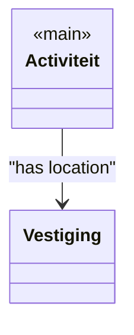
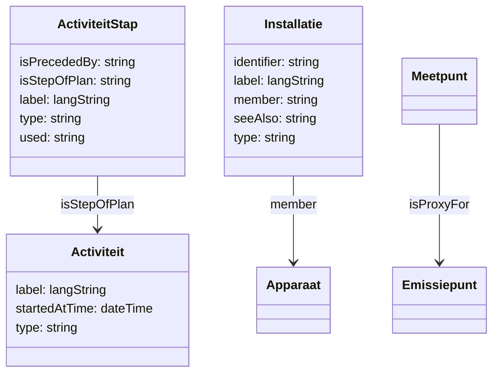
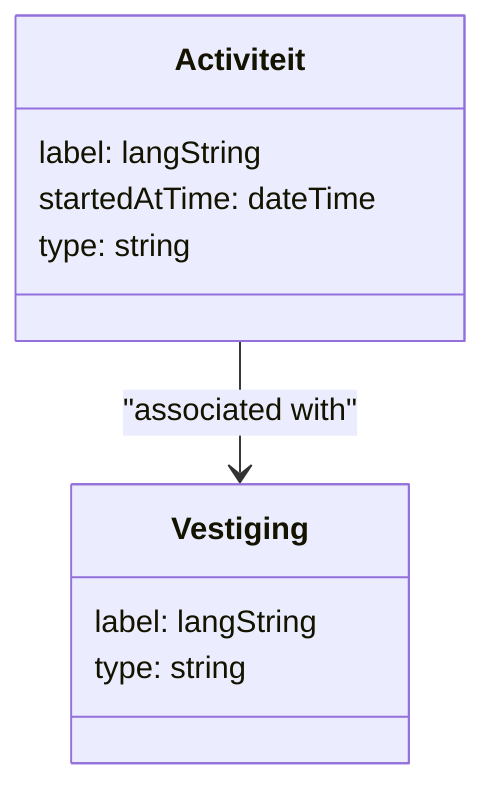

# Mermaid Class Diagram Generator

This directory contains tools to automatically generate Mermaid class diagrams from RDF data in the RIE-IEPR project.

## Overview

The system consists of several components:

1. **SPARQL Query** (`mermaid.rq`): Extracts class and property information from RDF data
2. **Python Converter** (`csv_to_mermaid.py`): Converts CSV output to Mermaid syntax
3. **Bash Script** (`mermaid.sh`): Orchestrates the entire process

## Usage

### Basic Usage (with Relationships)

```bash
cd /home/gehau/git/RIE-IEPR/documentatie/datamodel
./mermaid.sh
```

This will:
1. Find all TTL files in the data directory
2. 
2. Combine them into a single RDF dataset
3. Run the SPARQL query to extract class information and relationships
4. Generate a Mermaid class diagram with relationships in `mermaid_class_diagram.mmd`

### Output

The generated Mermaid diagram will be saved as:
- `mermaid_class_diagram.mmd` - Main output file with classes and relationships

## Components

### 1. SPARQL Query (`mermaid.rq`)

This query extracts:
- Classes (anything used as rdf:type)
- Properties of instances
- Labels and comments
- Data types of literal values
- Relationships between classes

### 2. Python Converter (`csv_to_mermaid.py`)

This script:
- Reads CSV output from the SPARQL query
- Groups properties by class
- Detects and processes relationships between classes
- Generates clean Mermaid syntax with relationships
- Handles URI simplification
- Escapes special characters

### 3. Bash Script (`mermaid.sh`)

This script:
- Finds all TTL files in the data directory
- Uses Apache Jena's `riot` tool to combine RDF files
- Runs the SPARQL query using `sparql` command
- Calls the Python converter
- Shows a preview of the result

## Requirements

- Apache Jena tools (`riot`, `sparql`)
- Python 3
- Bash shell

## Customization

### Adding Relationships

To add relationships between classes, you can:

1. **Manually edit** the generated Mermaid file
2. **Extend the SPARQL query** to include relationship detection
3. **Create a separate relationships file** and merge it

### Styling

You can add Mermaid styling to the generated diagram:



## Examples

### Generated Class with Relationships



### Relationship Types Found

The system automatically detects various types of relationships:

- **Type relationships**: `Activiteit --> Plan : type`
- **Step relationships**: `ActiviteitStap --> Activiteit : isStepOfPlan`
- **Containment**: `Installatie --> Apparaat : member`
- **Proxy relationships**: `Meetpunt --> Emissiepunt : isProxyFor`
- **Precedence**: `Step --> MultiStep : isPrecededBy`

## Integration with Documentation

You can include the generated Mermaid diagram in your Markdown documentation:

```markdown
# Data Model


```

## Troubleshooting

### No TTL files found

Make sure the script is run from the correct directory and that the TTL files exist in the expected location.

### Empty output

Check if the SPARQL query is finding the expected classes. You can test the query directly:

```bash
sparql --results=CSV --data=/tmp/riepr_mermaid.ttl --query mermaid.rq
```

### Python errors

Make sure you have Python 3 installed and that the script has execute permissions:

```bash
chmod +x csv_to_mermaid.py
```

## Future Enhancements

- Add automatic relationship detection
- Support for inheritance hierarchies
- Custom styling options
- Integration with existing Mermaid diagrams
- Support for different output formats

## License

This tool is part of the RIE-IEPR project and follows the same licensing terms.