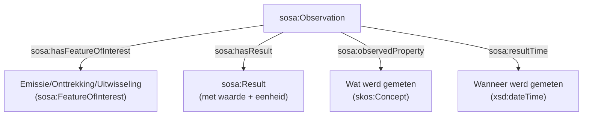

# Basisaannames


Dit document beschrijft de fundamentele aannames en modellen die ten grondslag liggen aan het RIE-IEPR-datamodel, vanuit het perspectief van Linked Open Data (LOD).

## 1. Processen als centraal skelet

Processen vormen het organisatieprincipe van het hele datamodel. **Alles hangt aan het hoofdproces van een exploitatie.** Dit betekent:

- Elke exploitatie implementeert precies één hoofdproces (`ssn:implements`)
- Subprocessen zijn gerelateerd via `pplan:isStepOfPlan`
- Emissie-, onttrekkings-, verwerkings- en meetprocessen zijn subprocessen van het hoofdproces
- Systemen (installaties, emissiepunten, ...) worden geïmplementeerd door processen (`ssn:implementedBy`)

```turtle
@prefix ssn:  <http://www.w3.org/ns/ssn/> .
@prefix pplan: <http://purl.org/net/p-plan#> .

# Exploitatie → hoofdproces
<.../exploitatie/019e9271-1454-7b38-9eae-505cace7ca54/2026-01-01/2026-01-01T10:00:00Z>
    ssn:implements <.../proces/019e9271-1455-78f7-94b6-becb88019f89/2026-01-01/2026-01-01T10:00:00Z> .

# Subproces → hoofdproces
<.../proces/019eaca0-b8c6-7240-ac66-b7831d1b3623/2026-01-01/2026-01-01T10:00:00Z>
    pplan:isStepOfPlan <.../proces/019e9271-1455-78f7-94b6-becb88019f89/2026-01-01/2026-01-01T10:00:00Z> .

# Proces → systeem
<.../proces/019eaca0-b8c6-7240-ac66-b7831d1b3623/2026-01-01/2026-01-01T10:00:00Z>
    ssn:implementedBy <.../emissiepunt/019eaca0-b8c6-7096-886c-103c3e21466c/2026-01-01/2026-01-01T10:00:00Z> .
```

## 2. URI-ontwerp en versiebeheer

Het model maakt onderscheid tussen **identity URIs** (tijdsloos) en **versie-URIs** (met tijd).

### Identity URI vs. versie URI

| Type | URI-patroon | Voorbeeld | Doel |
|---|---|---|---|
| Identity | `{type}/{uuid}` | `.../exploitatie/019e9271-1454-7b38-9eae-505cace7ca54` | Tijdsloze entiteit, unieke referentie |
| Versie | `{type}/{uuid}/{issued}/{created}` | `.../exploitatie/.../2026-01-01/2026-01-01T10:00:00Z` | Specifieke toestand op een moment |

De relatie tussen versie en identity wordt gelegd via `dct:isVersionOf`:

```turtle
<.../installatie/019e9271-1456-7a2f-ac4e-8904bab88f37/2026-01-01/2026-01-01T10:00:00Z>
    dct:isVersionOf <https://data.mjv.omgeving.vlaanderen.be/id/installatie/019e9271-1456-7a2f-ac4e-8904bab88f37> .
```

### Feature of Interest vs. versioneerbare entiteiten

Niet alle entiteiten zijn versioneerbaar. **Feature of Interest** entiteiten (Emissie, Onttrekking, Uitwisseling) hebben een **twee-segment URI** (`{type}/{uuid}`) en worden niet geversioneerd — ze vertegenwoordigen een tijdsloos concept dat door observaties wordt "gevuld" met tijd.

```turtle
# Feature of Interest (geen versie)
<.../emissie/019eaca0-b8c6-7096-886c-103c3e21466c>
    a riepr:Emissie, sosa:FeatureOfInterest .

# Observatie (met tijd) koppelt aan Feature of Interest
<.../observatie/.../2026-01-01T10:00:00Z>
    sosa:hasFeatureOfInterest <.../emissie/019eaca0-b8c6-7096-886c-103c3e21466c> .
```

## 3. Exploitatie: twee lagen

Een exploitatie bestaat uit **twee lagen**:

1. **De tijdsloze exploitatie** (identity URI) — representeert het abstracte concept van de exploitatie
2. **De versies/toestanden** (versie URI) — beschrijven een specifieke toestand met geldigheid, status en inhoud

```turtle
# Laag 1: tijdsloze exploitatie (identity)
<.../exploitatie/019e9271-1454-7b38-9eae-505cace7ca54>
    a riepr:Exploitatie ;
    prov:hadPrimarySource <https://data.vim.omgeving.vlaanderen.be/TBDTBD> .

# Laag 2: versie/toestand van de exploitatie
<.../exploitatie/019e9271-1454-7b38-9eae-505cace7ca54/2026-01-01/2026-01-01T10:00:00Z>
    a riepr:Exploitatie ;
    dct:isVersionOf <.../exploitatie/019e9271-1454-7b38-9eae-505cace7ca54> ;
    dct:issued "2026-01-01"^^xsd:date ;
    adms:status <https://data.omgeving.vlaanderen.be/id/concept/riepr/status-type/in_dienst> .
```

## 4. Proces-procedure koppels (OWL-axioma's)

Het model bevat **OWL-axioma's** die proces types dwingen aan bepaalde systemen te koppelen. De proces types komen uit de codelijst **`procedure_type`** ([beheerd in milieuinfo/codelijst-rie-iepr](https://github.com/milieuinfo/codelijst-rie-iepr/)):

| Proces type (`dct:type`) | URI | Moet implementeren (`ssn:implementedBy`) |
|---|---|---|
| Emissie | `…/procedure-type/emissie` | `riepr:Emissiepunt` |
| Onttrekking | `…/procedure-type/onttrekking` | `riepr:Onttrekkingspunt` |
| Verwerking | `…/procedure-type/verwerking` | `riepr:Installatie` |
| Meet | `…/procedure-type/meet` | `riepr:Meetpunt` |
| Uitwissel | `…/procedure-type/uitwissel` | `riepr:Uitwisselpunt` |
| Hoofdactiviteit | `…/hoofdactiviteit-type` | `riepr:Exploitatie` |

Dit betekent dat als een proces het type "emissie" heeft, het **per definitie** een emissiepunt moet implementeren. Deze axioma's zijn vastgelegd in de ontologie (`riepr.ttl`) en garanderen dataconsistentie.

De volledige URI's van de procedure types verwijzen naar [data.omgeving.vlaanderen.be](https://data.omgeving.vlaanderen.be/id/concept/riepr/procedure-type/emissie), waar ze als SKOS concepten gepubliceerd zijn.

## 5. Disjoint classes

Enkele klassen zijn onderling **disjoint**: een entiteit kan niet tegelijkertijd tot meerdere van deze klassen behoren.

- `riepr:Emissiepunt`
- `riepr:Onttrekkingspunt`
- `riepr:Meetpunt`

Een punt is dus ofwel een emissiepunt, ofwel een onttrekkingspunt, ofwel een meetpunt — nooit twee tegelijk. Het **Uitwisselpunt** is gedefinieerd als de equivalentie van de intersectie van Emissiepunt en Onttrekkingspunt (een punt dat zowel emissies als onttrekkingen toelaat).

## 6. Observaties en Features of Interest

Observaties volgen het **SOSA/SSN**-patroon:



Emissie, onttrekking en uitwisseling zijn **gebeurtenissen** (`riepr:Gebeurtenis`) en fungeren als `sosa:FeatureOfInterest`. Ze worden niet zelf "gemeten" — ze zijn het **onderwerp** van de meting.

```turtle
@prefix sosa: <http://www.w3.org/ns/sosa/> .

# Gebeurtenis (Feature of Interest)
<.../emissie/019eaca0-b8c6-7096-886c-103c3e21466c>
    a riepr:Emissie, sosa:FeatureOfInterest .

# Observatie van de gebeurtenis
<.../observatie/.../2026-01-01T10:00:00Z>
    a sosa:Observation ;
    sosa:hasFeatureOfInterest <.../emissie/019eaca0-b8c6-7096-886c-103c3e21466c> .
```

## 7. Systeemeigenschappen

Systeemeigenschappen (`riepr:Systeemeigenschap`) zijn eigenschappen die betrekking hebben op een systeem (installatie, emissiepunt, meetpunt, ...). Ze worden gekoppeld via `ssn:hasProperty`.

Elke systeemeigenschap heeft twee kenmerken:
- **`riepr:parameter`** — de naam van de parameter (bijv. "verwijderingsrendement")
- **`riepr:datatype`** — het datatype van de waarde (bijv. `xsd:decimal`)

```turtle
<.../systeemeigenschap/019ecf80-eae8-730f-8fc4-c09b55661a9f>
    a riepr:Systeemeigenschap ;
    riepr:parameter "verwijderingsrendement"@nl ;
    riepr:datatype <http://www.w3.org/2001/XMLSchema#decimal> .
```

## 8. Provenance en herkomst

Elke entiteit kan een primaire bron hebben via `prov:hadPrimarySource`. Dit traceert waar de data vandaan komt:

- **Exploitanten** → VKBO-onderneming (`org:Organization`)
- **Exploitatielocaties** → VKBO-vestiging (`org:Site`)
- **Exploitaties** → VIM-activiteit

```turtle
<.../exploitant/019e9271-1452-7630-be04-59ea199007a7>
    prov:hadPrimarySource <https://data.vlaanderen.be/id/onderneming/0413638187> .

<.../exploitatielocatie/.../2026-01-01/2026-01-01T10:00:00Z>
    prov:hadPrimarySource <https://data.vlaanderen.be/id/vestiging/2081766488> .
```

## Referenties

- [Gebruiksscenario's](./GEBRUIKSSCENARIO.md) — concrete voorbeelden van data-afname
- [Exploitant- en exploitatiemodel](./EXPLOITANT.md) — organisaties, locaties, activiteiten
- [Versiebeheer en tijdsrecht](./VERSIEBEHEER.md) — versies, geldigheid, historische query's
