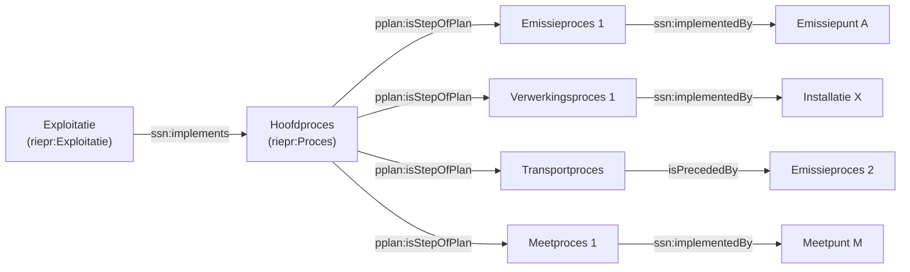

# Exploitant- en exploitatiemodel


Dit document beschrijft hoe organisaties (exploitanten), hun locaties (exploitatielocaties) en activiteiten (exploitaties) worden beschreven in het RIE-IEPR-datamodel.

## 1. Exploitant

Een **exploitant** is een entiteit die een milieuimpact heeft. In de ontologie is het een subklasse van `prov:Agent`.

### Kenmerken

| Eigenschap | Type | Verplicht | Beschrijving |
|---|---|---|---|
| `rdfs:label` | string | Ja | Naam van de exploitant |
| `prov:hadPrimarySource` | org:Organization | Ja | Primaire bron (VKBO-onderneming) |
| `dct:created` | dateTime | Nee | Aanmaakdatum |
| `dct:modified` | dateTime | Nee | Laatste wijzigingsdatum |
| `locn:address` | locn:Address | Nee | Adres van de exploitant |

### URI-patroon

Exploitanten hebben een **vaste identity URI** op basis van een UUID:

```turtle
@prefix riepr: <https://data.riepr.omgeving.vlaanderen.be/ns/riepr#> .
@prefix prov:  <http://www.w3.org/ns/prov#> .
@prefix org:   <http://www.w3.org/ns/org#> .

<https://data.mjv.omgeving.vlaanderen.be/id/exploitant/019e9271-1452-7630-be04-59ea199007a7>
    a riepr:Exploitant ;
    dct:created "2026-01-01T10:00:00Z"^^xsd:dateTime ;
    dct:modified "2026-01-01T10:00:00Z"^^xsd:dateTime ;
    prov:hadPrimarySource <https://data.vlaanderen.be/id/onderneming/0413638187> .
```

Er is **geen versiebeheer** voor exploitanten zelf — ze hebben geen `issued` of `created` segment in de URI.

## 2. Contactgegevens

Contactgegevens worden voorgesteld als een `oa:Annotation` die een versie/toestand van een exploitatie target. Ze zijn gekoppeld aan een specifieke exploitatie-versie (niet direct aan de exploitant).

```turtle
@prefix oa:    <http://www.w3.org/ns/oa#> .
@prefix foaf:  <http://xmlns.com/foaf/0.1/> .

<https://data.mjv.omgeving.vlaanderen.be/id/contactgegevens/019ed475-eb52-76ad-9c36-96ef45d889d0/2026-01-01T10:00:00Z>
    a riepr:Contactgegevens ;
    dct:isVersionOf <https://data.mjv.omgeving.vlaanderen.be/id/contactgegevens/019ed475-eb52-76ad-9c36-96ef45d889d0> ;
    oa:hasTarget <https://data.mjv.omgeving.vlaanderen.be/id/exploitatie/019e9271-1454-7b38-9eae-505cace7ca54> ;
    foaf:name "John Doe"@nl ;
    foaf:mbox <mailto:info@example.com> .
```

**Belangrijk:** `oa:hasTarget` verwijst naar een **exploitatie-versie** (met `/uuid/issued/created` in de URI), niet naar de identity-URI van de exploitant of naar de exploitant zelf. Dit maakt contactgegevens contextueel gebonden aan een specifieke toestand van de exploitatie.

## 3. Exploitatielocatie

Een **exploitatielocatie** is een specifieke geografische locatie waar een exploitant zijn processen uitvoert. Het is een subklasse van `sosa:Platform`, `prov:Entity` en `ogc:Feature`.

### Kenmerken

| Eigenschap | Type | Verplicht | Beschrijving |
|---|---|---|---|
| `rdfs:label` | string | Ja | Naam van de locatie |
| `prov:hadPrimarySource` | org:Site | Nee | Primaire bron (VKBO-vestiging) |
| `dct:issued` | date | Ja | Geldigheidsdatum |
| `dct:created` | dateTime | Ja | Aanmaakdatum |
| `adms:status` | skos:Concept | Nee | Status (in_dienst, ontmanteld, ...) |
| `locn:address` | locn:Address | Nee | Adresgegevens |
| `ogc:hasGeometry` | ogc:Geometry | Nee | Geografische coördinaten (WKT) |

### URI-patroon

Exploitatielocaties zijn **versioneerbaar**:

```turtle
@prefix ogc:  <http://www.opengis.net/ont/geosparql#> .
@prefix locn: <http://www.w3.org/ns/locn#> .
@prefix adms: <http://www.w3.org/ns/adms#> .

<https://data.mjv.omgeving.vlaanderen.be/id/exploitatielocatie/019e9271-1453-7810-92ea-ccac2e6932b1/2026-01-01/2026-01-01T10:00:00Z>
    a riepr:Exploitatielocatie ;
    dct:isVersionOf <https://data.mjv.omgeving.vlaanderen.be/id/exploitatielocatie/019e9271-1453-7810-92ea-ccac2e6932b1> ;
    dct:issued "2026-01-01"^^xsd:date ;
    dct:created "2026-01-01T10:00:00Z"^^xsd:dateTime ;
    adms:status <https://data.omgeving.vlaanderen.be/id/concept/riepr/status-type/in_dienst> ;
    prov:hadPrimarySource <https://data.vlaanderen.be/id/vestiging/2081766488> ;
    locn:address [
        a locn:Address ;
        locn:streetAddress "Voortstraat 27" ;
        locn:postalCode "2400" ;
        locn:addressLocality "Mol" ;
        locn:addressCountry "BE"
    ] ;
    ogc:hasGeometry [
        a ogc:Point ;
        ogc:asWKT "POINT (205700 209700)"^^ogc:wktLiteral ;
        ogc:crs <http://www.opengis.net/gml/srs/epsg.xml#31370>
    ] .
```

### Geospatiale data

Exploitatielocaties gebruiken **GeoSPARQL** voor geometrie. De coördinaten worden opgeslagen als WKT (Well-Known Text) met een CRS-URI:

```turtle
ogc:hasGeometry [
    a ogc:Point ;
    ogc:asWKT "POINT (205700 209700)"^^ogc:wktLiteral ;
    ogc:crs <http://www.opengis.net/gml/srs/epsg.xml#31370>
] .
```

CRS EPSG:31370 komt overeen met **Belge 1972 / Belgian Lambert 2008** (het Belgische landelijk coördinatenstelsel).

## 4. Exploitatie

Een **exploitatie** is de uitrol van middelen door een exploitant. Het is een subklasse van `ssn:Deployment`.

### Twee lagen: identity en versie

Een exploitatie bestaat uit twee niveaus:

1. **Identity URI** — de tijdsloze abstractie van de exploitatie
2. **Versie URI** — een specifieke toestand met geldigheid, status en inhoud

```turtle
@prefix ssn:  <http://www.w3.org/ns/ssn/> .
@prefix org:  <http://www.w3.org/ns/org#> .
@prefix prov: <http://www.w3.org/ns/prov#> .

# Laag 1: identity (tijdsloos)
<https://data.mjv.omgeving.vlaanderen.be/id/exploitatie/019e9271-1454-7b38-9eae-505cace7ca54>
    a riepr:Exploitatie ;
    prov:hadPrimarySource <https://data.vim.omgeving.vlaanderen.be/TBDTBD> .

# Laag 2: versie/toestand
<https://data.mjv.omgeving.vlaanderen.be/id/exploitatie/019e9271-1454-7b38-9eae-505cace7ca54/2026-01-01/2026-01-01T10:00:00Z>
    a riepr:Exploitatie ;
    dct:isVersionOf <https://data.mjv.omgeving.vlaanderen.be/id/exploitatie/019e9271-1454-7b38-9eae-505cace7ca54> ;
    rdfs:label "Een naam gekozen door de exploitant"@nl ;
    dct:issued "2026-01-01"^^xsd:date ;
    adms:status <https://data.omgeving.vlaanderen.be/id/concept/riepr/status-type/in_dienst> ;
    org:classification <http://data.europa.eu/ux2/nace2.1/231> ;
    ssn:implements <.../proces/019e9271-1455-78f7-94b6-becb88019f89/2026-01-01/2026-01-01T10:00:00Z> ;
    ssn:deployedOnPlatform <.../exploitatielocatie/019e9271-1453-7810-92ea-ccac2e6932b1/2026-01-01/2026-01-01T10:00:00Z> ;
    ssn:deployedSystem <.../installatie/...>, <.../emissiepunt/...>, <.../meetpunt/...> .
```

### Belangrijke relaties van een exploitatie-versie

| Relatie | Doel | Beschrijving |
|---|---|---|
| `ssn:implements` | Proces | Het hoofdproces dat de exploitatie uitvoert |
| `ssn:deployedOnPlatform` | Exploitatielocatie | De locatie waar de exploitatie plaatsvindt |
| `ssn:deployedSystem` | Systemen | Alle systemen (installaties, emissiepunten, meetpunten) die bij de exploitatie horen |
| `org:classification` | NACE-code | De hoofdactiviteit van de exploitant |

## 5. Het proces

Een **proces** is een industrieel proces met hiërarchische stappen. Het is een subklasse van `pplan:Plan`, `pplan:Step` en `sosa:Procedure`.

### Hoofdproces vs. subprocessen

```turtle
@prefix pplan: <http://purl.org/net/p-plan#> .
@prefix dct:   <http://purl.org/dc/terms/> .

# Hoofdproces (geïmplementeerd door exploitatie)
<.../proces/019e9271-1455-78f7-94b6-becb88019f89/2026-01-01/2026-01-01T10:00:00Z>
    a riepr:Proces ;
    rdfs:label "Vormen en bewerken van vlakglas"@nl ;
    dct:type <https://data.omgeving.vlaanderen.be/id/concept/riepr/hoofdactiviteit-type> .

# Subproces: emissie (koppelt aan emissiepunt)
<.../proces/019eaca0-b8c6-7240-ac66-b7831d1b3623/2026-01-01/2026-01-01T10:00:00Z>
    a riepr:Proces ;
    rdfs:label "Emissie schoorsteen 1"@nl ;
    dct:type <https://data.omgeving.vlaanderen.be/id/concept/riepr/procedure-type/emissie> ;
    pplan:isStepOfPlan <.../proces/019e9271-1455-78f7-94b6-becb88019f89/2026-01-01/2026-01-01T10:00:00Z> .

# Subproces: verwerking (koppelt aan installatie)
<.../proces/019eaca0-b8c6-7351-bd77-c8942e32577d/2026-01-01/2026-01-01T10:00:00Z>
    a riepr:Proces ;
    rdfs:label "Verwerking glas"@nl ;
    dct:type <https://data.omgeving.vlaanderen.be/id/concept/riepr/procedure-type/verwerking> ;
    pplan:isStepOfPlan <.../proces/019e9271-1455-78f7-94b6-becb88019f89/2026-01-01/2026-01-01T10:00:00Z> .
```

### Proces hiërarchie via `pplan:isStepOfPlan`

Processen kunnen genest zijn — een subprocess kan zelf weer subprocessen hebben:



## Referenties

- [Basisaannames](./BASISAANNAME.md) — URI-ontwerp, processen als skelet, OWL-axioma's
- [Installaties en emissiepunten](./SYSTEMEN.md) — systemen en subsystemen
- [Gebruiksscenario's](./GEBRUIKSSCENARIO.md) — concrete SPARQL-query's
- **Codelijsten**: De `dct:type` waarden (procedure_type, installatie_type) en `org:classification` (NACE) verwijzen naar gecontroleerde vocabulaires uit [milieuinfo/codelijst-rie-iepr](https://github.com/milieuinfo/codelijst-rie-iepr/).
