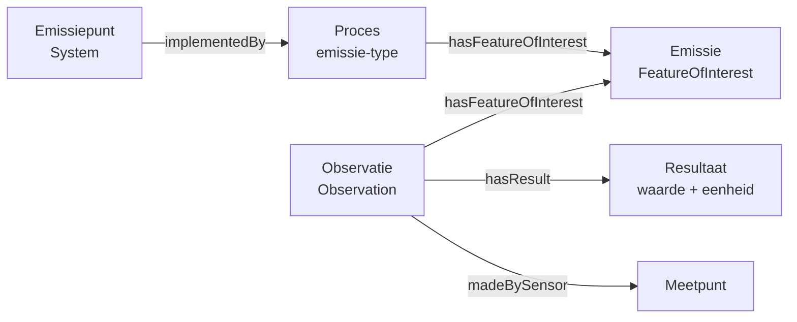

# Gebruiksscenario's


Deze documentatie beschrijft concrete gebruiksscenario's voor afnemers van het RIE-IEPR-datamodel via Linked Open Data (LOD). Alle voorbeelden zijn gebaseerd op een enkel voorbeeldbestand.

## Scenario 1: Een exploitant identificeren en contacteren

> **Doel**: Het doel is om alle informatie te vinden over een specifieke exploitant, inclusief contactgegevens.

Elke exploitant heeft een vaste URI gebaseerd op een UUID. Contactgegevens worden geannoteerd via de `oa:Annotation`-klasse en verwijzen naar de exploitatie (niet direct naar de exploitant).

```turtle
@prefix riepr: <https://data.riepr.omgeving.vlaanderen.be/ns/riepr#> .
@prefix prov:  <http://www.w3.org/ns/prov#> .
@prefix foaf:  <http://xmlns.com/foaf/0.1/> .
@prefix oa:    <http://www.w3.org/ns/oa#> .

<https://data.mjv.omgeving.vlaanderen.be/id/exploitant/019e9271-1452-7630-be04-59ea199007a7>
    a riepr:Exploitant ;
    prov:hadPrimarySource <https://data.vlaanderen.be/id/onderneming/0413638187> .

<https://data.mjv.omgeving.vlaanderen.be/id/contactgegevens/019ed475-eb52-76ad-9c36-96ef45d889d0/2026-01-01T10:00:00Z>
    a riepr:Contactgegevens ;
    oa:hasTarget <https://data.mjv.omgeving.vlaanderen.be/id/exploitatie/019e9271-1454-7b38-9eae-505cace7ca54> ;
    foaf:name "John Doe"@nl ;
    foaf:mbox <mailto:info@example.com> .
```

**SPARQL-query voorbeeld:**
```sparql
SELECT ?contactNaam ?contactEmail
WHERE {
  ?exploitant a riepr:Exploitant .
  ?contact a riepr:Contactgegevens ;
           oa:hasTarget ?exploitatie ;
           foaf:name ?contactNaam ;
           foaf:mbox ?contactEmail .
  ?exploitatie prov:hadPrimarySource ?exploitant .
}
```

## Scenario 2: Alle installaties van een exploitatie ophalen

> **Doel**: Het doel is om te achterhalen welke installaties, emissiepunten en meetpunten bij een bepaalde exploitatie horen.

De relatie tussen een exploitatie en haar systemen wordt gelegd via `ssn:deployedSystem`. Dit omvat installaties, emissiepunten, onttrekkingspunten, meetpunten en filters.

```turtle
@prefix ssn: <http://www.w3.org/ns/ssn/> .

<https://data.mjv.omgeving.vlaanderen.be/id/exploitatie/019e9271-1454-7b38-9eae-505cace7ca54/2026-01-01/2026-01-01T10:00:00Z>
    a riepr:Exploitatie ;
    ssn:deployedSystem
        <https://data.mjv.omgeving.vlaanderen.be/id/installatie/019e9271-1456-7a2f-ac4e-8904bab88f37/2026-01-01/2026-01-01T10:00:00Z>,
        <https://data.mjv.omgeving.vlaanderen.be/id/emissiepunt/019e9271-145b-75f5-83d9-fe9b0b7e9540/2026-01-01/2026-01-01T10:00:00Z>,
        <https://data.mjv.omgeving.vlaanderen.be/id/meetpunt/019e9271-1465-72f2-8291-c289676c3ded/2026-01-01/2026-01-01T10:00:00Z> .
```

**SPARQL-query voorbeeld:**
```sparql
SELECT ?systeem ?type ?label
WHERE {
  ?exploitatie a riepr:Exploitatie ;
               ssn:deployedSystem ?systeem .
  ?systeem a ?type ;           # riepr:Installatie, riepr:Emissiepunt, ...
           rdfs:label ?label .
}
```

## Scenario 3: Emissieobservaties opvragen voor een specifiek emissiepunt

> **Doel**: Het doel is om alle metingen en observaties te vinden die gekoppeld zijn aan een bepaald emissiepunt.

Observaties worden gekoppeld aan emissiepunten via `sosa:hasFeatureOfInterest`. Elke observatie heeft een resultaat dat de gemeten waarde bevat. De relatie tussen emissiepunt, emissie-gebeurtenis en observatie ziet er als volgt uit:



```turtle
@prefix sosa: <http://www.w3.org/ns/sosa/> .
@prefix qudt: <http://qudt.org/schema/qudt/> .
@prefix unit: <http://qudt.org/vocab/unit/> .

<https://data.mjv.omgeving.vlaanderen.be/id/observatie/019edc4a-1a35-7bn3-im4f-n9ojk7kgkf4/2026-01-01T10:00:00Z>
    a sosa:Observation ;
    sosa:hasFeatureOfInterest <https://data.mjv.omgeving.vlaanderen.be/id/emissiepunt/019e9271-145b-75f5-83d9-fe9b0b7e9540/2026-01-01/2026-01-01T10:00:00Z> ;
    sosa:observedProperty <https://data.omgeving.vlaanderen.be/id/concept/riepr/observed-property/NOx> ;
    sosa:resultTime "2026-01-01T10:00:00Z"^^xsd:dateTime ;
    sosa:hasResult [
        a sosa:Result ;
        qudt:numericValue "45.2"^^qudt:NumericValue ;
        qudt:unit unit:PPM
    ] .
```

**SPARQL-query voorbeeld:**
```sparql
SELECT ?emissiepunt ?datum ?stof ?waarde ?eenheid
WHERE {
  ?observatie a sosa:Observation ;
              sosa:hasFeatureOfInterest ?emissiepunt ;
              sosa:resultTime ?datum ;
              sosa:observedProperty ?stof ;
              sosa:hasResult [ qudt:numericValue ?waarde ;
                               qudt:unit ?eenheid ] .
  FILTER(?emissiepunt = <https://data.mjv.omgeving.vlaanderen.be/id/emissiepunt/019e9271-145b-75f5-83d9-fe9b0b7e9540/2026-01-01/2026-01-01T10:00:00Z>)
}
ORDER BY DESC(?datum)
```

## Scenario 4: Processen en hun hiërarchie doorzoeken

> **Doel**: Het doel is om de proceshiërarchie van een exploitatie in te zien. Welke stappen bij elkaar horen?

Processen vormen het centrale skelet van het model. Het hoofdproces (type = hoofdactiviteit) wordt geïmplementeerd door de exploitatie. Subprocessen zijn verbonden via `pplan:isStepOfPlan`.

```turtle
@prefix pplan: <http://purl.org/net/p-plan#> .
@prefix dct:   <http://purl.org/dc/terms/> .

# Hoofdproces van de exploitatie
<.../proces/019e9271-1455-78f7-94b6-becb88019f89/2026-01-01/2026-01-01T10:00:00Z>
    a riepr:Proces ;
    rdfs:label "Vormen en bewerken van vlakglas"@nl ;
    dct:type <https://data.omgeving.vlaanderen.be/id/concept/riepr/hoofdactiviteit-type> .

# Subproces: emissie
<.../proces/019eaca0-b8c6-7240-ac66-b7831d1b3623/2026-01-01/2026-01-01T10:00:00Z>
    a riepr:Proces ;
    rdfs:label "Emissieproces schoorsteen 1"@nl ;
    dct:type <https://data.omgeving.vlaanderen.be/id/concept/riepr/procedure-type/emissie> ;
    pplan:isStepOfPlan <.../proces/019e9271-1455-78f7-94b6-becb88019f89/2026-01-01/2026-01-01T10:00:00Z> .
```

**SPARQL-query voorbeeld:**
```sparql
SELECT ?hoofdProces ?subProces ?label ?type
WHERE {
  ?exploitatie ssn:implements ?hoofdProces .
  ?subProces pplan:isStepOfPlan ?hoofdProces ;
             rdfs:label ?label ;
             dct:type ?type .
}
```

## Scenario 5: Systeemeigenschappen van een installatie lezen

> **Doel**: Het doel is om de eigenschappen (parameters) van een specifieke installatie op te vragen.

Systeemeigenschappen worden gekoppeld via `ssn:hasProperty`. Elke eigenschap heeft een `riepr:parameter` (de naam) en een `riepr:datatype` (het datatype).

```turtle
@prefix ssn: <http://www.w3.org/ns/ssn/> .

<.../installatie/019e9271-1456-7a2f-ac4e-8904bab88f37/2026-01-01/2026-01-01T10:00:00Z>
    ssn:hasProperty <https://data.mjv.omgeving.vlaanderen.be/id/systeemeigenschap/019ecf80-eae8-730f-8fc4-c09b55661a9f> .

<https://data.mjv.omgeving.vlaanderen.be/id/systeemeigenschap/019ecf80-eae8-730f-8fc4-c09b55661a9f>
    a riepr:Systeemeigenschap ;
    riepr:parameter "verwijderingsrendement"@nl ;
    riepr:datatype <http://www.w3.org/2001/XMLSchema#decimal> .
```

## Scenario 6: Geospatiale data van een exploitatielocatie opvragen

> **Doel**: Het doel is om de geografische locatie en het adres van een exploitatie te vinden.

Exploitatielocaties gebruiken GeoSPARQL voor geometrie en LOCN voor adressen.

```turtle
@prefix ogc: <http://www.opengis.net/ont/geosparql#> .
@prefix locn: <http://www.w3.org/ns/locn#> .

<.../exploitatielocatie/019e9271-1453-7810-92ea-ccac2e6932b1/2026-01-01/2026-01-01T10:00:00Z>
    a riepr:Exploitatielocatie ;
    ogc:hasGeometry [
        a ogc:Point ;
        ogc:asWKT "POINT (205700 209700)"^^ogc:wktLiteral ;
        ogc:crs <http://www.opengis.net/gml/srs/epsg.xml#31370>
    ] ;
    locn:address [
        a locn:Address ;
        locn:streetAddress "Voortstraat 27" ;
        locn:postalCode "2400" ;
        locn:addressLocality "Mol" ;
        locn:addressCountry "BE"
    ] .
```

## Scenario 7: Observaties groeperen per meetpunt en tijdsperiode

> **Doel**: Het doel is om alle observaties van een meetpunt binnen een bepaalde tijdspanne te vinden.

Meetpunten fungeren als Feature of Interest voor observaties. De `sosa:hasFeatureOfInterest`-relatie koppelt observaties aan het meetpunt.

```turtle
# Observaties gekoppeld aan meetpunt 019e9271-1465-72f2-8291-c289676c3ded
<.../observatie/.../2026-01-01T10:00:00Z>
    sosa:hasFeatureOfInterest <.../meetpunt/019e9271-1465-72f2-8291-c289676c3ded/2026-01-01/2026-01-01T10:00:00Z> ;
    sosa:resultTime "2026-01-01T10:00:00Z"^^xsd:dateTime .

<.../observatie/.../2026-01-02T10:00:00Z>
    sosa:hasFeatureOfInterest <.../meetpunt/019e9271-1465-72f2-8291-c289676c3ded/2026-01-01/2026-01-01T10:00:00Z> ;
    sosa:resultTime "2026-01-02T10:00:00Z"^^xsd:dateTime .
```

## Referenties

- [Basisaannames](./BASISAANNAME.md) modellen en aannames achter het datamodel
- [Exploitant- en exploitatiemodel](./EXPLOITANT.md) organisaties, locaties, activiteiten
- [Installaties en emissiepunten](./SYSTEMEN.md) systemen en subsystemen
- [Observaties en emissies](./OBSERVATIES.md) metingen en gebeurtenissen
