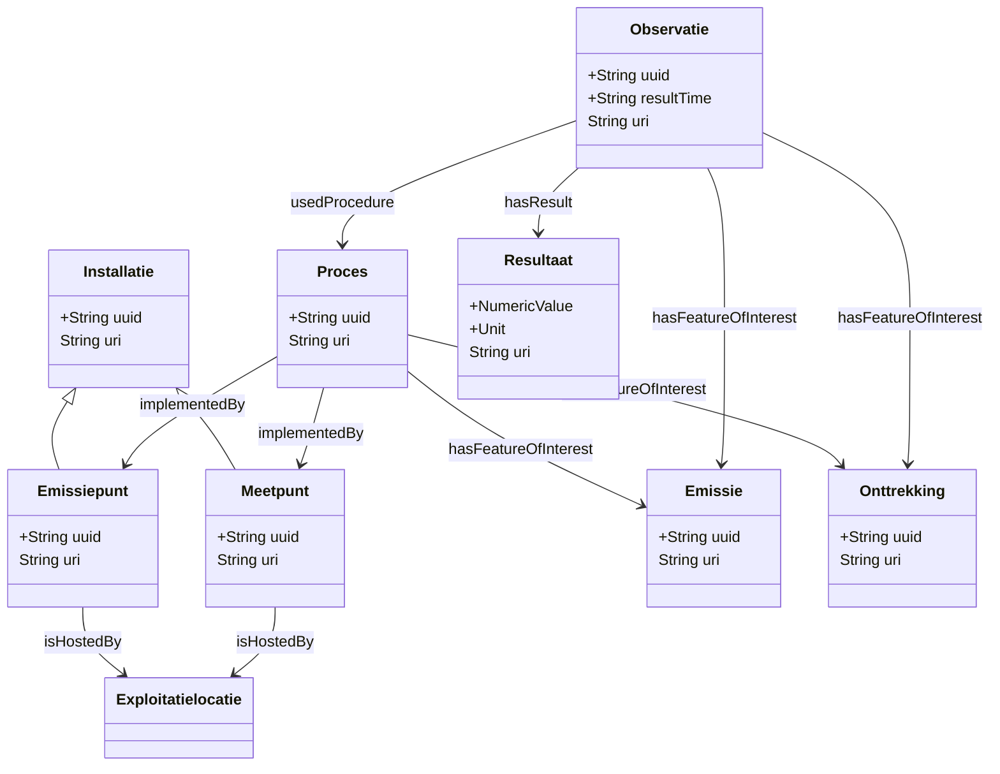

# Observaties en emissies


Dit document beschrijft hoe metingen, observaties en gebeurtenissen (emissie, onttrekking) worden voorgesteld in het RIE-IEPR-datamodel. Het volgt het **SOSA/SSN**-patroon van de W3C.

## 1. Het SOSA/SSN observatiepatroon

Het model gebruikt het standaard SOSA-patroon voor observaties:

```
Observation
  ├── hasFeatureOfInterest → Emissie / Onttrekking
  ├── observedProperty     → Wat werd gemeten (stof, parameter)
  ├── resultTime           → Wanneer werd gemeten
  └── hasResult            → Resultaat
        └── NumericValue   → De gemeten waarde + eenheid
```

## 2. Gebeurtenissen: Emissie, Onttrekking

Emissie en onttrekking zijn **gebeurtenissen** en fungeren als `sosa:FeatureOfInterest`. Ze vertegenwoordigen een tijdsloos concept. De gebeurtenis zelf heeft geen timestamp. De tijd wordt toegevoegd via de gekoppelde observatie.

### Emissie

Een **emissie** is een gebeurtenis waarbij stoffen de installatie verlaten (aan een emissiepunt).

```turtle
@prefix riepr: <https://data.riepr.omgeving.vlaanderen.be/ns/riepr#> .
@prefix sosa:  <http://www.w3.org/ns/sosa/> .
@prefix prov:  <http://www.w3.org/ns/prov#> .

<https://data.mjv.omgeving.vlaanderen.be/id/emissie/019eaca0-b8c6-7096-886c-103c3e21466c>
    a riepr:Emissie, sosa:FeatureOfInterest, prov:Entity .
```

Emissies hebben een **twee-segment URI** (`{type}/{uuid}`). Ze worden niet geversioneerd.

### Onttrekking

Een **onttrekking** is een gebeurtenis waarbij grondstoffen gewonnen worden (aan een onttrekkingspunt).

```turtle
<https://data.mjv.omgeving.vlaanderen.be/id/onttrekking/019eaca0-b8c6-7096-886c-103c3e21466d>
    a riepr:Onttrekking, sosa:FeatureOfInterest, prov:Entity .
```

> **Opmerking**: De klasse `Uitwisseling` is verwijderd uit de ontologie. Uitwisselingen worden nu rechtstreeks gekoppeld aan `Uitwisselpunt` via het procesmodel.

## 3. Observaties

Een **observatie** is een waarneming of meting. Het is een instantie van `sosa:Observation`.

### Kenmerken van een observatie

| Eigenschap | Type | Beschrijving |
|---|---|---|
| `sosa:hasFeatureOfInterest` | FeatureOfInterest | De gebeurtenis die wordt waargenomen (emissie, onttrekking) |
| `sosa:observedProperty` | Concept | Wat werd gemeten (stof, parameter) |
| `sosa:resultTime` | dateTime | Wanneer werd de meting uitgevoerd |
| `sosa:hasResult` | Resultaat | Het resultaat van de meting |
| `sosa:madeBySensor` | System | Het meetpunt/systeem dat de meting uitvoerde |
| `sosa:usedProcedure` | Procedure | De gebruikte meetprocedure |

### URI-patroon

Observaties zijn **versioneerbaar** met een drie-segment patroon (`{type}/{uuid}/{created}`):

```turtle
@prefix sosa:  <http://www.w3.org/ns/sosa/> .
@prefix qudt:  <http://qudt.org/schema/qudt/> .
@prefix unit:  <http://qudt.org/vocab/unit/> .
@prefix dct:   <http://purl.org/dc/terms/> .

<https://data.mjv.omgeving.vlaanderen.be/id/observatie/019edc4a-1a35-7bn3-im4f-n9ojk7kgkf4/2026-01-01T10:00:00Z>
    a sosa:Observation ;
    dct:isVersionOf <https://data.mjv.omgeving.vlaanderen.be/id/observatie/019edc4a-1a35-7bn3-im4f-n9ojk7kgkf4> ;
    sosa:hasFeatureOfInterest <https://data.mjv.omgeving.vlaanderen.be/id/emissie/019eaca0-b8c6-7096-886c-103c3e21466c> ;
    sosa:observedProperty <https://data.omgeving.vlaanderen.be/id/concept/riepr/observed-property/NOx> ;
    sosa:resultTime "2026-01-01T10:00:00Z"^^xsd:dateTime ;
    sosa:hasResult [
        a sosa:Result ;
        qudt:numericValue "45.2"^^qudt:NumericValue ;
        qudt:unit unit:PPM
    ] .
```

## 4. Resultaten en waarden

Het resultaat van een observatie wordt voorgesteld als een `sosa:Result` met een numerieke waarde en een eenheid (via QUDT).

```turtle
sosa:hasResult [
    a sosa:Result, prov:Entity ;
    qudt:numericValue "45.2"^^qudt:NumericValue ;
    qudt:unit unit:PPM
] .
```

QUDT (Quantities, Units, Types and Dimensions) biedt een gestandaardiseerd systeem voor eenheden:

- `unit:PPM` parts per million
- `unit:MG-PER-M3` milligram per kubieke meter
- `unit:LITER-PER-SEC` liter per seconde
- etc.

## 5. Geobserveerde eigenschappen (observedProperty)

De `sosa:observedProperty` geeft aan **wat** er werd gemeten. In het RIE-IEPR-model zijn dit concepten uit de codelijsten:

```turtle
# Voorbeeld: NOx-meting
<.../observatie/...> sosa:observedProperty <https://data.omgeving.vlaanderen.be/id/concept/riepr/observed-property/NOx> .

# Voorbeeld: CO-meting
<.../observatie/...> sosa:observedProperty <https://data.omgeving.vlaanderen.be/id/concept/riepr/observed-property/CO> .

# Voorbeeld: TSP (Total Suspended Particulates)
<.../observatie/...> sosa:observedProperty <https://data.omgeving.vlaanderen.be/id/concept/riepr/observed-property/TSP> .
```

## 6. Meetprocedures

Elke observatie kan een procedure hebben via `sosa:usedProcedure`. Het model definieert specifieke meetprocedures:

```turtle
@prefix sosa: <http://www.w3.org/ns/sosa/> .

# De meetprocedure als concept in de ontologie
<https://data.riepr.omgeving.vlaanderen.be/ns/riepr#meetProcedure>
    a sosa:Procedure, skos:Concept ;
    rdfs:label "Meetprocedure"@nl ;
    rdfs:comment "Een meetprocedure is een specifieke procedure die wordt gebruikt om metingen uit te voeren op meetpunten."@nl .
```

## 8. Volledig voorbeeld: emissie-observatie

Hieronder volgt een compleet voorbeeld van een emissie-observatie, van gebeurtenis tot resultaat:

```turtle
@prefix rdf:     <http://www.w3.org/1999/02/22-rdf-syntax-ns#> .
@prefix riepr:   <https://data.riepr.omgeving.vlaanderen.be/ns/riepr#> .
@prefix sosa:    <http://www.w3.org/ns/sosa/> .
@prefix prov:    <http://www.w3.org/ns/prov#> .
@prefix qudt:    <http://qudt.org/schema/qudt/> .
@prefix unit:    <http://qudt.org/vocab/unit/> .
@prefix dct:     <http://purl.org/dc/terms/> .
@prefix skos:    <http://www.w3.org/2004/02/skos/core#> .

# --- Gebeurtenis (Feature of Interest) ---
<https://data.mjv.omgeving.vlaanderen.be/id/emissie/019eaca0-b8c6-7096-886c-103c3e21466c>
    a riepr:Emissie, sosa:FeatureOfInterest, prov:Entity .

# --- Meetpunt (systeem) ---
<https://data.mjv.omgeving.vlaanderen.be/id/meetpunt/019e9271-1465-72f2-8291-c289676c3ded/2026-01-01/2026-01-01T10:00:00Z>
    a riepr:Meetpunt, sosa:System ;
    dct:isVersionOf <https://data.mjv.omgeving.vlaanderen.be/id/meetpunt/019e9271-1465-72f2-8291-c289676c3ded> .

# --- Observatie ---
<https://data.mjv.omgeving.vlaanderen.be/id/observatie/019edc4a-1a35-7bn3-im4f-n9ojk7kgkf4/2026-01-01T10:00:00Z>
    a sosa:Observation ;
    dct:isVersionOf <https://data.mjv.omgeving.vlaanderen.be/id/observatie/019edc4a-1a35-7bn3-im4f-n9ojk7kgkf4> ;
    sosa:hasFeatureOfInterest <https://data.mjv.omgeving.vlaanderen.be/id/emissie/019eaca0-b8c6-7096-886c-103c3e21466c> ;
    sosa:observedProperty <https://data.omgeving.vlaanderen.be/id/concept/riepr/observed-property/NOx> ;
    sosa:resultTime "2026-01-01T10:00:00Z"^^xsd:dateTime ;
    sosa:madeBySensor <https://data.mjv.omgeving.vlaanderen.be/id/meetpunt/019e9271-1465-72f2-8291-c289676c3ded/2026-01-01/2026-01-01T10:00:00Z> ;
    sosa:hasResult [
        a sosa:Result, prov:Entity ;
        qudt:numericValue "45.2"^^qudt:NumericValue ;
        qudt:unit unit:PPM
    ] .
```

## 9. Relatie tussen emissiepunt en emissie

Een **emissiepunt** (het fysieke systeem) is niet hetzelfde als een **emissie** (de gebeurtenis). Het emissiepunt is het platform waar de emissie plaatsvindt:

```turtle
# Emissiepunt = fysiek systeem
<.../emissiepunt/019eaca0-b8c6-7096-886c-103c3e21466c/2026-01-01/2026-01-01T10:00:00Z>
    a riepr:Emissiepunt, sosa:System .

# Emissie = gebeurtenis (Feature of Interest)
<.../emissie/019eaca0-b8c6-7096-886c-103c3e21466c>
    a riepr:Emissie, sosa:FeatureOfInterest .

# Observatie koppelt emissiepunt (via het proces) aan de emissie-gebeurtenis
<.../observatie/...>
    sosa:hasFeatureOfInterest <.../emissie/019eaca0-b8c6-7096-886c-103c3e21466c> .
```

## 10. Volledig observatiepatroon

Hieronder een overzicht van het volledige SOSA/SSN observatiepatroon met alle gekoppelde entiteiten:



## Referenties

- [Basisaannames](./BASISAANNAME.md) Feature of Interest, SOSA/SSN patroon
- [Installaties en emissiepunten](./SYSTEMEN.md) fysieke systemen
- [Gebruiksscenario's](./GEBRUIKSSCENARIO.md) SPARQL-query's voor observaties
- **Codelijsten**: De `observedProperty` waarden en andere categorisaties verwijzen naar SKOS concepten uit [milieuinfo/codelijst-rie-iepr](https://github.com/milieuinfo/codelijst-rie-iepr/).
