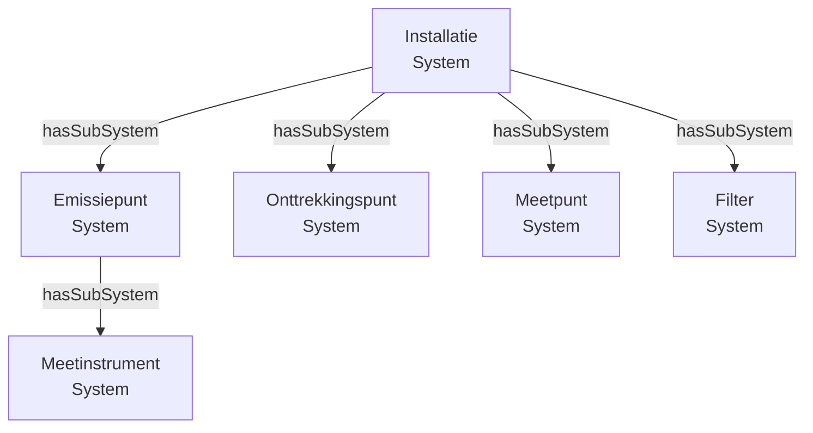
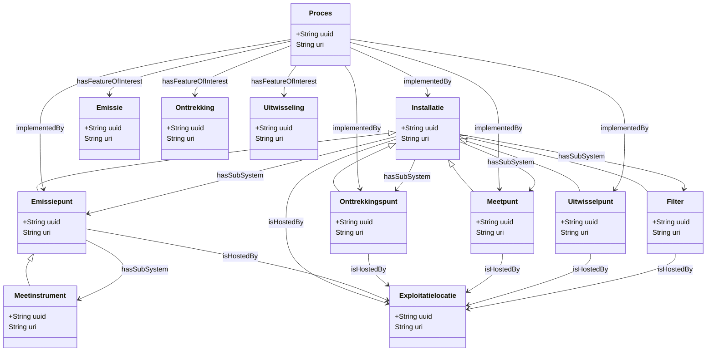

# Systemen: installaties, emissiepunten en meetpunten


Dit document beschrijft systemen — installaties, emissiepunten, onttrekkingspunten, meetpunten, uitwisselpunten, filters en meetinstrumenten — en hun onderlinge relaties in het RIE-IEPR-datamodel.

## 1. Systemen: een gemeenschappelijk patroon

Installaties, emissiepunten, onttrekkingspunten, meetpunten, uitwisselpunten en filters zijn allemaal **systemen**. Ze delen een gemeenschappelijk basispatroon:

| Eigenschap | Type | Beschrijving |
|---|---|---|
| `rdfs:label` | string | Naam van het systeem |
| `dct:type` | skos:Concept | Type (codelijst, bijv. "schoorsteen_verticale_uitstroom") |
| `dct:issued` | date | Geldigheidsdatum |
| `dct:created` | dateTime | Aanmaakdatum |
| `adms:status` | skos:Concept | Status (in_dienst, ontmanteld) |
| `ssn:isHostedBy` | Exploitatielocatie | Locatie waar het systeem gehost wordt |
| `riepr:inGebruikVanaf` | date | Datum waarop het systeem operationeel werd |
| `ssn:hasProperty` | Systeemeigenschap | Eigenschappen van het systeem |

Alle systemen zijn subklassen van `sosa:System` en `ogc:SpatialObject`.

## 2. Installaties

Een **installatie** is een infrastructuur voor een specifieke functie. Het type wordt bepaald door de codelijst **`installatie_type`** ([beheerd in milieuinfo/codelijst-rie-iepr](https://github.com/milieuinfo/codelijst-rie-iepr/)). In het AGC Glass-voorbeeld vinden we verschillende types:

```turtle
@prefix riepr: <https://data.riepr.omgeving.vlaanderen.be/ns/riepr#> .
@prefix dct:   <http://purl.org/dc/terms/> .
@prefix adms:  <http://www.w3.org/ns/adms#> .

# Waterzuiveringsinstallatie
<https://data.mjv.omgeving.vlaanderen.be/id/installatie/019e9271-1456-7a2f-ac4e-8904bab88f37/2026-01-01/2026-01-01T10:00:00Z>
    a riepr:Installatie, sosa:System ;
    dct:isVersionOf <https://data.mjv.omgeving.vlaanderen.be/id/installatie/019e9271-1456-7a2f-ac4e-8904bab88f37> ;
    rdfs:label "waterzuiveringsinstallatie"@nl ;
    dct:type <https://data.omgeving.vlaanderen.be/id/concept/riepr/installatie-type/waterzuivering> ;
    adms:status <https://data.omgeving.vlaanderen.be/id/concept/riepr/status-type/in_dienst> ;
    dct:issued "2026-01-01"^^xsd:date ;
    riepr:inGebruikVanaf "1970-01-01"^^xsd:date .

# GPBV-installatie
<https://data.mjv.omgeving.vlaanderen.be/id/installatie/BE_VL_000000002_INSTALLATION/2026-01-01/2026-01-01T10:00:00Z>
    a riepr:Installatie, sosa:System ;
    dct:isVersionOf <https://data.mjv.omgeving.vlaanderen.be/id/installatie/BE_VL_000000002_INSTALLATION> ;
    rdfs:label "AGC Glass Mol"@nl ;
    dct:type <https://data.omgeving.vlaanderen.be/id/concept/riepr/installatie-type/gpbv-installatie> .
```

**Opmerking:** GPBV-installaties gebruiken een andere identifier (GPBV-identificator) in plaats van een UUID.

### Installatie-eigenschappen

Installaties kunnen verschillende eigenschappen hebben, zoals:

```turtle
# Verwijderingsrendement
<.../systeemeigenschap/019ecf80-eae8-730f-8fc4-c09b55661a9f>
    a riepr:Systeemeigenschap ;
    riepr:parameter "verwijderingsrendement"@nl ;
    riepr:datatype <http://www.w3.org/2001/XMLSchema#decimal> .

# Geïnstalleerd vermogen
<.../systeemeigenschap/019edc4a-1a2b-71f3-8c45-d9e8f7a6b5c4>
    a riepr:Systeemeigenschap ;
    riepr:parameter "geinstalleerd_vermogen"@nl ;
    riepr:datatype <http://www.w3.org/2001/XMLSchema#decimal> .

# Geïnstalleerde productiecapaciteit
<.../systeemeigenschap/019edc4a-1a2c-72e4-9d56-e0f9g8b7c6d5>
    a riepr:Systeemeigenschap ;
    riepr:parameter "geinstalleerde_productiecapaciteit"@nl ;
    riepr:datatype <http://www.w3.org/2001/XMLSchema#decimal> .

# Waterzuiveringstechniek
<.../systeemeigenschap/019edc4a-1a2d-73f5-ae67-f1gad9c8d7e6>
    a riepr:Systeemeigenschap ;
    riepr:parameter "waterzuiveringstechniek"@nl ;
    riepr:datatype <http://www.w3.org/2001/XMLSchema#string> .
```

## 3. Emissiepunten

Een **emissiepunt** is een punt waar stoffen de installatie verlaten. Het is een subklasse van `riepr:Emissiepunt`, `sosa:System` en `ogc:SpatialObject`. Emissiepunten zijn **disjoint** met onttrekkingspunten en meetpunten. Het type wordt bepaald door de codelijst **`emissiepunt_type`**.

### Types emissiepunten

In het AGC Glass-voorbeeld komen verschillende types voor, zoals `schoorsteen_verticale_uitstroom` en `lozingspunt`:

```turtle
# Schoorsteen (lucht)
<.../emissiepunt/019eaca0-b8c6-7096-886c-103c3e21466c/2026-01-01/2026-01-01T10:00:00Z>
    a riepr:Emissiepunt, sosa:System ;
    dct:type <https://data.omgeving.vlaanderen.be/id/concept/riepr/emissiepunt-type/schoorsteen_verticale_uitstroom> .

# Lozingspunt (water)
<.../emissiepunt/019e9271-145b-75f5-83d9-fe9b0b7e9540/2026-01-01/2026-01-01T10:00:00Z>
    a riepr:Emissiepunt, sosa:System ;
    dct:type <https://data.omgeving.vlaanderen.be/id/concept/riepr/emissiepunt-type/lozingspunt> .
```

### Emissiepunt-eigenschappen

Emissiepunten hebben specifieke eigenschappen zoals aantal punten, hoogte en equivalente diameter:

```turtle
# Aantal punten
<.../systeemeigenschap/019ecf80-eae8-7fc8-a1ea-2e029966f763>
    a riepr:Systeemeigenschap ;
    riepr:parameter "aantalpunten"@nl ;
    riepr:datatype <http://www.w3.org/2001/XMLSchema#integer> .

# Hoogte (in meter)
<.../systeemeigenschap/019ecf80-eae8-7bf2-b175-a3a609e6f04b>
    a riepr:Systeemeigenschap ;
    riepr:parameter "hoogte"@nl ;
    riepr:datatype <http://www.w3.org/2001/XMLSchema#decimal> .

# Equivalente diameter (in meter)
<.../systeemeigenschap/019ecf80-eae8-7b3b-b30d-9009ac3ad4a1>
    a riepr:Systeemeigenschap ;
    riepr:parameter "equivalente-diameter"@nl ;
    riepr:datatype <http://www.w3.org/2001/XMLSchema#decimal> .
```

## 4. Onttrekkingspunten

Een **onttrekkingspunt** is een punt waar grondstoffen gewonnen worden of bemonsterd. Het is een subklasse van `riepr:Onttrekkingspunt`, `sosa:System` en `ogc:SpatialObject`.

```turtle
@prefix riepr: <https://data.riepr.omgeving.vlaanderen.be/ns/riepr#> .

<https://data.mjv.omgeving.vlaanderen.be/id/onttrekkingspunt/019e9271-145e-7f05-8a58-f670d6672c99/2026-01-01/2026-01-01T10:00:00Z>
    a riepr:Onttrekkingspunt, sosa:System ;
    dct:isVersionOf <https://data.mjv.omgeving.vlaanderen.be/id/onttrekkingspunt/019e9271-145e-7f05-8a58-f670d6672c99> ;
    rdfs:label "1 (FL koeltoren)"@nl ;
    dct:type <https://data.omgeving.vlaanderen.be/id/concept/riepr/procedure-type/onttrekking> .
```

### Onttrekkingspunt-eigenschappen

```turtle
# Diepte van het onttrekkingspunt
<.../systeemeigenschap/019edc4a-1a35-7bn3-im4f-n9ojk7kgkf4>
    a riepr:Systeemeigenschap ;
    riepr:parameter "diepte"@nl ;
    riepr:datatype <http://www.w3.org/2001/XMLSchema#decimal> .
```

## 5. Meetpunten

Een **meetpunt** is een punt waar metingen worden uitgevoerd. Het is een subklasse van `riepr:Meetpunt`, `sosa:System` en `ogc:SpatialObject`. Meetpunten zijn **disjoint** met emissiepunten en onttrekkingspunten.

```turtle
<https://data.mjv.omgeving.vlaanderen.be/id/meetpunt/019e9271-1465-72f2-8291-c289676c3ded/2026-01-01/2026-01-01T10:00:00Z>
    a riepr:Meetpunt, sosa:System ;
    dct:isVersionOf <https://data.mjv.omgeving.vlaanderen.be/id/meetpunt/019e9271-1465-72f2-8291-c289676c3ded> ;
    rdfs:label "Meetpunt 1"@nl .
```

## 6. Filters en Meetinstrumenten

Filters en meetinstrumenten zijn ook systemen, maar worden niet visueel weergegeven als aparte structurele elementen. Ze zijn gekoppeld aan een bovenliggend systeem via `ssn:hasSubSystem`.

```turtle
# Filter als subsysteem van een installatie
<.../installatie/BE_VL_000000002_INSTALLATION/2026-01-01/2026-01-01T10:00:00Z>
    ssn:hasSubSystem <.../emissiepunt/019eaca0-c589-72bc-a42c-b7140527c79f/2026-01-01/2026-01-01T10:00:00Z> .
```

### Filter-eigenschappen

Filters hebben specifieke eigenschappen zoals watervoerende laag, diepte en lengte:

```turtle
# Watervoerende laag
<.../systeemeigenschap/019edc4a-1a36-7co4-jn5g-o0pkl8lhlg5>
    a riepr:Systeemeigenschap ;
    riepr:parameter "watervoerendeLaag"@nl ;
    riepr:datatype <http://www.w3.org/2001/XMLSchema#string> .

# Lengte
<.../systeemeigenschap/019edc4a-1a37-7dp5-k o6h-p1qmm9mimh6>
    a riepr:Systeemeigenschap ;
    riepr:parameter "lengte"@nl ;
    riepr:datatype <http://www.w3.org/2001/XMLSchema#decimal> .
```

## 7. Systeemhiërarchie via `ssn:hasSubSystem`

Systemen kunnen genest zijn — een installatie kan subsystemen bevatten (emissiepunten, onttrekkingspunten, meetpunten, filters):



```turtle
# GPBV-installatie als bovenliggend systeem
<.../installatie/BE_VL_000000002_INSTALLATION/2026-01-01/2026-01-01T10:00:00Z>
    ssn:hasSubSystem <.../emissiepunt/019eaca0-c589-72bc-a42c-b7140527c79f/2026-01-01/2026-01-01T10:00:00Z> ;
    ssn:hasSubSystem <.../onttrekkingspunt/019e9271-145e-7f05-8a58-f670d6672c99/2026-01-01/2026-01-01T10:00:00Z> ;
    ssn:hasSubSystem <.../meetpunt/019e9271-145f-75f2-8222-342e7028bb37/2026-01-01/2026-01-01T10:00:00Z> .
```

## 8. Relatie tussen processen en systemen

Processen koppelen aan systemen via `ssn:implementedBy`. Dit is een **OWL-axioma** in de ontologie:

```turtle
# Emissieproces → emissiepunt
<.../proces/019eaca0-b8c6-7240-ac66-b7831d1b3623/2026-01-01/2026-01-01T10:00:00Z>
    dct:type <https://data.omgeving.vlaanderen.be/id/concept/riepr/procedure-type/emissie> ;
    ssn:implementedBy <.../emissiepunt/019eaca0-b8c6-7096-886c-103c3e21466c/2026-01-01/2026-01-01T10:00:00Z> .

# Verwerkingsproces → installatie
<.../proces/019eaca0-b8c6-7351-bd77-c8942e32577d/2026-01-01/2026-01-01T10:00:00Z>
    dct:type <https://data.omgeving.vlaanderen.be/id/concept/riepr/procedure-type/verwerking> ;
    ssn:implementedBy <.../installatie/019e9271-1456-7a2f-ac4e-8904bab88f37/2026-01-01/2026-01-01T10:00:00Z> .

# Meetproces → meetpunt
<.../proces/019eaca0-b8c6-7462-ce88-d9a53f43688e/2026-01-01/2026-01-01T10:00:00Z>
    dct:type <https://data.omgeving.vlaanderen.be/id/concept/riepr/procedure-type/meet> ;
    ssn:implementedBy <.../meetpunt/019e9271-1465-72f2-8291-c289676c3ded/2026-01-01/2026-01-01T10:00:00Z> .
```

## 9. Systeem → Exploitatielocatie relatie

Elk systeem is rechtstreeks gekoppeld aan een exploitatielocatie via `sosa:isHostedBy`:

```turtle
<.../installatie/019e9271-1456-7a2f-ac4e-8904bab88f37/2026-01-01/2026-01-01T10:00:00Z>
    sosa:isHostedBy <.../exploitatielocatie/019e9271-1453-7810-92ea-ccac2e6932b1/2026-01-01/2026-01-01T10:00:00Z> .

<.../emissiepunt/019e9271-145b-75f5-83d9-fe9b0b7e9540/2026-01-01/2026-01-01T10:00:00Z>
    sosa:isHostedBy <.../exploitatielocatie/019e9271-1453-7810-92ea-ccac2e6932b1/2026-01-01/2026-01-01T10:00:00Z> .
```

## 10. Uitgebreide systeemrelaties

Hieronder een overzicht van alle belangrijke relaties tussen systemen en andere entiteiten:


    "Installatie" --> "Emissiepunt" : ssn:hasSubSystem
    "Installatie" --> "Onttrekkingspunt" : ssn:hasSubSystem
    "Installatie" --> "Meetpunt" : ssn:hasSubSystem
    "Installatie" --> "Filter" : ssn:hasSubSystem
    "Emissiepunt" --> "Meetinstrument" : ssn:hasSubSystem
    
    %% Exploitatie links
    "Exploitatie" -- "Proces" : ssn:implements
    "Exploitatie" -- "Exploitatielocatie" : sosa:hasPlatform
```

## Referenties

- [Basisaannames](./BASISAANNAME.md) — proces-procedure koppels, disjoint classes
- [Exploitant- en exploitatiemodel](./EXPLOITANT.md) — exploitatie → systeem relatie
- [Observaties en emissies](./OBSERVATIES.md) — metingen op meetpunten
- **Codelijsten**: De `dct:type` waarden (installatie_type, emissiepunt_type, onttrekkingspunt_type, meetpunt_type, filter_type, meetinstrument_type) verwijzen naar gecontroleerde vocabulaires uit [milieuinfo/codelijst-rie-iepr](https://github.com/milieuinfo/codelijst-rie-iepr/).
