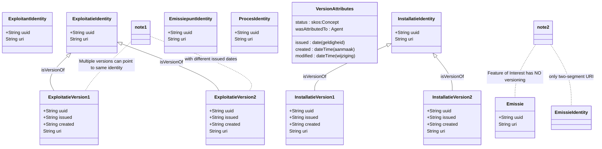

# Versiebeheer en tijdsrecht


Dit document beschrijft hoe versiebeheer en tijdsrecht werken in het RIE-IEPR-datamodel, vanuit het perspectief van Linked Open Data (LOD).

## 1. URI-structuren voor versiebeheer

Het model maakt een fundamenteel onderscheid tussen **identity URIs** (tijdsloos) en **versie URIs** (met tijd).

### Identity URI (tijdsloos)

De identity URI verwijst naar de abstracte, tijdsloze entiteit. Deze verandert nooit:

```
https://data.mjv.omgeving.vlaanderen.be/id/exploitatie/{uuid}
https://data.mjv.omgeving.vlaanderen.be/id/installatie/{uuid}
https://data.mjv.omgeving.vlaanderen.be/id/emissiepunt/{uuid}
```

### Versie URI (met tijd)

Een versie URI bevat twee tijdsegmenten: de geldigheidsdatum (`issued`) en de aanmaaktimestamp (`created`):

```
https://data.mjv.omgeving.vlaanderen.be/id/exploitatie/{uuid}/{issued}/{created}
https://data.mjv.omgeving.vlaanderen.be/id/installatie/{uuid}/{issued}/{created}
```

### Feature of Interest (geen versie)

Emissies, onttrekkingen en uitwisselingen hebben een **twee-segment URI** zonder tijd — ze zijn geen versioneerbare entiteiten:

```
https://data.mjv.omgeving.vlaanderen.be/id/emissie/{uuid}
https://data.mjv.omgeving.vlaanderen.be/id/onttrekking/{uuid}
https://data.mjv.omgeving.vlaanderen.be/id/uitwisseling/{uuid}
```

## `dct:isVersionOf` — de link tussen versie en identity

De relatie `dct:isVersionOf` koppelt een versie aan haar identity URI:

```turtle
@prefix dct: <http://purl.org/dc/terms/> .

# Versie → identity
<.../installatie/019e9271-1456-7a2f-ac4e-8904bab88f37/2026-01-01/2026-01-01T10:00:00Z>
    dct:isVersionOf <https://data.mjv.omgeving.vlaanderen.be/id/installatie/019e9271-1456-7a2f-ac4e-8904bab88f37> .

<.../installatie/019e9271-1456-7a2f-ac4e-8904bab88f37/2026-06-01/2026-06-01T10:00:00Z>
    dct:isVersionOf <https://data.mjv.omgeving.vlaanderen.be/id/installatie/019e9271-1456-7a2f-ac4e-8904bab88f37> .
```

Meerdere versies kunnen naar dezelfde identity verwijzen — ze beschrijven verschillende toestanden van hetzelfde object.

## 3. Geldigheid: `dct:issued` en `adms:status`

Elke versie heeft een geldigheidsdatum (`dct:issued`) en een status (`adms:status`):

```turtle
@prefix dct:  <http://purl.org/dc/terms/> .
@prefix adms: <http://www.w3.org/ns/adms#> .

<.../exploitatie/019e9271-1454-7b38-9eae-505cace7ca54/2026-01-01/2026-01-01T10:00:00Z>
    dct:issued "2026-01-01"^^xsd:date ;
    adms:status <https://data.omgeving.vlaanderen.be/id/concept/riepr/status-type/in_dienst> .

<.../exploitatie/019e9271-1454-7b38-9eae-505cace7ca54/2026-07-01/2026-07-01T10:00:00Z>
    dct:issued "2026-07-01"^^xsd:date ;
    adms:status <https://data.omgeving.vlaanderen.be/id/concept/riepr/status-type/in_dienst> .
```

### Beschikbare statussen

| Status | Beschrijving |
|---|---|
| `in_dienst` | De entiteit is actief en in gebruik |
| `ontmanteld` | De entiteit is buiten gebruik gesteld |

## 4. PROV-O provenance-attributen

Elke versie bevat provenance-informatie via PROV-O:

| Attribuut | Type | Beschrijving |
|---|---|---|
| `dct:created` | dateTime | Wanneer deze versie werd aangemaakt |
| `dct:modified` | dateTime | Wanneer deze versie voor het laatst werd gewijzigd |
| `prov:wasAttributedTo` | Agent | Aan wie is de data toe te schrijven (exploitant) |

```turtle
<.../installatie/019e9271-1456-7a2f-ac4e-8904bab88f37/2026-01-01/2026-01-01T10:00:00Z>
    dct:created "2026-01-01T10:00:00Z"^^xsd:dateTime ;
    dct:modified "2026-01-01T10:00:00Z"^^xsd:dateTime ;
    prov:wasAttributedTo <.../exploitant/019e9271-1452-7630-be04-59ea199007a7> .
```

## 5. Historische query's met tijdsrecht

### Huidige toestand opvragen

Om de huidige versie van een installatie te vinden, zoekt u naar de versie met de hoogste `dct:issued` die nog geldig is:

```sparql
SELECT ?versie ?label ?issued
WHERE {
  ?versie a riepr:Installatie ;
          dct:isVersionOf <https://data.mjv.omgeving.vlaanderen.be/id/installatie/019e9271-1456-7a2f-ac4e-8904bab88f37> ;
          rdfs:label ?label ;
          dct:issued ?issued .
}
ORDER BY DESC(?issued)
LIMIT 1
```

### Toestand op een historisch moment

Om de toestand van een installatie op een specifiek datum te vinden:

```sparql
SELECT ?versie ?label ?issued
WHERE {
  ?versie a riepr:Installatie ;
          dct:isVersionOf <https://data.mjv.omgeving.vlaanderen.be/id/installatie/019e9271-1456-7a2f-ac4e-8904bab88f37> ;
          rdfs:label ?label ;
          dct:issued ?issued .
  FILTER(?issued <= "2026-03-01"^^xsd:date)
}
ORDER BY DESC(?issued)
LIMIT 1
```

### Versies van een entiteit door de tijd heen

```sparql
SELECT ?versie ?label ?issued ?created ?status
WHERE {
  ?versie a riepr:Installatie ;
          dct:isVersionOf <https://data.mjv.omgeving.vlaanderen.be/id/installatie/019e9271-1456-7a2f-ac4e-8904bab88f37> ;
          rdfs:label ?label ;
          dct:issued ?issued ;
          dct:created ?created .
  OPTIONAL { ?versie adms:status ?status }
}
ORDER BY ?issued, ?created
```


## 6. Exploitatie: twee lagen in versiebeheer

De exploitatie heeft een specifiek versiebeheerpatroon met **twee lagen**:

1. **Identity laag** — de tijdsloze exploitatie (geen `issued`, geen `created`)
2. **Versie laag** — toestanden van de exploitatie (met `issued` en `created`)

```turtle
# Laag 1: identity (geen tijd)
<.../exploitatie/019e9271-1454-7b38-9eae-505cace7ca54>
    a riepr:Exploitatie .

# Laag 2: versies (met tijd)
<.../exploitatie/019e9271-1454-7b38-9eae-505cace7ca54/2026-01-01/2026-01-01T10:00:00Z>
    a riepr:Exploitatie ;
    dct:isVersionOf <.../exploitatie/019e9271-1454-7b38-9eae-505cace7ca54> .

<.../exploitatie/019e9271-1454-7b38-9eae-505cace7ca54/2026-07-01/2026-07-01T10:00:00Z>
    a riepr:Exploitatie ;
    dct:isVersionOf <.../exploitatie/019e9271-1454-7b38-9eae-505cace7ca54> .
```

## 7. Versiebeheerpatroon in diagram



## Referenties

- [Basisaannames](./BASISAANNAME.md) — URI-patronen, exploitatie twee lagen
- [Gebruiksscenario's](./GEBRUIKSSCENARIO.md) — SPARQL-query's voor versiebeheer
- [Aangifte en dossier](./AANGIFTE.md) — relatie tussen indienen en versies
