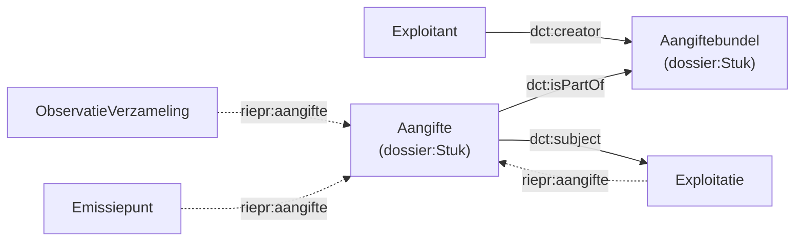

# Aangifte en dossier

!!! abstract "Beide stromen"
    Deze pagina behandelt structurele **en** operationele gegevens. Ze zijn hieronder per sectie uit elkaar gehouden en als zodanig gemarkeerd; zie [Twee stromen](./datamodel.md) voor de grens.

Een **aangifte** is een document ingediend bij de overheid. In de ontologie is het een subklasse van `dossier:Stuk` ([Dossier-model](https://data.vlaanderen.be/ns/dossier#)). Aangiften vormen de administratieve lijm van het model: entiteiten uit beide stromen (exploitaties, systemen, processen, observaties) kunnen er via `riepr:aangifte` naar verwijzen.

## 1. Aangifte

### Kenmerken

| Eigenschap | Type | Verplicht | Beschrijving |
|---|---|---|---|
| `dct:subject` | riepr:Exploitatie | Ja (exact 1) | De exploitatie waarop de aangifte betrekking heeft |
| `dct:created` | date | Ja (exact 1) | Datum van indiening |
| `dct:modified` | date | Nee | Datum van goedkeuring |
| `dct:isPartOf` | riepr:Aangiftebundel | Nee | De bundel waartoe de aangifte behoort |
| `dossier:informatieclassificatie` | concept | Nee (0..1) | Informatieclassificatie (openbaar, vertrouwelijk, …). De ontologie legt geen waardebereik vast; de URI in het voorbeeld hieronder is illustratief. |

### URI-patroon

Aangiften gebruiken een **`vlaanderenId`** (geen UUID) en worden niet geversioneerd:

```
https://data.mjv.omgeving.vlaanderen.be/id/aangifte/{vlaanderenId}
```

```turtle
@prefix dossier: <https://data.vlaanderen.be/ns/dossier#> .
@prefix dct:     <http://purl.org/dc/terms/> .
@prefix rdfs:    <http://www.w3.org/2000/01/rdf-schema#> .

<https://data.mjv.omgeving.vlaanderen.be/id/aangifte/MJV-2026-0001>
    a riepr:Aangifte, dossier:Stuk ;
    rdfs:label "Bijzondere toelating - wijziging GL012345"@nl ;
    dct:subject <https://data.mjv.omgeving.vlaanderen.be/id/exploitatie/019e9271-1454-7b38-9eae-505cace7ca54> ;
    dct:created "2025-12-01"^^xsd:date ;
    dct:modified "2026-01-15"^^xsd:date ;
    dossier:informatieclassificatie <https://data.vlaanderen.be/ns/dossier#openbaar> .
```

## 2. Aangiftebundel

Een **aangiftebundel** is een verzameling van aangiften die samen worden ingediend door een enkele exploitant. Ook de bundel is een `dossier:Stuk` en gebruikt hetzelfde URI-patroon (`aangifte/{vlaanderenId}`).

| Eigenschap | Type | Verplicht | Beschrijving |
|---|---|---|---|
| `dct:type` | concept (aangifte_type) | Ja (exact 1) | Typering van de bundel (bijv. `structuur`) |
| `dct:creator` | riepr:Exploitant | Ja (exact 1) | De exploitant die de bundel indient |
| `dct:created` | date | Ja (exact 1) | Datum van indiening |
| `dct:modified` | date | Nee | Datum van goedkeuring |
| `adms:status` | concept (aangifte_status) | Ja (exact 1) | Status van de bundel |

De individuele aangiften verwijzen naar hun bundel via `dct:isPartOf`:

```turtle
@prefix dct: <http://purl.org/dc/terms/> .
@prefix adms: <http://www.w3.org/ns/adms#> .

<https://data.mjv.omgeving.vlaanderen.be/id/aangifte/MJV-2026-B0007>
    a riepr:Aangiftebundel, dossier:Stuk ;
    rdfs:label "Bundel RIE-IEPR aangiften GL012345"@nl ;
    dct:type <https://data.omgeving.vlaanderen.be/id/concept/riepr/aangifte-type/structuur> ;
    dct:creator <https://data.mjv.omgeving.vlaanderen.be/id/exploitant/019e9271-1452-7630-be04-59ea199007a7> ;
    dct:created "2025-12-01"^^xsd:date ;
    adms:status <https://data.omgeving.vlaanderen.be/id/concept/riepr/aangifte-status/ingediend> .

# Een aangifte uit die bundel
<https://data.mjv.omgeving.vlaanderen.be/id/aangifte/MJV-2026-0001>
    dct:isPartOf <https://data.mjv.omgeving.vlaanderen.be/id/aangifte/MJV-2026-B0007> .
```

### Beschikbare statussen (`aangifte_status`)

| Status | Betekenis | ADMS-equivalent (`skos:seeAlso`) |
|---|---|---|
| `concept` | Nog niet ingediend (werkversie) | `adms/status/UnderDevelopment` |
| `ingediend` | Ingediend bij de overheid | `adms/status/Completed` |
| `gefaald` | De procedure is gefaald | — |
| `ingetrokken` | De aangifte is ingetrokken | `adms/status/Withdrawn` |

De statussen komen uit de codelijst [`aangifte_status`](https://github.com/milieuinfo/codelijst-rie-iepr/blob/main/src/source/aangifte_status.csv); let op dat dit een **andere** lijst is dan `status_type`, die de status van structurele entiteiten beschrijft (zie [Versiebeheer §3](./versiebeheer.md#3-geldigheid-dctissued-dctvalid-en-admsstatus)).

## 3. `riepr:aangifte`: de link van data naar aangifte

Naast `dct:isPartOf` (aangifte → bundel) bestaat de objectproperty **`riepr:aangifte`**. Ze is **optioneel** (0..1) en is het enige predicaat dat vanuit *beide* stromen naar hetzelfde administratieve document wijst. Ze staat op precies deze elf klassen:

| Structurele stroom | Operationele stroom |
|---|---|
| `riepr:Exploitatie` | `riepr:Observatie` |
| `riepr:Exploitatielocatie` | `riepr:ObservatieVerzameling` |
| `riepr:Proces` | |
| `riepr:Installatie` | |
| `riepr:Emissiepunt` | |
| `riepr:Onttrekkingspunt` | |
| `riepr:Uitwisselpunt` | |
| `riepr:Meetpunt` | |
| `riepr:Filter` | |

De gebeurtenissen zelf (`Emissie`, `Onttrekking`, `Verbruik`) dragen **geen** `riepr:aangifte`: ze zijn niet zelf aangeefbaar.

```turtle
@prefix riepr: <https://data.riepr.omgeving.vlaanderen.be/ns/riepr#> .

# De exploitatie en de meting wijzen naar dezelfde aangifte
<.../exploitatie/019e9271-1454-7b38-9eae-505cace7ca54/2026-01-01/2026-01-01T10:00:00Z>
    riepr:aangifte <https://data.mjv.omgeving.vlaanderen.be/id/aangifte/MJV-2026-0001> .

<.../observatieverzameling/019edc4a-1a30-7b33-9e4f-aabbccddeeff/2026-01-01T10:00:00Z>
    riepr:aangifte <https://data.mjv.omgeving.vlaanderen.be/id/aangifte/MJV-2026-0001> .
```

### Waarom optioneel?

Data kan bestaan zonder aangifte (bijv. in concept, of afkomstig uit een bron zonder administratieve koppeling). De property is dus geen verplichte referentie, maar een **contextlink**:

- Ze geeft aan **in de context van welke aangifte** de data is vastgelegd.
- Ze maakt het mogelijk de consequenties van een **ingetrokken** aangifte (`adms:status` = `ingetrokken`) te bepalen: alle entiteiten die via `riepr:aangifte` naar die aangifte wijzen, behoren tot de ingetrokken context, zonder de data zelf te verwijderen.

**SPARQL: alle data die behoort tot een ingetrokken aangifte:**
```sparql
PREFIX adms:  <http://www.w3.org/ns/adms#>
PREFIX dct:   <http://purl.org/dc/terms/>
PREFIX riepr: <https://data.riepr.omgeving.vlaanderen.be/ns/riepr#>

SELECT ?entiteit ?type
WHERE {
  ?aangifte adms:status <https://data.omgeving.vlaanderen.be/id/concept/riepr/aangifte-status/ingetrokken> .
  ?entiteit a ?type ;
            riepr:aangifte ?aangifte .
}
```

## 4. Diagram



## Referenties

- [End-to-end voorbeeld](./endtoend.md) — de aangifte als lijm in de volledige keten
- [Exploitant en exploitatie](./exploitant.md) — `dct:subject` wijst naar de exploitatie
- [Observaties en emissies](./observaties.md) — observaties en verzamelingen met `riepr:aangifte`
- **Codelijsten**: `aangifte_type` en `aangifte_status` uit [milieuinfo/codelijst-rie-iepr](https://github.com/milieuinfo/codelijst-rie-iepr/)
