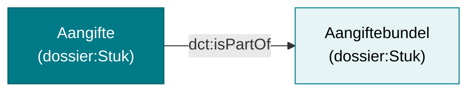

# Aangifte en dossier


Dit document beschrijft hoe aangiften en dossiers gekoppeld zijn aan de RIE-IEPR-data. Het gebruikt de **Dossier**-ontologie van Vlaanderen voor documentbeheer.

## 1. Aangifte

Een **aangifte** is een document ingediend bij de overheid. In de ontologie is het een subklasse van `dossier:Stuk`.

```turtle
@prefix dossier: <https://data.vlaanderen.be/ns/dossier#> .
@prefix dct:     <http://purl.org/dc/terms/> .

<https://data.mjv.omgeving.vlaanderen.be/id/aangifte/019edc4a-1a39-7fr7-mq8j-r3soo1okok8>
    a dossier:Stuk ;
    dct:title "RIE-IEPR aangifte 2026"@nl ;
    dct:created "2026-01-01T10:00:00Z"^^xsd:dateTime .
```

## 2. Aangiftebundel

Een **aangiftebundel** is een verzameling van aangiften. Het is eveneens een subklasse van `dossier:Stuk`.

```turtle
<https://data.mjv.omgeving.vlaanderen.be/id/aangiftebundel/019edc4a-1a3a-7gs8-nr9k-s4tpp2plpl9>
    a dossier:Stuk ;
    dct:title "Bundel RIE-IEPR aangiften 2026"@nl .
```

Een aangifte kan deel uitmaken van een aangiftebundel via `dct:isPartOf`:

```turtle
@prefix dct: <http://purl.org/dc/terms/> .

<.../aangifte/019edc4a-1a39-7fr7-mq8j-r3soo1okok8>
    dct:isPartOf <.../aangiftebundel/019edc4a-1a3a-7gs8-nr9k-s4tpp2plpl9> .
```

## 3. Relaties tussen entiteiten



## 4. Integratie met data

Aangiften zijn gekoppeld aan de RIE-IEPR-data. Ze betreffen specifieke exploitaties, installaties of emissies. De koppeling gebeurt via URI-referenties naar de betreffende entiteiten in het datamodel.

## Referenties

- [Basisaannames](./basisaanname.md) PROV-O provenance patroon
- [Versiebeheer en tijdsrecht](./versiebeheer.md) relatie tussen indienen en versies
