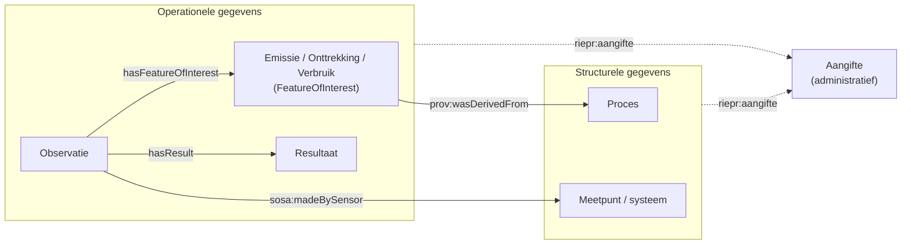

---
hide:
  - title
---

# Datamodel

Het RIE-IEPR-datamodel bestaat uit **twee stromen die apart gelezen en apart afgenomen worden**. Deze pagina beschrijft waar de grens ligt. Elke andere pagina in deze documentatie is aan één van beide stromen toegewezen en draagt bovenaan een banner die aangeeft welke.

## De twee stromen

| | **Structurele gegevens** | **Operationele gegevens** |
|---|---|---|
| Beschrijft | de organisatie en infrastructuur van de exploitatie | wat er gemeten en gerapporteerd wordt |
| Klassen | `Exploitant`, `Contactpersoon`, `Exploitatielocatie`, `Exploitatie`, `Proces`, `Procesvariabele`, `Rubriek`, `Installatie`, `Emissiepunt`, `Onttrekkingspunt`, `Uitwisselpunt`, `Meetpunt`, `Filter`, `Systeemeigenschap` | `Emissie`, `Onttrekking`, `Verbruik`, `Observatie`, `ObservatieVerzameling`, `Resultaat` |
| Versiebeheer | ja: `dct:issued` + `dct:created` in de URI, `dct:isVersionOf` naar de identity | nee: geen `issued`, geen `dct:isVersionOf` |
| Codelijsten | `installatie_type`, `emissiepunt_type`, `procedure_type`, `status_type`, `*_eigenschappen`, … | `operationeel_lucht`, `operationeel_water`, `operationeel_grondwater`, `thema_type`, … |
| Herkomst | migratie uit CBB en de VMM XML-aangiften; daarna beheerd in de applicatie | de operationele rapportageflow (jaarvracht, zelfcontrole) |
| Applicatiedocumentatie | ja — `DATASTRUCTUUR.md`, `VERSIONERING.md` | deels — `DATASTRUCTUUR.OBSERVATIES.md` (work in progress) |
| Status | vastgelegd | **analyse nog lopende** |

!!! warning "Analyse operationele gegevens nog lopende"
    Alles wat in deze documentatie onder de operationele stroom valt, kan nog wijzigen. De structurele stroom is stabiel.

## De drie predicaten die de grens oversteken

Tussen beide stromen bestaan **precies drie** relaties. Al het overige blijft binnen één stroom.

| Predicaat | Van | Naar | Cardinaliteit |
|---|---|---|---|
| `prov:wasDerivedFrom` | `Emissie`, `Onttrekking`, `Verbruik` | `Proces` | verplicht, min 1 |
| `sosa:madeBySensor` | `Observatie` | `ssn:System` (het meetpunt) | optioneel, 0..1 |
| `riepr:aangifte` | beide stromen | `Aangifte` | optioneel, 0..1 |

De omgekeerde weg — van een emissiepunt naar zijn metingen — loopt dus **niet** rechtstreeks. Een observatie wijst nooit naar een emissiepunt; ze wijst naar de *emissie*, en die is afgeleid van het emissieproces dat het emissiepunt implementeert. Zie [Observaties en emissies](./observaties.md#2-gebeurtenissen-emissie-onttrekking).

## Waar u wat vindt

### Structurele gegevens

- [Exploitant- en exploitatiemodel](./exploitant.md) — organisaties, locaties en activiteiten
- [Systemen: installaties, emissiepunten en meetpunten](./systemen.md) — systemen, subsystemen en eigenschappen
- [Versiebeheer en tijdsrecht](./versiebeheer.md) — versies, geldigheid en historische query's
- [Migratie](./migratie.md) — hoe de VMM/IMJV-gegevens naar dit model zijn omgezet

### Operationele gegevens

- [Observaties en emissies](./observaties.md) — metingen, observaties en gebeurtenissen

### Overkoepelend

- [Basisaannames](./basisaanname.md) — de modellen en aannames onder het hele datamodel
- [End-to-end voorbeeld](./endtoend.md) — de volledige keten, met beide stromen expliciet uit elkaar gehouden
- [Aangifte en dossier](./aangifte.md) — het administratieve document waaraan beide stromen kunnen hangen
