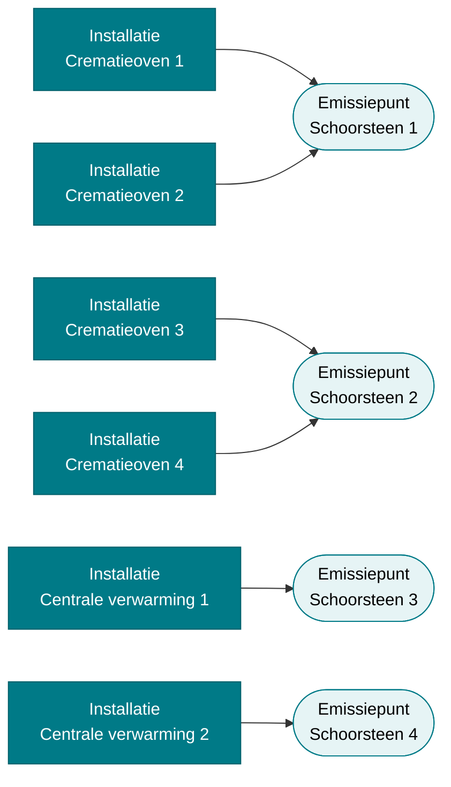
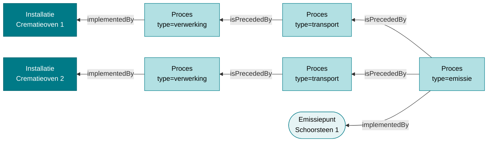

# Datavoorbeeld: Crematorium (meerdere bronnen, één emissiepunt)

!!! info "Structurele stroom"
    Deze pagina beschrijft **structurele gegevens**: installaties, emissiepunten en de processen die ze verbinden. Metingen en emissiewaarden komen hier niet aan bod — die staan in [Observaties en emissies](../observaties.md).

Het crematorium is het schoolvoorbeeld van een vraag die het datamodel vaak oproept:
**hoe geef je aan dat meerdere bronnen uitstoten via één en hetzelfde emissiepunt?**
Twee crematieovens delen één schoorsteen; er is dus geen één-op-één-relatie tussen
installatie en emissiepunt.

Het antwoord is dat de koppeling **niet rechtstreeks tussen de systemen** wordt gelegd,
maar **via de processen**: elke bron heeft een eigen verwerkingsproces en een eigen
transportproces, en die transportprocessen komen samen op **één** emissieproces dat het
gedeelde emissiepunt implementeert.

!!! note
    Dit is een **datavoorbeeld**: de data is fictief en dient uitsluitend om het datamodel te illustreren.

| | |
|---|---|
| Bron (data) | `src/main/input/activiteit/05-ai-crematorium.ttl` |
| Bron (use case) | `documentatie/applicatie/DATASTRUCTUUR.md` — *Use case 1: Crematorium* |
| Aard | handgeschreven toelichting op basis van beide bronnen |

## 1. Het scenario

Een crematorium met zes stookinstallaties en vier schoorstenen:

| Bron (installatie) | `installatie_type` | Vermogen | Emissiepunt |
|---|---|---|---|
| Crematieoven 1 | `directe_stookinstallatie` | 0,6 MW | Schoorsteen 1 |
| Crematieoven 2 | `directe_stookinstallatie` | 0,6 MW | Schoorsteen 1 |
| Crematieoven 3 | `directe_stookinstallatie` | 0,6 MW | Schoorsteen 2 |
| Crematieoven 4 | `directe_stookinstallatie` | 0,6 MW | Schoorsteen 2 |
| Centrale verwarming 1 | `stookinstallatie` | 0,085 MW | Schoorsteen 3 |
| Centrale verwarming 2 | `stookinstallatie` | 0,085 MW | Schoorsteen 4 |

Schoorstenen 1 en 2 zijn **gedeeld**; schoorstenen 3 en 4 niet. Alle vier zijn van het
type `schoorsteen_verticale_uitstroom`, 6 m hoog met een equivalente diameter van 0,35 m.



Dit is de weergave zoals de gebruiker ze in de applicatie ziet. De pijl "oven → schoorsteen"
bestaat echter **niet als één predicaat** in de data; ze is de samenvatting van een ketting
van drie processen.

## 2. De regel: één emissiepunt, één emissieproces, N transportprocessen

Drie afspraken bepalen samen hoe meerdere bronnen op één emissiepunt terechtkomen:

1. **Elke bron heeft een eigen verwerkingsproces.** Een proces met `dct:type` =
   `procedure-type/verwerking` dat de installatie implementeert (`ssn:implementedBy`).
2. **Elk emissiepunt heeft één emissieproces.** Een proces met `dct:type` =
   `procedure-type/emissie` dat het emissiepunt implementeert. Het emissiepunt wordt in de
   applicatie ook via dit proces gevisualiseerd, niet via het emissiepunt zelf. Dit is een
   afspraak uit de applicatiedocumentatie; de ontologie legt de bovengrens van één niet als
   restrictie op.
3. **Per bron-naar-emissiepunt-verbinding bestaat één transportproces.** Een proces met
   `dct:type` = `procedure-type/transport` dat de overbrenging van de stof representeert.

Twee ovens op één schoorsteen geven dus **twee** verwerkingsprocessen, **twee**
transportprocessen en **één** emissieproces. Het aantal transportprocessen dat naar een
emissieproces wijst, is het aantal bronnen dat op dat emissiepunt uitstoot.

!!! warning "`pplan:isPrecededBy` wijst tegen de stroomrichting in"
    De stof stroomt `verwerking → transport → emissie`. In RDF staat telkens de omgekeerde
    relatie: `X pplan:isPrecededBy Y` betekent *Y komt vóór X*. Zie
    [Codelijsten §Proceduretypes en transportprocessen](../codelijsten.md#proceduretypes-en-transportprocessen)
    en [Migratie §6.2](../migratie.md#62-hoe-u-pplanisprecededby-leest).

### Het patroon in één beeld

Schoorsteen 1 met haar twee ovens. De pijlen tonen de RDF-richting; de stof stroomt van
rechts naar links.



De convergentie zit volledig in de twee `pplan:isPrecededBy`-tripels op **hetzelfde**
emissieproces. Alle processen — verwerking, transport en emissie — hangen daarnaast via
`pplan:isStepOfPlan` onder het hoofdproces van de exploitatie.

## 3. De data

!!! tip "URI's in dit voorbeeld"
    Dit datavoorbeeld gebruikt sprekende namen onder
    `https://data.riepr.omgeving.vlaanderen.be/id/`, net als de andere voorbeelden in
    `src/main/input/activiteit/`. De productiedata van het MJV volgt het patroon
    `{type}/{uuid}/{issued}/{created}` met `dct:isVersionOf` naar de identity-URI; zie
    [URI-patronen](../uri-patterns.md) en [Versiebeheer](../versiebeheer.md), en §3.5 voor
    hetzelfde fragment in die vorm.

Alle fragmenten gebruiken deze prefixen:

```turtle
@prefix riepr:  <https://data.riepr.omgeving.vlaanderen.be/ns/riepr#> .
@prefix adms:   <http://www.w3.org/ns/adms#> .
@prefix dct:    <http://purl.org/dc/terms/> .
@prefix pplan:  <http://purl.org/net/p-plan#> .
@prefix qudt:   <http://qudt.org/schema/qudt/> .
@prefix rdfs:   <http://www.w3.org/2000/01/rdf-schema#> .
@prefix skos:   <http://www.w3.org/2004/02/skos/core#> .
@prefix sosa:   <http://www.w3.org/ns/sosa/> .
@prefix ssn:    <http://www.w3.org/ns/ssn/> .
@prefix unit:   <http://qudt.org/vocab/unit/> .
@prefix xsd:    <http://www.w3.org/2001/XMLSchema#> .

@prefix installatie:    <https://data.riepr.omgeving.vlaanderen.be/id/installatie/> .
@prefix emissiepunt:    <https://data.riepr.omgeving.vlaanderen.be/id/emissiepunt/> .
@prefix meetpunt:       <https://data.riepr.omgeving.vlaanderen.be/id/meetpunt/> .
@prefix onttrekkingspunt: <https://data.riepr.omgeving.vlaanderen.be/id/onttrekkingspunt/> .
@prefix filter:         <https://data.riepr.omgeving.vlaanderen.be/id/filter/> .
@prefix proces:         <https://data.riepr.omgeving.vlaanderen.be/id/proces/> .
@prefix exploitatie:    <https://data.riepr.omgeving.vlaanderen.be/id/exploitatie/> .
@prefix locatie:        <https://data.riepr.omgeving.vlaanderen.be/id/exploitatielocatie/> .
@prefix eig:            <https://data.riepr.omgeving.vlaanderen.be/id/systeemeigenschap/> .
@prefix rubriek:        <https://data.riepr.omgeving.vlaanderen.be/id/rubriek/> .
@prefix variabele:      <https://data.riepr.omgeving.vlaanderen.be/id/procesvariabele/> .

@prefix riepr-status-type:           <https://data.omgeving.vlaanderen.be/id/concept/riepr/status-type/> .
@prefix riepr-procedure-type:        <https://data.omgeving.vlaanderen.be/id/concept/riepr/procedure-type/> .
@prefix riepr-installatie-type:      <https://data.omgeving.vlaanderen.be/id/concept/riepr/installatie-type/> .
@prefix riepr-emissiepunt-type:      <https://data.omgeving.vlaanderen.be/id/concept/riepr/emissiepunt-type/> .
@prefix riepr-rubriek-type:          <https://data.omgeving.vlaanderen.be/id/concept/riepr/rubriek-type/> .
@prefix riepr-installatie-eig:       <https://data.omgeving.vlaanderen.be/id/concept/riepr/installatie-eigenschappen/> .
@prefix riepr-emissiepunt-eig:       <https://data.omgeving.vlaanderen.be/id/concept/riepr/emissiepunt-eigenschappen/> .
```

### 3.1 Exploitatie, locatie en hoofdproces

```turtle
exploitatie:crematoria-exploitatie-1
    a riepr:Exploitatie ;
    rdfs:label "Crematorium Gent"@nl ;
    adms:status riepr-status-type:in_dienst ;
    ssn:deployedOnPlatform locatie:crematoria-1 ;
    # Alle systemen hangen als deployedSystem aan de exploitatie
    ssn:deployedSystem
        installatie:crematieoven-1, installatie:crematieoven-2,
        installatie:crematieoven-3, installatie:crematieoven-4,
        installatie:centrale-verwarming-1, installatie:centrale-verwarming-2,
        emissiepunt:schoorsteen-1, emissiepunt:schoorsteen-2,
        emissiepunt:schoorsteen-3, emissiepunt:schoorsteen-4,
        meetpunt:meetpunt-schoorsteen-1, meetpunt:meetpunt-schoorsteen-2 ;
    # Precies één hoofdproces
    ssn:implements proces:crematorium-hoofdproces .

proces:crematorium-hoofdproces
    a riepr:Proces ;
    rdfs:label "Crematorium Proces"@nl ;
    dct:type riepr-procedure-type:hoofdactiviteit ;
    ssn:implementedBy exploitatie:crematoria-exploitatie-1 .
```

### 3.2 De bronnen: installaties met hun verwerkingsproces

```turtle
installatie:crematieoven-1
    a riepr:Installatie, ssn:System ;
    rdfs:label "Crematieoven 1"@nl ;
    dct:type riepr-installatie-type:directe_stookinstallatie ;
    adms:status riepr-status-type:in_dienst ;
    riepr:inGebruikVanaf "2021-08-01"^^xsd:date ;
    ssn:hasProperty eig:crematieoven-1-vermogen ;
    sosa:isHostedBy locatie:crematoria-1 .

eig:crematieoven-1-vermogen
    a riepr:Systeemeigenschap ;
    dct:type riepr-installatie-eig:geinstalleerd_vermogen ;
    rdfs:value "0.6"^^xsd:decimal ;
    qudt:hasUnit unit:MegaW .

# Het verwerkingsproces van deze bron
proces:stookproces-crematieoven-1
    a riepr:Proces ;
    rdfs:label "Stookproces Crematieoven 1"@nl ;
    dct:type riepr-procedure-type:verwerking ;
    ssn:implementedBy installatie:crematieoven-1 ;
    pplan:isStepOfPlan proces:crematorium-hoofdproces ;
    riepr:rubriek rubriek:vlarem-43-1, rubriek:vlarem-43-2 .
```

Crematieoven 2 is identiek opgebouwd, met een eigen `proces:stookproces-crematieoven-2`.

### 3.3 Het emissiepunt met zijn ene emissieproces

```turtle
emissiepunt:schoorsteen-1
    a riepr:Emissiepunt, ssn:System ;
    rdfs:label "Schoorsteen 1"@nl ;
    dct:type riepr-emissiepunt-type:schoorsteen_verticale_uitstroom ;
    adms:status riepr-status-type:in_dienst ;
    riepr:inGebruikVanaf "2002-01-01"^^xsd:date ;
    ssn:hasProperty eig:schoorsteen-1-hoogte, eig:schoorsteen-1-diameter ;
    sosa:isHostedBy locatie:crematoria-1 .

eig:schoorsteen-1-hoogte
    a riepr:Systeemeigenschap ;
    dct:type riepr-emissiepunt-eig:schouw-hoogte ;
    rdfs:value "6.0"^^xsd:decimal ;
    qudt:hasUnit unit:M .

eig:schoorsteen-1-diameter
    a riepr:Systeemeigenschap ;
    dct:type riepr-emissiepunt-eig:schouw-diameter ;
    rdfs:value "0.35"^^xsd:decimal ;
    qudt:hasUnit unit:M .

# Eén emissieproces voor dit emissiepunt — ook als er meerdere bronnen op uitkomen
proces:emissie-schoorsteen-1
    a riepr:Proces ;
    rdfs:label "Emissieproces Schoorsteen 1"@nl ;
    dct:type riepr-procedure-type:emissie ;
    ssn:implementedBy emissiepunt:schoorsteen-1 ;
    pplan:isStepOfPlan proces:crematorium-hoofdproces .
```

### 3.4 De transportprocessen: hier gebeurt de convergentie

```turtle
# Transport van oven 1 naar schoorsteen 1
proces:transport-crematieoven-1-schoorsteen-1
    a riepr:Proces ;
    rdfs:label "Transport rookgassen Crematieoven 1 → Schoorsteen 1"@nl ;
    dct:type riepr-procedure-type:transport ;
    pplan:isStepOfPlan proces:crematorium-hoofdproces ;
    pplan:isPrecededBy proces:stookproces-crematieoven-1 .

# Transport van oven 2 naar schoorsteen 1
proces:transport-crematieoven-2-schoorsteen-1
    a riepr:Proces ;
    rdfs:label "Transport rookgassen Crematieoven 2 → Schoorsteen 1"@nl ;
    dct:type riepr-procedure-type:transport ;
    pplan:isStepOfPlan proces:crematorium-hoofdproces ;
    pplan:isPrecededBy proces:stookproces-crematieoven-2 .

# Beide transporten komen samen op hetzelfde emissieproces
proces:emissie-schoorsteen-1
    pplan:isPrecededBy
        proces:transport-crematieoven-1-schoorsteen-1,
        proces:transport-crematieoven-2-schoorsteen-1 .
```

Dat laatste blok is het volledige antwoord op de vraag: **twee `pplan:isPrecededBy`-tripels
op één emissieproces**. Een derde oven op dezelfde schoorsteen voegt één transportproces en
één extra tripel toe — het emissieproces en het emissiepunt blijven ongewijzigd.

### 3.5 Dezelfde tripels in de versie-URI-vorm van de productiedata

Dit datavoorbeeld gebruikt sprekende namen. De productiedata van het MJV gebruikt
UUID-versie-URI's; hetzelfde convergentieblok ziet er daar zo uit:

```turtle
<https://data.mjv.omgeving.vlaanderen.be/id/proces/019ee1b0-3a41-7c08-9f2d-4b6d1e2a7c31/2026-01-01/2026-01-01T10:00:00Z>
    a riepr:Proces ;
    dct:isVersionOf <https://data.mjv.omgeving.vlaanderen.be/id/proces/019ee1b0-3a41-7c08-9f2d-4b6d1e2a7c31> ;
    dct:type <https://data.omgeving.vlaanderen.be/id/concept/riepr/procedure-type/emissie> ;
    ssn:implementedBy <https://data.mjv.omgeving.vlaanderen.be/id/emissiepunt/019ee1b0-3a42-7dd5-8a14-c3f0b9e45a77/2026-01-01/2026-01-01T10:00:00Z> ;
    pplan:isPrecededBy
        <https://data.mjv.omgeving.vlaanderen.be/id/proces/019ee1b0-3a43-71ba-b6c9-2e8d4f0a1b53/2026-01-01/2026-01-01T10:00:00Z> ,
        <https://data.mjv.omgeving.vlaanderen.be/id/proces/019ee1b0-3a44-7e6f-95ab-7d1c8a3e9042/2026-01-01/2026-01-01T10:00:00Z> .
```

### 3.6 Procesvariabelen: welke stof gaat er door

De stof die van bron naar emissiepunt gaat, wordt expliciet gemaakt met
`riepr:Procesvariabele`. De uitvoer van het verwerkingsproces is de invoer van het
transportproces, en die is op haar beurt de invoer van het emissieproces. Eenzelfde
variabele mag hergebruikt worden zolang het logisch om dezelfde stof gaat.

```turtle
variabele:rookgas-uitstoot
    a riepr:Procesvariabele ;
    rdfs:label "Rookgas Crematieoven 1"@nl ;
    qudt:hasUnit unit:MilliGM-PER-M3 ;
    pplan:isOutputVarOf proces:stookproces-crematieoven-1 ;
    pplan:isInputVarOf  proces:transport-crematieoven-1-schoorsteen-1 .
```

## 4. Waarom niet rechtstreeks?

Twee kortere modelleringen liggen voor de hand maar leveren problemen op.

**Eén emissieproces per bron op hetzelfde emissiepunt.** Dan zouden twee processen van het
type `emissie` hetzelfde emissiepunt implementeren. De applicatie visualiseert een
emissiepunt via zijn emissieproces, dus de schoorsteen zou dubbel verschijnen, en
operationele gegevens die aan het emissiepunt hangen zouden tweemaal geteld kunnen worden.
De afspraak is daarom: **één emissieproces per emissiepunt**, hoeveel bronnen er ook op
uitkomen.

**Een rechtstreekse relatie installatie → emissiepunt.** Die zou wel vastleggen *dat* er een
verband is, maar niet *welke stof* er stroomt, en er zou geen plaats zijn om de overbrenging
zelf te beschrijven. Het transportproces is precies het knooppunt waaraan de procesvariabelen
hangen, waardoor massabalans en herkomst traceerbaar blijven.

## 5. De structurele variant: `ssn:hasSubSystem`

Naast de proceslijn bestaat er een puur **structurele** relatie tussen systemen:
`ssn:hasSubSystem`. Ze drukt **samenstelling** uit — "dit zit in dat" — en geen stroom. In
dit datavoorbeeld hangt elk meetpunt als subsysteem onder de schoorsteen die het bemeet, en
de grondwaterfilter onder het onttrekkingspunt:

```turtle
emissiepunt:schoorsteen-1 ssn:hasSubSystem meetpunt:meetpunt-schoorsteen-1 .
emissiepunt:schoorsteen-2 ssn:hasSubSystem meetpunt:meetpunt-schoorsteen-2 .

onttrekkingspunt:grondwaterput-1 ssn:hasSubSystem filter:grondwaterfilter-1 .
```

De relatie is in de ontologie een *-op-*-relatie: een systeem mag meerdere subsystemen hebben
én zelf subsysteem zijn van meerdere systemen. Twee ovens zouden dus dezelfde schoorsteen als
subsysteem mogen aanwijzen. Dat legt echter alleen vast **dát** er een verband is, niet welke
stof er stroomt, en het vervangt de proceslijn **niet**:

| | `ssn:hasSubSystem` | Proceslijn (verwerking → transport → emissie) |
|---|---|---|
| Drukt uit | structurele samenstelling | stroom van stof van bron naar uitstootpunt |
| Cardinaliteit | *-op-* | N transportprocessen naar 1 emissieproces |
| Draagt stoffen | nee | ja, via `riepr:Procesvariabele` |
| Nodig voor de visualisatie | nee | ja |

## 6. Het spiegelbeeld: één bron, meerdere emissiepunten

Hetzelfde patroon werkt in de andere richting. Eén installatie die op twee emissiepunten
uitstoot, krijgt één verwerkingsproces en twee transportprocessen, elk naar het emissieproces
van zijn eigen emissiepunt. Die situatie komt in dit crematorium niet voor; onderstaande
tripels tonen hoe ze eruit zou zien als crematieoven 1 ook op schoorsteen 2 zou lozen:

```turtle
proces:transport-crematieoven-1-schoorsteen-1 pplan:isPrecededBy proces:stookproces-crematieoven-1 .
proces:transport-crematieoven-1-schoorsteen-2 pplan:isPrecededBy proces:stookproces-crematieoven-1 .

proces:emissie-schoorsteen-1 pplan:isPrecededBy proces:transport-crematieoven-1-schoorsteen-1 .
proces:emissie-schoorsteen-2 pplan:isPrecededBy proces:transport-crematieoven-1-schoorsteen-2 .
```

Het transportproces is dus in beide richtingen het scharnierpunt: het aantal
transportprocessen is het aantal verbindingen tussen bronnen en emissiepunten.

## 7. Gevolg voor metingen

Op schoorsteen 1 en 2 staat een meetpunt. Omdat beide schoorstenen gedeeld zijn, meet dat
meetpunt de **gecombineerde** rookgassen van twee ovens:

```turtle
meetpunt:meetpunt-schoorsteen-1
    a riepr:Meetpunt, ssn:System ;
    rdfs:label "Meetpunt Schoorsteen 1"@nl ;
    adms:status riepr-status-type:in_dienst ;
    sosa:isHostedBy locatie:crematoria-1 .

proces:meting-schoorsteen-1
    a riepr:Proces ;
    dct:type riepr-procedure-type:meting ;
    ssn:implementedBy meetpunt:meetpunt-schoorsteen-1 ;
    pplan:isStepOfPlan proces:crematorium-hoofdproces .
```

Een gemeten waarde op schoorsteen 1 kan daarom **niet** zonder bijkomende aannames over de
twee ovens verdeeld worden. De graaf maakt dat expliciet: het emissieproces van schoorsteen 1
wordt voorafgegaan door twee transportprocessen, dus de meting slaat op beide bronnen samen.

## 8. Rubrieken

De VLAREM-rubrieken hangen aan het **proces**, niet aan de installatie (`riepr:rubriek` heeft
`riepr:Proces` als domein):

| Rubriek | Omschrijving | Hangt aan |
|---|---|---|
| 43.1 | Crematoria | stookproces 1–4 |
| 43.2 | Stookinstallaties (crematieovens) | stookproces 1–4 |
| 43.3 | Stookinstallaties voor ruimteverwarming, 0,085 MW | stookproces 5–6 |

```turtle
rubriek:vlarem-43-1
    a riepr:Rubriek ;
    dct:type riepr-rubriek-type:vlarem ;
    skos:notation "43.1" ;
    skos:definition "Crematoria"@nl .
```

## 9. Opvragen welke bronnen op een emissiepunt uitkomen

```sparql
PREFIX riepr:   <https://data.riepr.omgeving.vlaanderen.be/ns/riepr#>
PREFIX dct:     <http://purl.org/dc/terms/>
PREFIX pplan:   <http://purl.org/net/p-plan#>
PREFIX rdfs:    <http://www.w3.org/2000/01/rdf-schema#>
PREFIX ssn:     <http://www.w3.org/ns/ssn/>
PREFIX riepr-procedure-type: <https://data.omgeving.vlaanderen.be/id/concept/riepr/procedure-type/>

SELECT ?emissiepunt ?emissiepuntLabel ?bron ?bronLabel
WHERE {
  # het ene emissieproces van het emissiepunt
  ?emissieproces dct:type riepr-procedure-type:emissie ;
                 ssn:implementedBy ?emissiepunt ;
                 pplan:isPrecededBy ?transport .
  # elk transportproces staat voor één bron die op dit punt uitstoot
  ?transport dct:type riepr-procedure-type:transport ;
             pplan:isPrecededBy ?verwerking .
  ?verwerking dct:type riepr-procedure-type:verwerking ;
              ssn:implementedBy ?bron .
  ?emissiepunt a riepr:Emissiepunt ; rdfs:label ?emissiepuntLabel .
  ?bron rdfs:label ?bronLabel .
}
```

Voor het crematorium levert deze query twee rijen voor schoorsteen 1, twee voor schoorsteen 2
en één voor schoorstenen 3 en 4.

## Referenties

- [Systemen §7: systeemhiërarchie via `ssn:hasSubSystem`](../systemen.md#7-systeemhierarchie-via-ssnhassubsystem) — de structurele relatie
- [Systemen §8: relatie tussen processen en systemen](../systemen.md#8-relatie-tussen-processen-en-systemen) — `ssn:implementedBy`
- [Basisaannames §1](../basisaanname.md#1-processen-als-centraal-skelet) en [§4](../basisaanname.md#4-proces-procedure-koppels-owl-axiomas) — het procesmodel en de proces-procedurekoppels
- [Codelijsten §Proceduretypes en transportprocessen](../codelijsten.md#proceduretypes-en-transportprocessen) — de stroomrichting van `pplan:isPrecededBy`
- [AGC Glass Europe (referentie)](./agc-glass.md) — het volledige referentie-datavoorbeeld
- Applicatiedocumentatie `documentatie/applicatie/DATASTRUCTUUR.md`, *Use case 1: Crematorium* — dezelfde casus vanuit het perspectief van de invoerapplicatie
