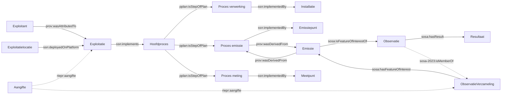

# End-to-end voorbeeld

Dit document loopt de volledige dataketen van het RIE-IEPR-model door, van de exploitant tot de gemeten waarde, en toont hoe een **aangifte** alle entiteiten aan elkaar bindt. Het voorbeeld is synthetisch (dezelfde URI-patronen en waarden als het datavoorbeeld van AGC Glass Europe in `documentatie/datamodel/datavoorbeelden/`).

Lees dit document na [Basisaannames](./basisaanname.md); het gaat ervan uit dat u de URI-patronen en het versiebeheer kent.

Het voorbeeld is opgesplitst in **structurele gegevens** en **operationele gegevens**. De structurele stroom beschrijft exploitant, locatie, exploitatie, processen en systemen. De operationele stroom beschrijft emissies/onttrekkingen, observaties en resultaten. Operationele gegevens linken altijd naar structurele gegevens.

## Het geheel



De keten in één zin: een **exploitant** voert op een **locatie** een **plan van processen** uit, waarvoor **systemen** (installaties, emissie-, meet- en onttrekkingspunten) worden ingezet; een **emissie** is de gebeurtenis die uit een emissieproces *afgeleid* is; **observaties** meten die gebeurtenis en leveren een **resultaat**; en een **aangifte** is het administratieve document waarop al die entiteiten (optioneel) wijzen.

## Structurele gegevens

### 1. Exploitant en exploitatie

De **exploitant** is de rechtsvorm (VKBO-onderneming). Hij heeft een twee-segment URI en wordt niet geversioneerd.

```turtle
<https://data.mjv.omgeving.vlaanderen.be/id/exploitant/019e9271-1452-7630-be04-59ea199007a7>
    a riepr:Exploitant ;
    rdfs:label "AGC Glass Europe NV"@nl ;
    prov:hadPrimarySource <https://data.vlaanderen.be/id/onderneming/0413638187> .
```

De **exploitatie** is de uitrol van middelen door die exploitant op een locatie. Ze is geversioneerd (drie segmenten: `uuid/issued/created`) en draagt het procesplan:

```turtle
<https://data.mjv.omgeving.vlaanderen.be/id/exploitatie/019e9271-1454-7b38-9eae-505cace7ca54/2026-01-01/2026-01-01T10:00:00Z>
    a riepr:Exploitatie ;
    dct:isVersionOf <https://data.mjv.omgeving.vlaanderen.be/id/exploitatie/019e9271-1454-7b38-9eae-505cace7ca54> ;
    rdfs:label "Bijzondere toelating GL012345"@nl ;
    dct:issued "2026-01-01"^^xsd:date ;
    dct:created "2026-01-01T10:00:00Z"^^xsd:dateTime ;
    dct:modified "2026-01-01T10:00:00Z"^^xsd:dateTime ;
    adms:status <https://data.omgeving.vlaanderen.be/id/concept/riepr/status-type/in_dienst> ;
    # De hoofdactiviteit als NACE-code (de exploitant selecteert die uit zijn VKBO-activiteiten)
    org:classification <http://data.europa.eu/ux2/nace2.1/231> ;
    prov:wasAttributedTo <https://data.mjv.omgeving.vlaanderen.be/id/exploitant/019e9271-1452-7630-be04-59ea199007a7> ;
    ssn:deployedOnPlatform <https://data.mjv.omgeving.vlaanderen.be/id/exploitatielocatie/019e9271-1453-7810-92ea-ccac2e6932b1/2026-01-01/2026-01-01T10:00:00Z> ;
    ssn:implements <https://data.mjv.omgeving.vlaanderen.be/id/proces/019e9271-1455-78f7-94b6-becb88019f89/2026-01-01/2026-01-01T10:00:00Z> .
```

Een **contactpersoon** is een `oa:Annotation` op de exploitatie (twee-segment URI, geen versiebeheer):

```turtle
<https://data.mjv.omgeving.vlaanderen.be/id/contactpersoon/019ed475-eb52-76ad-9c36-96ef45d889d0>
    a riepr:Contactpersoon ;
    oa:hasTarget <https://data.mjv.omgeving.vlaanderen.be/id/exploitatie/019e9271-1454-7b38-9eae-505cace7ca54> ;
    dct:type <https://data.riepr.omgeving.vlaanderen.be/id/concept/milieucoordinator> ;
    foaf:name "John Doe"@nl ;
    foaf:mbox <mailto:info@example.com> ;
    dct:created "2026-01-01T10:00:00Z"^^xsd:dateTime .
```

### 2. Exploitatielocatie

De locatie is een `sosa:Platform`/`ogc:Feature` en het ankerpunt voor alle systemen:

```turtle
<https://data.mjv.omgeving.vlaanderen.be/id/exploitatielocatie/019e9271-1453-7810-92ea-ccac2e6932b1/2026-01-01/2026-01-01T10:00:00Z>
    a riepr:Exploitatielocatie ;
    dct:isVersionOf <https://data.mjv.omgeving.vlaanderen.be/id/exploitatielocatie/019e9271-1453-7810-92ea-ccac2e6932b1> ;
    rdfs:label "Site Mols"@nl ;
    dct:issued "2026-01-01"^^xsd:date ;
    dct:created "2026-01-01T10:00:00Z"^^xsd:dateTime ;
    adms:status <https://data.omgeving.vlaanderen.be/id/concept/riepr/status-type/in_dienst> ;
    locn:address [ a locn:Address ;
        locn:streetAddress "Voortstraat 27" ;
        locn:postalCode "2400" ;
        locn:addressLocality "Mol"
    ] ;
    prov:hadPrimarySource <https://data.vlaanderen.be/id/vestiging/2081766488> .
```

### 3. Het procesplan (P-Plan)

Elke exploitatie implementeert precies één **hoofdproces**. Subprocessen hangen eronder via `pplan:isStepOfPlan`; de volgorde van stappen wordt aangegeven met `pplan:isPrecededBy`. Het type van elk proces komt uit de codelijst [`procedure_type`](https://github.com/milieuinfo/codelijst-rie-iepr/blob/main/src/source/procedure_type.csv) en dwingt via een OWL-axioma af welk systeem het proces moet implementeren (zie [Basisaannames](./basisaanname.md)):

```turtle
# Hoofdproces: het plan zelf, getypeerd als hoofdactiviteit.
# Het wordt geïmplementeerd door de exploitatie (OWL-axioma).
<https://data.mjv.omgeving.vlaanderen.be/id/proces/019e9271-1455-78f7-94b6-becb88019f89/2026-01-01/2026-01-01T10:00:00Z>
    a riepr:Proces ;
    dct:isVersionOf <https://data.mjv.omgeving.vlaanderen.be/id/proces/019e9271-1455-78f7-94b6-becb88019f89> ;
    rdfs:label "Productie van glas"@nl ;
    dct:type <https://data.omgeving.vlaanderen.be/id/concept/riepr/hoofdactiviteit-type> ;
    ssn:implementedBy <https://data.mjv.omgeving.vlaanderen.be/id/exploitatie/019e9271-1454-7b38-9eae-505cace7ca54/2026-01-01/2026-01-01T10:00:00Z> ;
    dct:created "2026-01-01T10:00:00Z"^^xsd:dateTime .

# Stap 1: verwerking in de installatie
<https://data.mjv.omgeving.vlaanderen.be/id/proces/019e9271-146f-7bcc-a28a-c12c48a610fc/2026-01-01/2026-01-01T10:00:00Z>
    a riepr:Proces ;
    dct:isVersionOf <https://data.mjv.omgeving.vlaanderen.be/id/proces/019e9271-146f-7bcc-a28a-c12c48a610fc> ;
    rdfs:label "Smeltoven"@nl ;
    dct:type <https://data.omgeving.vlaanderen.be/id/concept/riepr/procedure-type/verwerking> ;
    ssn:implementedBy <https://data.mjv.omgeving.vlaanderen.be/id/installatie/019e9271-1456-7a2f-ac4e-8904bab88f37/2026-01-01/2026-01-01T10:00:00Z> ;
    pplan:isStepOfPlan <https://data.mjv.omgeving.vlaanderen.be/id/proces/019e9271-1455-78f7-94b6-becb88019f89/2026-01-01/2026-01-01T10:00:00Z> ;
    dct:created "2026-01-01T10:00:00Z"^^xsd:dateTime .

# Stap 2: emissie via de schoorsteen (na de smeltoven)
<https://data.mjv.omgeving.vlaanderen.be/id/proces/019e9271-1464-7b2e-9c11-aa22bb33cc44/2026-01-01/2026-01-01T10:00:00Z>
    a riepr:Proces ;
    dct:isVersionOf <https://data.mjv.omgeving.vlaanderen.be/id/proces/019e9271-1464-7b2e-9c11-aa22bb33cc44> ;
    rdfs:label "Uitstoot schoorsteen 1"@nl ;
    dct:type <https://data.omgeving.vlaanderen.be/id/concept/riepr/procedure-type/emissie> ;
    ssn:implementedBy <https://data.mjv.omgeving.vlaanderen.be/id/emissiepunt/019e9271-145b-75f5-83d9-fe9b0b7e9540/2026-01-01/2026-01-01T10:00:00Z> ;
    pplan:isStepOfPlan <https://data.mjv.omgeving.vlaanderen.be/id/proces/019e9271-1455-78f7-94b6-becb88019f89/2026-01-01/2026-01-01T10:00:00Z> ;
    pplan:isPrecededBy <https://data.mjv.omgeving.vlaanderen.be/id/proces/019e9271-146f-7bcc-a28a-c12c48a610fc/2026-01-01/2026-01-01T10:00:00Z> ;
    dct:created "2026-01-01T10:00:00Z"^^xsd:dateTime .

# Stap 3: meting aan het meetpunt (na de smeltoven)
<https://data.mjv.omgeving.vlaanderen.be/id/proces/019e9271-1470-739e-b93b-ba3f6f75feb4/2026-01-01/2026-01-01T10:00:00Z>
    a riepr:Proces ;
    dct:isVersionOf <https://data.mjv.omgeving.vlaanderen.be/id/proces/019e9271-1470-739e-b93b-ba3f6f75feb4> ;
    rdfs:label "Luchtkwaliteitsmeting schoorsteen 1"@nl ;
    dct:type <https://data.omgeving.vlaanderen.be/id/concept/riepr/procedure-type/meet> ;
    ssn:implementedBy <https://data.mjv.omgeving.vlaanderen.be/id/meetpunt/019e9271-1465-72f2-8291-c289676c3ded/2026-01-01/2026-01-01T10:00:00Z> ;
    pplan:isStepOfPlan <https://data.mjv.omgeving.vlaanderen.be/id/proces/019e9271-1455-78f7-94b6-becb88019f89/2026-01-01/2026-01-01T10:00:00Z> ;
    pplan:isPrecededBy <https://data.mjv.omgeving.vlaanderen.be/id/proces/019e9271-146f-7bcc-a28a-c12c48a610fc/2026-01-01/2026-01-01T10:00:00Z> ;
    dct:created "2026-01-01T10:00:00Z"^^xsd:dateTime .
```

> **P-Plan** ([www.opmw.org/model/p-plan](https://www.opmw.org/model/p-plan/)) is een W3C-ontologie voor processen: een `pplan:Plan` is een geordende reeks `pplan:Step`'s. RIE-IEPR maakt er gebruik van via `pplan:isStepOfPlan` (hierarchical) en `pplan:isPrecededBy` (volgorde). Het hoofdproces is tegelijk `pplan:Plan` en `pplan:Step`; elke stap is een `pplan:Step`.

## Structurele gegevens

### 4. Systemen en hun eigenschappen

Systemen (installaties, emissie- en meetpunten) worden **gehost** op de exploitatielocatie via `sosa:isHostedBy` en kunnen **eigenschappen** hebben via `ssn:hasProperty`:

```turtle
<https://data.mjv.omgeving.vlaanderen.be/id/emissiepunt/019e9271-145b-75f5-83d9-fe9b0b7e9540/2026-01-01/2026-01-01T10:00:00Z>
    a riepr:Emissiepunt, ssn:System ;
    dct:isVersionOf <https://data.mjv.omgeving.vlaanderen.be/id/emissiepunt/019e9271-145b-75f5-83d9-fe9b0b7e9540> ;
    rdfs:label "Schoorsteen 1"@nl ;
    dct:type <https://data.omgeving.vlaanderen.be/id/concept/riepr/emissiepunt-type/schoorsteen_verticale_uitstroom> ;
    adms:status <https://data.omgeving.vlaanderen.be/id/concept/riepr/status-type/in_dienst> ;
    sosa:isHostedBy <https://data.mjv.omgeving.vlaanderen.be/id/exploitatielocatie/019e9271-1453-7810-92ea-ccac2e6932b1/2026-01-01/2026-01-01T10:00:00Z> ;
    ogc:hasGeometry [ a ogc:Point ;
        ogc:asWKT "POINT (205713.0 209689.0)"^^ogc:wktLiteral ;
        ogc:crs <http://www.opengis.net/gml/srs/epsg.xml#31370>
    ] ;
    dct:created "2026-01-01T10:00:00Z"^^xsd:dateTime .

# Een eigenschap van het emissiepunt: de hoogte
<https://data.mjv.omgeving.vlaanderen.be/id/systeemeigenschap/019ecf80-eae8-730f-8fc4-c09b55661a9f>
    a riepr:Systeemeigenschap ;
    dct:type <https://data.omgeving.vlaanderen.be/id/concept/riepr/emissiepunt-eigenschappen/hoogte> ;
    rdfs:value "50"^^xsd:decimal ;
    qudt:hasUnit <http://qudt.org/vocab/unit/M> ;
    riepr:parameter <https://data.omgeving.vlaanderen.be/id/concept/emissiepunt-eigenschappen/hoogte> .
```

## Operationele gegevens

### 5. De gebeurtenis: emissie

Een **emissie** is de gebeurtenis die uit het emissieproces is *afgeleid* (`prov:wasDerivedFrom`, verplicht, minstens één). De emissie zelf is tijdsloos (twee-segment URI); de tijd zit in de observaties:

```turtle
<https://data.mjv.omgeving.vlaanderen.be/id/emissie/019eaca0-b8c6-7096-886c-103c3e21466c>
    a riepr:Emissie, sosa:FeatureOfInterest, prov:Entity ;
    rdfs:label "Uitstoot schoorsteen 1 (GL012345)"@nl ;
    prov:wasDerivedFrom <https://data.mjv.omgeving.vlaanderen.be/id/proces/019e9271-1464-7b2e-9c11-aa22bb33cc44/2026-01-01/2026-01-01T10:00:00Z> .
```

Onttrekkingen werken analoog: `riepr:Onttrekking` is `prov:wasDerivedFrom` een onttrekkingsproces (`dct:type` = `procedure-type/onttrekking`, `ssn:implementedBy` een `riepr:Onttrekkingspunt`).

### 6. De meting: observatieverzameling, observatie, resultaat

Eén meting of bemonstering levert doorgaans **meerdere individuele observaties** op (bijv. één per gemeten stof). Die delen gemeenschappelijke context (zelfde emissie, meetpunt, moment). Voor die gedeelde context is er de **observatieverzameling** (`sosa-2023:ObservationCollection`):

```turtle
# De verzameling: gedeelde context van de meting
<https://data.mjv.omgeving.vlaanderen.be/id/observatieverzameling/019edc4a-1a30-7b33-9e4f-aabbccddeeff/2026-01-01T10:00:00Z>
    a riepr:ObservatieVerzameling ;
    rdfs:label "Meting schoorsteen 1, 1 januari 2026"@nl ;
    sosa:hasFeatureOfInterest <https://data.mjv.omgeving.vlaanderen.be/id/emissie/019eaca0-b8c6-7096-886c-103c3e21466c> ;
    sosa-2023:hasMember <https://data.mjv.omgeving.vlaanderen.be/id/observatie/019edc4a-1a35-7b33-im4f-n9ojk7kgkf4/2026-01-01T10:00:00Z> ,
                       <https://data.mjv.omgeving.vlaanderen.be/id/observatie/019edc4a-1a36-7b33-im4f-n9ojk7kgkf5/2026-01-01T10:00:00Z> ;
    riepr:aangifte <https://data.mjv.omgeving.vlaanderen.be/id/aangifte/019edc4a-1a39-7fr7-mq8j-r3soo1okok8> ;
    dct:created "2026-01-01T10:00:00Z"^^xsd:dateTime .

# Individuele observatie 1: NOx
<https://data.mjv.omgeving.vlaanderen.be/id/observatie/019edc4a-1a35-7b33-im4f-n9ojk7kgkf4/2026-01-01T10:00:00Z>
    a sosa:Observation ;
    sosa:hasFeatureOfInterest <https://data.mjv.omgeving.vlaanderen.be/id/emissie/019eaca0-b8c6-7096-886c-103c3e21466c> ;
    sosa:observedProperty <https://data.omgeving.vlaanderen.be/id/concept/riepr/observed-property/NOx> ;
    sosa:madeBySensor <https://data.mjv.omgeving.vlaanderen.be/id/meetpunt/019e9271-1465-72f2-8291-c289676c3ded/2026-01-01/2026-01-01T10:00:00Z> ;
    sosa:usedProcedure <https://data.omgeving.vlaanderen.be/id/concept/riepr/bepalingsmethode/EN1948> ;
    sosa:phenomenonTime "2026-01-01T08:00:00Z/2026-01-01T12:00:00Z"^^xsd:dateTimeInterval ;
    sosa:resultTime "2026-01-01T10:00:00Z"^^xsd:dateTime ;
    sosa-2023:isMemberOf <https://data.mjv.omgeving.vlaanderen.be/id/observatieverzameling/019edc4a-1a30-7b33-9e4f-aabbccddeeff/2026-01-01T10:00:00Z> ;
    sosa:hasResult <https://data.mjv.omgeving.vlaanderen.be/id/resultaat/019edc4a-1a40-7b33-im4f-n9ojk7kgkf9> ;
    dct:created "2026-01-01T10:00:00Z"^^xsd:dateTime .

# Het resultaat heeft een eigen URI (twee segmenten)
<https://data.mjv.omgeving.vlaanderen.be/id/resultaat/019edc4a-1a40-7b33-im4f-n9ojk7kgkf9>
    a sosa:Result, prov:Entity ;
    qudt:numericValue "45.2"^^xsd:decimal ;
    qudt:hasUnit <http://qudt.org/vocab/unit/MG-PER-M3> .

# Een resultaat kan ook puur tekstueel zijn (vrije waarde)
<https://data.mjv.omgeving.vlaanderen.be/id/resultaat/019edc4a-1a41-7b33-im4f-n9ojk7kgkfa>
    a sosa:Result, prov:Entity ;
    rdfs:comment "Kleurafwijking geconstateerd, hermeting ingepland"@nl .
```

Let op: de observatie wijst via `sosa:hasFeatureOfInterest` rechtstreeks naar de **emissie** (de gebeurtenis), niet naar het emissiepunt of het meetpunt. Het meetpunt verschijnt via `sosa:madeBySensor`.

### 7. De aangifte als lijm

Een **aangifte** (`dossier:Stuk`) is het administratieve document. Via de objectproperty `riepr:aangifte` kunnen de operationele entiteiten (exploitatie, exploitatielocatie, systemen, processen, emissies, observatieverzamelingen, …) naar de aangifte verwijzen waaraan ze gerelateerd zijn. De koppeling is **optioneel**: data kan ook zonder aangifte bestaan (bijv. in concept).

```turtle
<https://data.mjv.omgeving.vlaanderen.be/id/aangifte/019edc4a-1a39-7fr7-mq8j-r3soo1okok8>
    a riepr:Aangifte, dossier:Stuk ;
    rdfs:label "Bijzondere toelating - wijziging GL012345"@nl ;
    dct:subject <https://data.mjv.omgeving.vlaanderen.be/id/exploitatie/019e9271-1454-7b38-9eae-505cace7ca54> ;
    dct:created "2025-12-01"^^xsd:date ;
    dct:modified "2026-01-15"^^xsd:date ;
    dossier:informatieclassificatie <https://data.vlaanderen.be/ns/dossier#openbaar> .
```

Zie [Aangifte en dossier](./aangifte.md) voor het volledige model, en [Versiebeheer en tijdsrecht](./versiebeheer.md) voor hoe ingediende data wordt geversioneerd.

## Samenvatting van de koppelingen

| Van | Property | Naar | Verplicht |
|---|---|---|---|
| Exploitatie | `prov:wasAttributedTo` | Exploitant | ja |
| Exploitatie | `ssn:deployedOnPlatform` | Exploitatielocatie | ja (exact 1) |
| Exploitatie | `ssn:implements` | Hoofdproces | ja (exact 1) |
| Proces (stap) | `pplan:isStepOfPlan` | Bovenliggend proces | ja (exact 1) |
| Proces | `pplan:isPrecededBy` | Voorafgaand proces | nee (0..n) |
| Proces | `ssn:implementedBy` | Systeem (type-afhankelijk) | ja (min 1) |
| Systeem | `sosa:isHostedBy` | Exploitatielocatie | ja (exact 1) |
| Systeem | `ssn:hasProperty` | Systeemeigenschap | nee (0..n) |
| Emissie/Onttrekking | `prov:wasDerivedFrom` | Proces | ja (min 1) |
| Observatie | `sosa:hasFeatureOfInterest` | Emissie/Onttrekking | ja (exact 1) |
| Observatie | `sosa:hasResult` | Resultaat | ja (exact 1) |
| Observatie | `sosa:madeBySensor` | Systeem (meetpunt) | nee (0..1) |
| Observatie | `sosa-2023:isMemberOf` | ObservatieVerzameling | nee (0..1) |
| ObservatieVerzameling | `sosa-2023:hasMember` | Observatie | ja (min 1) |
| ObservatieVerzameling | `sosa:hasFeatureOfInterest` | Emissie/Onttrekking | ja (exact 1) |
| Resultaat | `qudt:hasUnit` | QUDT-eenheid | nee (0..1) |
| Diverse entiteiten | `riepr:aangifte` | Aangifte | nee (0..1) |

## Al de keten in één query

```sparql
PREFIX sosa:    <http://www.w3.org/ns/sosa/>
PREFIX ssn:     <http://www.w3.org/ns/ssn/>
PREFIX prov:    <http://www.w3.org/ns/prov#>
PREFIX pplan:   <http://purl.org/net/p-plan#>
PREFIX qudt:    <http://qudt.org/schema/qudt/>
PREFIX dct:     <http://purl.org/dc/terms/>
PREFIX riepr:   <https://data.riepr.omgeving.vlaanderen.be/ns/riepr#>

# Voor elke exploitatie: locatie, emissies, en de gemeten NOx-waarden
SELECT ?exploitatie ?locatie ?emissie ?waarde ?eenheid WHERE {
    ?exploitatie a riepr:Exploitatie ;
        ssn:deployedOnPlatform ?locatie .
    ?emissie a riepr:Emissie ;
        prov:wasDerivedFrom ?proces .
    ?proces ssn:implementedBy ?emissiepunt ;
        pplan:isStepOfPlan+ ?hoofd .
    ?exploitatie ssn:implements ?hoofd .
    ?emissiepunt sosa:isHostedBy ?locatie .
    ?observatie sosa:hasFeatureOfInterest ?emissie ;
        sosa:hasResult ?resultaat .
    ?resultaat qudt:numericValue ?waarde ;
        qudt:hasUnit ?eenheid .
}
```

## Referenties

- [Basisaannames](./basisaanname.md) — URI-ontwerp, OWL-axioma's, P-Plan
- [Exploitant en exploitatie](./exploitant.md) — organisaties, locaties, contactpersonen
- [Systemen](./systemen.md) — installaties, emissie- en meetpunten, eigenschappen
- [Observaties en emissies](./observaties.md) — het SOSA/SSN-observatiepatroon
- [Aangifte en dossier](./aangifte.md) — administratieve koppeling
- [URI-patronen](./uri-patterns.md) — alle Hydra URI-templates
