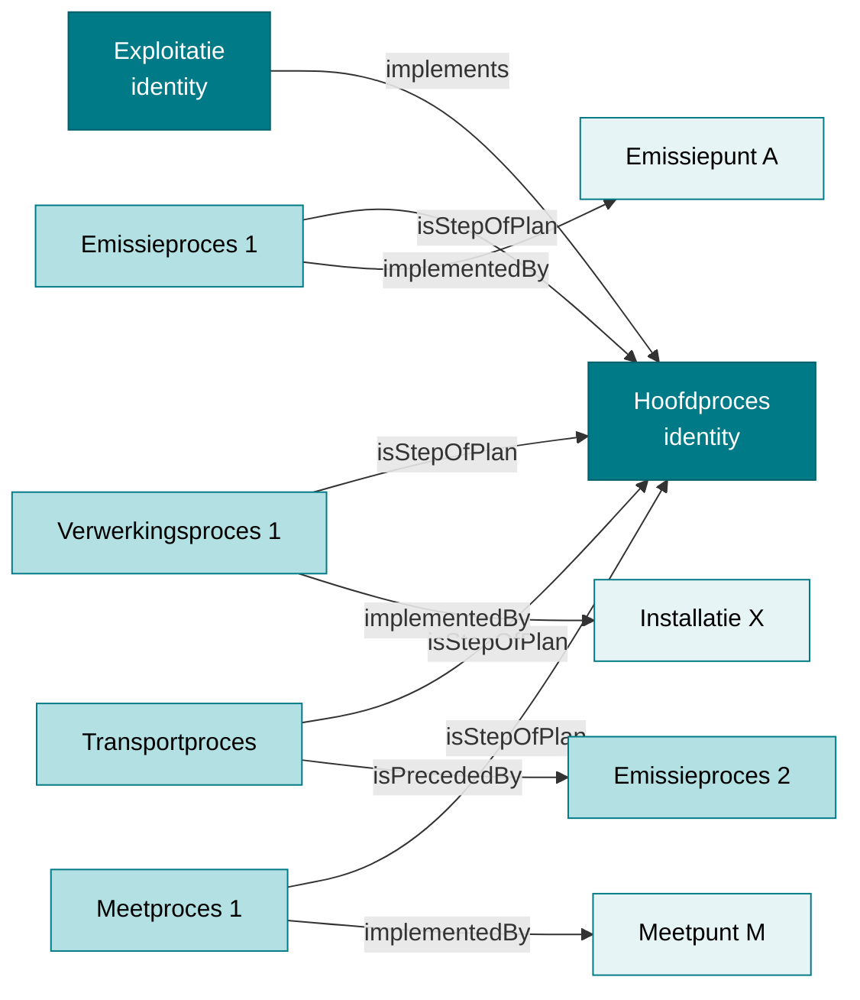

# Exploitant- en exploitatiemodel

!!! info "Structurele stroom"
    Deze pagina beschrijft **structurele gegevens**: de organisatie en infrastructuur van de exploitatie. Metingen, emissies en observaties komen hier niet aan bod — die staan in [Observaties en emissies](./observaties.md). De grens tussen beide stromen staat in [Twee stromen](./datamodel.md).

Dit document beschrijft hoe organisaties (exploitanten), hun locaties (exploitatielocaties) en activiteiten (exploitaties) worden beschreven in het RIE-IEPR-datamodel.

## 1. Exploitant

Een **exploitant** is een entiteit die een milieu-impact heeft. In de ontologie is het een subklasse van `prov:Agent`.

### Kenmerken

| Eigenschap | Type | Verplicht | Beschrijving |
|---|---|---|---|
| `rdfs:label` | string | Ja | Naam van de exploitant |
| `prov:hadPrimarySource` | org:Organization | Ja | Primaire bron (VKBO-onderneming) |
| `dct:created` | dateTime | Nee | Aanmaakdatum |
| `dct:modified` | dateTime | Nee | Laatste wijzigingsdatum |
| `locn:address` | locn:Address | Nee | Adres van de exploitant |

### URI-patroon

Exploitanten hebben een **vaste identity URI**, in het datavoorbeeld op basis van een UUID:

```turtle
@prefix riepr: <https://data.riepr.omgeving.vlaanderen.be/ns/riepr#> .
@prefix prov:  <http://www.w3.org/ns/prov#> .
@prefix org:   <http://www.w3.org/ns/org#> .

<https://data.mjv.omgeving.vlaanderen.be/id/exploitant/019e9271-1452-7630-be04-59ea199007a7>
    a riepr:Exploitant ;
    dct:created "2026-01-01T10:00:00Z"^^xsd:dateTime ;
    dct:modified "2026-01-01T10:00:00Z"^^xsd:dateTime ;
    prov:hadPrimarySource <https://data.vlaanderen.be/id/onderneming/0413638187> .
```

Er is **geen versiebeheer** voor exploitanten zelf. De URI bevat geen `issued`- of `created`-segment.

> **Let op**: het Hydra-template in de ontologie definieert de exploitant-URI als `.../id/exploitant/{ondernemingsnummer}`, terwijl het datavoorbeeld een UUID gebruikt. Zie [URI-patronen](./uri-patterns.md).

## 2. Contactpersoon

Een **contactpersoon** is een subklasse van `oa:Annotation` en beschrijft de gegevens van een persoon die optreedt als contact binnen een bepaalde functie voor een exploitant. Via `oa:hasTarget` wordt de contactpersoon gekoppeld aan **exact één** exploitatie (`minCardinality 1`, `maxCardinality 1`).

### `dct:type` bepaalt wat de contactpersoon is

`dct:type` verwijst naar een concept uit het RIE-IEPR-conceptenschema en **bepaalt wat de contactpersoon is**:

| `dct:type` | Betekenis |
|---|---|
| `<https://data.riepr.omgeving.vlaanderen.be/id/concept/milieucoordinator>` | De persoon is de **milieucoördinator** van de exploitatie |
| `<https://data.riepr.omgeving.vlaanderen.be/id/concept/contactpersoon>` | De persoon is een **contactpersoon** van de exploitatie |

`dct:type` is **verplicht** en komt **exact één keer** voor (min/max cardinaliteit 1).

### Kenmerken

| Eigenschap | Type | Verplicht | Beschrijving |
|---|---|---|---|
| `dct:type` | skos:Concept | Ja | Type contactpersoon (`:milieucoordinator` of `:contactpersoon`) |
| `foaf:name` | string | Ja | Naam van de persoon |
| `oa:hasTarget` | riepr:Exploitatie | Ja | De exploitatie waarop de contactpersoon betrekking heeft |
| `dct:created` | dateTime | Ja | Aanmaakdatum |
| `foaf:mbox` | string | Nee | E-mailadres |
| `foaf:phone` | string | Nee | Telefoonnummer |
| `dct:modified` | dateTime | Nee | Laatste wijzigingsdatum |
| `rdfs:comment` | string | Nee | Beschrijving of opmerking |

### URI-patroon: geen versiebeheer

Contactpersonen hebben **geen versiebeheer**. Er is één vaste identity-URI op basis van een UUID, zonder `issued`- of `created`-segment en zonder `dct:isVersionOf`:

```turtle
@prefix oa:   <http://www.w3.org/ns/oa#> .
@prefix dct:  <http://purl.org/dc/terms/> .
@prefix foaf: <http://xmlns.com/foaf/0.1/> .

<https://data.mjv.omgeving.vlaanderen.be/id/contactpersoon/019ed475-eb52-76ad-9c36-96ef45d889d0>
    a riepr:Contactpersoon ;
    dct:type <https://data.riepr.omgeving.vlaanderen.be/id/concept/milieucoordinator> ;
    dct:created "2026-01-01T10:00:00Z"^^xsd:dateTime ;
    oa:hasTarget <https://data.mjv.omgeving.vlaanderen.be/id/exploitatie/019e9271-1454-7b38-9eae-505cace7ca54> ;
    foaf:name "John Doe"@nl ;
    foaf:mbox <mailto:info@example.com> .
```

> **Geen versiebeheer**: in tegenstelling tot exploitatie, exploitatielocatie en systemen heeft een contactpersoon **geen versie-URI**. De URI bevat geen `issued`- of `created`-segment en er is geen `dct:isVersionOf`-relatie naar een identity-URI. Wijzigingen overschrijven de resource op dezelfde URI.

**Belangrijk:** `oa:hasTarget` verwijst naar de **exploitatie** (niet naar de exploitant zelf). Contactpersonen zijn zo contextueel gebonden aan de exploitatie waarvoor de persoon optreedt.

## 3. Exploitatielocatie

Een **exploitatielocatie** is een specifieke geografische locatie waar een exploitant processen uitvoert. Het is een subklasse van `sosa:Platform`, `prov:Entity` en `ogc:Feature`.

### Kenmerken

| Eigenschap | Type | Verplicht | Beschrijving |
|---|---|---|---|
| `rdfs:label` | string | Ja | Naam van de locatie |
| `prov:hadPrimarySource` | org:Site | Nee (0..1) | Primaire bron (VKBO-vestiging) |
| `prov:wasAttributedTo` | riepr:Exploitant | Ja (exact 1) | De exploitant aan wie de locatie is toe te schrijven |
| `dct:issued` | date | Ja | Geldigheidsdatum |
| `dct:created` | dateTime | Ja | Aanmaakdatum |
| `adms:status` | skos:Concept | Nee | Status (in_dienst, ontmanteld, ...) |
| `locn:address` | locn:Address | Nee | Adresgegevens |
| `ogc:hasGeometry` | ogc:Geometry | Nee | Geografische coördinaten (WKT) |
| `dct:valid` | date | Nee | Einde geldigheid (zie [Versiebeheer](./versiebeheer.md)) |
| `riepr:aangifte` | riepr:Aangifte (0..1) | Nee | De aangifte waaraan deze locatie gerelateerd is |
| `adms:identifier` | adms:Identifier (0..n) | Nee | Externe (DOMG/INSPIRE) identificatoren |

### URI-patroon

Exploitatielocaties zijn **versioneerbaar**:

```turtle
@prefix ogc:  <http://www.opengis.net/ont/geosparql#> .
@prefix locn: <http://www.w3.org/ns/locn#> .
@prefix adms: <http://www.w3.org/ns/adms#> .

<https://data.mjv.omgeving.vlaanderen.be/id/exploitatielocatie/019e9271-1453-7810-92ea-ccac2e6932b1/2026-01-01/2026-01-01T10:00:00Z>
    a riepr:Exploitatielocatie ;
    dct:isVersionOf <https://data.mjv.omgeving.vlaanderen.be/id/exploitatielocatie/019e9271-1453-7810-92ea-ccac2e6932b1> ;
    dct:issued "2026-01-01"^^xsd:date ;
    dct:created "2026-01-01T10:00:00Z"^^xsd:dateTime ;
    adms:status <https://data.omgeving.vlaanderen.be/id/concept/riepr/status-type/in_dienst> ;
    prov:hadPrimarySource <https://data.vlaanderen.be/id/vestiging/2081766488> ;
    prov:wasAttributedTo <https://data.mjv.omgeving.vlaanderen.be/id/exploitant/019e9271-1452-7630-be04-59ea199007a7> ;
    locn:address [
        a locn:Address ;
        locn:streetAddress "Voortstraat 27" ;
        locn:postalCode "2400" ;
        locn:addressLocality "Mol" ;
        locn:addressCountry "BE"
    ] ;
    ogc:hasGeometry [
        a ogc:Point ;
        ogc:asWKT "POINT (205700 209700)"^^ogc:wktLiteral ;
        ogc:crs <http://www.opengis.net/gml/srs/epsg.xml#31370>
    ] .
```

### Geografische data

Exploitatielocaties gebruiken **GeoSPARQL** voor geometrie. De coördinaten worden opgeslagen als WKT (Well-Known Text) met een CRS-URI:

```turtle
<.../exploitatielocatie/019e9271-1453-7810-92ea-ccac2e6932b1/2026-01-01/2026-01-01T10:00:00Z>
    ogc:hasGeometry [
        a ogc:Point ;
        ogc:asWKT "POINT (205700 209700)"^^ogc:wktLiteral ;
        ogc:crs <http://www.opengis.net/gml/srs/epsg.xml#31370>
    ] .
```

> **Let op**: `ogc:crs` is **geen** GeoSPARQL-eigenschap — de standaard kent dat predicaat niet en verwacht dat het CRS in de WKT-literal zelf staat (`<http://www.opengis.net/def/crs/EPSG/0/31370> POINT (…)`). Het datavoorbeeld gebruikt `ogc:crs` als aparte relatie; de ontologie legt hierover niets vast. Reken er dus niet op dat een standaard GeoSPARQL-implementatie deze CRS-aanduiding oppikt.

CRS EPSG:31370 komt overeen met **Belge 1972 / Belgian Lambert 72**, het klassieke Belgische landelijke coördinatenstelsel. (Het nieuwere Belgian Lambert 2008 is EPSG:3812 en wordt hier *niet* gebruikt.)

## 4. Exploitatie

Een **exploitatie** is de uitrol van middelen door een exploitant. Het is een subklasse van `ssn:Deployment`.

### Twee lagen: identity en versie

Een exploitatie bestaat uit twee niveaus:

1. **Identity-URI** — de tijdsloze abstractie van de exploitatie
2. **Versie-URI** — een specifieke toestand met geldigheid, status en inhoud

```turtle
@prefix ssn:  <http://www.w3.org/ns/ssn/> .
@prefix org:  <http://www.w3.org/ns/org#> .
@prefix prov: <http://www.w3.org/ns/prov#> .

# Laag 1: identity (tijdsloos)
<https://data.mjv.omgeving.vlaanderen.be/id/exploitatie/019e9271-1454-7b38-9eae-505cace7ca54>
    a riepr:Exploitatie ;
    prov:hadPrimarySource <https://data.vim.omgeving.vlaanderen.be/TBDTBD> .

# Laag 2: versie/toestand
<https://data.mjv.omgeving.vlaanderen.be/id/exploitatie/019e9271-1454-7b38-9eae-505cace7ca54/2026-01-01/2026-01-01T10:00:00Z>
    a riepr:Exploitatie ;
    dct:isVersionOf <https://data.mjv.omgeving.vlaanderen.be/id/exploitatie/019e9271-1454-7b38-9eae-505cace7ca54> ;
    rdfs:label "Een naam gekozen door de exploitant"@nl ;
    dct:issued "2026-01-01"^^xsd:date ;
    adms:status <https://data.omgeving.vlaanderen.be/id/concept/riepr/status-type/in_dienst> ;
    org:classification <http://data.europa.eu/ux2/nace2.1/231> ;
    ssn:implements <.../proces/019e9271-1455-78f7-94b6-becb88019f89/2026-01-01/2026-01-01T10:00:00Z> ;
    ssn:deployedOnPlatform <.../exploitatielocatie/019e9271-1453-7810-92ea-ccac2e6932b1/2026-01-01/2026-01-01T10:00:00Z> ;
    ssn:deployedSystem <.../installatie/...>, <.../emissiepunt/...>, <.../meetpunt/...> .
```

### Belangrijke relaties van een exploitatie-versie

| Relatie | Doel | Beschrijving |
|---|---|---|
| `ssn:implements` | Proces | Het hoofdproces dat de exploitatie uitvoert |
| `ssn:deployedOnPlatform` | Exploitatielocatie | De locatie waar de exploitatie plaatsvindt |
| `ssn:deployedSystem` | Systemen | Alle systemen (installaties, emissiepunten, meetpunten) die bij de exploitatie horen |
| `org:classification` | NACE-code | De hoofdactiviteit van de exploitatie (NACE-code uit de VKBO-activiteiten) |
| `dct:valid` | date | Einde geldigheid van deze versie (start is `dct:issued`) — zie [Versiebeheer](./versiebeheer.md) |
| `riepr:aangifte` | riepr:Aangifte (0..1) | De aangifte waaraan deze exploitatie gerelateerd is (optioneel; kan ook wijzen op een ingetrokken aangifte) |
| `adms:identifier` | adms:Identifier (0..n) | Externe VMM-identificatie (bijv. CBB-nummer) bij migratie — zie [Basisaannames §9](./basisaanname.md#9-externe-identificatoren-admsidentifier) |

> **Let op**: de koppeling naar de **exploitant** loopt niet via de exploitatie maar via de exploitatielocatie (`prov:wasAttributedTo`, verplicht en exact één). Dat is de enige plaats waar `prov:wasAttributedTo` in de ontologie voorkomt.

## 5. Het proces

Een **proces** is een industrieel proces met hiërarchische stappen. Het is een subklasse van `pplan:Plan`, `pplan:Step` en `sosa:Procedure`.

### Hoofdproces vs. subprocessen

```turtle
@prefix pplan: <http://purl.org/net/p-plan#> .
@prefix dct:   <http://purl.org/dc/terms/> .

# Hoofdproces (geïmplementeerd door exploitatie)
<.../proces/019e9271-1455-78f7-94b6-becb88019f89/2026-01-01/2026-01-01T10:00:00Z>
    a riepr:Proces ;
    rdfs:label "Vormen en bewerken van vlakglas"@nl ;
    dct:type <https://data.omgeving.vlaanderen.be/id/concept/riepr/procedure-type/hoofdactiviteit> .

# Subproces: emissie (koppelt aan emissiepunt)
<.../proces/019eaca0-b8c6-7240-ac66-b7831d1b3623/2026-01-01/2026-01-01T10:00:00Z>
    a riepr:Proces ;
    rdfs:label "Emissie schoorsteen 1"@nl ;
    dct:type <https://data.omgeving.vlaanderen.be/id/concept/riepr/procedure-type/emissie> ;
    pplan:isStepOfPlan <.../proces/019e9271-1455-78f7-94b6-becb88019f89/2026-01-01/2026-01-01T10:00:00Z> .

# Subproces: verwerking (koppelt aan installatie)
<.../proces/019eaca0-b8c6-7351-bd77-c8942e32577d/2026-01-01/2026-01-01T10:00:00Z>
    a riepr:Proces ;
    rdfs:label "Verwerking glas"@nl ;
    dct:type <https://data.omgeving.vlaanderen.be/id/concept/riepr/procedure-type/verwerking> ;
    pplan:isStepOfPlan <.../proces/019e9271-1455-78f7-94b6-becb88019f89/2026-01-01/2026-01-01T10:00:00Z> .
```

### Proceshiërarchie via `pplan:isStepOfPlan`

Processen kunnen genest zijn: een subproces kan zelf weer subprocessen hebben.



## Referenties

- [Basisaannames](./basisaanname.md) — URI-ontwerp, processen als skelet, OWL-axioma's
- [Systemen](./systemen.md) — systemen en subsystemen
- [Gebruiksscenario's](./gebruiksscenario.md) — concrete SPARQL-query's
- **Codelijsten**: de `dct:type`-waarden (procedure_type, installatie_type) en `org:classification` (NACE) verwijzen naar gecontroleerde vocabulaires uit [milieuinfo/codelijst-rie-iepr](https://github.com/milieuinfo/codelijst-rie-iepr/).
