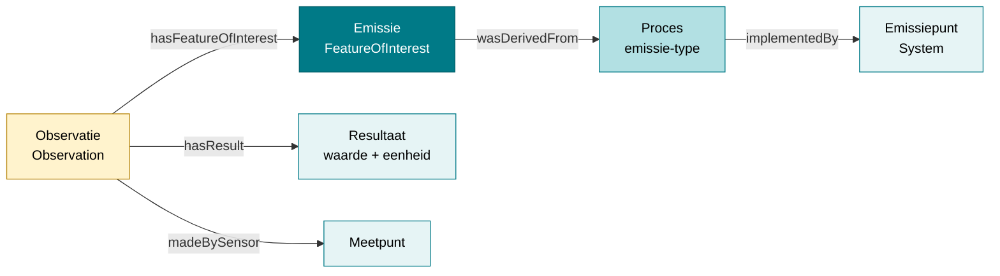

# Gebruiksscenario's

!!! abstract "Beide stromen"
    Deze pagina behandelt structurele **en** operationele gegevens. Ze zijn hieronder per sectie uit elkaar gehouden en als zodanig gemarkeerd; zie [Twee stromen](./datamodel.md) voor de grens.

Deze pagina beschrijft concrete gebruiksscenario's voor afnemers van het RIE-IEPR-datamodel via Linked Open Data (LOD). Elk scenario is gemarkeerd met de stroom waartoe het behoort (zie [Twee stromen](./datamodel.md)): scenario's 1, 2, 4, 5 en 6 zijn **structureel**, scenario's 3 en 7 **operationeel**. De structurele voorbeelden komen uit het datavoorbeeld [AGC Glass Europe](./datavoorbeelden/agc-glass.md); de operationele voorbeelden (observaties, resultaten) zijn synthetisch, omdat de operationele stroom nog niet gemigreerd is.

## Scenario 1: Een exploitant identificeren en contacteren

> **Structurele stroom.** **Doel**: alle informatie vinden over een specifieke exploitant, inclusief contactpersonen.

Elke exploitant heeft een vaste URI gebaseerd op een UUID. Contactpersonen worden geannoteerd via de `oa:Annotation`-subklasse `riepr:Contactpersoon` en verwijzen naar de exploitatie (niet direct naar de exploitant). Het `dct:type` verwijst naar het concept `:milieucoordinator` of `:contactpersoon` en bepaalt wat de persoon is. Er is **geen versiebeheer**: de URI is een vaste identity-URI op basis van een UUID.

```turtle
@prefix riepr: <https://data.riepr.omgeving.vlaanderen.be/ns/riepr#> .
@prefix prov:  <http://www.w3.org/ns/prov#> .
@prefix dct:   <http://purl.org/dc/terms/> .
@prefix foaf:  <http://xmlns.com/foaf/0.1/> .
@prefix oa:    <http://www.w3.org/ns/oa#> .

<https://data.mjv.omgeving.vlaanderen.be/id/exploitant/019e9271-1452-7630-be04-59ea199007a7>
    a riepr:Exploitant ;
    prov:hadPrimarySource <https://data.vlaanderen.be/id/onderneming/0413638187> .

<https://data.mjv.omgeving.vlaanderen.be/id/contactpersoon/019ed475-eb52-76ad-9c36-96ef45d889d0>
    a riepr:Contactpersoon ;
    dct:type <https://data.riepr.omgeving.vlaanderen.be/id/concept/milieucoordinator> ;
    oa:hasTarget <https://data.mjv.omgeving.vlaanderen.be/id/exploitatie/019e9271-1454-7b38-9eae-505cace7ca54> ;
    foaf:name "John Doe"@nl ;
    foaf:mbox <mailto:info@example.com> .
```

**SPARQL-query voorbeeld:**
```sparql
PREFIX riepr: <https://data.riepr.omgeving.vlaanderen.be/ns/riepr#>
PREFIX prov:  <http://www.w3.org/ns/prov#>
PREFIX dct:   <http://purl.org/dc/terms/>
PREFIX foaf:  <http://xmlns.com/foaf/0.1/>
PREFIX oa:    <http://www.w3.org/ns/oa#>
PREFIX ssn:   <http://www.w3.org/ns/ssn/>

SELECT ?exploitant ?contactNaam ?contactEmail ?type
WHERE {
  ?exploitant a riepr:Exploitant .
  # de band exploitatie -> exploitant loopt via de exploitatielocatie
  ?locatie prov:wasAttributedTo ?exploitant .
  ?exploitatie ssn:deployedOnPlatform ?locatie .
  ?contact a riepr:Contactpersoon ;
           dct:type ?type ;
           oa:hasTarget ?exploitatie ;
           foaf:name ?contactNaam ;
           foaf:mbox ?contactEmail .
}
```

## Scenario 2: Alle installaties van een exploitatie ophalen

> **Structurele stroom.** **Doel**: achterhalen welke installaties, emissiepunten en meetpunten bij een bepaalde exploitatie horen.

De relatie tussen een exploitatie en haar systemen wordt gelegd via `ssn:deployedSystem`. Dit omvat installaties, emissiepunten, onttrekkingspunten, meetpunten en filters.

```turtle
@prefix ssn: <http://www.w3.org/ns/ssn/> .

<https://data.mjv.omgeving.vlaanderen.be/id/exploitatie/019e9271-1454-7b38-9eae-505cace7ca54/2026-01-01/2026-01-01T10:00:00Z>
    a riepr:Exploitatie ;
    ssn:deployedSystem
        <https://data.mjv.omgeving.vlaanderen.be/id/installatie/019e9271-1456-7a2f-ac4e-8904bab88f37/2026-01-01/2026-01-01T10:00:00Z>,
        <https://data.mjv.omgeving.vlaanderen.be/id/emissiepunt/019e9271-145b-75f5-83d9-fe9b0b7e9540/2026-01-01/2026-01-01T10:00:00Z>,
        <https://data.mjv.omgeving.vlaanderen.be/id/meetpunt/019e9271-1465-72f2-8291-c289676c3ded/2026-01-01/2026-01-01T10:00:00Z> .
```

**SPARQL-query voorbeeld:**
```sparql
PREFIX riepr: <https://data.riepr.omgeving.vlaanderen.be/ns/riepr#>
PREFIX ssn:   <http://www.w3.org/ns/ssn/>
PREFIX rdfs:  <http://www.w3.org/2000/01/rdf-schema#>

SELECT ?systeem ?type ?label
WHERE {
  ?exploitatie a riepr:Exploitatie ;
               ssn:deployedSystem ?systeem .
  ?systeem a ?type ;           # riepr:Installatie, riepr:Emissiepunt, ...
           rdfs:label ?label .
}
```

## Scenario 3: Emissieobservaties opvragen voor een specifiek emissiepunt

!!! warning "Analyse nog lopende"
    De operationele stroom is nog in analyse; dit scenario kan wijzigen.

> **Operationele stroom.** **Doel**: alle metingen en observaties vinden die aan een bepaald emissiepunt gekoppeld zijn.

Let op: de `sosa:hasFeatureOfInterest` van een observatie wijst **altijd** naar een **emissie of onttrekking** (de gebeurtenis), nooit naar het emissiepunt zelf. Het emissiepunt is bereikbaar via de keten emissie → proces → emissiepunt. Elke observatie heeft een resultaat dat de gemeten waarde bevat:



```turtle
@prefix sosa: <http://www.w3.org/ns/sosa/> .
@prefix ssn:  <http://www.w3.org/ns/ssn/> .
@prefix prov: <http://www.w3.org/ns/prov#> .
@prefix qudt: <http://qudt.org/schema/qudt/> .
@prefix unit: <http://qudt.org/vocab/unit/> .

# De emissie-gebeurtenis, afgeleid van het emissieproces op emissiepunt ...7e9540
<https://data.mjv.omgeving.vlaanderen.be/id/emissie/019eaca0-b8c6-7096-886c-103c3e21466c>
    a riepr:Emissie, sosa:FeatureOfInterest, prov:Entity ;
    prov:wasDerivedFrom <.../proces/019eaca0-b8c6-7240-ac66-b7831d1b3623/2026-01-01/2026-01-01T10:00:00Z> .

<.../proces/019eaca0-b8c6-7240-ac66-b7831d1b3623/2026-01-01/2026-01-01T10:00:00Z>
    ssn:implementedBy <https://data.mjv.omgeving.vlaanderen.be/id/emissiepunt/019e9271-145b-75f5-83d9-fe9b0b7e9540/2026-01-01/2026-01-01T10:00:00Z> .

# De observatie wijst naar de emissie (niet naar het emissiepunt)
<https://data.mjv.omgeving.vlaanderen.be/id/observatie/019edc4a-1a35-7b33-9e4f-1c2d3e4f5a6b/2026-01-01T10:00:00Z>
    a sosa:Observation ;
    sosa:hasFeatureOfInterest <https://data.mjv.omgeving.vlaanderen.be/id/emissie/019eaca0-b8c6-7096-886c-103c3e21466c> ;
    sosa:observedProperty <https://data.omgeving.vlaanderen.be/id/concept/chemische_stof/MGWGWNFMUOTEHG-UHFFFAOYSA-N> ;
    sosa:resultTime "2026-01-01T10:00:00Z"^^xsd:dateTime ;
    sosa:hasResult <https://data.mjv.omgeving.vlaanderen.be/id/resultaat/019edc4a-1a40-7b33-9e4f-3e4f5a6b7c8d> ;
    dct:created "2026-01-01T10:00:00Z"^^xsd:dateTime .

<https://data.mjv.omgeving.vlaanderen.be/id/resultaat/019edc4a-1a40-7b33-9e4f-3e4f5a6b7c8d>
    a riepr:Resultaat ;
    qudt:numericValue "45.2"^^xsd:decimal ;
    qudt:hasUnit unit:MG-PER-M3 .
```

**SPARQL-query voorbeeld:**
```sparql
PREFIX sosa: <http://www.w3.org/ns/sosa/>
PREFIX ssn:  <http://www.w3.org/ns/ssn/>
PREFIX prov: <http://www.w3.org/ns/prov#>
PREFIX qudt: <http://qudt.org/schema/qudt/>

# Alle metingen bij emissiepunt ...7e9540: FOI → emissie → proces → emissiepunt
SELECT ?emissiepunt ?datum ?stof ?waarde ?eenheid
WHERE {
  ?emissie a riepr:Emissie ;
           prov:wasDerivedFrom ?proces .
  ?proces ssn:implementedBy ?emissiepunt .
  ?observatie a sosa:Observation ;
              sosa:hasFeatureOfInterest ?emissie ;
              sosa:resultTime ?datum ;
              sosa:observedProperty ?stof ;
              sosa:hasResult ?resultaat .
  ?resultaat qudt:numericValue ?waarde ;
             qudt:hasUnit ?eenheid .
  FILTER(?emissiepunt = <https://data.mjv.omgeving.vlaanderen.be/id/emissiepunt/019e9271-145b-75f5-83d9-fe9b0b7e9540/2026-01-01/2026-01-01T10:00:00Z>)
}
ORDER BY DESC(?datum)
```

## Scenario 4: Processen en hun hiërarchie doorzoeken

> **Structurele stroom.** **Doel**: de proceshiërarchie van een exploitatie doorzien — welke stappen horen bij elkaar?

Processen vormen het centrale skelet van het model. Het hoofdproces (type = hoofdactiviteit) wordt geïmplementeerd door de exploitatie. Subprocessen zijn verbonden via `pplan:isStepOfPlan`.

```turtle
@prefix pplan: <http://purl.org/net/p-plan#> .
@prefix dct:   <http://purl.org/dc/terms/> .

# Hoofdproces van de exploitatie
<.../proces/019e9271-1455-78f7-94b6-becb88019f89/2026-01-01/2026-01-01T10:00:00Z>
    a riepr:Proces ;
    rdfs:label "Vormen en bewerken van vlakglas"@nl ;
    dct:type <https://data.omgeving.vlaanderen.be/id/concept/riepr/procedure-type/hoofdactiviteit> .

# Subproces: emissie
<.../proces/019eaca0-b8c6-7240-ac66-b7831d1b3623/2026-01-01/2026-01-01T10:00:00Z>
    a riepr:Proces ;
    rdfs:label "Emissieproces schoorsteen 1"@nl ;
    dct:type <https://data.omgeving.vlaanderen.be/id/concept/riepr/procedure-type/emissie> ;
    pplan:isStepOfPlan <.../proces/019e9271-1455-78f7-94b6-becb88019f89/2026-01-01/2026-01-01T10:00:00Z> .
```

**SPARQL-query voorbeeld:**
```sparql
PREFIX ssn:   <http://www.w3.org/ns/ssn/>
PREFIX pplan: <http://purl.org/net/p-plan#>
PREFIX dct:   <http://purl.org/dc/terms/>
PREFIX rdfs:  <http://www.w3.org/2000/01/rdf-schema#>

SELECT ?hoofdProces ?subProces ?label ?type
WHERE {
  ?exploitatie ssn:implements ?hoofdProces .
  ?subProces pplan:isStepOfPlan ?hoofdProces ;
             rdfs:label ?label ;
             dct:type ?type .
}
```

## Scenario 5: Systeemeigenschappen van een installatie lezen

> **Structurele stroom.** **Doel**: de eigenschappen van een specifieke installatie opvragen.

Systeemeigenschappen worden gekoppeld via `ssn:hasProperty`. **Wat** de eigenschap is, staat in het verplichte `dct:type` (een concept uit een `*_eigenschappen`-codelijst); de waarde staat in `rdfs:value` met een `qudt:hasUnit`. `riepr:parameter` (optioneel) wijst naar het concept *waarover* de eigenschap gaat — bij een verwijderingsrendement is dat de chemische stof — en `riepr:datatype` (optioneel) naar het datatype-IRI. Beide zijn objectproperties: hun waarde is altijd een IRI.

```turtle
@prefix ssn: <http://www.w3.org/ns/ssn/> .

<.../installatie/019e9271-1456-7a2f-ac4e-8904bab88f37/2026-01-01/2026-01-01T10:00:00Z>
    ssn:hasProperty <https://data.mjv.omgeving.vlaanderen.be/id/systeemeigenschap/019ecf80-eae8-730f-8fc4-c09b55661a9f> .

<https://data.mjv.omgeving.vlaanderen.be/id/systeemeigenschap/019ecf80-eae8-730f-8fc4-c09b55661a9f>
    a riepr:Systeemeigenschap ;
    dct:type <https://data.omgeving.vlaanderen.be/id/concept/riepr/installatie-eigenschappen/verwijderingsrendement> ;
    riepr:parameter <https://data.omgeving.vlaanderen.be/id/concept/chemische_stof/VEXZGXHMUGYJMC-UHFFFAOYSA-M> ;
    rdfs:value "0"^^xsd:decimal ;
    qudt:hasUnit <http://qudt.org/vocab/unit/PERCENT> .
```

## Scenario 6: Geografische data van een exploitatielocatie opvragen

> **Structurele stroom.** **Doel**: de geografische locatie en het adres van een exploitatie vinden.

Exploitatielocaties gebruiken GeoSPARQL voor geometrie en LOCN voor adressen.

```turtle
@prefix ogc: <http://www.opengis.net/ont/geosparql#> .
@prefix locn: <http://www.w3.org/ns/locn#> .

<.../exploitatielocatie/019e9271-1453-7810-92ea-ccac2e6932b1/2026-01-01/2026-01-01T10:00:00Z>
    a riepr:Exploitatielocatie ;
    ogc:hasGeometry [
        a ogc:Point ;
        ogc:asWKT "POINT (205700 209700)"^^ogc:wktLiteral ;
        ogc:crs <http://www.opengis.net/gml/srs/epsg.xml#31370>
    ] ;
    locn:address [
        a locn:Address ;
        locn:streetAddress "Voortstraat 27" ;
        locn:postalCode "2400" ;
        locn:addressLocality "Mol" ;
        locn:addressCountry "BE"
    ] .
```

## Scenario 7: Observaties groeperen per meetpunt en tijdsperiode

!!! warning "Analyse nog lopende"
    De operationele stroom is nog in analyse; dit scenario kan wijzigen.

> **Operationele stroom.** **Doel**: alle observaties van een meetpunt binnen een bepaalde tijdspanne vinden.

Meetpunten zijn **geen** Feature of Interest (dat is de emissie of onttrekking). Een meetpunt is het **sensorapparaat** van de observatie: de `sosa:madeBySensor`-relatie koppelt observaties aan het meetpunt.

```turtle
# Observaties uitgevoerd door meetpunt 019e9271-1465-72f2-8291-c289676c3ded
<.../observatie/.../2026-01-01T10:00:00Z>
    sosa:hasFeatureOfInterest <.../emissie/...> ;
    sosa:madeBySensor <.../meetpunt/019e9271-1465-72f2-8291-c289676c3ded/2026-01-01/2026-01-01T10:00:00Z> ;
    sosa:resultTime "2026-01-01T10:00:00Z"^^xsd:dateTime .

<.../observatie/.../2026-01-02T10:00:00Z>
    sosa:hasFeatureOfInterest <.../emissie/...> ;
    sosa:madeBySensor <.../meetpunt/019e9271-1465-72f2-8291-c289676c3ded/2026-01-01/2026-01-01T10:00:00Z> ;
    sosa:resultTime "2026-01-02T10:00:00Z"^^xsd:dateTime .
```

**SPARQL-query voorbeeld:**
```sparql
PREFIX sosa: <http://www.w3.org/ns/sosa/>

SELECT ?observatie ?datum
WHERE {
  ?observatie a sosa:Observation ;
              sosa:madeBySensor <https://data.mjv.omgeving.vlaanderen.be/id/meetpunt/019e9271-1465-72f2-8291-c289676c3ded/2026-01-01/2026-01-01T10:00:00Z> ;
              sosa:resultTime ?datum .
  FILTER(?datum >= "2026-01-01T00:00:00Z"^^xsd:dateTime
      && ?datum <=  "2026-01-31T23:59:59Z"^^xsd:dateTime)
}
ORDER BY ?datum
```

## Referenties

- [Basisaannames](./basisaanname.md) — modellen en aannames achter het datamodel
- [Exploitant- en exploitatiemodel](./exploitant.md) — organisaties, locaties, activiteiten
- [Systemen](./systemen.md) — systemen en subsystemen
- [Observaties en emissies](./observaties.md) — metingen en gebeurtenissen
