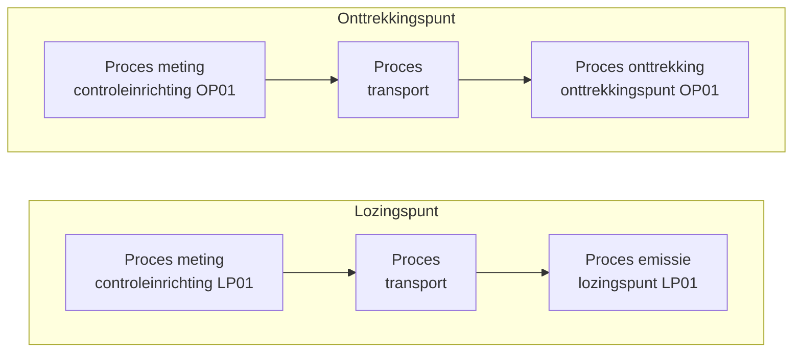

# Migratie

> **Scope**: Deze chapter beschrijft de transformatie van de VMM XML-aangiften (IMJV) naar het **MJV-datamodel** (RIE-IEPR, zie [Datamodel](./datamodel.md)) inclusief de toepassing van de [codelijsten](./codelijsten.md). Sommige migratiestappen zijn toegelicht in het datavoorbeeld AGC Glass in `documentatie/datamodel/datavoorbeelden/`.

De migratie is een eenmalige laadbewerking: uit de historische VMM-gegevens worden de structurele entiteiten van het MJV-datamodel (exploitant, exploitatie, systemen, processen) opgebouwd. De operationele stroom (observaties) wordt niet gemigreerd.

## 1. Brondata: VMM XML-aangiften

De bron zijn de **vaste gegevens** van de IMJV-aangiften in XML, gesplitst per luik. De XML-schema's (stand 9.0.54.IMJV) staan op:

| Luik | Schema |
|---|---|
| Lucht | [VasteGegevensAangifteLucht.xsd](https://www.milieuinfo.be/schemas/imjv/9.0.54.IMJV/xsd/Lucht/VasteGegevensAangifteLucht.xsd) |
| Water | [VasteGegevensAangifteWater.xsd](https://www.milieuinfo.be/schemas/imjv/9.0.54.IMJV/xsd/Water/VasteGegevensAangifteWater.xsd) |
| Grondwater | [VasteGegevensAangifteGrondwater.xsd](https://www.milieuinfo.be/schemas/imjv/9.0.54.IMJV/xsd/Grondwater/VasteGegevensAangifteGrondwater.xsd) |

Alle luiken delen `RapporteringsJaar` en `CBBExploitatieNummer` als kop. De relevante structuur per luik:

**Lucht**

| XML-element | Kenmerk |
|---|---|
| `Activiteiten/Installatie/{ProductieEenheid, EnergieActiviteit, Fakkel, OpslagEnOverslag, Waterzuivering}` | `@activiteitID` |
| `Activiteiten/Installatie/Apparaten/Apparaat/*` | `@activiteitID` |
| `EmissiePunten/Emissiepunt` | `@emissiepuntID` |
| `EmissiePunten/Emissiepunt/Zuiveringsapparaat` | `@zuiveringsapparaatID` |
| `Stoffen/Stof` | `@stofID` |
| `Milieudruk` | verbruiksgegevens, geleide en niet-geleide emissies |

**Water**

| XML-element | Kenmerk |
|---|---|
| `Activiteiten/Activiteit` (met `Watergebruik`) | `@activiteitID`, `@waterGebruikID` |
| `Lozingspunten/Lozingspunt` (meetputtype `lozend` of `Oppompend`) | `@lozingspuntID` |
| `Apparaten/Apparaat` (met `Technieken/Techniek`, `Verwijdering`) | `@apparaatID`, `@techniekID`, `@verwijderingID` |

**Grondwater**

| XML-element | Kenmerk |
|---|---|
| `Grondwaterputten/Grondwaterput` (type `GRONDWATERWINNING` of `PEIL`) | `@GrondwaterputID` |
| `Grondwaterput/Peilfilters/Peilfilter` | `@peilfilterID` |
| `Grondwaterput/Pompfilter` | `@pompfilterID` |
| `Debietmeters/Debietmeter` (gekoppeld aan pompfilter) | `@debietmeterID` |

## 2. Doel: MJV-datamodel

Elk VMM-object wordt afgebeeld op een klasse uit het RIE-IEPR-datamodel (zie [Systemen](./systemen.md), [Exploitant en exploitatie](./exploitant.md), [Basisaannames](./basisaanname.md)). Systemen zijn subklassen van `ssn:System` en worden versiebeheerd via `dct:isVersionOf` (zie [Versiebeheer](./versiebeheer.md)).

| VMM-bron | MJV-doelklasse | Toelichting |
|---|---|---|
| `CBBExploitatieNummer` + vestiging (dOMG) | `riepr:Exploitant`, `riepr:Exploitatielocatie`, `riepr:Exploitatie` | exploitatie krijgt het hoofdproces (activiteit) |
| Lucht `Installatie`/`ProductieEenheid`/... (`@activiteitID`) | `riepr:Installatie` | type `installatie_type:installatie` |
| Lucht `Zuiveringsapparaat` (`@zuiveringsapparaatID`) | `riepr:Installatie` | type `installatie_type:luchtzuivering` |
| Water `Apparaat` (`@apparaatID`) | `riepr:Installatie` | type wordt afgeleid uit de data (zie §4.2) |
| Lucht `Emissiepunt` (`@emissiepuntID`) | `riepr:Emissiepunt` | type uit codelijst `emissiepunt_type` (bv. `schoorsteen_verticale_uitstroom`) |
| Water `Lozingspunt` met meetputtype `lozend` | `riepr:Emissiepunt` | type `emissiepunt_type:lozingspunt` |
| Water `Lozingspunt` met meetputtype `Oppompend` | `riepr:Onttrekkingspunt` | type `onttrekkingspunt_type:onttrekkingspunt` |
| Grondwater `Grondwaterput` type `GRONDWATERWINNING` | `riepr:Onttrekkingspunt` | type `onttrekkingspunt_type:pompput` |
| Grondwater `Grondwaterput` type `PEIL` | `riepr:Meetpunt` | peilput |
| Grondwater `Peilfilter` | `riepr:Filter` | type `filter_type:filter` |
| Grondwater `Pompfilter` | `riepr:Filter` | type `filter_type:pomp` |
| GPBV-installatie | `riepr:Installatie` | type `installatie_type:gpbv-installatie`, identifier uit het GPBV-register (DOMG) |
| Lozingspunt → afgeleid meetpunt | `riepr:Meetpunt` | type `meetpunt_type:controleinrichting` (zie §5.2) |
| Onttrekkingspunt → afgeleid meetpunt | `riepr:Meetpunt` | type `meetpunt_type:controleinrichting`/`meetinrichting` (zie §5.3) |
| Elk systeem → afgeleid proces | `riepr:Proces` | zie §5.1 |

## 3. Algemene migratieregels

1. **Identiteiten behouden.** De VMM-identifiers worden op het gemigreerde object bewaard als `adms:Identifier` met `adms:scheme "VMM"` en een VMM-datatype (bv. `vmm:activiteitId`, `vmm:emissiepuntId`, `vmm:apparaatId`, `vmm:lozingspuntCode`, `vmm:onttrekkingspuntCode`, `vmm:filterId`, `vmm:putID`, `vmm:putKey`). Zo blijft het object traceerbaar naar de bron. GPBV- en DOMG-objecten krijgen een identifier met `adms:scheme "DOMG"`. Zie [Basisaannames: externe identificatoren](./basisaanname.md#9-externe-identificatoren-admsidentifier).

2. **URI-toewijzing.** Nieuwe systemen krijgen een UUID als lokale identifier. Uitzondering: GPBV-installaties nemen hun identificator uit het GPBV-register over (bv. `BE.VL.000000002.INSTALLATION`, plus INSPIRE-id als `^^riepr:inspireId`).

3. **Status en geldigheid.** Gemigreerde, geldige systemen krijgen `adms:status` = `status_type:in_dienst`, een `dct:issued`/`dct:created`/`dct:modified` op de migatiedatum en een versie-URI conform het [URI-patronen](./uri-patterns.md) model.

4. **Locatie.** Elk systeem (installatie, emissiepunt, onttrekkingspunt, meetpunt) wordt verbonden met de exploitatielocatie via `sosa:isHostedBy`. Dit maakt het later mogelijk een vestiging/locatie aan een andere exploitatie te link zonder het systeem te wijzigen.

5. **Ingebruiknamedatum.** `riepr:inGebruikVanaf` wordt afgeleid uit de brondata (bv. `JaarIngebruikname` per techniek in de water-XML; bij meerdere jaren het minimum). Ontbreekt een ondubbelzinnige datum, dan wordt een mockdatum gebruikt en in een commentaar aangeduid.

6. **Codelijsten.** VMM/VITO-codes uit de brondata worden afgebeeld op concepten uit de [codelijsten](./codelijsten.md) (zie §6). Technische codes verwijzen naar de VITO-codelijst (`https://vito.be/codelijst/techniek/...`), chemische stoffen naar `https://data.omgeving.vlaanderen.be/id/concept/chemische_stof/<InChIKey>`.

7. **Datakwaliteit.** Waarden worden as-is overgenomen; datakwaliteitsproblemen in de bron (bv. spaties in namen, ontbrekende waarden) worden niet "hersteld" maar zichtbaar gelaten.

## 4. Entiteiten per luik

### 4.1 Exploitant, exploitatielocatie en exploitatie

* `CBBExploitatieNummer` → `riepr:Exploitant` met `prov:hadPrimarySource` naar de onderneming (KBO) en `adms:identifier` (VMM `cbbNummer`).
* De exploitatielocatie is gebaseerd op de vestiging (dOMG): `prov:hadPrimarySource` naar de vestiging, adres- en geometriegegevens (EPSG:31370), plus de DOMG-identifiers.
* De exploitatie implementeert **het hoofdproces** (`ssn:implements`), met NACE-classificatie (`org:classification`) uit de primaire bron en `ssn:deployedSystem` naar alle systemen van de exploitatie.

### 4.2 Installaties

* **Lucht**: elke `Installatie`/activiteit (`@activiteitID`) wordt een `riepr:Installatie` met type `installatie_type:installatie`. Eigenschappen zoals geïnstalleerd vermogen en geïnstalleerde productiecapaciteit worden `riepr:Systeemeigenschap` (met QUDT-eenheid).
* **Luchtzuivering**: elk `Zuiveringsapparaat` wordt een `riepr:Installatie` met type `installatie_type:luchtzuivering`.
* **Water**: elk `Apparaat` wordt een `riepr:Installatie`. Het type wordt **op basis van de data** bepaald, bv. `XML Water + Apparaat + "Zuivering"` → `installatie_type:waterzuivering`, anders `installatie_type:installatie`.
* **Waterzuiveringstechnieken**: `Technieken/Techniek` (VITO-code + `JaarIngebruikname`) worden `riepr:Systeemeigenschap` van type `installatie-eigenschappen:waterzuiveringstechniek` met `rdfs:value` naar het VITO-codelijstconcept en `riepr:inGebruikVan`.
* **Verwijderingen**: `Verwijdering` per stof wordt `riepr:Systeemeigenschap` van type `installatie-eigenschappen:verwijderingsrendement` met `riepr:parameter` naar het chemische-stofconcept.
* **GPBV**: de GPBV-installatie wordt `riepr:Installatie` type `installatie_type:gpbv-installatie` met DOMG-identifiers en geometrie. Alle overige systemen van de exploitatie worden `ssn:hasSubSystem` van de GPBV-installatie.

### 4.3 Emissiepunten (lucht)

Elk `Emissiepunt` wordt een `riepr:Emissiepunt` met type uit `emissiepunt_type` (bv. `schoorsteen_verticale_uitstroom`) en eigenschappen `aantalpunten`, `hoogte` en `equivalente-diameter` als `riepr:Systeemeigenschap`.

### 4.4 Lozingspunten (water)

Een `Lozingspunt` uit de water-XML wordt:

* meetputtype `lozend` → `riepr:Emissiepunt` type `emissiepunt_type:lozingspunt`, met bijbehorende **controleinrichting** (zie §5.2)
* meetputtype `Oppompend` → `riepr:Onttrekkingspunt` (zie §4.5)

### 4.5 Onttrekkingspunten

* **Water**: `Lozingspunt` met meetputtype `Oppompend` → `riepr:Onttrekkingspunt` (bv. "Opgenomen oppervlaktewater").
* **Grondwater**: `Grondwaterput` type `GRONDWATERWINNING` → `riepr:Onttrekkingspunt` type `onttrekkingspunt_type:pompput`. Hierbij worden **alle** VMM-identifiers van de put bewaard: `onttrekkingspuntCode`, `exploitantID`, `watnr`, `vergunningID`, `installatieVergunningID`, `vergundeRubriekID`, `installatieID`, `iioaID`, `putID` en `putKey`.
* **Filters**: `Peilfilter` → `riepr:Filter` type `filter_type:filter`, `Pompfilter` → `riepr:Filter` type `filter_type:pomp`. Filters zijn `ssn:hasSubSystem` van het onttrekkingspunt. Filtereigenschappen (`watervoerendeLaag` (codelijstcode), `diepte`, `lengte`) zijn `riepr:Systeemeigenschap`.
* **Meetinrichting**: per onttrekkingspunt (pompput) wordt een `riepr:Meetpunt` (controleinrichting/meetinrichting) aangemaakt op basis van de putnaam (zie §5.3).

### 4.6 Meetpunten

* Een **peilput** (grondwaterput type `PEIL`) is een `riepr:Meetpunt` met diepte- en referentiepunteigenschappen.
* Per lozingspunt/onttrekkingspunt wordt een controleinrichting aangemaakt (zie §5).

### 4.7 Systeemeigenschappen

Alle numerieke eigenschappen uit de brondata (hoogte, diameter, diepte, vermogen, rendementen, ...) worden afzonderlijke `riepr:Systeemeigenschap`-objecten, verbonden via `ssn:hasProperty`. De typering (`dct:type`) komt uit de eigenschappen-codelijsten (`installatie_eigenschappen`, `emissiepunt_eigenschappen`, `onttrekkingspunt_eigenschappen`, `meetpunt_eigenschappen`, `filter_eigenschappen`) en bepaalt mee welk datatype en welke eenheid (QUDT) verwacht wordt.

## 5. Processen en verbindingen

### 5.1 Elk systeem krijgt een proces

> **Regel**: elke installatie, emissiepunt, onttrekkingspunt, meetpunt en filter krijgt een eigen `riepr:Proces` die de indienstneming van dat systeem representeert.

* Het proces heeft `ssn:implementedBy` naar het systeem (en het systeem `ssn:implements` naar het proces).
* De `dct:type` van het proces komt uit de codelijst `procedure_type` en volgt op het systeemtype:

| Systeem | `procedure_type` |
|---|---|
| installatie | `verwerking` |
| emissiepunt (incl. lozingspunt) | `emissie` |
| onttrekkingspunt | `onttrekking` |
| meetpunt | `meting` |

* Het proces is een stap in het plan van de exploitatie: `pplan:isStepOfPlan` naar het (hoofd-)proces van de GPBV-installatie of het hoofdproces van de exploitatie.
* De volgorde van processen wordt vastgelegd met `pplan:isPrecededBy` (*stap X is voorafgegaan door stap Y*).
* De scheiding tussen systeem en proces zorgt ervoor dat wijzigingen aan verbindingen (bv. een installatie die naar een andere zuiveringsinstallatie gaat) geen wijziging aan het systeem zelf vereisen.

### 5.2 Lozingspunt: controleinrichting + transportproces

> **Regel**: een lozingspunt krijgt een **controleinrichting** (een `riepr:Meetpunt` van type `meetpunt_type:controleinrichting`, genamed "Controleinrichting " + naam lozingspunt). De controleinrichting en het lozingspunt zijn onderling verbonden via een **transportproces**: de twee processen (meting en emissie) worden met een proces van type `procedure_type:transport` aan elkaar gekoppeld.

```
PROCES_CONTROLEINRICHTING  <--  PROCES_TRANSPORT  <--  PROCES_LOZINGSPUNT
        (meting)                (transport)              (emissie)
```

In Turtle (zie ook [Codelijsten: procedure types en transportprocessen](./codelijsten.md#procedure-types-en-transportprocessen)):

```turtle
@prefix dct:   <http://purl.org/dc/terms/> .
@prefix pplan: <http://www.w3.org/ns/p-plan#> .
@prefix ssn:   <http://www.w3.org/ns/ssn/> .
@prefix riepr: <https://data.riepr.omgeving.vlaanderen.be/ns/riepr#> .

<.../proces/TRANSPORT_LP01/uuid/2026-01-01/2026-01-01T10:00:00Z> a riepr:Proces ;
    dct:type <https://data.omgeving.vlaanderen.be/id/concept/riepr/procedure-type/transport> ;
    pplan:isStepOfPlan <.../proces/PARENT/uuid/2026-01-01/2026-01-01T10:00:00Z> ;
    pplan:isPrecededBy <.../proces/CONTROLEINRICHTING_LP01/uuid/2026-01-01/2026-01-01T10:00:00Z> .

<.../proces/EMISSIE_LP01/uuid/2026-01-01/2026-01-01T10:00:00Z> a riepr:Proces ;
    dct:type <https://data.omgeving.vlaanderen.be/id/concept/riepr/procedure-type/emissie> ;
    ssn:implementedBy <.../emissiepunt/LP01/uuid/2026-01-01/2026-01-01T10:00:00Z> ;
    pplan:isStepOfPlan <.../proces/PARENT/uuid/2026-01-01/2026-01-01T10:00:00Z> ;
    pplan:isPrecededBy <.../proces/TRANSPORT_LP01/uuid/2026-01-01/2026-01-01T10:00:00Z> .
```

Het transportproces maakt de keten tussen de controleinrichting en het lozingspunt expliciet en zorgt ervoor dat de overbrenging (massa) tussen de twee processen traceerbaar is.

### 5.3 Onttrekkingspunt: controleinrichting vóór het onttrekkingspunt

> **Regel**: ook een onttrekkingspunt krijgt een **controleinrichting** (een `riepr:Meetpunt`). Omgekeerd van het lozingspuntgeval wordt de controleinrichting in dit geval **vóór** geplaatst dat de stroom naar het onttrekkingspunt gaat:

```
PROCES_CONTROLEINRICHTING  <--  PROCES_TRANSPORT  <--  PROCES_ONTTREKKINGSPUNT
        (meting)                (transport)              (onttrekking)
```

Dat is: het transportproces wordt voorafgegaan door het proces van de controleinrichting, en het proces van het onttrekkingspunt wordt voorafgegaan door het transportproces.

```turtle
<.../proces/TRANSPORT_OP01/uuid/2026-01-01/2026-01-01T10:00:00Z> a riepr:Proces ;
    dct:type <https://data.omgeving.vlaanderen.be/id/concept/riepr/procedure-type/transport> ;
    pplan:isStepOfPlan <.../proces/PARENT/uuid/2026-01-01/2026-01-01T10:00:00Z> ;
    pplan:isPrecededBy <.../proces/CONTROLEINRICHTING_OP01/uuid/2026-01-01/2026-01-01T10:00:00Z> .

<.../proces/ONTTREKKING_OP01/uuid/2026-01-01/2026-01-01T10:00:00Z> a riepr:Proces ;
    dct:type <https://data.omgeving.vlaanderen.be/id/concept/riepr/procedure-type/onttrekking> ;
    ssn:implementedBy <.../onttrekkingspunt/OP01/uuid/2026-01-01/2026-01-01T10:00:00Z> ;
    pplan:isStepOfPlan <.../proces/PARENT/uuid/2026-01-01/2026-01-01T10:00:00Z> ;
    pplan:isPrecededBy <.../proces/TRANSPORT_OP01/uuid/2026-01-01/2026-01-01T10:00:00Z> .
```



> **Nota**: in het datavoorbeeld AGC Glass (stand 01/07/2026) zijn deze transportprocessen nog niet uitgewerkt (de emissie- en onttrekkingsprocessen verwijzen daar rechtstreeks naar het meetproces). De regels in deze chapter zijn bepalend voor de migratie.

### 5.4 Rubrieken op processen

Rubrieken hangen op de processen (niet op de systemen), omdat ze afhangen van de installatie *voor een bepaald doel* (activiteit): eenzelfde installatie kan onder verschillende rubrieken vallen afhankelijk van de activiteit. Een rubriek is een anoniem `riepr:Rubriek`-object met `skos:notation` (bv. `20.3.4.1°b)`), `skos:definition`, `dct:type` uit `rubriek_type` (bv. `vlarem`) en `prov:hadPrimarySource` (VITO).

## 6. Codelijsten

VMM- en VITO-codes uit de XML worden tijdens de migratie vertaald naar concepten uit de [codelijsten](./codelijsten.md) (gepubliceerd op `https://data.omgeving.vlaanderen.be/id/concept/riepr/`, beheerd in [milieuinfo/codelijst-rie-iepr](https://github.com/milieuinfo/codelijst-rie-iepr)):

| Bron (VMM/VITO) | Codelijst | Doelconcept (voorbeeld) |
|---|---|---|
| systeemtype (afgeleid) | `installatie_type` | `waterzuivering`, `luchtzuivering`, `gpbv-installatie`, `installatie` |
| emissiepunttype (afgeleid) | `emissiepunt_type` | `lozingspunt`, `schoorsteen_verticale_uitstroom`, `emissiepunt` |
| onttrekkingspunttype (afgeleid) | `onttrekkingspunt_type` | `onttrekkingspunt`, `pompput` |
| meetpunttype (afgeleid) | `meetpunt_type` | `controleinrichting`, `meetinrichting` |
| filtertype (afgeleid) | `filter_type` | `filter`, `pomp` |
| proces van systeem | `procedure_type` | `verwerking`, `emissie`, `onttrekking`, `meting`, `transport` |
| geldende status | `status_type` | `in_dienst` |
| rubriek | `rubriek_type` | `vlarem`, `egw` |
| waterzuiveringstechniek (VITO-code) | externe VITO-codelijst | `https://vito.be/codelijst/techniek/2.2.1` |
| verontreinigende stof | externe stofcodelijst | `https://data.omgeving.vlaanderen.be/id/concept/chemische_stof/<InChIKey>` |
| watervoerende laag (code) | `watervoerende_laag` | bv. `0100`, `0230` |
| NACE-activiteit | externe NACE-codelijst | `http://data.europa.eu/ux2/nace2.1/231` |

## 7. Referentievoorbeeld: AGC Glass

Het volledige referentievoorbeeld van de migratie staat in `documentatie/datamodel/datavoorbeelden/agc-glass_MJV_01-07-2026.ttl` (demonstratiedata, geen echte data). Belangrijke patronen uit dat voorbeeld:

* **Exploitatie met VMM-identificatie**: `adms:identifier` met `adms:scheme "VMM"` en `rdf:value "01787986000160"^^vmm:cbbNummer`.
* **Type-afleiding installatie**: `XML Water + Apparaat + "Zuivering"` → `installatie_type:waterzuivering`.
* **Ingebruiknamedatum**: afgeleid uit `JaarIngebruikname` per techniek (bv. minimum van 1989 en 1998 → `1989-01-01`).
* **Lozingspunten**: meetputtype `lozend` → `emissiepunt_type:lozingspunt`; controleinrichting met naam "Controleinrichting " + lozingspunt-naam, `inGebruikVanaf` gelijkgezet aan het gekoppelde lozingspunt.
* **Onttrekkingspunten**: meetputtype `Oppompend` (water) en type `GRONDWATERWINNING` (grondwater) → `riepr:Onttrekkingspunt`; meetinrichting per put op basis van de putnaam.
* **Grondwaterputten**: volledige set VMM-identifiers (onttrekkingspuntCode, putID, putKey, watnr, vergunningID, ...) bewaard; peilput (type `PEIL`) → meetpunt.
* **GPBV-installatie**: identifier uit het GPBV-register, alle systemen als `ssn:hasSubSystem`.
* **Processen**: elk systeem heeft een proces met `pplan:isStepOfPlan` (GPBV-proces of hoofdproces) en `pplan:isPrecededBy`-koppelingen; het hoofdproces draagt de rubrieken.
* **Interpretaties**: aannames die niet rechtstreeks uit de brondata volgen, zijn in het voorbeeld expliciet aangeduid met `[EIGEN INTERPRETATIE]` (bv. volgorde van installaties in de keten).
