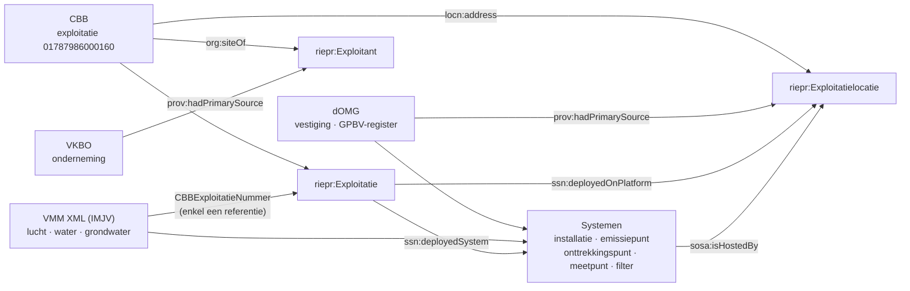
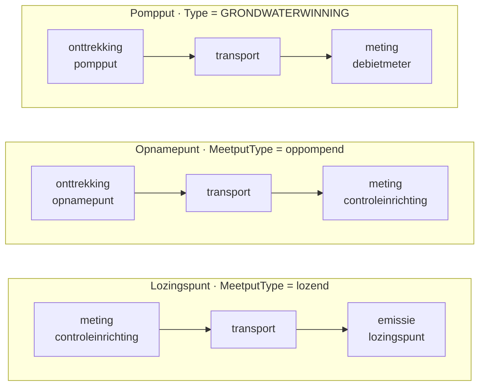

# Migratie

> **Scope**: Dit hoofdstuk beschrijft hoe de historische VMM/IMJV-gegevens worden omgezet naar het **MJV-datamodel** (RIE-IEPR, zie [Datamodel](./datamodel.md)), inclusief de toepassing van de [codelijsten](./codelijsten.md). Het referentievoorbeeld staat in `documentatie/datamodel/datavoorbeelden/agc-glass_MJV_01-07-2026.ttl`.

De migratie is een eenmalige laadbewerking: er worden **structurele** entiteiten opgebouwd (exploitant, exploitatielocatie, exploitatie, systemen, processen). De operationele stroom (observaties, emissies, onttrekkingen) wordt niet in deze stap gemigreerd — zie [Observaties en emissies](./observaties.md).

De migratie put uit **twee verschillende bronnen** die op één sleutel aan elkaar hangen:

| Bron | Levert | Rol |
|---|---|---|
| **CBB** (`data.cbb.omgeving.vlaanderen.be`) | exploitatie, exploitant, exploitatielocatie, adres | het organisatorische skelet |
| **VMM XML-aangiften** (IMJV, per luik) | installaties, emissiepunten, onttrekkingspunten, meetpunten, filters en hun eigenschappen | de infrastructuur binnen dat skelet |

De volgorde is niet vrij te kiezen: **de migratie begint bij CBB**. Pas als exploitatie, exploitatielocatie en exploitant bestaan, kunnen de systemen uit de XML eraan opgehangen worden.

---

## 1. Vertrekpunt: CBB

### 1.1 Waarom niet vanuit de XML

De VMM XML-aangiften bevatten **géén** exploitant-, vestigings- of adresgegevens. Elk luik begint met dezelfde tweeledige kop:

```xml
<VasteGegevensAangifteWater>
  <RapporteringsJaar>2021</RapporteringsJaar>
  <CBBExploitatieNummer>01787986000160</CBBExploitatieNummer>
  ...
```

`CBBExploitatieNummer` is een **referentie**, geen beschrijving. De XML zegt enkel *bij welke exploitatie* de aangeleverde systemen horen; wie die exploitatie uitbaat, waar ze ligt en onder welke onderneming ze valt, staat er niet in. Die gegevens komen uit CBB.

Praktisch gevolg voor de migratie:

1. Laad eerst de exploitatie uit CBB en bouw daaruit `riepr:Exploitatie`, `riepr:Exploitatielocatie` en `riepr:Exploitant`.
2. Lees pas daarna de XML-luiken en hang elk systeem op aan de reeds bestaande exploitatie en exploitatielocatie.
3. Systemen uit een XML waarvan het `CBBExploitatieNummer` niet in CBB voorkomt, kunnen niet gemigreerd worden — die aangifte hoort in de foutafhandeling, niet in de doeldata.

### 1.2 Wat CBB levert

De CBB-exploitatie is bereikbaar via een URI die het CBB-nummer letterlijk bevat:

```
https://data.cbb.omgeving.vlaanderen.be/id/exploitatie/01787986000160
```

Vanuit dat ene knooppunt zijn alle organisatorische gegevens bereikbaar:

| CBB-gegeven | Relatie in CBB | Gebruikt voor |
|---|---|---|
| naam van de exploitatie | `rdfs:label` | `rdfs:label` van de exploitatie |
| exploitant (organisatie) | `org:siteOf` | `riepr:Exploitant` |
| KBO-nummer van de exploitant | `imjv:kbonummer` op de exploitant | link naar de VKBO-onderneming |
| adres van de exploitatie | `locn:address` | `locn:address` van de exploitatielocatie |

Het KBO-nummer wordt genormaliseerd (punten weggehaald) en omgezet naar de VKBO-URI die als **primaire bron** van de exploitant dient:

```
"0413.638.187"  ->  0413638187  ->  https://data.vlaanderen.be/id/onderneming/0413638187
```

### 1.3 De koppelsleutel



Het CBB-nummer blijft na de migratie bewaard op de exploitatie als externe identificator, zodat de brug tussen bron en doel navolgbaar blijft:

```turtle
<.../exploitatie/019e9271-1454-7b38-9eae-505cace7ca54/2026-01-01/2026-01-01T10:00:00Z>
    adms:identifier [ a adms:Identifier ;
        adms:schemaAgency "VMM" ;
        skos:notation "01787986000160"^^vmm:cbbNummer
    ] .
```

### 1.4 Aanvullende bronnen

Naast CBB en de XML worden nog drie bronnen geraadpleegd:

| Bron | Levert |
|---|---|
| **dOMG** | vestigingsgegevens en geometrie van de exploitatielocatie (EPSG:31370), INSPIRE-id's, en het **GPBV-register** met de identificator van de GPBV-installatie |
| **VKBO** (`data.vlaanderen.be`) | de onderneming achter de exploitant en de NACE-activiteiten waaruit de hoofdactiviteit wordt gekozen |
| **VITO / stoffencodelijsten** | techniekcodes voor waterzuivering en de InChIKey-gebaseerde concepten voor chemische stoffen |

De exploitatie zelf komt primair uit het **VIM**; de toestanden (versies) worden in het MJV bijgehouden.

---

## 2. Brondata: de VMM XML-aangiften

De bron zijn de **vaste gegevens** van de IMJV-aangiften in XML, gesplitst per luik. De XML-schema's (stand 9.0.54.IMJV) staan op:

| Luik | Schema |
|---|---|
| Lucht | [VasteGegevensAangifteLucht.xsd](https://www.milieuinfo.be/schemas/imjv/9.0.54.IMJV/xsd/Lucht/VasteGegevensAangifteLucht.xsd) |
| Water | [VasteGegevensAangifteWater.xsd](https://www.milieuinfo.be/schemas/imjv/9.0.54.IMJV/xsd/Water/VasteGegevensAangifteWater.xsd) |
| Grondwater | [VasteGegevensAangifteGrondwater.xsd](https://www.milieuinfo.be/schemas/imjv/9.0.54.IMJV/xsd/Grondwater/VasteGegevensAangifteGrondwater.xsd) |

Alle luiken delen `RapporteringsJaar` en `CBBExploitatieNummer` als kop (zie §1.1).

### 2.1 Lucht

| XML-element | Kenmerk | Relevante inhoud |
|---|---|---|
| `Activiteiten/Installatie/{ProductieEenheid, EnergieActiviteit, OpslagEnOverslag, Fakkel, Waterzuivering}` | `@activiteitID` | `Naam`, `DatumIngebruikname`, `GeinstalleerdVermogen`, `Capaciteit` |
| `Activiteiten/Installatie/Apparaten/Apparaat/*` | `@activiteitID` | idem, als apparaat binnen een installatie |
| `EmissiePunten/Emissiepunt` | `@emissiepuntID` | `Naam`, `XCoordinaat`, `YCoordinaat`, `AantalPunten`, `Soort`, `Hoogte`, `EquivalenteDiameter`, `GekoppeldeActiviteiten` |
| `EmissiePunten/Emissiepunt/Zuiveringsapparatuur/Zuiveringsapparaat` | `@zuiveringsapparaatID` | `Naam`, `Techniek`, `DatumIngebruikname`, `Zuivering`, `Verwijdering` |
| `Stoffen/Stof`, `MeetMethoden`, `Milieudruk`, `ProcesSchemas` | | operationele en documentaire gegevens — niet in deze migratiestap |

### 2.2 Water

| XML-element | Kenmerk | Relevante inhoud |
|---|---|---|
| `Activiteiten/Activiteit` (met `Watergebruik`) | `@activiteitID`, `@waterGebruikID` | activiteiten en watergebruik |
| `Lozingspunten/Lozingspunt` | `@lozingspuntID` | `Naam`, `MeetputType` (**lozend / transfer / oppompend**), `Lozingsplaats`, `GekoppeldeActiviteiten` |
| `Apparaten/Apparaat` | `@apparaatID` | `Naam`, `Zuivering`, `Technieken/Techniek` (`@techniekID`, `JaarIngebruikname`), `Verwijdering` (`@verwijderingID`, `VerontreinigendeStof`, `Rendement`) |
| `Meetmethoden`, `ProcesSchemas` | | niet in deze migratiestap |

> Lozingspunten hebben **geen coördinaten** in de XML. Ze krijgen bij de migratie dus geen `ogc:hasGeometry`; enkel emissiepunten (lucht) en grondwaterputten dragen een geometrie.

### 2.3 Grondwater

| XML-element | Kenmerk | Relevante inhoud |
|---|---|---|
| `Grondwaterputten/Grondwaterput` | `@GrondwaterputID` | `Putnummer`, `Diepte`, `LambertcoordinaatX`, `LambertcoordinaatY`, `Type` (**GRONDWATERWINNING / GEOTHERMIE / PEIL**) |
| `Grondwaterput/Peilfilters/Peilfilter` | `@peilfilterID` | `Filternummer`, `WatervoerendeLaag`, `DiepteOnderkant`, `Lengte` |
| `Grondwaterput/Pompfilter` | `@pompfilterID` | `Filternummer`, `WatervoerendeLaag`, `DiepteOnderkant`, `DieptePomp`, `Lengte` |
| `Debietmeters/Debietmeter` | `@debietmeterID` | `Merk`, `Serienummer`, `DatumLaatsteIjking`, `Pompfilters` (referenties naar `@pompfilterID`) |

> Een `Debietmeter` verwijst naar **één of meer pompfilters**, nooit rechtstreeks naar een put. Het schema legt dat expliciet vast: *"Debietmeters kunnen enkel aan pompputten gekoppeld worden"*. De koppeling debietmeter → pompput loopt dus via de pompfilter.

### 2.4 Wat niet gemigreerd wordt

`Milieudruk`, `Stoffen`, `Emissiehoeveelheden`, `MeetMethoden` en de `ProcesSchemas` bevatten meet- en verbruiksgegevens. Die horen bij de operationele stroom en vallen buiten deze laadbewerking.

---

## 3. Doel: het MJV-datamodel

Elk bronobject wordt afgebeeld op een klasse uit het RIE-IEPR-datamodel (zie [Systemen](./systemen.md), [Exploitant en exploitatie](./exploitant.md), [Basisaannames](./basisaanname.md)). Systemen zijn subklassen van `ssn:System` en worden versiebeheerd via `dct:isVersionOf` (zie [Versiebeheer](./versiebeheer.md)).

| Bron | MJV-doelklasse | `dct:type` |
|---|---|---|
| CBB exploitatie | `riepr:Exploitatie` | — (hoofdproces draagt de typering) |
| CBB exploitant (`org:siteOf`) | `riepr:Exploitant` | — |
| CBB adres + dOMG-vestiging | `riepr:Exploitatielocatie` | — |
| Lucht `Installatie`/`Apparaat` (`@activiteitID`) | `riepr:Installatie` | `installatie_type:installatie` (of specifieker, zie §5.2) |
| Lucht `Zuiveringsapparaat` (`@zuiveringsapparaatID`) | `riepr:Installatie` | `installatie_type:luchtzuivering` |
| Water `Apparaat` (`@apparaatID`) | `riepr:Installatie` | `installatie_type:waterzuivering` of `installatie_type:installatie` (§5.2) |
| GPBV-installatie (dOMG-register) | `riepr:Installatie` | `installatie_type:gpbv` |
| Lucht `Emissiepunt` (`@emissiepuntID`) | `riepr:Emissiepunt` | uit `emissiepunt_type`, o.b.v. `Soort` |
| Water `Lozingspunt`, `MeetputType = lozend` | `riepr:Emissiepunt` | `emissiepunt_type:lozingspunt` |
| Water `Lozingspunt`, `MeetputType = oppompend` | `riepr:Onttrekkingspunt` | `onttrekkingspunt_type:opnamepunt` |
| Water `Lozingspunt`, `MeetputType = transfer` | `riepr:Uitwisselpunt` | `uitwisselpunt_type:uitwisselpunt` |
| Grondwater `Grondwaterput`, `Type = GRONDWATERWINNING` | `riepr:Onttrekkingspunt` | `onttrekkingspunt_type:pompput` |
| Grondwater `Grondwaterput`, `Type = PEIL` | `riepr:Meetpunt` | `meetpunt_type:peilput` |
| Grondwater `Peilfilter` | `riepr:Filter` | `filter_type:peil` |
| Grondwater `Pompfilter` | `riepr:Filter` | `filter_type:pomp` |
| Grondwater `Debietmeter` | `riepr:Meetpunt` | `meetpunt_type:debietmeter` |
| Lozingspunt → afgeleide controle | `riepr:Meetpunt` | `meetpunt_type:controleinrichting` (§5.6) |
| Opnamepunt → afgeleide controle | `riepr:Meetpunt` | `meetpunt_type:controleinrichting` (§5.6) |
| Elk systeem → afgeleid proces | `riepr:Proces` | uit `procedure_type` (§6.1) |

> **Let op — codelijsten zijn leidend.** De concepten hierboven komen uit [milieuinfo/codelijst-rie-iepr](https://github.com/milieuinfo/codelijst-rie-iepr). Waarden die daar niet in staan (bv. `onttrekkingspunt_type:onttrekkingspunt`, `meetpunt_type:meetinrichting`, `filter_type:filter`, `installatie_type:gpbv-installatie`) mogen niet gebruikt worden. Zie §9 voor de plaatsen waar het datavoorbeeld hier nog van afwijkt.

---

## 4. Algemene migratieregels

1. **Identiteiten behouden.** De VMM-identifiers worden op het gemigreerde object bewaard als `adms:Identifier` met `adms:schemaAgency "VMM"` en een VMM-datatype (bv. `vmm:activiteitId`, `vmm:emissiepuntId`, `vmm:apparaatId`, `vmm:lozingspuntCode`, `vmm:onttrekkingspuntCode`, `vmm:filterId`, `vmm:putID`, `vmm:putKey`). Zo blijft het object traceerbaar naar de bron. GPBV- en dOMG-objecten krijgen een identifier met `adms:schemaAgency "DOMG"`. Zie [Basisaannames: externe identificatoren](./basisaanname.md#9-externe-identificatoren-admsidentifier).
   De ontologie en het datavoorbeeld gebruiken hiervoor `adms:schemaAgency` en `skos:notation`; waar [Basisaannames](./basisaanname.md) nog `adms:scheme`/`rdf:value` vermeldt, is de ontologie leidend.

2. **URI-toewijzing.** Nieuwe systemen krijgen een UUID als lokale identifier. Uitzondering: GPBV-installaties nemen hun identificator uit het GPBV-register over (bv. `BE_VL_000000002_INSTALLATION`, met de INSPIRE-id als `^^riepr:inspireId`).

3. **Status en geldigheid.** Gemigreerde, geldige objecten krijgen `adms:status` = `status_type:in_dienst`, een `dct:issued`/`dct:created`/`dct:modified` op de migratiedatum en een versie-URI conform de [URI-patronen](./uri-patterns.md).

4. **Locatie.** Elk systeem (installatie, emissiepunt, onttrekkingspunt, uitwisselpunt, meetpunt) wordt verbonden met de exploitatielocatie via `sosa:isHostedBy`. Dat is redundant met de omweg exploitatie → exploitatielocatie, maar maakt het later mogelijk een vestiging aan een andere exploitatie te koppelen zonder het systeem te wijzigen.

5. **Ingebruiknamedatum.** `riepr:inGebruikVanaf` wordt afgeleid uit de brondata:
   * lucht: `DatumIngebruikname` van de activiteit of het zuiveringsapparaat;
   * water: `JaarIngebruikname` per techniek — bij meerdere technieken het **minimum**, omgezet naar 1 januari van dat jaar;
   * afgeleide meetpunten: gelijkgezet aan het systeem waaraan ze hangen.
   Ontbreekt een ondubbelzinnige datum, dan wordt een mockdatum gebruikt en in een commentaar aangeduid.

6. **Geometrie.** Coördinaten uit de bron (`XCoordinaat`/`YCoordinaat` bij emissiepunten, `LambertcoordinaatX`/`Y` bij grondwaterputten) worden `ogc:hasGeometry` met een `ogc:Point` in WKT en CRS `EPSG:31370`. Lozingspunten en filters hebben geen coördinaten in de bron en krijgen dus geen geometrie.

7. **Codelijsten.** VMM/VITO-codes uit de brondata worden afgebeeld op concepten uit de [codelijsten](./codelijsten.md) (zie §7). Techniekcodes verwijzen naar de VITO-codelijst (`https://vito.be/codelijst/techniek/...`), chemische stoffen naar `https://data.omgeving.vlaanderen.be/id/concept/chemische_stof/<InChIKey>`.

8. **Datakwaliteit.** Waarden worden as-is overgenomen; datakwaliteitsproblemen in de bron (bv. spaties in namen, ontbrekende waarden) worden niet "hersteld" maar zichtbaar gelaten.

---

## 5. Entiteiten

### 5.1 Exploitant, exploitatielocatie en exploitatie

Deze drie komen **volledig uit CBB en dOMG** — de XML draagt hier niets aan bij behalve het CBB-nummer als identificator.

* **Exploitant** — uit de CBB-organisatie (`org:siteOf`). Krijgt een eigen UUID-URI zonder versiebeheer, met `prov:hadPrimarySource` naar de VKBO-onderneming die uit het KBO-nummer is afgeleid.
* **Exploitatielocatie** — gebaseerd op de dOMG-vestiging: `prov:hadPrimarySource` naar de vestiging, het adres uit CBB, de geometrie (EPSG:31370) en de dOMG/INSPIRE-identifiers. Versiebeheerd.
* **Exploitatie** — versiebeheerd, met:
  * `adms:identifier` met het CBB-nummer (`^^vmm:cbbNummer`);
  * `prov:hadPrimarySource` naar het VIM;
  * `org:classification` met de NACE-code van de hoofdactiviteit (gekozen uit de VKBO-activiteitenlijst);
  * `ssn:implements` naar **het hoofdproces**;
  * `ssn:deployedOnPlatform` naar de exploitatielocatie;
  * `ssn:deployedSystem` naar **alle** systemen die uit de XML zijn gemigreerd.

### 5.2 Installaties

* **Lucht** — elke `Installatie`/activiteit (`@activiteitID`) wordt een `riepr:Installatie`. Het subtype-element bepaalt de typering waar de codelijst dat toelaat (bv. `OpslagEnOverslag` → `installatie_type:opslag_overslag`); anders `installatie_type:installatie`. `GeinstalleerdVermogen` en `Capaciteit` worden `riepr:Systeemeigenschap` met QUDT-eenheid.
* **Luchtzuivering** — elk `Zuiveringsapparaat` wordt een `riepr:Installatie` met type `installatie_type:luchtzuivering`, met `Techniek` als systeemeigenschap.
* **Water** — elk `Apparaat` wordt een `riepr:Installatie`. Het type wordt **uit de data** bepaald: staat er een `Zuivering`-element (`XML Water + Apparaat + "Zuivering"`), dan `installatie_type:waterzuivering`, anders `installatie_type:installatie`.
* **Waterzuiveringstechnieken** — `Technieken/Techniek` (VITO-code + `JaarIngebruikname`) worden `riepr:Systeemeigenschap` van type `installatie_eigenschappen:waterzuiveringstechniek`, met `rdfs:value` naar het VITO-codelijstconcept en de ingebruiknamedatum.
* **Verwijderingen** — elke `Verwijdering` (per `VerontreinigendeStof` met `Rendement`) wordt een `riepr:Systeemeigenschap` van type `installatie_eigenschappen:verwijderingsrendement` met `riepr:parameter` naar het chemische-stofconcept en `qudt:hasUnit unit:PERCENT`.
* **GPBV** — de GPBV-installatie komt niet uit de XML maar uit het dOMG-register: `riepr:Installatie` met type `installatie_type:gpbv`, de registeridentificator als URI-segment en geometrie uit dOMG. Bij gebrek aan bronkennis over de werkelijke hiërarchie worden **alle overige systemen** van de exploitatie als `ssn:hasSubSystem` onder de GPBV-installatie gehangen. Dat is een expliciete aanname, geen brongegeven.

### 5.3 Emissiepunten (lucht)

Elk `Emissiepunt` wordt een `riepr:Emissiepunt`:

* `dct:type` uit `emissiepunt_type` op basis van `Soort` (bv. `schoorsteen_verticale_uitstroom`, `schoorsteen_horizontale_uitstroom`, `fakkel`, `gebouw`; anders `emissiepunt`);
* `AantalPunten`, `Hoogte` en `EquivalenteDiameter` als `riepr:Systeemeigenschap`;
* `XCoordinaat`/`YCoordinaat` als `ogc:hasGeometry`;
* `Zuiveringsapparatuur` levert de luchtzuiveringsinstallaties die aan dit punt voorafgaan (§5.2).

### 5.4 Lozingspunten (water)

`MeetputType` bepaalt de doelklasse — er zijn **drie** waarden, niet twee:

| `MeetputType` | Doelklasse | `dct:type` | Keten |
|---|---|---|---|
| `lozend` | `riepr:Emissiepunt` | `emissiepunt_type:lozingspunt` | controleinrichting **vóór** het punt (§6.3) |
| `oppompend` | `riepr:Onttrekkingspunt` | `onttrekkingspunt_type:opnamepunt` | controleinrichting **na** het punt (§6.4) |
| `transfer` | `riepr:Uitwisselpunt` | `uitwisselpunt_type:uitwisselpunt` | zie §9 — nog niet uitgewerkt |

`Lozingsplaats` (oppervlaktewater, riool, grondwater, …) wordt een `riepr:Systeemeigenschap` van type `emissiepunt_eigenschappen:lozingspunt-lozingsplaats`, met als waarde het overeenkomstige selectiemogelijkheid-concept.

### 5.5 Onttrekkingspunten

* **Water** — `Lozingspunt` met `MeetputType = oppompend` wordt een `riepr:Onttrekkingspunt` van type `onttrekkingspunt_type:opnamepunt` (bv. "OPGENOMEN KANAALWATER"). De codelijst omschrijft dit als *"plaats waar het oppervlaktewater wordt gewonnen voor gebruik in bedrijfsprocessen"*.
* **Grondwater** — `Grondwaterput` met `Type = GRONDWATERWINNING` wordt een `riepr:Onttrekkingspunt` van type `onttrekkingspunt_type:pompput`, met `Diepte` en `WatervoerendeLaag` als `riepr:Systeemeigenschap` (`onttrekkingspunt_eigenschappen:diepte`, `onttrekkingspunt_eigenschappen:watervoerendelaag`) en de Lambert-coördinaten als geometrie.
* **Alle identifiers bewaren.** Grondwaterputten dragen in de bron een hele reeks VMM-sleutels. Die worden **allemaal** als aparte `adms:Identifier` bewaard: `onttrekkingspuntCode`, `exploitantID`, `watnr`, `vergunningID`, `installatieVergunningID`, `vergundeRubriekID`, `installatieID`, `iioaID`, `putID` en `putKey`.
* **Filters** hangen als `ssn:hasSubSystem` onder het onttrekkingspunt (§5.7).
* **Meting** — elk onttrekkingspunt krijgt een meetpunt, maar dat komt **ná** het onttrekkingspunt in de keten (§6.4).

### 5.6 Meetpunten

Er zijn drie herkomsten van meetpunten, met elk een eigen type:

| Herkomst | `dct:type` | Naamgeving |
|---|---|---|
| `Grondwaterput` met `Type = PEIL` | `meetpunt_type:peilput` | putnaam uit de bron |
| `Debietmeter` (via de pompfilter naar de pompput) | `meetpunt_type:debietmeter` | `"Meetinrichting " + putnaam` — de bron heeft geen naamveld |
| afgeleid bij een lozingspunt of opnamepunt | `meetpunt_type:controleinrichting` | `"Controleinrichting " + naam van het punt` |

De **controleinrichting** bestaat niet in de bron: ze wordt tijdens de migratie aangemaakt omdat het datamodel de meting als een apart systeem met een eigen proces modelleert. Ze erft `riepr:inGebruikVanaf` en de VMM-identificator van het punt waaraan ze hangt. De codelijst omschrijft een controleinrichting als *"een meetpunt voorafgaand een lozingspunt of na een opnamepunt"* — die twee richtingen zijn niet inwisselbaar, zie §6.

Een **peilput** krijgt daarnaast diepte- en referentiepunteigenschappen (`meetpunt_eigenschappen:diepte`, `referentiepunt`, `referentiepunt_naam`, `referentiepunt_diepte`).

### 5.7 Filters

* `Peilfilter` → `riepr:Filter` met type `filter_type:peil`;
* `Pompfilter` → `riepr:Filter` met type `filter_type:pomp`.

Filters zijn `ssn:hasSubSystem` van de put waartoe ze behoren — een peilfilter onder de peilput (een meetpunt), een pompfilter onder de pompput (een onttrekkingspunt). Filtergegevens uit de bron (`WatervoerendeLaag`, `DiepteOnderkant`, `DieptePomp`, `Lengte`) worden `riepr:Systeemeigenschap`.

### 5.8 Systeemeigenschappen

Alle numerieke en gecodeerde eigenschappen uit de brondata (hoogte, diameter, diepte, lengte, vermogen, capaciteit, rendement, watervoerende laag, …) worden afzonderlijke `riepr:Systeemeigenschap`-objecten, verbonden via `ssn:hasProperty`. De typering (`dct:type`) komt uit de eigenschappen-codelijsten (`installatie_eigenschappen`, `emissiepunt_eigenschappen`, `onttrekkingspunt_eigenschappen`, `meetpunt_eigenschappen`, `filter_eigenschappen`, `uitwisselpunt_eigenschappen`) en bepaalt mee welk datatype (`relevantDataType`) en welke eenheid (`relevantUnit`, QUDT) verwacht wordt.

---

## 6. Processen en de richting van de keten

### 6.1 Elk systeem krijgt een proces

> **Regel**: elke installatie, elk emissiepunt, onttrekkingspunt, uitwisselpunt, meetpunt en filter krijgt een eigen `riepr:Proces` dat de indienstneming en de rol van dat systeem representeert.

* Het proces heeft `ssn:implementedBy` naar het systeem (en het systeem `ssn:implements` naar het proces).
* De `dct:type` van het proces komt uit `procedure_type` en volgt uit het systeemtype:

| Systeem | `procedure_type` |
|---|---|
| installatie | `verwerking` |
| emissiepunt (incl. lozingspunt) | `emissie` |
| onttrekkingspunt (opnamepunt, pompput) | `onttrekking` |
| uitwisselpunt | `uitwissel` |
| meetpunt (controleinrichting, debietmeter, peilput) | `meting` |

* Het proces is een stap in het plan van de exploitatie: `pplan:isStepOfPlan` naar het proces van de GPBV-installatie, of — als er geen GPBV-installatie is — naar het hoofdproces van de exploitatie.
* De scheiding tussen systeem en proces zorgt ervoor dat wijzigingen aan verbindingen (bv. een installatie die naar een andere zuiveringsinstallatie gaat) geen wijziging aan het systeem zelf vereisen.

### 6.2 Hoe je `pplan:isPrecededBy` leest

De volgorde van stappen wordt vastgelegd met `pplan:isPrecededBy`. De relatie wijst **tegen de stroomrichting in**:

```
X pplan:isPrecededBy Y     betekent     Y komt vóór X in de keten
```

In de diagrammen hieronder wijzen de pijlen mee met de **stroom** (stof, water, lucht). In de RDF staat dus telkens de *omgekeerde* relatie. Dit onderscheid is de bron van de meeste fouten bij de migratie van meetpunten.

### 6.3 Lozingspunt: de controleinrichting ligt ervóór

Bij een lozing verlaat het water de exploitatie. De controle gebeurt **vóór** het punt van lozing:

```
meting (controleinrichting)  →  [transport]  →  emissie (lozingspunt)
```

In RDF wordt dat het emissieproces dat voorafgegaan wordt door het meetproces:

```turtle
@prefix dct:   <http://purl.org/dc/terms/> .
@prefix pplan: <http://purl.org/net/p-plan#> .
@prefix ssn:   <http://www.w3.org/ns/ssn/> .
@prefix riepr: <https://data.riepr.omgeving.vlaanderen.be/ns/riepr#> .

<.../proces/CONTROLEINRICHTING_LP01/...> a riepr:Proces ;
    dct:type <https://data.omgeving.vlaanderen.be/id/concept/riepr/procedure-type/meting> ;
    ssn:implementedBy <.../meetpunt/CI_LP01/...> ;
    pplan:isStepOfPlan <.../proces/PARENT/...> .

<.../proces/EMISSIE_LP01/...> a riepr:Proces ;
    dct:type <https://data.omgeving.vlaanderen.be/id/concept/riepr/procedure-type/emissie> ;
    ssn:implementedBy <.../emissiepunt/LP01/...> ;
    pplan:isStepOfPlan <.../proces/PARENT/...> ;
    # de controleinrichting gaat vooraf aan het lozingspunt
    pplan:isPrecededBy <.../proces/CONTROLEINRICHTING_LP01/...> .
```

### 6.4 Onttrekkingspunt: de meting ligt erná

Bij een onttrekking komt het water de exploitatie **binnen**. De stroom loopt dus de andere kant op, en de meting volgt op de onttrekking:

```
onttrekking (opnamepunt / pompput)  →  [transport]  →  meting (controleinrichting / debietmeter)
```

Dat is de spiegeling van §6.3 — niet dezelfde volgorde. Het onttrekkingsproces heeft **geen** `pplan:isPrecededBy` naar het meetproces; het meetproces heeft er één naar het onttrekkingsproces:

```turtle
<.../proces/ONTTREKKING_OP01/...> a riepr:Proces ;
    dct:type <https://data.omgeving.vlaanderen.be/id/concept/riepr/procedure-type/onttrekking> ;
    ssn:implementedBy <.../onttrekkingspunt/OP01/...> ;
    pplan:isStepOfPlan <.../proces/PARENT/...> .
    # geen isPrecededBy: de onttrekking is het begin van de keten

<.../proces/CONTROLEINRICHTING_OP01/...> a riepr:Proces ;
    dct:type <https://data.omgeving.vlaanderen.be/id/concept/riepr/procedure-type/meting> ;
    ssn:implementedBy <.../meetpunt/CI_OP01/...> ;
    pplan:isStepOfPlan <.../proces/PARENT/...> ;
    # de meting volgt op het onttrekkingspunt
    pplan:isPrecededBy <.../proces/ONTTREKKING_OP01/...> .
```

Voor een grondwaterpompput geldt hetzelfde patroon, met een `meetpunt_type:debietmeter` in plaats van een controleinrichting.

### 6.5 Transportprocessen

Waar de overbrenging tussen twee processen expliciet gemaakt moet worden, wordt er een proces van type `procedure_type:transport` tussen geschoven. Het transportproces neemt de `pplan:isPrecededBy` van het volgende proces over en wijst zelf naar het vorige:

```turtle
<.../proces/TRANSPORT_LP01/...> a riepr:Proces ;
    dct:type <https://data.omgeving.vlaanderen.be/id/concept/riepr/procedure-type/transport> ;
    pplan:isStepOfPlan <.../proces/PARENT/...> ;
    pplan:isPrecededBy <.../proces/CONTROLEINRICHTING_LP01/...> .

<.../proces/EMISSIE_LP01/...>
    pplan:isPrecededBy <.../proces/TRANSPORT_LP01/...> .
```

Zo blijft de massabalans traceerbaar over processen heen. Zie [Codelijsten: procedure types en transportprocessen](./codelijsten.md#procedure-types-en-transportprocessen).

### 6.6 Overzicht



De pijlen tonen de **stroomrichting**. In RDF staat telkens de omgekeerde `pplan:isPrecededBy`-relatie (§6.2).

### 6.7 Rubrieken op processen

Rubrieken hangen op de **processen**, niet op de systemen: ze hangen af van de installatie *voor een bepaald doel* (activiteit), en eenzelfde installatie kan onder verschillende rubrieken vallen naargelang de activiteit. Een rubriek is een anoniem `riepr:Rubriek`-object met `skos:notation` (bv. `20.3.4.1°b)`), `skos:definition`, `dct:type` uit `rubriek_type` (`vlarem`) en `prov:hadPrimarySource` (VITO). Bij de migratie draagt het hoofdproces de rubrieken.

---

## 7. Codelijsten

VMM- en VITO-codes uit de bron worden tijdens de migratie vertaald naar concepten uit de [codelijsten](./codelijsten.md) (gepubliceerd op `https://data.omgeving.vlaanderen.be/id/concept/riepr/`, beheerd in [milieuinfo/codelijst-rie-iepr](https://github.com/milieuinfo/codelijst-rie-iepr)):

| Bron | Codelijst | Doelconcepten |
|---|---|---|
| aanwezigheid `Zuivering`, luik en elementtype | `installatie_type` | `installatie`, `waterzuivering`, `luchtzuivering`, `gpbv`, `opslag_overslag`, `stookinstallatie`, `geothermisch` |
| `Soort` (lucht), `MeetputType = lozend` | `emissiepunt_type` | `emissiepunt`, `lozingspunt`, `schoorsteen`, `schoorsteen_verticale_uitstroom`, `schoorsteen_horizontale_uitstroom`, `fakkel`, `gebouw` |
| `MeetputType = oppompend`, `Type = GRONDWATERWINNING` | `onttrekkingspunt_type` | `opnamepunt`, `pompput` |
| `MeetputType = transfer` | `uitwisselpunt_type` | `uitwisselpunt` |
| `Type = PEIL`, `Debietmeter`, afgeleide controle | `meetpunt_type` | `peilput`, `debietmeter`, `controleinrichting` |
| `Peilfilter` / `Pompfilter` | `filter_type` | `peil`, `pomp` (ook: `injectie`, `omkeerbaar`) |
| proces van een systeem | `procedure_type` | `verwerking`, `emissie`, `onttrekking`, `uitwissel`, `meting`, `transport`, `hoofdactiviteit` |
| geldende status | `status_type` | `in_dienst` (verder: `tijdelijk_uit_dienst`, `definitief_uit_dienst`, `ontmanteld`, …) |
| rubriek | `rubriek_type` | `vlarem` |
| `Lozingsplaats` | `emissiepunt_eigenschappen` | `lozingspunt-lozingsplaats` + selectiemogelijkheden `oppervlaktewater`, `riool`, `grondwater` |
| `Techniek` (VITO-code) | externe VITO-codelijst | `https://vito.be/codelijst/techniek/2.2.1` |
| `VerontreinigendeStof` | externe stofcodelijst | `https://data.omgeving.vlaanderen.be/id/concept/chemische_stof/<InChIKey>` |
| `WatervoerendeLaag` | `watervoerende_laag` | bv. `0100`, `0230` |
| NACE-activiteit (VKBO) | externe NACE-codelijst | `http://data.europa.eu/ux2/nace2.1/231` |

---

## 8. Referentievoorbeeld: AGC Glass

Het volledige referentievoorbeeld staat in `documentatie/datamodel/datavoorbeelden/agc-glass_MJV_01-07-2026.ttl` (demonstratiedata, geen echte data), voor CBB-exploitatie `01787986000160`. Belangrijke patronen:

* **Vertrekpunt CBB**: exploitatie, exploitant en exploitatielocatie zijn opgebouwd rond CBB-exploitatie `01787986000160`; het CBB-nummer staat als `adms:identifier` (`^^vmm:cbbNummer`) op de exploitatie.
* **Type-afleiding installatie**: `XML Water + Apparaat + "Zuivering"` → `installatie_type:waterzuivering`.
* **Ingebruiknamedatum**: afgeleid uit `JaarIngebruikname` per techniek (bv. minimum van 1989 en 1998 → `1989-01-01`).
* **Lozingspunten**: `MeetputType = lozend` → `emissiepunt_type:lozingspunt`, met een controleinrichting `"Controleinrichting " + naam` waarvan `inGebruikVanaf` gelijkgezet is aan het lozingspunt.
* **Onttrekkingspunten**: `MeetputType = oppompend` (water) en `Type = GRONDWATERWINNING` (grondwater); per grondwaterput een meetpunt op basis van de putnaam.
* **Grondwaterputten**: volledige set VMM-identifiers bewaard (`onttrekkingspuntCode`, `putID`, `putKey`, `watnr`, `vergunningID`, …); de peilput (`Type = PEIL`) is een meetpunt.
* **GPBV-installatie**: identificator uit het GPBV-register (`BE_VL_000000002_INSTALLATION`), met alle overige systemen als `ssn:hasSubSystem`.
* **Processen**: elk systeem heeft een proces met `pplan:isStepOfPlan` naar het GPBV-proces; het hoofdproces draagt de rubrieken.
* **Ketenrichting**: het emissieproces van een lozingspunt is `isPrecededBy` het meetproces; bij een onttrekkingspunt is het **meetproces** `isPrecededBy` het onttrekkingsproces. De omkering uit §6.3/§6.4 is in het voorbeeld correct toegepast.
* **Interpretaties**: aannames die niet uit de brondata volgen, zijn in het voorbeeld gemarkeerd met `[EIGEN INTERPRETATIE]` (bv. de volgorde van installaties in de keten).

---

## 9. Bekende afwijkingen en open punten

Het datavoorbeeld dateert van 01/07/2026 en loopt op enkele plaatsen achter op de codelijsten. Bij de eigenlijke migratie zijn de **codelijsten leidend**.

| Onderwerp | Datavoorbeeld | Codelijst / regel |
|---|---|---|
| type van een opnamepunt | `onttrekkingspunt_type:onttrekkingspunt` | `onttrekkingspunt_type:opnamepunt` |
| type van de meting bij een pompput | `meetpunt_type:meetinrichting` | `meetpunt_type:debietmeter` |
| type van een peilfilter | `filter_type:filter` | `filter_type:peil` |
| type van de GPBV-installatie | `installatie_type:gpbv-installatie` | `installatie_type:gpbv` |
| type van de peilput | ontbreekt | `meetpunt_type:peilput` |
| `sosa:isHostedBy` | ontbreekt op een deel van de afgeleide meetpunten | verplicht op elk systeem (§4, regel 4) |
| transportprocessen | niet uitgewerkt; emissie- en meetprocessen zijn rechtstreeks gekoppeld | §6.5 |

Nog niet uitgewerkt in de migratie:

* **`MeetputType = transfer`** — het schema kent drie waarden (`lozend`, `transfer`, `oppompend`). Het datamodel heeft met `riepr:Uitwisselpunt` en `procedure_type:uitwissel` alle bouwstenen, maar de afleidingsregels en de ketenrichting voor een transferpunt zijn nog niet vastgelegd.
* **`Type = GEOTHERMIE`** — grondwaterputten kennen naast `GRONDWATERWINNING` en `PEIL` ook `GEOTHERMIE`. Er is een `installatie_type:geothermisch`, maar geen bijbehorend `onttrekkingspunt_type`; de doelklasse voor zo'n put is nog te beslissen.
* **`filter_eigenschappen`** — die codelijst is leeg, terwijl de bron per filter `WatervoerendeLaag`, `DiepteOnderkant`, `DieptePomp` en `Lengte` levert. Vandaag worden `diepte` en `watervoerendelaag` op het **onttrekkingspunt** gemodelleerd (`onttrekkingspunt_eigenschappen`). Of de filtergegevens op de filter dan wel op de put horen, is een openstaand punt.
* **Debietmeter-eigenschappen** — `Merk`, `Serienummer` en `DatumLaatsteIjking` hebben nog geen concept in `meetpunt_eigenschappen`.
