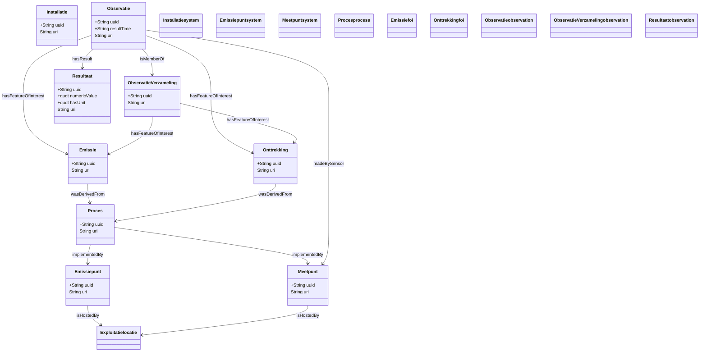

# Observaties en emissies

!!! info "Operationele stroom"
    Deze pagina beschrijft **operationele gegevens**: gebeurtenissen (emissie, onttrekking, verbruik), observaties, verzamelingen en resultaten. De structurele entiteiten waaraan ze hangen, staan in [Systemen](./systemen.md) en [Exploitant en exploitatie](./exploitant.md). De grens tussen beide stromen staat in [Twee stromen](./datamodel.md).

!!! warning "Analyse nog lopende"
    De analyse van operationele gegevens is nog lopende. De informatie in dit document kan wijzigen na afronding van de analyse.

Dit document beschrijft hoe metingen, observaties en gebeurtenissen (emissie, onttrekking, verbruik) worden voorgesteld in het RIE-IEPR-datamodel. Het volgt het **SOSA/SSN**-patroon van de W3C ([vocab-ssn](https://www.w3.org/TR/vocab-ssn/)).

## 0. Waar deze stroom aan de structuur hangt

De operationele stroom raakt de structurele stroom op precies drie plaatsen:

| Predicaat | Van | Naar (structureel/administratief) | Cardinaliteit |
|---|---|---|---|
| `prov:wasDerivedFrom` | `Emissie`, `Onttrekking`, `Verbruik` | `Proces` | verplicht, min 1 |
| `sosa:madeBySensor` | `Observatie` | het meetpunt (`ssn:System`) | optioneel, 0..1 |
| `riepr:aangifte` | `Observatie`, `ObservatieVerzameling` | `Aangifte` | optioneel, 0..1 |

Al de rest — feature of interest, resultaat, verzameling, geobserveerde eigenschap — blijft binnen deze stroom. Zie [Twee stromen](./datamodel.md).

## 1. Het SOSA/SSN observatiepatroon

Het model gebruikt het standaard SOSA-patroon voor observaties:

```
Observatie (sosa:Observation)
  ├── hasFeatureOfInterest → Emissie / Onttrekking   (verplicht, exact 1)
  ├── observedProperty     → wat werd gemeten (concept)
  ├── madeBySensor         → meetpunt / systeem
  ├── usedProcedure        → bepalingsmethode (concept)
  ├── resultTime           → wanneer werd het resultaat vastgelegd
  ├── phenomenonTime       → tijdstip of interval van het verschijnsel
  ├── hasResult            → Resultaat (verplicht, exact 1)
  │     └── qudt:numericValue + qudt:hasUnit (of rdfs:comment als tekst)
  └── isMemberOf           → ObservatieVerzameling (optioneel)
```

## 2. Gebeurtenissen: Emissie, Onttrekking

Emissie en onttrekking zijn **gebeurtenissen** en fungeren als `sosa:FeatureOfInterest`. Ze vertegenwoordigen een tijdsloos concept: de gebeurtenis zelf heeft geen timestamp, de tijd zit in de observaties.

### Emissie

Een **emissie** is een gebeurtenis waarbij stoffen de installatie verlaten (aan een emissiepunt). Ze is een subklasse van `prov:Entity` en `sosa:FeatureOfInterest` en wordt **afgeleid** (`prov:wasDerivedFrom`) van het emissieproces waaruit ze voortkomt (verplicht, minstens één):

```turtle
@prefix riepr: <https://data.riepr.omgeving.vlaanderen.be/ns/riepr#> .
@prefix sosa:  <http://www.w3.org/ns/sosa/> .
@prefix prov:  <http://www.w3.org/ns/prov#> .

# De gebeurtenis (twee-segment URI, niet geversioneerd)
<https://data.mjv.omgeving.vlaanderen.be/id/emissie/019eaca0-b8c6-7096-886c-103c3e21466c>
    a riepr:Emissie, sosa:FeatureOfInterest, prov:Entity ;
    rdfs:label "Uitstoot schoorsteen 1"@nl ;
    # De emissie is afgeleid van het emissieproces (verplicht, min 1)
    prov:wasDerivedFrom <https://data.mjv.omgeving.vlaanderen.be/id/proces/019eaca0-b8c6-7240-ac66-b7831d1b3623/2026-01-01/2026-01-01T10:00:00Z> .

# Enkele emissie, meerdere observaties:
# de emissie is het feature-of-interest van al die observaties (of verzamelingen)
```

### Onttrekking

Een **onttrekking** is een gebeurtenis waarbij grondstoffen worden gewonnen of bemonsterd (aan een onttrekkingspunt), analoog aan de emissie maar dan afgeleid van een onttrekkingsproces:

```turtle
<https://data.mjv.omgeving.vlaanderen.be/id/onttrekking/019eaca0-b8c6-7096-886c-103c3e21466d>
    a riepr:Onttrekking, sosa:FeatureOfInterest, prov:Entity ;
    rdfs:label "Grondwaterwinning put 1"@nl ;
    prov:wasDerivedFrom <https://data.mjv.omgeving.vlaanderen.be/id/proces/019eaca0-b8c6-7241-ac66-b7831d1b3624/2026-01-01/2026-01-01T10:00:00Z> .
```

> **Opmerking**: De ontologie kent naast `Emissie` en `Onttrekking` ook `riepr:Verbruik` (verbruik van stoffen), met exact hetzelfde patroon. Een klasse `Uitwisseling` is **niet** gemodelleerd, hoewel `DATAPLATFORM.md` in de applicatiedocumentatie er wel naar verwijst — dat is een openstaand punt. Een uitwisselpunt is per definitie zowel emissiepunt als onttrekkingspunt (zie [Basisaannames §5](./basisaanname.md#5-disjoint-classes)); er bestaan dus zowel emissie- als onttrekkingsgebeurtenissen voor.

### Relatie tussen punt en gebeurtenis

Een **emissiepunt** (het fysieke systeem) is niet hetzelfde als een **emissie** (de gebeurtenis). De keten loopt via het proces:

```turtle
# Emissiepunt = fysiek systeem (gehost op de locatie)
<.../emissiepunt/019e9271-145b-75f5-83d9-fe9b0b7e9540/2026-01-01/2026-01-01T10:00:00Z>
    a riepr:Emissiepunt, ssn:System ;
    sosa:isHostedBy <.../exploitatielocatie/...> .

# Emissieproces: type emissie, implementeert het emissiepunt (OWL-axioma)
<.../proces/019eaca0-b8c6-7240-ac66-b7831d1b3623/2026-01-01/2026-01-01T10:00:00Z>
    dct:type <https://data.omgeving.vlaanderen.be/id/concept/riepr/procedure-type/emissie> ;
    ssn:implementedBy <.../emissiepunt/019e9271-145b-75f5-83d9-fe9b0b7e9540/2026-01-01/2026-01-01T10:00:00Z> .

# Emissie = gebeurtenis, afgeleid van dat proces
<.../emissie/019eaca0-b8c6-7096-886c-103c3e21466c>
    a riepr:Emissie, sosa:FeatureOfInterest ;
    prov:wasDerivedFrom <.../proces/019eaca0-b8c6-7240-ac66-b7831d1b3623/2026-01-01/2026-01-01T10:00:00Z> .

# Observatie koppelt aan de emissie (niet aan het emissiepunt!)
<.../observatie/.../2026-01-01T10:00:00Z>
    sosa:hasFeatureOfInterest <.../emissie/019eaca0-b8c6-7096-886c-103c3e21466c> .
```

## 3. Observaties

Een **observatie** is een waarneming of meting. Het is een instantie van `sosa:Observation`.

### Kenmerken van een observatie

| Eigenschap | Type | Verplicht | Beschrijving |
|---|---|---|---|
| `sosa:hasFeatureOfInterest` | Emissie/Onttrekking | Ja (exact 1) | De gebeurtenis die wordt waargenomen |
| `sosa:hasResult` | riepr:Resultaat | Ja (exact 1) | Het resultaat van de meting |
| `dct:created` | dateTime | Ja (exact 1) | Aanmaaktimestamp (ook in de URI) |
| `sosa:observedProperty` | concept | Nee | Wat werd gemeten (stof, parameter) |
| `sosa:madeBySensor` | ssn:System | Nee | Het meetpunt/systeem dat de meting uitvoerde |
| `sosa:usedProcedure` | concept | Nee | De bepalingsmethode |
| `sosa:resultTime` | dateTime | Nee | Wanneer het resultaat werd vastgelegd |
| `sosa:phenomenonTime` | `time:TemporalEntity` | Nee | Tijdstip of interval van het verschijnsel (OWL-Time; er bestaat geen XSD-datatype voor een interval) |
| `sosa-2023:isMemberOf` | riepr:ObservatieVerzameling | Nee | De verzameling waartoe de observatie behoort |
| `riepr:aangifte` | riepr:Aangifte | Nee | De aangifte waaraan de observatie gerelateerd is |

### `sosa:madeBySensor`

`madeBySensor` is een standaard SOSA-property ([SOSAmadeBySensor](https://www.w3.org/TR/vocab-ssn/#SOSAmadeBySensor)): "het sensorapparaat dat de observatie heeft gemaakt". In de 2017 REC is de range `sosa:Sensor`; in het RIE-IEPR-model draagt het meetpunt die rol, en is het model daar `ssn:System`. De range is daarom in de ontologie `ssn:System`.

### URI-patroon

De observatie-URI draagt naast de identifier één tijdsegment: `{uuid}/{created}`. Er is **geen** `issued`-segment en **geen** `dct:isVersionOf`: een observatie wordt niet geversioneerd. De `created`-timestamp maakt de URI uniek per registratie; de geldigheid zit in de gekoppelde structurele entiteiten.

```turtle
@prefix sosa:  <http://www.w3.org/ns/sosa/> .
@prefix qudt:  <http://qudt.org/schema/qudt/> .
@prefix unit:  <http://qudt.org/vocab/unit/> .
@prefix dct:   <http://purl.org/dc/terms/> .

<https://data.mjv.omgeving.vlaanderen.be/id/observatie/019edc4a-1a35-7b33-9e4f-1c2d3e4f5a6b/2026-01-01T10:00:00Z>
    a sosa:Observation ;
    sosa:hasFeatureOfInterest <https://data.mjv.omgeving.vlaanderen.be/id/emissie/019eaca0-b8c6-7096-886c-103c3e21466c> ;
    sosa:observedProperty <https://data.omgeving.vlaanderen.be/id/concept/chemische_stof/MGWGWNFMUOTEHG-UHFFFAOYSA-N> ;
    sosa:resultTime "2026-01-01T10:00:00Z"^^xsd:dateTime ;
    sosa:hasResult <https://data.mjv.omgeving.vlaanderen.be/id/resultaat/019edc4a-1a40-7b33-9e4f-3e4f5a6b7c8d> ;
    dct:created "2026-01-01T10:00:00Z"^^xsd:dateTime .
```

## 4. Resultaten en waarden

Het resultaat van een observatie is een `riepr:Resultaat` — subklasse van `sosa:Result` en `qb:Observation` (RDF Data Cube) — met een **eigen URI** (`resultaat/{uuid}`), geen anonieme node:

```turtle
@prefix qudt: <http://qudt.org/schema/qudt/> .
@prefix unit:  <http://qudt.org/vocab/unit/> .

# Numeriek resultaat
<https://data.mjv.omgeving.vlaanderen.be/id/resultaat/019edc4a-1a40-7b33-9e4f-3e4f5a6b7c8d>
    a riepr:Resultaat ;
    qudt:numericValue "45.2"^^xsd:decimal ;
    qudt:hasUnit unit:MG-PER-M3 .

# Tekstueel resultaat (vrije waarde, bijvoorbeeld een kwalificatie)
<https://data.mjv.omgeving.vlaanderen.be/id/resultaat/019edc4a-1a41-7b33-9e4f-4f5a6b7c8d9e>
    a riepr:Resultaat ;
    rdfs:comment "Kleurafwijking geconstateerd, hermeting ingepland"@nl .
```

QUDT (Quantities, Units, Types and Dimensions) biedt een gestandaardiseerd systeem voor eenheden:

- `unit:MG-PER-M3` milligram per kubieke meter
- `unit:LITER-PER-SEC` liter per seconde
- `unit:M` meter
- `unit:PERCENT` percentage
- etc.

## 5. Geobserveerde eigenschappen (observedProperty)

De `sosa:observedProperty` geeft aan **wat** er werd gemeten. In het RIE-IEPR-model zijn dit concepten uit de codelijsten: chemische stoffen worden geïdentificeerd via hun InChIKey onder `…/id/concept/chemische_stof/`, andere gemeten grootheden komen uit de operationele codelijsten. Er is géén aparte `observed-property`-codelijst.

```turtle
# Voorbeeld: een gemeten stof, geïdentificeerd via haar InChIKey
<.../observatie/...> sosa:observedProperty <https://data.omgeving.vlaanderen.be/id/concept/chemische_stof/MGWGWNFMUOTEHG-UHFFFAOYSA-N> .

# Voorbeeld: een contextuele parameter uit een operationele codelijst
<.../observatie/...> sosa:observedProperty <https://data.omgeving.vlaanderen.be/id/concept/riepr/operationeel-lucht/debiet> .
```

## 6. Procedures: meetproces en bepalingsmethode

Het model kent twee verschillende vormen van "procedure", die niet verward moeten worden:

1. **Het meetproces** — een `riepr:Proces` zoals elk ander proces in het plan. Het heeft `dct:type` = [`procedure-type/meting`](https://github.com/milieuinfo/codelijst-rie-iepr/blob/main/src/source/procedure_type.csv) (dezelfde codelijst als emissie, onttrekking, verwerking, uitwissel) en **implementeert per OWL-axioma een `riepr:Meetpunt`**:

    ```turtle
    <.../proces/019e9271-1470-739e-b93b-ba3f6f75feb4/2026-01-01/2026-01-01T10:00:00Z>
        dct:type <https://data.omgeving.vlaanderen.be/id/concept/riepr/procedure-type/meting> ;
        ssn:implementedBy <.../meetpunt/019e9271-1465-72f2-8291-c289676c3ded/2026-01-01/2026-01-01T10:00:00Z> ;
        pplan:isStepOfPlan <.../hoofdproces/...> .
    ```

2. **De bepalingsmethode** — de methodologie van de meting zelf (bijv. een norm als EN 1948). Die staat op de observatie via `sosa:usedProcedure` en verwijst naar een concept uit een bepalingsmethode-codelijst. Die codelijst is nog niet gepubliceerd in [milieuinfo/codelijst-rie-iepr](https://github.com/milieuinfo/codelijst-rie-iepr/tree/main/src/source); de onderstaande URI is dus illustratief:

    ```turtle
    <.../observatie/...>
        sosa:usedProcedure <https://data.omgeving.vlaanderen.be/id/concept/riepr/bepalingsmethode/EN1948> .
    ```

## 7. Observatieverzamelingen

Eén meting of bemonstering levert doorgaans **meerdere individuele observaties** op (bijv. één per gemeten stof). Die observaties delen een gemeenschappelijke context: dezelfde emissie, hetzelfde meetpunt, hetzelfde moment. Die gedeelde context is de **observatieverzameling** (`riepr:ObservatieVerzameling`, subklasse van `sosa-2023:ObservationCollection`):

```turtle
@prefix sosa-2023: <http://www.w3.org/ns/sosa/> .

# De verzameling (twee segmenten: {uuid}/{created})
<https://data.mjv.omgeving.vlaanderen.be/id/observatieverzameling/019edc4a-1a30-7b33-9e4f-aabbccddeeff/2026-01-01T10:00:00Z>
    a riepr:ObservatieVerzameling ;
    rdfs:label "Meting schoorsteen 1, 1 januari 2026"@nl ;
    # De verzameling zelf wijst naar het feature of interest (exact 1)
    sosa:hasFeatureOfInterest <https://data.mjv.omgeving.vlaanderen.be/id/emissie/019eaca0-b8c6-7096-886c-103c3e21466c> ;
    # en bevat minstens één observatie
    sosa-2023:hasMember <https://data.mjv.omgeving.vlaanderen.be/id/observatie/019edc4a-1a35-7b33-9e4f-1c2d3e4f5a6b/2026-01-01T10:00:00Z> ,
                       <https://data.mjv.omgeving.vlaanderen.be/id/observatie/019edc4a-1a36-7b33-9e4f-2d3e4f5a6b7c/2026-01-01T10:00:00Z> ;
    # optioneel: de aangifte waaraan de meting gerelateerd is
    riepr:aangifte <https://data.mjv.omgeving.vlaanderen.be/id/aangifte/MJV-2026-0001> ;
    dct:created "2026-01-01T10:00:00Z"^^xsd:dateTime .
```

Elke individuele observatie wijst omgekeerd naar de verzameling via `sosa-2023:isMemberOf` (max 1). Een observatie kan ook **zonder** verzameling bestaan (`isMemberOf` is optioneel).

## 8. Volledig voorbeeld: emissie-observatie

Hieronder volgt een compleet voorbeeld van een emissie-observatie, van gebeurtenis tot resultaat:

```turtle
@prefix rdf:     <http://www.w3.org/1999/02/22-rdf-syntax-ns#> .
@prefix riepr:   <https://data.riepr.omgeving.vlaanderen.be/ns/riepr#> .
@prefix sosa:    <http://www.w3.org/ns/sosa/> .
@prefix ssn:     <http://www.w3.org/ns/ssn/> .
@prefix prov:    <http://www.w3.org/ns/prov#> .
@prefix qudt:    <http://qudt.org/schema/qudt/> .
@prefix unit:    <http://qudt.org/vocab/unit/> .
@prefix dct:     <http://purl.org/dc/terms/> .
@prefix time:    <http://www.w3.org/2006/time#> .

# --- Gebeurtenis (Feature of Interest), afgeleid van het emissieproces ---
<https://data.mjv.omgeving.vlaanderen.be/id/emissie/019eaca0-b8c6-7096-886c-103c3e21466c>
    a riepr:Emissie, sosa:FeatureOfInterest, prov:Entity ;
    prov:wasDerivedFrom <https://data.mjv.omgeving.vlaanderen.be/id/proces/019eaca0-b8c6-7240-ac66-b7831d1b3623/2026-01-01/2026-01-01T10:00:00Z> .

# --- Meetpunt (systeem) ---
<https://data.mjv.omgeving.vlaanderen.be/id/meetpunt/019e9271-1465-72f2-8291-c289676c3ded/2026-01-01/2026-01-01T10:00:00Z>
    a riepr:Meetpunt, ssn:System ;
    dct:isVersionOf <https://data.mjv.omgeving.vlaanderen.be/id/meetpunt/019e9271-1465-72f2-8291-c289676c3ded> .

# --- Observatie ---
<https://data.mjv.omgeving.vlaanderen.be/id/observatie/019edc4a-1a35-7b33-9e4f-1c2d3e4f5a6b/2026-01-01T10:00:00Z>
    a sosa:Observation ;
    sosa:hasFeatureOfInterest <https://data.mjv.omgeving.vlaanderen.be/id/emissie/019eaca0-b8c6-7096-886c-103c3e21466c> ;
    sosa:observedProperty <https://data.omgeving.vlaanderen.be/id/concept/chemische_stof/MGWGWNFMUOTEHG-UHFFFAOYSA-N> ;
    sosa:madeBySensor <https://data.mjv.omgeving.vlaanderen.be/id/meetpunt/019e9271-1465-72f2-8291-c289676c3ded/2026-01-01/2026-01-01T10:00:00Z> ;
    sosa:phenomenonTime [ a time:Interval ;
        time:hasBeginning [ time:inXSDDateTimeStamp "2026-01-01T08:00:00Z"^^xsd:dateTimeStamp ] ;
        time:hasEnd       [ time:inXSDDateTimeStamp "2026-01-01T12:00:00Z"^^xsd:dateTimeStamp ] ] ;
    sosa:resultTime "2026-01-01T10:00:00Z"^^xsd:dateTime ;
    sosa:hasResult <https://data.mjv.omgeving.vlaanderen.be/id/resultaat/019edc4a-1a40-7b33-9e4f-3e4f5a6b7c8d> ;
    dct:created "2026-01-01T10:00:00Z"^^xsd:dateTime .

# --- Resultaat (eigen URI) ---
<https://data.mjv.omgeving.vlaanderen.be/id/resultaat/019edc4a-1a40-7b33-9e4f-3e4f5a6b7c8d>
    a riepr:Resultaat ;
    qudt:numericValue "45.2"^^xsd:decimal ;
    qudt:hasUnit unit:MG-PER-M3 .
```

## 9. Volledig observatiepatroon

Hieronder een overzicht van het volledige SOSA/SSN-observatiepatroon met alle gekoppelde entiteiten:



## Referenties

- [End-to-end voorbeeld](./endtoend.md) — de volledige keten van exploitant tot gemeten waarde
- [Basisaannames](./basisaanname.md) — Feature of Interest, SOSA/SSN patroon
- [Installaties en emissiepunten](./systemen.md) — fysieke systemen
- [Gebruiksscenario's](./gebruiksscenario.md) — SPARQL-query's voor observaties
- **Codelijsten**: De `observedProperty`-waarden, procedure-types en bepalingsmethodes verwijzen naar SKOS-concepten uit [milieuinfo/codelijst-rie-iepr](https://github.com/milieuinfo/codelijst-rie-iepr/).
