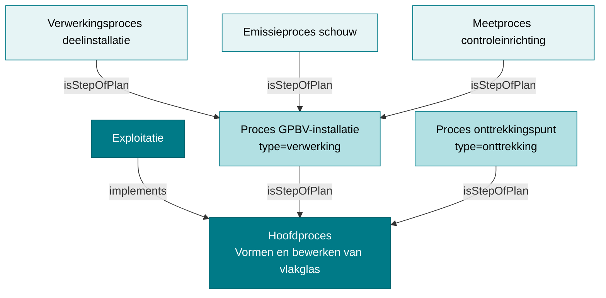
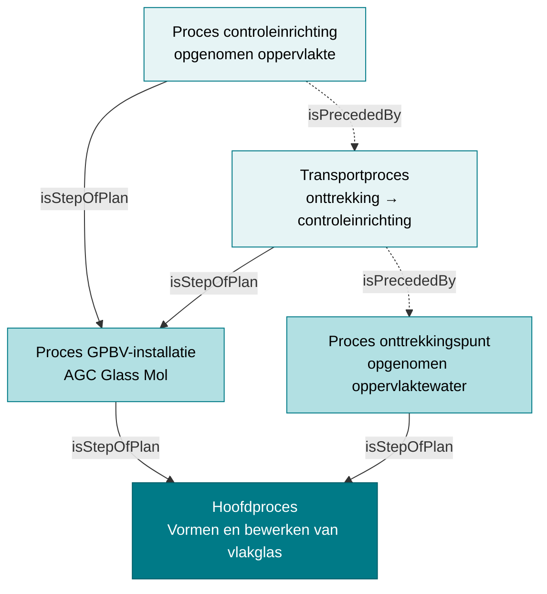
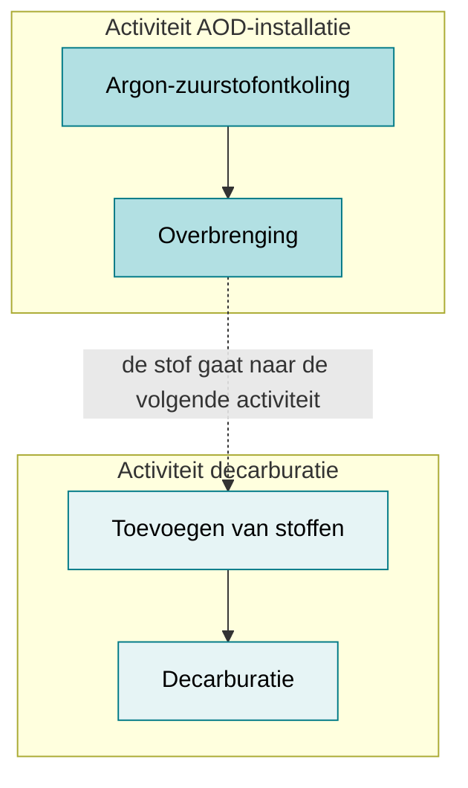

# Processtructuur: hiërarchie en volgorde

!!! info "Structurele stroom"
    Deze pagina beschrijft **structurele gegevens**: hoe processen onder elkaar hangen en hoe ze onderling geordend zijn. Zie [Twee stromen](./datamodel.md) voor de grens met de operationele stroom.

Twee P-Plan-eigenschappen lijken op elkaar maar beantwoorden een verschillende vraag:
`pplan:isStepOfPlan` zegt **waar een stap bij hoort**, `pplan:isPrecededBy` zegt **wat er
vóór komt**. Ze staan los van elkaar, en dat roept in de praktijk steeds dezelfde vraag op:

> Moeten twee processen die met `pplan:isPrecededBy` verbonden zijn, tot hetzelfde plan
> behoren?

**Nee.** De hiërarchie volgt de opbouw van de installatie of activiteit; de volgorde volgt
de stroom van de stof. Die twee vallen vaak niet samen. Deze pagina legt uit waarom, met het
voorbeeld uit het referentiedatavoorbeeld dat de vraag doorgaans oproept.

## 1. Twee onafhankelijke assen

| | `pplan:isStepOfPlan` | `pplan:isPrecededBy` |
|---|---|---|
| Beantwoordt | *Waar hoort deze stap bij?* | *Wat komt er vóór deze stap?* |
| Volgt | de opbouw van de exploitatie (activiteit, GPBV-installatie, deelinstallatie) | de stroom van stof, water of lucht |
| Cardinaliteit | 0..1 — een proces hoort bij **hoogstens één** plan | 0..n — een proces kan meerdere voorgangers hebben |
| Richting | omhoog, naar het bovenliggende proces | tegen de stroomrichting in |
| Beperkt de andere as | nee | nee |

De ontologie legt geen enkel verband tussen beide: `riepr:Proces` heeft een restrictie
`pplan:isStepOfPlan` met `owl:maxCardinality 1` en een restrictie `pplan:isPrecededBy` met
`owl:minCardinality 0`, maar **geen** axioma dat vereist dat voorganger en opvolger hetzelfde
bovenliggende plan delen.

!!! warning "`pplan:isPrecededBy` wijst tegen de stroomrichting in"
    `X pplan:isPrecededBy Y` betekent *Y komt vóór X*. Zie
    [Migratie §6.2](./migratie.md#62-hoe-u-pplanisprecededby-leest).

## 2. De hiërarchie is niet plat

Een proces kan zelf weer processen aggregeren. De typische opbouw is drie niveaus diep:



In het datavoorbeeld [AGC Glass Europe](./datavoorbeelden/agc-glass.md) hangen er maar
**twee** processen rechtstreeks onder het hoofdproces; de overige **78** hangen onder het
proces van de GPBV-installatie. De regel uit [Migratie §6.1](./migratie.md#61-elk-systeem-krijgt-een-proces)
— `pplan:isStepOfPlan` naar het proces van de GPBV-installatie, of naar het hoofdproces als
er geen GPBV-installatie is — verklaart die verdeling.

!!! tip "Gevolg voor query's"
    Wie alle processen van een exploitatie wil ophalen, mag **niet** één stap omhoog kijken.
    Gebruik het transitieve pad `pplan:isStepOfPlan+`, zoals in
    [End-to-end §query's](./endtoend.md).

## 3. Een voorbeeld waarbij de volgorde de plangrens oversteekt

Dit is het fragment uit het referentievoorbeeld dat de vraag doorgaans oproept. Het
meetproces hangt onder de GPBV-installatie, maar de keten waarin het zit begint bij het
onttrekkingsproces dat rechtstreeks onder het hoofdproces hangt. Sinds 2026-09-11 loopt die
keten via een transportproces (§5); de plangrens wordt daardoor overgestoken door het
transportproces:

```turtle
@prefix riepr: <https://data.riepr.omgeving.vlaanderen.be/ns/riepr#> .
@prefix dct:   <http://purl.org/dc/terms/> .
@prefix pplan: <http://purl.org/net/p-plan#> .
@prefix ssn:   <http://www.w3.org/ns/ssn/> .

# Niveau 1 — het hoofdproces van de exploitatie
<.../proces/019e9271-1455-78f7-94b6-becb88019f89/...>
    a riepr:Proces ;
    rdfs:label "Vormen en bewerken van vlakglas"@nl .

# Niveau 2 — het proces van de GPBV-installatie
<.../proces/019e9271-146f-7bcc-a28a-c12c48a610fc/...>
    a riepr:Proces ;
    rdfs:label "Proces GPBV installatie AGC Glass Mol"@nl ;
    dct:type <https://data.omgeving.vlaanderen.be/id/concept/riepr/procedure-type/verwerking> ;
    pplan:isStepOfPlan <.../proces/019e9271-1455-78f7-94b6-becb88019f89/...> .

# Niveau 2 — het onttrekkingsproces, óók rechtstreeks onder het hoofdproces
<.../proces/019e9271-147b-712f-8499-6bbf0d73ed8a/...>
    a riepr:Proces ;
    rdfs:label "Proces onttrekkingspunt opgenomen oppervlaktewater"@nl ;
    dct:type <https://data.omgeving.vlaanderen.be/id/concept/riepr/procedure-type/onttrekking> ;
    pplan:isStepOfPlan <.../proces/019e9271-1455-78f7-94b6-becb88019f89/...> .

# Niveau 3 — het meetproces hangt onder de GPBV-installatie
<.../proces/019e9271-1481-7a80-acfd-0fc82389cba6/...>
    a riepr:Proces ;
    rdfs:label "Proces controleinrichting opgenomen oppervlakte"@nl ;
    dct:type <https://data.omgeving.vlaanderen.be/id/concept/riepr/procedure-type/meting> ;
    pplan:isStepOfPlan <.../proces/019e9271-146f-7bcc-a28a-c12c48a610fc/...> ;
    pplan:isPrecededBy <.../proces/01a08fe8-e500-7394-829e-79a2dcd0e335/...> .

# Niveau 3 — het transportproces hangt óók onder de GPBV-installatie ...
<.../proces/01a08fe8-e500-7394-829e-79a2dcd0e335/...>
    a riepr:Proces ;
    rdfs:label "Transport van Opgenomen oppervlaktewater naar Controleinrichting Opgenomen oppervlakte"@nl ;
    dct:type <https://data.omgeving.vlaanderen.be/id/concept/riepr/procedure-type/transport> ;
    pplan:isStepOfPlan <.../proces/019e9271-146f-7bcc-a28a-c12c48a610fc/...> ;
    # ... maar wordt voorafgegaan door een proces uit een ánder plan
    pplan:isPrecededBy <.../proces/019e9271-147b-712f-8499-6bbf0d73ed8a/...> .
```

De twee assen naast elkaar — doorlopende lijn = hiërarchie, stippellijn = volgorde:



Beide uitspraken zijn tegelijk waar en spreken elkaar niet tegen:

- **Hiërarchie**: de controleinrichting en het transport horen bij de GPBV-installatie.
- **Volgorde**: het water passeert eerst het onttrekkingspunt en daarna de controleinrichting.

Het zijn twee verschillende beweringen over hetzelfde proces. Zou je eisen dat ze samenvallen,
dan zou je de controleinrichting onder het hoofdproces moeten hangen — en daarmee de
informatie verliezen dat ze tot de GPBV-installatie behoort.

## 4. Waarom dit geen uitzondering is

Een GPBV-installatie voert een activiteit uit die uit meerdere deelprocessen bestaat
(verwerking in een stookinstallatie, afgassing, overbrenging, …). Een verbinding loopt
regelmatig van zo'n deelproces naar een ander deel van de fabriek dat **niet** binnen
dezelfde activiteit valt.

Een staalfabriek illustreert dat: bij de AOD-installatie horen onder meer de spoel- en
argoninstallatie. Het argonproces is een stap van de activiteit van de AOD-installatie, die
op haar beurt een stap van het hoofdproces is. De overbrenging ligt echter tussen de
binnenste deelprocessen — dus tussen twee processen die in verschillende plannen zitten.



De aggregatie beschrijft de **installatiestructuur**, de volgorde beschrijft de
**stofstroom**. Een fabriek waarin die twee altijd samenvallen, is de uitzondering.

## 5. Tussen twee installaties staat een transportproces

Een overbrenging van stoffen tussen twee installaties is **zelf ook een proces**: een proces
met `dct:type` = `procedure-type/transport`. De ketting is dus niet
`verwerking → verwerking` maar:

```
verwerking  →  transport  →  verwerking of emissie
```

In RDF, met de omgekeerde richting van `pplan:isPrecededBy`:

```turtle
<.../proces/TRANSPORT/...>
    dct:type <https://data.omgeving.vlaanderen.be/id/concept/riepr/procedure-type/transport> ;
    pplan:isStepOfPlan <.../proces/PARENT/...> ;
    pplan:isPrecededBy <.../proces/VERWERKING-BRON/...> .

<.../proces/EMISSIE/...>
    dct:type <https://data.omgeving.vlaanderen.be/id/concept/riepr/procedure-type/emissie> ;
    ssn:implementedBy <.../emissiepunt/.../...> ;
    pplan:isStepOfPlan <.../proces/PARENT/...> ;
    pplan:isPrecededBy <.../proces/TRANSPORT/...> .
```

Het transportproces neemt de `pplan:isPrecededBy` van het volgende proces over en wijst zelf
naar het vorige (zie [Migratie §6.5](./migratie.md#65-transportprocessen)). Het is het
knooppunt waaraan de procesvariabelen (de stoffen) hangen. Het is
daardoor ook de plaats waar meerdere bronnen op één emissiepunt samenkomen — zie het
datavoorbeeld [Crematorium](./datavoorbeelden/crematorium.md).

Niet elke `pplan:isPrecededBy` vraagt om een transportproces. Waar geen overbrenging van
stof tussen twee installaties plaatsvindt — bijvoorbeeld een controleinrichting die vlak
vóór een lozingspunt in dezelfde leiding ligt — wordt de volgorde rechtstreeks gelegd (zie
[Migratie §6.3](./migratie.md#63-lozingspunt-de-controleinrichting-ligt-ervoor)).

!!! note "Toegevoegd aan het referentievoorbeeld op 2026-09-11"
    Tot dan bevatte `agc-glass_MJV_01-07-2026.ttl` **geen enkel** proces van het type
    `transport`: alle 31 `pplan:isPrecededBy`-relaties legden een rechtstreeks verband. Er
    staat nu voor elk van die 31 paren een transportproces tussen, zodat het bestand de
    keten `verwerking → transport → verwerking/emissie` toont. De proceduretypes zijn nu:
    `verwerking` (21×), `transport` (31×), `emissie` (12×), `meting` (10×), `onttrekking`
    (6×) en `hoofdactiviteit` (1×). Zie de changelog bovenaan dat bestand.

## 6. Query's die met de diepte omgaan

Alle processen van een exploitatie, ongeacht hoe diep genest:

```sparql
PREFIX riepr: <https://data.riepr.omgeving.vlaanderen.be/ns/riepr#>
PREFIX pplan: <http://purl.org/net/p-plan#>
PREFIX ssn:   <http://www.w3.org/ns/ssn/>

SELECT ?exploitatie ?proces
WHERE {
  ?exploitatie a riepr:Exploitatie ;
               ssn:implements ?hoofdproces .
  # + volgt de hiërarchie over alle niveaus, niet slechts één stap
  ?proces pplan:isStepOfPlan+ ?hoofdproces .
}
```

De processen die in de keten aan een gegeven proces voorafgaan, ongeacht hun plaats in de
hiërarchie:

```sparql
PREFIX pplan: <http://purl.org/net/p-plan#>
PREFIX rdfs:  <http://www.w3.org/2000/01/rdf-schema#>

SELECT ?voorganger ?label
WHERE {
  <https://data.mjv.omgeving.vlaanderen.be/id/proces/019e9271-1481-7a80-acfd-0fc82389cba6/2026-01-01/2026-01-01T10:00:00Z>
      pplan:isPrecededBy+ ?voorganger .
  ?voorganger rdfs:label ?label .
}
```

Merk op dat deze tweede query **geen** voorwaarde op `pplan:isStepOfPlan` bevat. Dat is
bewust: de keten mag plangrenzen oversteken.

## 7. Aandachtspunten in het referentievoorbeeld

Bij het lezen van `agc-glass_MJV_01-07-2026.ttl` zijn de volgende zaken opgevallen. De
eerste twee zijn op 2026-09-11 in dat bestand rechtgezet; de derde is bewust blijven staan.

| Vaststelling | Status |
|---|---|
| Het hoofdproces had **geen** `dct:type` | **Opgelost.** Het draagt nu `procedure-type/hoofdactiviteit` én de door het OWL-axioma vereiste `ssn:implementedBy` naar de exploitatie. |
| Er stond **geen enkel** transportproces in het bestand | **Opgelost.** Zie §5. |
| Het onttrekkingsproces hangt onder het hoofdproces, zijn meetproces onder de GPBV-installatie | **Bewust behouden.** Die asymmetrie is precies wat de plangrens in §3 doet ontstaan, en het oversteken van een plangrens is toegelaten en bedoeld. Beide processen onder de GPBV-installatie hangen zou de asymmetrie wegnemen, maar ook het enige voorbeeld van dit patroon uit het bestand halen. |
| 1 van de 62 `pplan:isPrecededBy`-relaties steekt een plangrens over | Het oversteken is dus toegelaten maar zeldzaam in dit bestand. Sinds de invoering van de transportprocessen is het het transportproces dat de grens oversteekt. |

!!! note "Ontologiewijziging van 2026-09-11: `ssn:implementedBy` aanvaardt nu ook een uitrol"
    Het OWL-axioma voor `procedure-type/hoofdactiviteit` eist
    `ssn:implementedBy some riepr:Exploitatie`, maar de restrictie op `:Proces` liet voor
    `ssn:implementedBy` alleen een `ssn:System` toe. Een `riepr:Exploitatie` is een
    `ssn:Deployment`, geen `ssn:System` — axioma en restrictie spraken elkaar dus tegen.

    De restrictie in `riepr.ttl` aanvaardt nu de unie van beide:

    ```turtle
    rdfs:subClassOf [ a owl:Restriction ;
        owl:onProperty ssn:implementedBy ;
        owl:someValuesFrom [ owl:unionOf ( ssn:System ssn:Deployment ) ] ;
        owl:minCardinality "0"^^xsd:nonNegativeInteger ;
        owl:maxCardinality "1"^^xsd:nonNegativeInteger
    ] ;
    ```

    Tegelijk is een **tweede** restrictie op diezelfde property verwijderd. Die eiste
    `:Installatie` als waarde van `ssn:implementedBy` voor élk proces, wat door elk emissie-,
    meet- en onttrekkingsproces geschonden werd, en ze had bovendien een andere
    cardinaliteit (onbegrensd in plaats van max 1). De omgekeerde richting staat al als
    `ssn:implements` op `:Installatie` zelf.

    Samen brengen die twee wijzigingen het aantal SHACL-schendingen op `ssn:implementedBy`
    in het AGC-datavoorbeeld van 30 naar 0.

## Referenties

- [Basisaannames §1](./basisaanname.md#1-processen-als-centraal-skelet) — processen als skelet van het model, en wat P-Plan is
- [Exploitant en exploitatie §5](./exploitant.md#5-het-proces) — hoofdproces en subprocessen
- [Codelijsten §Proceduretypes en transportprocessen](./codelijsten.md#proceduretypes-en-transportprocessen) — de proceduretypes en de stroomrichting
- [Migratie §6](./migratie.md#6-processen-en-de-richting-van-de-keten) — hoe de processen uit de VMM/IMJV-gegevens worden opgebouwd, inclusief [§6.5 transportprocessen](./migratie.md#65-transportprocessen)
- [Crematorium](./datavoorbeelden/crematorium.md) — meerdere bronnen die op één emissiepunt samenkomen
- [Systemen §8](./systemen.md#8-relatie-tussen-processen-en-systemen) — `ssn:implementedBy`
