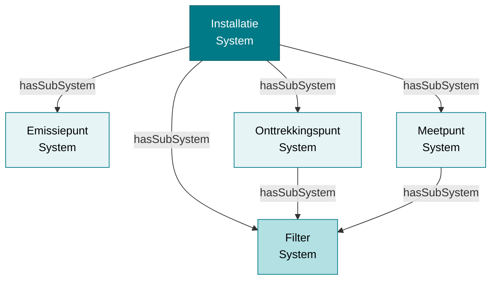
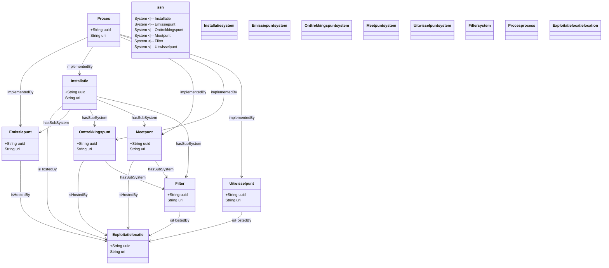

# Systemen: installaties, emissiepunten en meetpunten

!!! info "Structurele stroom"
    Deze pagina beschrijft **structurele gegevens**: de organisatie en infrastructuur van de exploitatie. Metingen, emissies en observaties komen hier niet aan bod — die staan in [Observaties en emissies](./observaties.md). De grens tussen beide stromen staat in [Twee stromen](./datamodel.md).

Dit document beschrijft systemen - installaties, emissiepunten, onttrekkingspunten, meetpunten en filters - en hun onderlinge relaties in het RIE-IEPR-datamodel.

## 1. Systemen: een gemeenschappelijk patroon

Installaties, emissiepunten, onttrekkingspunten, meetpunten en filters zijn allemaal **systemen**. Ze delen een gemeenschappelijk basispatroon:

| Eigenschap | Type | Cardinaliteit | Beschrijving |
|---|---|---|---|
| `rdfs:label` | string | 1..n | Naam van het systeem |
| `dct:type` | skos:Concept | 0..1 | Type uit de codelijst (bijv. `schoorsteen_verticale_uitstroom`) |
| `dct:issued` | date | 1..1 | Start van de geldigheid |
| `dct:valid` | date | 0..1 | Einde geldigheid (zie [Versiebeheer](./versiebeheer.md)) |
| `dct:created` | dateTime | 1..1 | Aanmaakdatum |
| `dct:modified` | dateTime | 1..1 | Laatste wijziging |
| `adms:status` | skos:Concept | 1..1 | Status (`in_dienst`, `ontmanteld`, …) |
| `riepr:inGebruikVanaf` | date | 1..1 | Datum waarop het systeem operationeel werd |
| `riepr:inGebruikTot` | date | 0..1 | Datum waarop het systeem buiten gebruik werd gesteld |
| `ssn:hasProperty` | Systeemeigenschap | 0..n | Eigenschappen van het systeem |
| `ogc:hasGeometry` | ogc:Geometry | 0..1 | Geometrie, waar de bron coördinaten levert |
| `riepr:aangifte` | riepr:Aangifte | 0..1 | De aangifte waaraan dit systeem gerelateerd is |
| `adms:identifier` | adms:Identifier | 0..n | Externe (bron/migratie) identificatoren |
| `sosa:isHostedBy` | Exploitatielocatie | — | Locatie waar het systeem gehost wordt (zie §9) |

Alle systemen zijn subklassen van `ssn:System` en `ogc:SpatialObject`.

!!! note "Twee nuances"
    - `riepr:Filter` kent in de ontologie **geen** `ssn:hasProperty`-restrictie, terwijl de bron wél filtereigenschappen levert. Zie [Migratie §9](./migratie.md#9-bekende-afwijkingen-en-open-punten).
    - `sosa:isHostedBy` staat niet in de ontologie: het is een conventie die in het datavoorbeeld consequent wordt toegepast, maar er is geen OWL-restrictie die het afdwingt (zie §9).

> **Externe identificatoren**: `adms:identifier` bewaart codes uit bron-systemen (VMM-migratie, DOMG/INSPIRE) naast de eigen RIE-IEPR-URI. Zie [Basisaannames: externe identificatoren](./basisaanname.md#9-externe-identificatoren-admsidentifier).

> **Codelijsten en Systeemeigenschappen**: Het `dct:type` van een systeem (bijv. `installatie_type`, `emissiepunt_type`) bepaalt welke `Systeemeigenschap`-concepten relevant zijn. De codelijsten in [milieuinfo/codelijst-rie-iepr](https://github.com/milieuinfo/codelijst-rie-iepr) bevatten per eigenschap metadata zoals `relevantDataType`, `relevantUnit`, `isVerplicht` en `isMeervoudig`, en koppelen eigenschappen aan systeemtypes via `relevantRiepr`. Dit maakt het mogelijk om te weten welke eigenschappen verplicht zijn voor een bepaald systeemtype en welk datatype/eenheid verwacht wordt.

## 2. Installaties

Een **installatie** is een infrastructuur voor een specifieke functie. Het type wordt bepaald door de codelijst **`installatie_type`** ([beheerd in milieuinfo/codelijst-rie-iepr](https://github.com/milieuinfo/codelijst-rie-iepr/)). In het AGC Glass-voorbeeld vinden we verschillende types:

```turtle
@prefix riepr: <https://data.riepr.omgeving.vlaanderen.be/ns/riepr#> .
@prefix dct:   <http://purl.org/dc/terms/> .
@prefix adms:  <http://www.w3.org/ns/adms#> .

# Waterzuiveringsinstallatie
<https://data.mjv.omgeving.vlaanderen.be/id/installatie/019e9271-1456-7a2f-ac4e-8904bab88f37/2026-01-01/2026-01-01T10:00:00Z>
    a riepr:Installatie, ssn:System ;
    dct:isVersionOf <https://data.mjv.omgeving.vlaanderen.be/id/installatie/019e9271-1456-7a2f-ac4e-8904bab88f37> ;
    rdfs:label "waterzuiveringsinstallatie"@nl ;
    dct:type <https://data.omgeving.vlaanderen.be/id/concept/riepr/installatie-type/waterzuivering> ;
    adms:status <https://data.omgeving.vlaanderen.be/id/concept/riepr/status-type/in_dienst> ;
    dct:issued "2026-01-01"^^xsd:date ;
    riepr:inGebruikVanaf "1970-01-01"^^xsd:date .

# GPBV-installatie
<https://data.mjv.omgeving.vlaanderen.be/id/installatie/BE_VL_000000002_INSTALLATION/2026-01-01/2026-01-01T10:00:00Z>
    a riepr:Installatie, ssn:System ;
    dct:isVersionOf <https://data.mjv.omgeving.vlaanderen.be/id/installatie/BE_VL_000000002_INSTALLATION> ;
    rdfs:label "AGC Glass Mol"@nl ;
    dct:type <https://data.omgeving.vlaanderen.be/id/concept/riepr/installatie-type/gpbv> .
```

**Opmerking:** GPBV-installaties gebruiken een andere identifier (GPBV-identificator) in plaats van een UUID.

### Installatie-eigenschappen

Installaties kunnen verschillende eigenschappen hebben, zoals:

```turtle
# Verwijderingsrendement (met parameter als concept)
<.../systeemeigenschap/019ecf80-eae8-730f-8fc4-c09b55661a9f>
    a riepr:Systeemeigenschap ;
    dct:type <https://data.omgeving.vlaanderen.be/id/concept/riepr/installatie-eigenschappen/verwijderingsrendement> ;
    rdfs:value "0"^^xsd:decimal ;
    qudt:hasUnit unit:PERCENT ;
    riepr:parameter <https://data.omgeving.vlaanderen.be/id/concept/chemische_stof/VEXZGXHMUGYJMC-UHFFFAOYSA-M> .

# Geïnstalleerd vermogen
<.../systeemeigenschap/019edc4a-1a2b-71f3-8c45-d9e8f7a6b5c4>
    a riepr:Systeemeigenschap ;
    dct:type <https://data.omgeving.vlaanderen.be/id/concept/riepr/installatie-eigenschappen/geinstalleerd_vermogen> ;
    rdfs:value "1500"^^xsd:decimal ;
    qudt:hasUnit unit:KW .

# Geïnstalleerde productiecapaciteit
<.../systeemeigenschap/019edc4a-1a2c-72e4-9d56-e0f9a8b7c6d5>
    a riepr:Systeemeigenschap ;
    dct:type <https://data.omgeving.vlaanderen.be/id/concept/riepr/installatie-eigenschappen/geinstalleerde_productiecapaciteit> ;
    rdfs:value "100"^^xsd:decimal ;
    qudt:hasUnit unit:TONNE-PER-YR .

# Waterzuiveringstechniek (met parameter als concept)
<.../systeemeigenschap/019edc4a-1a2d-73f5-ae67-f1a9d8c7e6f5>
    a riepr:Systeemeigenschap ;
    dct:type <https://data.omgeving.vlaanderen.be/id/concept/riepr/installatie-eigenschappen/waterzuiveringstechniek> ;
    rdfs:value "ultrafiltratie"@nl ;
    riepr:parameter <https://data.omgeving.vlaanderen.be/id/concept/chemische_stof/IJGRMHOSHXDMSA-UHFFFAOYSA-N> .
```

## 3. Emissiepunten

Een **emissiepunt** is een punt waar stoffen de exploitatie verlaten. Het is een subklasse van `ssn:System` en `ogc:SpatialObject`. Emissiepunten zijn **disjoint** met meetpunten; met onttrekkingspunten niet — een punt dat zowel emissies als onttrekkingen toelaat is een **uitwisselpunt** (zie [Basisaannames §5](./basisaanname.md#5-disjoint-classes)). Het type wordt bepaald door de codelijst **`emissiepunt_type`**.

### Types emissiepunten

In het AGC Glass-voorbeeld komen verschillende types voor, zoals `schoorsteen_verticale_uitstroom` en `lozingspunt`:

```turtle
# Schoorsteen (lucht)
<.../emissiepunt/019eaca0-b8c6-7096-886c-103c3e21466c/2026-01-01/2026-01-01T10:00:00Z>
    a riepr:Emissiepunt, ssn:System ;
    dct:type <https://data.omgeving.vlaanderen.be/id/concept/riepr/emissiepunt-type/schoorsteen_verticale_uitstroom> .

# Lozingspunt (water)
<.../emissiepunt/019e9271-145b-75f5-83d9-fe9b0b7e9540/2026-01-01/2026-01-01T10:00:00Z>
    a riepr:Emissiepunt, ssn:System ;
    dct:type <https://data.omgeving.vlaanderen.be/id/concept/riepr/emissiepunt-type/lozingspunt> .
```

### Emissiepunt-eigenschappen

Emissiepunten hebben specifieke eigenschappen zoals aantal punten, hoogte en equivalente diameter. Het **`dct:type`** benoemt de eigenschap (uit `emissiepunt_eigenschappen`); de waarde staat in `rdfs:value` met een `qudt:hasUnit`:

```turtle
# Aantal punten
<.../systeemeigenschap/019ecf80-eae8-7a2f-a407-9e4892c4debd>
    a riepr:Systeemeigenschap ;
    dct:type <https://data.omgeving.vlaanderen.be/id/concept/riepr/emissiepunt-eigenschappen/aantalpunten> ;
    rdfs:value "1"^^xsd:integer .

# Hoogte van de schouw (in meter)
<.../systeemeigenschap/019ecf80-eae8-7f51-881b-55d6b3278a90>
    a riepr:Systeemeigenschap ;
    dct:type <https://data.omgeving.vlaanderen.be/id/concept/riepr/emissiepunt-eigenschappen/schouw-hoogte> ;
    rdfs:value "80.0"^^xsd:decimal ;
    qudt:hasUnit unit:M .

# Diameter van de schouw (in meter)
<.../systeemeigenschap/019ecf80-eae8-78e1-aeb9-c19e6918e530>
    a riepr:Systeemeigenschap ;
    dct:type <https://data.omgeving.vlaanderen.be/id/concept/riepr/emissiepunt-eigenschappen/schouw-diameter> ;
    rdfs:value "2.2"^^xsd:decimal ;
    qudt:hasUnit unit:M .
```

> **Let op**: `riepr:parameter` is een **objectproperty** en mag dus geen tekstliteral als waarde krijgen. Ze wijst naar een concept (bijvoorbeeld een chemische stof) *waarover* de eigenschap gaat, niet naar de naam van de eigenschap zelf — die staat in `dct:type`. Het datavoorbeeld van 01/07/2026 gebruikt nog de slugs `hoogte` en `equivalente-diameter`; in de codelijst heten ze `schouw-hoogte` en `schouw-diameter`.

## 4. Onttrekkingspunten

Een **onttrekkingspunt** is een punt waar grondstoffen gewonnen worden. Het is een subklasse van `ssn:System` en `ogc:SpatialObject`.

```turtle
@prefix riepr: <https://data.riepr.omgeving.vlaanderen.be/ns/riepr#> .

<https://data.mjv.omgeving.vlaanderen.be/id/onttrekkingspunt/019e9271-145e-7f05-8a58-f670d6672c99/2026-01-01/2026-01-01T10:00:00Z>
    a riepr:Onttrekkingspunt, ssn:System ;
    dct:isVersionOf <https://data.mjv.omgeving.vlaanderen.be/id/onttrekkingspunt/019e9271-145e-7f05-8a58-f670d6672c99> ;
    rdfs:label "1 (FL koeltoren)"@nl ;
    dct:type <https://data.omgeving.vlaanderen.be/id/concept/riepr/onttrekkingspunt-type/pompput> .
```

### Onttrekkingspunt-eigenschappen

```turtle
# Diepte van het onttrekkingspunt
<.../systeemeigenschap/019edc4a-1a35-7b33-9e4f-1c2d3e4f5a6b>
    a riepr:Systeemeigenschap ;
    dct:type <https://data.omgeving.vlaanderen.be/id/concept/riepr/onttrekkingspunt-eigenschappen/diepte> ;
    rdfs:value "45.5"^^xsd:decimal ;
    qudt:hasUnit unit:M .
```

## 5. Meetpunten

Een **meetpunt** is een punt waar metingen worden uitgevoerd. Het is een subklasse van `ssn:System` en `ogc:SpatialObject`. Meetpunten zijn **disjoint** met emissiepunten en onttrekkingspunten.

```turtle
<https://data.mjv.omgeving.vlaanderen.be/id/meetpunt/019e9271-1465-72f2-8291-c289676c3ded/2026-01-01/2026-01-01T10:00:00Z>
    a riepr:Meetpunt, ssn:System ;
    dct:isVersionOf <https://data.mjv.omgeving.vlaanderen.be/id/meetpunt/019e9271-1465-72f2-8291-c289676c3ded> ;
    rdfs:label "Meetpunt 1"@nl .
```

## 6. Filters

Filters zijn ook systemen, maar treden nooit zelfstandig op: ze hangen altijd via `ssn:hasSubSystem` onder een bovenliggend systeem.

### Filter als subsysteem

Filters kunnen gekoppeld zijn aan:
- **Onttrekkingspunten** (voor grondwaterwinning)
- **Meetpunten** (voor bemonstering)

```turtle
# Filter als subsysteem van een onttrekkingspunt
<.../onttrekkingspunt/019e9271-1463-719b-948f-22a102653d02/2026-01-01/2026-01-01T10:00:00Z>
    ssn:hasSubSystem <.../filter/019e9682-6644-7edf-b3c1-487ce3d798f5/2026-01-01/2026-01-01T10:00:00Z> .

# Filter als subsysteem van een meetpunt
<.../meetpunt/019e9271-1469-7d16-975e-2b00841913e6/2026-01-01/2026-01-01T10:00:00Z>
    ssn:hasSubSystem <.../filter/019e9682-6644-711a-b032-2a0aea8fcdcb/2026-01-01/2026-01-01T10:00:00Z> .
```

### Filter-eigenschappen

De bron levert per filter een watervoerende laag, een diepte en een lengte. De codelijst `filter_eigenschappen` bevat vandaag echter **nog geen concepten**: de conceptscheme bestaat, maar is leeg. Daarom worden diepte en watervoerende laag voorlopig op het **onttrekkingspunt** gemodelleerd, via `onttrekkingspunt_eigenschappen`:

```turtle
# Watervoerende laag, op het onttrekkingspunt
<.../systeemeigenschap/019edc4a-1a36-7c04-8f5a-0a0b1c2d3e4f>
    a riepr:Systeemeigenschap ;
    dct:type <https://data.omgeving.vlaanderen.be/id/concept/riepr/onttrekkingspunt-eigenschappen/watervoerendelaag> ;
    rdfs:value "Kalksteen"@nl .
```

Of de filtergegevens uiteindelijk op de filter dan wel op de put horen, is een openstaand punt — zie [Migratie §9](./migratie.md#9-bekende-afwijkingen-en-open-punten).

## 7. Systeemhiërarchie via `ssn:hasSubSystem`

Systemen kunnen genest zijn - een installatie kan subsystemen bevatten (emissiepunten, onttrekkingspunten, meetpunten, filters):



```turtle
# GPBV-installatie als bovenliggend systeem
<.../installatie/BE_VL_000000002_INSTALLATION/2026-01-01/2026-01-01T10:00:00Z>
    ssn:hasSubSystem <.../emissiepunt/019eaca0-c589-72bc-a42c-b7140527c79f/2026-01-01/2026-01-01T10:00:00Z> ;
    ssn:hasSubSystem <.../onttrekkingspunt/019e9271-145e-7f05-8a58-f670d6672c99/2026-01-01/2026-01-01T10:00:00Z> ;
    ssn:hasSubSystem <.../meetpunt/019e9271-145f-75f2-8222-342e7028bb37/2026-01-01/2026-01-01T10:00:00Z> .
```

## 8. Relatie tussen processen en systemen

Processen koppelen aan systemen via `ssn:implementedBy`. Dit is een **OWL-axioma** in de ontologie:

```turtle
# Emissieproces → emissiepunt
<.../proces/019eaca0-b8c6-7240-ac66-b7831d1b3623/2026-01-01/2026-01-01T10:00:00Z>
    dct:type <https://data.omgeving.vlaanderen.be/id/concept/riepr/procedure-type/emissie> ;
    ssn:implementedBy <.../emissiepunt/019eaca0-b8c6-7096-886c-103c3e21466c/2026-01-01/2026-01-01T10:00:00Z> .

# Verwerkingsproces → installatie
<.../proces/019eaca0-b8c6-7351-bd77-c8942e32577d/2026-01-01/2026-01-01T10:00:00Z>
    dct:type <https://data.omgeving.vlaanderen.be/id/concept/riepr/procedure-type/verwerking> ;
    ssn:implementedBy <.../installatie/019e9271-1456-7a2f-ac4e-8904bab88f37/2026-01-01/2026-01-01T10:00:00Z> .

# Meetproces → meetpunt
<.../proces/019eaca0-b8c6-7462-ce88-d9a53f43688e/2026-01-01/2026-01-01T10:00:00Z>
    dct:type <https://data.omgeving.vlaanderen.be/id/concept/riepr/procedure-type/meting> ;
    ssn:implementedBy <.../meetpunt/019e9271-1465-72f2-8291-c289676c3ded/2026-01-01/2026-01-01T10:00:00Z> .
```

## 9. Systeem → Exploitatielocatie relatie

In het datavoorbeeld is elk systeem rechtstreeks gekoppeld aan een exploitatielocatie via `sosa:isHostedBy`. Die koppeling is redundant met de omweg exploitatie → exploitatielocatie, maar maakt het mogelijk een locatie aan een andere exploitatie te koppelen zonder het systeem te wijzigen. De ontologie legt de relatie **niet** als restrictie op; in `riepr.ttl` loopt de band tussen systeem en exploitatie via `ssn:hasDeployment` / `ssn:deployedSystem`.

```turtle
<.../installatie/019e9271-1456-7a2f-ac4e-8904bab88f37/2026-01-01/2026-01-01T10:00:00Z>
    sosa:isHostedBy <.../exploitatielocatie/019e9271-1453-7810-92ea-ccac2e6932b1/2026-01-01/2026-01-01T10:00:00Z> .

<.../emissiepunt/019e9271-145b-75f5-83d9-fe9b0b7e9540/2026-01-01/2026-01-01T10:00:00Z>
    sosa:isHostedBy <.../exploitatielocatie/019e9271-1453-7810-92ea-ccac2e6932b1/2026-01-01/2026-01-01T10:00:00Z> .
```

## 10. Uitgebreide systeemrelaties

Hieronder een overzicht van alle belangrijke relaties tussen systemen en andere entiteiten:



Dit diagram bevat **uitsluitend structurele entiteiten**. De operationele stroom (emissie, onttrekking, observatie, resultaat) hangt aan het `Proces` via `prov:wasDerivedFrom` en aan het `Meetpunt` via `sosa:madeBySensor` — zie [Twee stromen](./datamodel.md#de-drie-predicaten-die-de-grens-oversteken).

## Referenties

- [Basisaannames](./basisaanname.md) - proces-procedure koppels, disjoint classes
- [Exploitant- en exploitatiemodel](./exploitant.md) - exploitatie -> systeem relatie
- [Observaties en emissies](./observaties.md) - *operationele stroom*: metingen op deze systemen
- **Codelijsten**: De `dct:type` waarden (installatie_type, emissiepunt_type, onttrekkingspunt_type, meetpunt_type, filter_type) verwijzen naar gecontroleerde vocabulaires uit [milieuinfo/codelijst-rie-iepr](https://github.com/milieuinfo/codelijst-rie-iepr/).
