# Versiebeheer en tijdsrecht

!!! info "Structurele stroom"
    Deze pagina beschrijft **structurele gegevens**: de organisatie en infrastructuur van de exploitatie. Metingen, emissies en observaties komen hier niet aan bod — die staan in [Observaties en emissies](./observaties.md). De grens tussen beide stromen staat in [Twee stromen](./datamodel.md).

Dit document beschrijft hoe versiebeheer en tijdsrecht werken in het RIE-IEPR-datamodel, vanuit het perspectief van Linked Open Data (LOD).

## 1. URI-structuren voor versiebeheer

Het model maakt een fundamenteel onderscheid tussen **identity URIs** (tijdsloos) en **versie URIs** (met tijd).

### Identity URI (tijdsloos)

De identity URI verwijst naar de abstracte, tijdsloze entiteit. Deze verandert nooit:

```
https://data.mjv.omgeving.vlaanderen.be/id/exploitatie/{uuid}
https://data.mjv.omgeving.vlaanderen.be/id/installatie/{uuid}
https://data.mjv.omgeving.vlaanderen.be/id/emissiepunt/{uuid}
```

### Versie URI (met tijd)

Een versie URI bevat twee tijdsegmenten: de geldigheidsdatum (`issued`) en de aanmaaktimestamp (`created`):

```
https://data.mjv.omgeving.vlaanderen.be/id/exploitatie/{uuid}/{issued}/{created}
https://data.mjv.omgeving.vlaanderen.be/id/installatie/{uuid}/{issued}/{created}
```

### Structurele entiteiten zonder versiebeheer

Niet elke structurele entiteit is versioneerbaar. Exploitant, contactpersoon, systeemeigenschap, rubriek en procesvariabele dragen enkel een identifier:

```
https://data.mjv.omgeving.vlaanderen.be/id/exploitant/{uuid}
https://data.mjv.omgeving.vlaanderen.be/id/contactpersoon/{uuid}
https://data.mjv.omgeving.vlaanderen.be/id/systeemeigenschap/{uuid}
```

Wijzigingen overschrijven deze resources op dezelfde URI; er is geen historiek.

!!! info "Operationele gegevens worden niet geversioneerd"
    Dit hoofdstuk gaat **uitsluitend** over de structurele stroom. Emissies, onttrekkingen, verbruiken, observaties, verzamelingen en resultaten kennen geen `dct:issued`, geen `dct:valid` en geen `dct:isVersionOf`. Hun tijdsaspect zit in de observatie zelf (`sosa:resultTime`, `sosa:phenomenonTime`) en in de aangifte waaraan ze hangen. Zie [Observaties en emissies](./observaties.md) en [Twee stromen](./datamodel.md).

## 2. `dct:isVersionOf` de link tussen versie en identity

De relatie `dct:isVersionOf` koppelt een versie aan haar identity URI:

```turtle
@prefix dct: <http://purl.org/dc/terms/> .

# Versie → identity
<.../installatie/019e9271-1456-7a2f-ac4e-8904bab88f37/2026-01-01/2026-01-01T10:00:00Z>
    dct:isVersionOf <https://data.mjv.omgeving.vlaanderen.be/id/installatie/019e9271-1456-7a2f-ac4e-8904bab88f37> .

<.../installatie/019e9271-1456-7a2f-ac4e-8904bab88f37/2026-06-01/2026-06-01T10:00:00Z>
    dct:isVersionOf <https://data.mjv.omgeving.vlaanderen.be/id/installatie/019e9271-1456-7a2f-ac4e-8904bab88f37> .
```

Meerdere versies kunnen naar dezelfde identity verwijzen. Ze beschrijven verschillende toestanden van hetzelfde object.

## 3. Geldigheid: `dct:issued`, `dct:valid` en `adms:status`

Elke versie heeft een **geldigheidsperiode** en een status:

- `dct:issued` (verplicht): de **start** van de geldigheid.
- `dct:valid` (optioneel): het **einde** van de geldigheid. Ontbreekt het, dan geldt de versie tot op heden (of tot het begin van de volgende versie).
- `adms:status`: de status van de entiteit in die versie.

```turtle
@prefix dct:  <http://purl.org/dc/terms/> .
@prefix adms: <http://www.w3.org/ns/adms#> .

# Versie 1: geldig van 2026-01-01 tot 2026-06-30 (geldigheidseinde expliciet)
<.../exploitatie/019e9271-1454-7b38-9eae-505cace7ca54/2026-01-01/2026-01-01T10:00:00Z>
    dct:issued "2026-01-01"^^xsd:date ;
    dct:valid  "2026-06-30"^^xsd:date ;
    adms:status <https://data.omgeving.vlaanderen.be/id/concept/riepr/status-type/in_dienst> .

# Versie 2: geldig van 2026-07-01, geen einde (huidige versie)
<.../exploitatie/019e9271-1454-7b38-9eae-505cace7ca54/2026-07-01/2026-07-01T10:00:00Z>
    dct:issued "2026-07-01"^^xsd:date ;
    adms:status <https://data.omgeving.vlaanderen.be/id/concept/riepr/status-type/in_dienst> .
```

> **Note**: het model gebruikt geen `prov:wasRevisionOf` tussen versies. Versies zijn afzonderlijke URIs die via `dct:isVersionOf` naar dezelfde identity verwijzen; de volgorde en geldigheid volgt uit `dct:issued`/`dct:valid`.

### Beschikbare statussen

De codelijst [`status_type`](https://github.com/milieuinfo/codelijst-rie-iepr/blob/main/src/source/status_type.csv) telt zes waarden:

| Status | Beschrijving | ADMS-equivalent |
|---|---|---|
| `voorgesteld` | De entiteit is voorgesteld, nog niet bevestigd | `adms/status/UnderDevelopment` |
| `in_dienst` | De entiteit is actief en in gebruik | `adms/status/Completed` |
| `tijdelijk_uit_dienst` | De entiteit is tijdelijk buiten gebruik | `adms/status/Deprecated` |
| `definitief_uit_dienst` | De entiteit is definitief buiten gebruik | `adms/status/Withdrawn` |
| `ontmanteld` | De entiteit bestaat niet meer | `adms/status/Withdrawn` |
| `verkeerde_registratie` | De entiteit werd verkeerd geregistreerd en is niet van toepassing | `adms/status/Withdrawn` |

Voor **aangiften** geldt een aparte lijst (`aangifte_status`), zie [Aangifte en dossier](./aangifte.md#beschikbare-statussen-aangifte_status).

## 4. PROV-O provenance-attributen

Elke versie draagt aanmaak- en wijzigingsinformatie:

| Attribuut | Type | Waar | Beschrijving |
|---|---|---|---|
| `dct:created` | dateTime | elke versioneerbare klasse | Wanneer deze versie werd aangemaakt |
| `dct:modified` | dateTime | elke versioneerbare klasse | Wanneer deze versie voor het laatst werd gewijzigd |
| `prov:hadPrimarySource` | resource | exploitant, exploitatielocatie, exploitatie | De bron waaruit de data komt (VKBO, VIM) |
| `prov:wasAttributedTo` | riepr:Exploitant | **enkel** `riepr:Exploitatielocatie` | Aan welke exploitant de locatie is toe te schrijven (verplicht, exact 1) |

```turtle
<.../installatie/019e9271-1456-7a2f-ac4e-8904bab88f37/2026-01-01/2026-01-01T10:00:00Z>
    dct:created "2026-01-01T10:00:00Z"^^xsd:dateTime ;
    dct:modified "2026-01-01T10:00:00Z"^^xsd:dateTime .

# De band met de exploitant loopt via de exploitatielocatie
<.../exploitatielocatie/019e9271-1453-7810-92ea-ccac2e6932b1/2026-01-01/2026-01-01T10:00:00Z>
    prov:wasAttributedTo <.../exploitant/019e9271-1452-7630-be04-59ea199007a7> .
```

> `prov:wasAttributedTo` staat in de ontologie **alleen** op `riepr:Exploitatielocatie`. Systemen en processen dragen de relatie niet; wie ze uitbaat, leidt u af via de exploitatie en haar locatie.

## 5. Historische query's met tijdsrecht

### Huidige toestand opvragen

Om de huidige versie van een installatie te vinden, zoekt u naar de versie met de hoogste `dct:issued` die niet in de toekomst ligt en waarvoor `dct:valid` ontbreekt of nog niet verstreken is. In het voorbeeld staat `NOW()` voor het moment van bevragen:

```sparql
SELECT ?versie ?label ?issued
WHERE {
  ?versie a riepr:Installatie ;
          dct:isVersionOf <https://data.mjv.omgeving.vlaanderen.be/id/installatie/019e9271-1456-7a2f-ac4e-8904bab88f37> ;
          rdfs:label ?label ;
          dct:issued ?issued .
  OPTIONAL { ?versie dct:valid ?valid }
  BIND(xsd:date(NOW()) AS ?vandaag)
  FILTER(?issued <= ?vandaag)
  FILTER(!BOUND(?valid) || ?valid >= ?vandaag)
}
ORDER BY DESC(?issued)
LIMIT 1
```

### Toestand op een historisch moment

Om de toestand van een installatie op een specifiek datum te vinden (`?issued <= moment` en `dct:valid` ontbreekt of ligt na het moment):

```sparql
SELECT ?versie ?label ?issued
WHERE {
  ?versie a riepr:Installatie ;
          dct:isVersionOf <https://data.mjv.omgeving.vlaanderen.be/id/installatie/019e9271-1456-7a2f-ac4e-8904bab88f37> ;
          rdfs:label ?label ;
          dct:issued ?issued .
  OPTIONAL { ?versie dct:valid ?valid }
  FILTER(?issued <= "2026-03-01"^^xsd:date)
  FILTER(!BOUND(?valid) || ?valid >= "2026-03-01"^^xsd:date)
}
ORDER BY DESC(?issued)
LIMIT 1
```

### Versies van een entiteit door de tijd heen

```sparql
SELECT ?versie ?label ?issued ?valid ?created ?status
WHERE {
  ?versie a riepr:Installatie ;
          dct:isVersionOf <https://data.mjv.omgeving.vlaanderen.be/id/installatie/019e9271-1456-7a2f-ac4e-8904bab88f37> ;
          rdfs:label ?label ;
          dct:issued ?issued ;
          dct:created ?created .
  OPTIONAL { ?versie dct:valid ?valid }
  OPTIONAL { ?versie adms:status ?status }
}
ORDER BY ?issued, ?created
```


## 6. Exploitatie: twee lagen in versiebeheer

De exploitatie heeft een specifiek versiebeheerpatroon met **twee lagen**:

1. **Identity laag** de tijdsloze exploitatie (geen `issued`, geen `created`)
2. **Versie laag** toestanden van de exploitatie (met `issued` en `created`)

```turtle
# Laag 1: identity (geen tijd)
<.../exploitatie/019e9271-1454-7b38-9eae-505cace7ca54>
    a riepr:Exploitatie .

# Laag 2: versies (met tijd)
<.../exploitatie/019e9271-1454-7b38-9eae-505cace7ca54/2026-01-01/2026-01-01T10:00:00Z>
    a riepr:Exploitatie ;
    dct:isVersionOf <.../exploitatie/019e9271-1454-7b38-9eae-505cace7ca54> .

<.../exploitatie/019e9271-1454-7b38-9eae-505cace7ca54/2026-07-01/2026-07-01T10:00:00Z>
    a riepr:Exploitatie ;
    dct:isVersionOf <.../exploitatie/019e9271-1454-7b38-9eae-505cace7ca54> .
```

## 7. Versiebeheerpatroon in diagram

```mermaid
classDiagram
    %% Identity URIs (tijdsloos)
    class ExploitantIdentity {
      +String uuid
      String uri
    }
    class ExploitatieIdentity {
      +String uuid
      String uri
    }
    class InstallatieIdentity {
      +String uuid
      String uri
    }
    class EmissiepuntIdentity {
      +String uuid
      String uri
    }
    class ProcesIdentity {
      +String uuid
      String uri
    }
    
    %% Version URIs (met tijd)
    class ExploitatieVersion1 {
      +String uuid
      +String issued
      +String created
      String uri
    }
    class ExploitatieVersion2 {
      +String uuid
      +String issued
      +String created
      String uri
    }
    class InstallatieVersion1 {
      +String uuid
      +String issued
      +String created
      String uri
    }
    class InstallatieVersion2 {
      +String uuid
      +String issued
      +String created
      String uri
    }
    
    %% Structurele entiteit zonder versiebeheer
    class ExploitantIdentityOnly["Exploitant / Contactpersoon"] {
      +String uuid
      String uri
    }
    
    %% Links between version URIs and identity URIs (versie isVersionOf identity)
    ExploitatieVersion1 --> ExploitatieIdentity : isVersionOf
    ExploitatieVersion2 --> ExploitatieIdentity : isVersionOf
    InstallatieVersion1 --> InstallatieIdentity : isVersionOf
    InstallatieVersion2 --> InstallatieIdentity : isVersionOf
    
    %% Version attributes
    class VersionAttributes {
      +date issued
      +dateTime created
      +dateTime modified
      +Concept status
    }
    
    note for ExploitatieIdentity "Meerdere versies wijzen naar dezelfde identity, elk met een eigen issued-datum"
    note for ExploitantIdentityOnly "Geen versiebeheer: enkel een identity-URI, wijzigingen overschrijven"
    
    classDef identity fill:#e6f4f5,stroke:#007A87,stroke-width:2px
    classDef version fill:#b2e0e3,stroke:#007A87,stroke-width:2px
    classDef foi fill:#007A87,stroke:#005f6a,stroke-width:2px,color:#fff
    classDef attributes fill:#fff3cd,stroke:#b8860b,stroke-width:2px
    
    class ExploitantIdentity identity
    class ExploitatieIdentity identity
    class InstallatieIdentity identity
    class EmissiepuntIdentity identity
    class ProcesIdentity identity
    class ExploitatieVersion1 version
    class ExploitatieVersion2 version
    class InstallatieVersion1 version
    class InstallatieVersion2 version
    class ExploitantIdentityOnly foi
    class VersionAttributes attributes
```



## Referenties

- [Basisaannames](./basisaanname.md) URI-patronen, exploitatie twee lagen
- [Gebruiksscenario's](./gebruiksscenario.md) SPARQL-query's voor versiebeheer
- [Aangifte en dossier](./aangifte.md) relatie tussen indienen en versies
