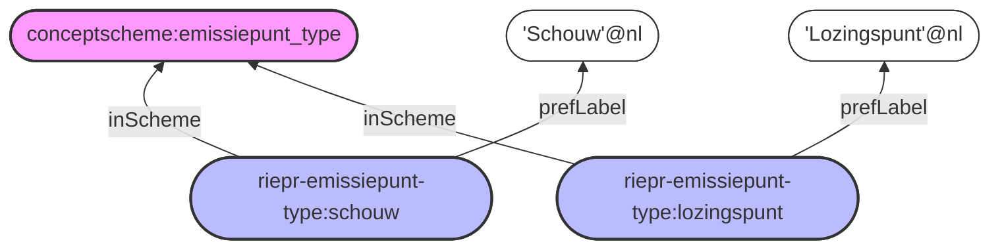
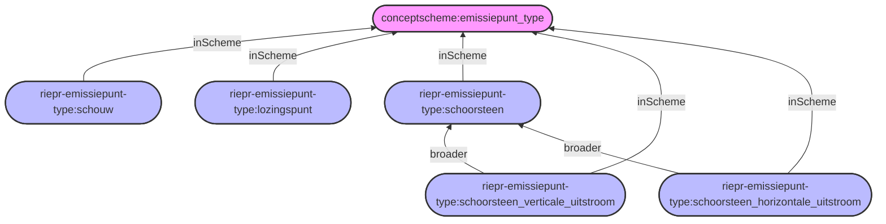
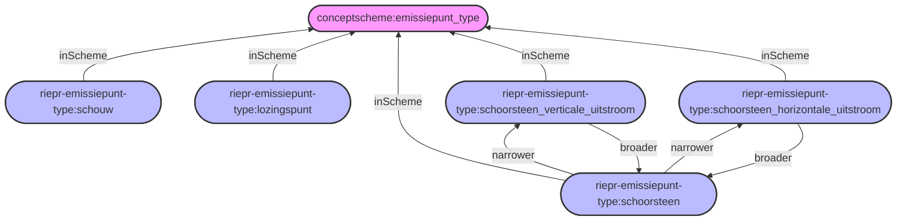

# RIE-IEPR Datamodel
## Codelijsten

Codelijsten van RIE-IEPR worden beheerd op: https://github.com/milieuinfo/codelijst-rie-iepr/tree/main/src/source in CSV bestanden die schemas linken met concepten.

```csv
_id,_type,topConceptOf,inScheme,prefLabel,altLabel,notation,definition,scopeNote,broader,relevantDataType,relevantCodeList,relevantriepr,relevantProperty,relevantQuantityKind,relevantUnit,applicableUnit,seeAlso,subject,hasProcedureForProperty,dc_type,actie,value,minValue,maxValue,operatie,technischefiche,referentiewaardeType
conceptscheme:emissiepunt_type,skos:ConceptScheme,,,Emissiepunt types,,,Een typering van verschillende soorten emissiepunten.
riepr-emissiepunt-type:emissiepunt,skos:Concept,conceptscheme:emissiepunt_type,conceptscheme:emissiepunt_type,Emissiepunt,,emissiepunt,Een regulier emissiepunt.,,,,,,,,,,
riepr-emissiepunt-type:lozingspunt,skos:Concept,conceptscheme:emissiepunt_type,conceptscheme:emissiepunt_type,Lozingspunt,,lozingspunt,Een lozing naar water.
```

De kolommen in deze codelijsten kunnen labels bevatten en andere attributen die een concept verder beschrijven.



### Hierarchie
Binnen concepten kan je het `broader` veld gebruiken om een hiërarchie aan te geven tussen concepten. In bovenstaand voorbeeld is er geen hiërarchie, maar indien er een hiërarchie is kan deze automatisch worden meegenomen in de gegenereerde code en documentatie.

```csv
_id,_type,topConceptOf,inScheme,prefLabel,altLabel,notation,definition,scopeNote,broader,relevantDataType,relevantCodeList,relevantriepr,relevantProperty,relevantQuantityKind,relevantUnit,applicableUnit,seeAlso,subject,hasProcedureForProperty,dc_type,actie,value,minValue,maxValue,operatie,technischefiche,referentiewaardeType
conceptscheme:emissiepunt_type,skos:ConceptScheme,,,Emissiepunt types,,,Een typering van verschillende soorten emissiepunten.
riepr-emissiepunt-type:emissiepunt,skos:Concept,conceptscheme:emissiepunt_type,conceptscheme:emissiepunt_type,Emissiepunt,,emissiepunt,Een regulier emissiepunt.,,,,,,,,,,
riepr-emissiepunt-type:lozingspunt,skos:Concept,conceptscheme:emissiepunt_type,conceptscheme:emissiepunt_type,Lozingspunt,,lozingspunt,Een lozing naar water.
riepr-emissiepunt-type:schouw,skos:Concept,conceptscheme:emissiepunt_type,conceptscheme:emissiepunt_type,Schouw,,schouw,Een schouw.
riepr-emissiepunt-type:schoorsteen,skos:Concept,conceptscheme:emissiepunt_type,conceptscheme:emissiepunt_type,Schoorsteen,,schoorsteen,Een schoorsteen.
riepr-emissiepunt-type:schoorsteen_verticale_uitstroom,skos:Concept,conceptscheme:emissiepunt_type,conceptscheme:emissiepunt_type,Schoorsteen met verticale uitstroom,,schoorsteen_verticale_uitstroom,,,riepr-emissiepunt-type:schoorsteen
riepr-emissiepunt-type:schoorsteen_horizontale_uitstroom,skos:Concept,conceptscheme:emissiepunt_type,conceptscheme:emissiepunt_type,Schoorsteen met horizontale uitstroom,,schoorsteen_horizontale_uitstroom,,,riepr-emissiepunt-type:schoorsteen,,,,,,,,,,,,,,,,,,
```



In de gegeneerde codelijsten zal de inverse relatie `narrower` ook automatisch worden toegevoegd op basis van de `broader` relatie. In bovenstaand voorbeeld zal `riepr-emissiepunt-type:schoorsteen` automatisch een `narrower` relatie hebben met `riepr-emissiepunt-type:schoorsteen_verticale_uitstroom` en `riepr-emissiepunt-type:schoorsteen_horizontale_uitstroom`.



### Gelinkte codelijsten
De relaties (predicates) die gebruikt worden om codelijsten te linken met elkaar liggen niet vast en hangen af van de relatie.
Zo zal een eenheid de relatie `relevantUnit` gebruiken en een parameter `paramterDimensie`.

Intern binnen de codelijsten is er echter meestal een specifieke relatie die gebruikt wordt. Binnen RIE-IEPR is dit `relevantRiepr`. Deze relatie geeft aan dat een concept
gerelateerd is aan een ander RIE-IEPR concept.