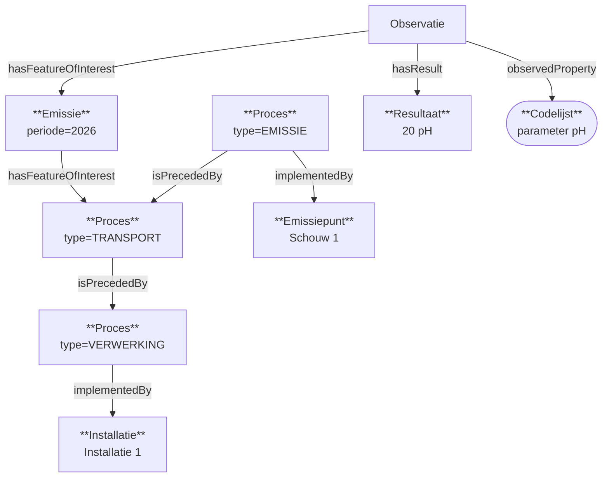
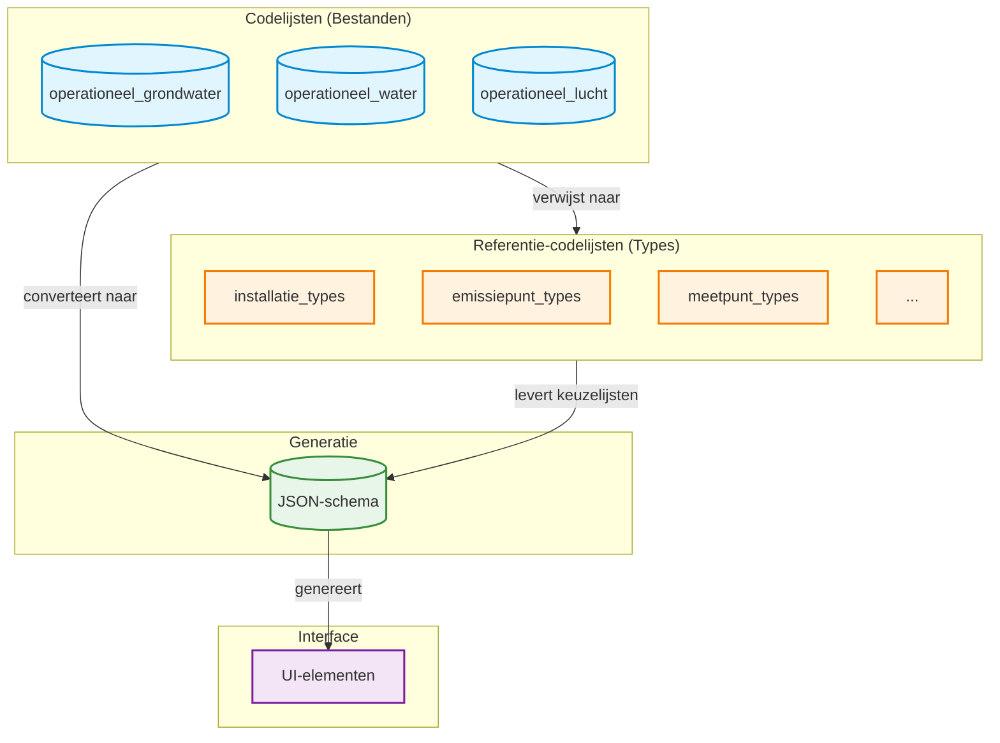

# RIE-IEPR Datamodel
## Observaties

[TOC]

### Concepten
**Meetbare systemen**
De metingen en observaties gebeuren op systemen die meetbaar zijn. Algemeen zijn dit alle meetpunten, maar ook andere systemen kunnen meetbaar zijn (bepaalde types emissiepunten).
De logica die bepaald welk systeem meetbaar is zit in de codelijsten van typeringen.

**Processen**
Processen van de structuur beschrijven de samenhang en activiteit van installaties, emissiepunten, etc.
Qua rapportering van operationele gegevens zullen we steeds op een proces rapporteren omdat we bijvoorbeeld
rapporteren op "het rookgas uit schouw 1 afkomstig van de directe stookinstallatie". M.a.w. de pijl van de installatie naar de schouw.

**Emissie, Onttrekking en Uitwisseling**
De meting heeft betrekking tot het meten of observeren van emissie, onttrekking of uitwisseling over een periode (jaar).

**Tijdstip van observatie**
Het tijdstip waarop een observatie plaats heeft gevonden.

**Tijdstip van het fenomeen**
Het tijdstip waarop de emissie, (...) heeft plaatsgevonden. In het geval van jaarvrachten gaat dit om het volledige jaar (range).

### Basis datamodel
Observaties zijn gekoppeld aan Emissie, Onttrekking of Uitwisseling. Dit is de feature of interest voor een specifieke periode en proces waarop gemeten wordt. 

### Versionering
Net zoals structurele gegevens hebben observaties versionering. Dit is nodig om toe te laten dat iemand gegevens kan corrigeren of intrekken.
Anders dan de structurele gegevens is er geen 'geldig vanaf' datum. De observaties zijn gekoppeld aan een aangifte (net zoals structuur) indien ze zijn ingediend.
Wanneer een andere aangifte deze overschrijft dan is de datum van de aangifte bepalend.

### Architecturale flow
De doelstelling van operationele gegevens is om a.h.v. codelijsten een JSON-schema te kunnen aanmaken zonder bijkomende applicatielogica te voorzien die specifiek bepaald waar deze gegevens moeten ophangen.
De codelijst van operationele gegevens zegt **wat** we vragen (label, eenheden,... gelijkaardig als eigenschappen), **waarop** dit bevraagd mag worden (welke types, gelijkaardig als eigenschappen) en bijkomende bepalingen 
voor operationele gegevens om aan te geven wat de datum/range is (**wanneer**).

