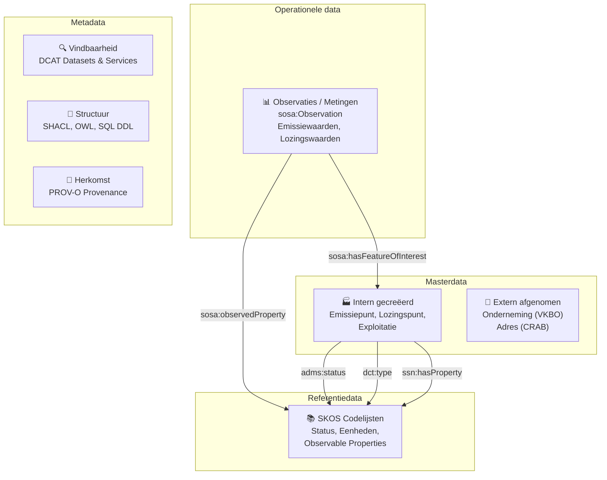
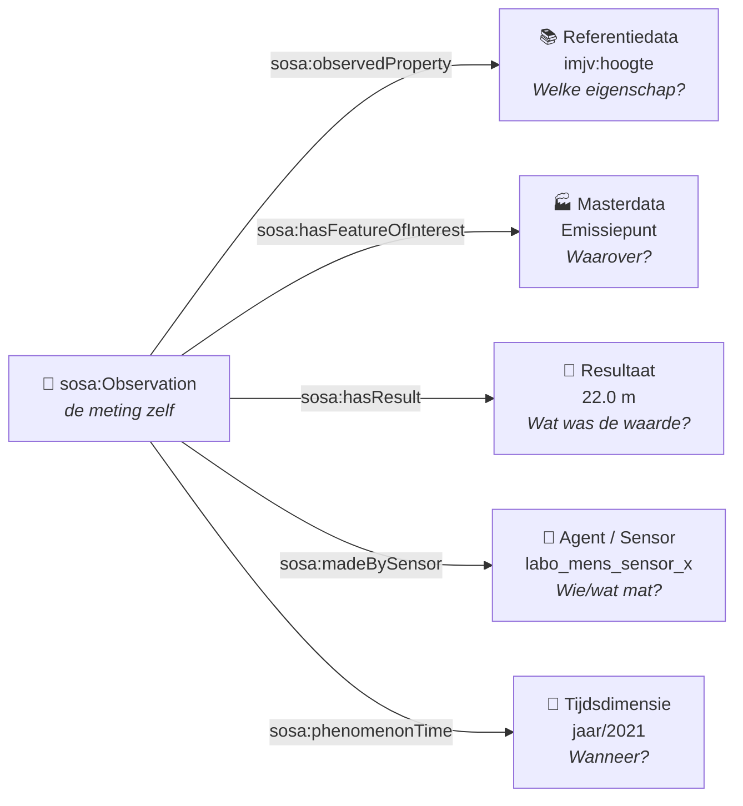
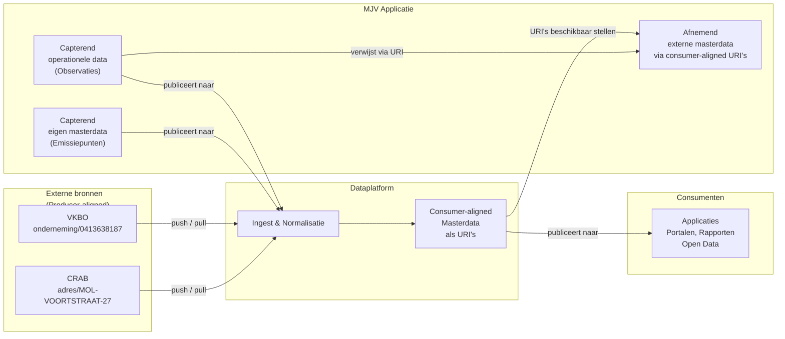
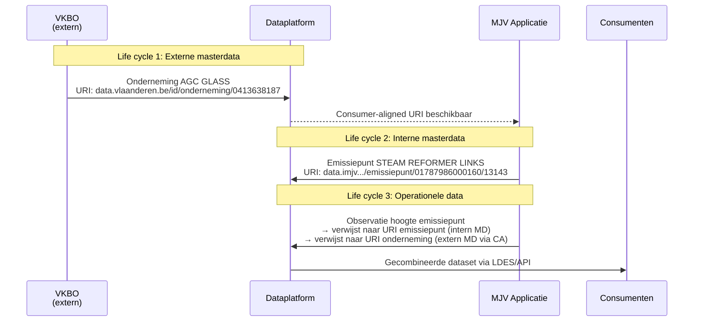
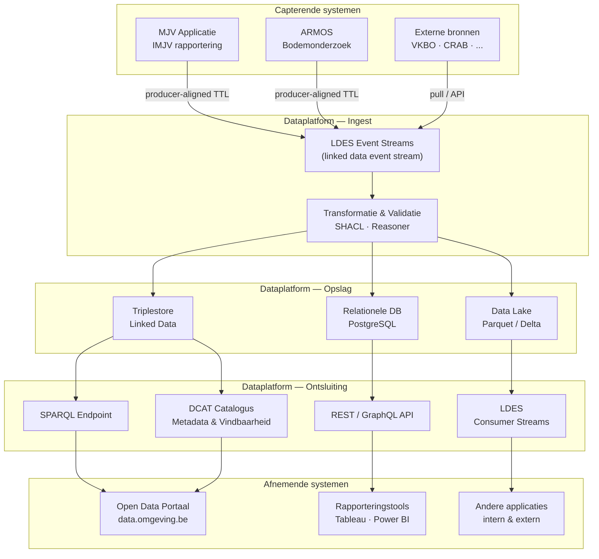

# Functionele kennisdeling: Datalake & Dataplatform

**Datum:** 3 juni 2026 | **Duur:** ~30 minuten  
**Doelpubliek:** business, analisten, ontwikkelaars

---

## Agenda

1. De vier soorten data — met voorbeelden uit AGC Glass Mol
2. SOSA/SSN: hoe we meten en rapporteren modelleren
3. Producer- vs. consumer-aligned data
4. Capterende en afnemende systemen — en de life cycle van data
5. High-level architectuur dataplatform

---

## 1. De vier soorten data

In ons dataplatform onderscheiden we vier soorten data. Ze hebben elk een andere life cycle, een andere beheerder en een andere technische vorm.



---

### 1.1 Masterdata

Masterdata beschrijven de **duurzame entiteiten** in onze wereld: bedrijven, vestigingen, emissiepunten, installaties. Ze hebben een relatief stabiele life cycle en worden als persistent beschouwd.

Belangrijk onderscheid: sommige masterdata worden **afgenomen van externe bronnen**, andere worden **zelf gecreëerd** door de applicatie.

**Extern afgenomen masterdata** — URI uit de namespace van de externe bron:

```turtle
# Onderneming afgenomen van VKBO — de URI hoort bij data.vlaanderen.be
<https://data.vlaanderen.be/id/onderneming/0413638187>
    a riepr:Exploitant ;
    rdfs:label "AGC GLASS EUROPE"@nl ;
    adms:status st:in_gebruik ;
    imjv:kbonummer "0413.638.187"^^imjv:KBONummer ;
    locn:address <https://data.cbb.omgeving.vlaanderen.be/id/address/...> .
```

**Intern gecreëerde masterdata** — URI in onze eigen namespace:

```turtle
# Emissiepunt gecreëerd door MJV — de URI hoort bij data.imjv.omgeving.vlaanderen.be
<https://data.imjv.omgeving.vlaanderen.be/id/emissiepunt/01787986000160/13143>
    a riepr:Emissiepunt , ssn:System ;
    rdfs:label "AGC GLASS EUROPE VESTIGING MOL : STEAM REFORMER LINKS (2021)" ;
    adms:status st:in_gebruik ;
    ssn:hasProperty imjv:hoogte , imjv:diameter .
```

> **Kernboodschap voor business:** een "emissiepunt" is de schouw of het afvoerpunt aan een installatie. Het bestaat als object in ons systeem, onafhankelijk van of er al gemeten is. Het is masterdata omdat we dit zelf registreren en beheren.

---

### 1.2 Referentiedata

Referentiedata zijn de **gecontroleerde woordenlijsten** (codelijsten) die we gebruiken om masterdata en operationele data te typeren, te classificeren of te kwalificeren. Ze worden beheerd als SKOS-conceptschema's.

Typisch gebruik:
- `adms:status` → status van een object (in gebruik, buiten gebruik, …)
- `dcterms:type` → type van een emissiepunt (lucht, water, bodem, …)
- `sosa:observedProperty` → welke eigenschap gemeten wordt
- `ssn:hasProperty` → welke eigenschappen een object *kan* hebben

```turtle
# Status — meervoudig getypeerd als SKOS concept én ADMS status
st:in_gebruik
    a adms:Status , skos:Concept ;
    skos:prefLabel "In gebruik"@nl .

# Observable property — tegelijk een SKOS concept, SSN property en SOSA observeerbare eigenschap
imjv:hoogte
    a ssn:Property , sosa:Property , sosa:ObservableProperty ;
    rdfs:label "Hoogte"@nl .

imjv:diameter
    a ssn:Property , sosa:Property , sosa:ObservableProperty ;
    rdfs:label "Diameter"@nl .
```

> **Kernboodschap:** referentiedata zijn de "look-up tabellen" van het semantische web. Ze zijn stabiel, worden centraal beheerd en door meerdere applicaties gedeeld.

---

### 1.3 Operationele data

Operationele data zijn de **dynamische meetresultaten en rapporteringswaarden**. Ze zijn het resultaat van een meting, berekening of registratie op een bepaald moment.

Ze verwijzen altijd:
- **naar masterdata** via `sosa:hasFeatureOfInterest` — *over welk object gaat deze meting?*
- **naar referentiedata** via `sosa:observedProperty` — *welke eigenschap wordt gemeten?*

```turtle
# Observatie van de hoogte van een emissiepunt (AGC Glass, 2021)
<https://data.imjv.omgeving.vlaanderen.be/id/emissiepunt/01787986000160/2269/jaar/2021/imjv#hoogte>
    a riepr:Observatie , sosa:Execution ;

    # Verwijst naar MASTERDATA: over welk object gaat het?
    sosa:hasFeatureOfInterest
        <https://data.imjv.omgeving.vlaanderen.be/id/emissiepunt/01787986000160/2269/jaar/2021> ;

    # Verwijst naar REFERENTIEDATA: welke eigenschap?
    sosa:observedProperty imjv:hoogte ;

    # Het resultaat
    sosa:hasResult <.../imjv#hoogte/result> ;
    sosa:madeBySensor agent:labo_mens_sensor_x ;
    sosa:phenomenonTime <https://data.riepr.omgeving.vlaanderen.be/id/tijd/jaar/2021> ;
    sosa:resultTime "2022-01-01T00:00:00"^^xsd:dateTime .
```

---

### 1.4 Metadata

Metadata beschrijven **niet de dingen zelf, maar de data over die dingen**. Drie smaken:

**Vindbaarheid (DCAT)** — zodat portalen en catalogussen datasets kunnen indexeren:

```turtle
<https://data.imjv.omgeving.vlaanderen.be/id/dataset/emissies-lucht>
    a dcat:Dataset ;
    dct:title "Emissies naar lucht (IMJV)"@nl ;
    dct:publisher <https://data.vlaanderen.be/id/organisatie/OVO001827> ;
    dcat:distribution [
        a dcat:Distribution ;
        dcat:downloadURL <https://data.imjv.omgeving.vlaanderen.be/files/emissies-lucht-2021.ttl> ;
        dct:format <https://www.iana.org/assignments/media-types/text/turtle>
    ] ;
    dcat:service [
        a dcat:DataService ;
        dcat:endpointURL <https://ldes.imjv.omgeving.vlaanderen.be/emissies> ;
        dct:conformsTo <https://w3id.org/ldes/specification>
    ] .
```

**Structuur (SHACL / OWL / SQL DDL)** — zodat tools en teams weten welke velden verplicht zijn:

```turtle
# SHACL shape: emissiepunt moet een label, status en hoogte-eigenschap hebben
imjv:EmissiepuntShape
    a sh:NodeShape ;
    sh:targetClass riepr:Emissiepunt ;
    sh:property [
        sh:path rdfs:label ;
        sh:minCount 1 ;
        sh:datatype xsd:string
    ] ;
    sh:property [
        sh:path adms:status ;
        sh:minCount 1 ;
        sh:class adms:Status
    ] .
```

**Herkomst (PROV-O)** — zodat we kunnen traceren hoe data tot stand is gekomen:

```turtle
<.../observatie/hoogte>
    prov:wasGeneratedBy <.../rapporterings-activiteit/2021> ;
    prov:wasDerivedFrom <.../brondata/imjv-formulier-2021> .
```

---

## 2. Het SOSA-observatiepatroon

SOSA (Sensor, Observation, Sample, Actuator) is de W3C-standaard die we gebruiken om metingen en rapporteringen uniform te modelleren. Elke observatie beantwoordt vier vragen:



Dit patroon werkt op alle niveaus: fysische metingen (NO₂-concentratie in mg/m³), geometrische observaties (schoorsteehhoogte in meter), maar ook berekende aggregaten en zelfgerapporteerde jaarcijfers.

---

## 3. Producer-aligned vs. consumer-aligned data

Dit is het meest kritische architectuurconcept — en tegelijk het minst intuïtieve.

### Het probleem

Applicaties hebben de neiging om **interne identifiers** te gebruiken wanneer ze naar andere objecten verwijzen. Ons eigen systeem kent een emissiepunt als ID `2269`. Een andere applicatie kent dezelfde onderneming als interne klant-ID `K-00412`. Noch `2269` noch `K-00412` is een stabiele, universele identifier die buiten de grenzen van de eigen applicatie werkt.

### De oplossing: het dataplatform als vertaallaag



### Wat betekent dit concreet?

| | Capterend systeem | Afnemend systeem |
|---|---|---|
| **Definitie** | Creëert en beheert de data | Gebruikt de data van elders |
| **Masterdata onderneming** | VKBO (extern) | MJV applicatie |
| **Masterdata emissiepunt** | MJV applicatie | Alle andere applicaties |
| **Operationele data (observaties)** | MJV applicatie | Rapporteringstools, open data |

> **Kernregel:** wanneer een observatie verwijst naar een onderneming of adres, gebruikt ze **altijd de consumer-aligned URI** (`https://data.vlaanderen.be/id/onderneming/0413638187`), nooit een interne database-ID.

---

## 4. Life cycles van data — waarom dit ertoe doet

Elk datatype heeft een eigen life cycle. Die mogen elkaar **niet vermengen**.



### Antipatroon — zo niet

```turtle
# FOUT: interne ID gebruikt ipv. URI
<.../observatie/hoogte>
    sosa:hasFeatureOfInterest "2269" ;       # ← interne ID, onbruikbaar buiten MJV
    imjv:exploitantId "K-00412" .            # ← interne sleutel, geen URI
```

### Correct patroon

```turtle
# JUIST: URI's gebruikt — werkt over applicatiegrenzen heen
<https://data.imjv.omgeving.vlaanderen.be/id/emissiepunt/01787986000160/2269/jaar/2021/imjv#hoogte>
    a riepr:Observatie , sosa:Execution ;
    sosa:hasFeatureOfInterest
        <https://data.imjv.omgeving.vlaanderen.be/id/emissiepunt/01787986000160/2269/jaar/2021> ;
    sosa:observedProperty imjv:hoogte .
```

---

## 5. High-level architectuur dataplatform



**Separation of concerns — samengevat:**

| Laag | Verantwoordelijkheid |
|---|---|
| Capterende systemen | Creëren correcte data met URI's; scheiden master- van operationele data |
| Ingest & Validatie | Controleert SHACL-conformiteit; verrijkt met metadata |
| Opslag | Meerdere representaties voor verschillende use cases |
| Ontsluiting | Consumer-aligned views; DCAT-beschrijvingen voor vindbaarheid |
| Afnemende systemen | Consumeren via stabiele URI's; muteren niét |

---

## Takeaways

1. **Vier soorten data, vier life cycles.** Master, referentie, operationeel en metadata mogen niet door elkaar lopen.
2. **URI's zijn de lijm.** Geen interne ID's in gepubliceerde data — altijd de URI van het platform.
3. **SOSA structureert metingen universeel.** Elke observatie beantwoordt: *wat*, *waarover*, *door wie*, *wanneer*, *met welk resultaat*.
4. **Je bent capterend én afnemend.** MJV creëert emissiepunten (capterend) en neemt ondernemingen af (afnemend) bij het capteren van emissiepunten. MJV creëert observaties (capterend) en neemt emissiepunten af (afnemend) bij het capteren van observaties. Die rollen vragen een bewuste architectuurkeuze.
5. **Consumer-aligned data beschermen consumenten.** Externe wijzigingen in bronnen worden door het platform geabsorbeerd; consumenten zien een stabiele view.

---

*Brondata in dit document: AGC Glass Europe Mol, IMJV-rapportering 2021 (`AGC_GLASS_MOL.ttl`)*
