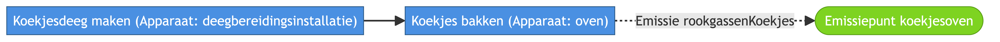

# 🍪 Van koekjes tot CO₂

**Een visueel verhaal over productie, installaties en emissierapportage**

## Overzicht




## 🟦 1. Het vertrekpunt: een bedrijf op een locatie

**🏭 Koekjesfabriek**

**📍 Exploitatieplatform** (site met gebouwen en installaties)

**👤 Exploitant** (juridisch verantwoordelijke organisatie)

➡️ De exploitant werkt op deze locatie en is verantwoordelijk voor alles wat daar gebeurt.

## 🟦 2. Het plan: hoe koekjes gemaakt worden

**📘 Plan: “Koekjes maken”**

Dit plan beschrijft:

* wat er moet gebeuren

* in welke volgorde

* met welke soorten installaties

❗ Geen timing, geen metingen, geen waarden

➡️ Het is een **blauwdruk / werkinstructie**

## 🟦 3. De stappen in het plan

🔹 Stap 1 – Deeg maken

🔹 Stap 2 – Koekjes bakken

🔹 Stap 3 – Emissie van rookgassen

Elke stap zegt:
```
“Dit deel van het proces hoort bij dit type installatie.”
```


## 🟦 4. De installaties die het plan uitvoeren

**⚙️ Deegbereidingsinstallatie**

**🔥 Oven**

**🌫️ Emissiepunt (schoorsteen)**

➡️ Dit zijn echte, fysieke systemen

➡️ Ze staan samen opgesteld op de site

## 🟦 5. De deployment: zo stond alles opgesteld in 2020

**🧩 Deployment (2020)**

🔹 welke installaties actief waren

🔹 waar ze stonden

🔹 in welke periode

**📆 1 jan 2020 – 31 dec 2020**

➡️ Antwoord op de vraag:

```
“Met welke opstelling werd er dat jaar geproduceerd?”
```

## 🟦 6. De uitvoering: wat er effectief gebeurt

⏱️ In 2020 gebeurden er echte activiteiten:

🔹 deeg maken

🔹 bakken

🔹 rookgassen uitstoten

Dit zijn:

🔹 **concrete handelingen**

🔹 **in de tijd**

🔹 **met specifieke installaties**

➡️ Dit is de realiteit, niet het plan.

## 🟦 7. Wat er fysiek door het proces stroomt

**📥 Bloem**

**➡️ Deeg**

**➡️ Koekjes**

♻️ Bij het bakken:

🔹 ontstaan **rookgassen**

🔹 die via het emissiepunt worden uitgestoten

➡️ Alles wat eruit komt, is te herleiden tot een stap in het proces.

## 🟦 8. De meting: CO₂-emissie rapporteren

**📊 Observatie: CO₂-vracht**

Wat wordt gemeten?

🔹 eigenschap: **CO₂-vracht**

🔹 van: **uitgestoten rookgassen**

🔹 over: **kalenderjaar 2020**

📆 Niet één meetmoment
📆 Maar een **jaarlijkse emissie**

➡️ Resultaat: **6 ton CO₂**

## 🟦 9. Waarom de tijd expliciet is

**🕰️ Emissiejaar 2020**

🔹 begin: 1 januari

🔹 einde: 31 december

➡️ Zo is altijd duidelijk:

🔹 over welke periode een cijfer gaat

🔹 ook jaren later, bij audits of inspecties

## 🟦 10. Verantwoordelijkheid en governance

**👤 Exploitant**

🔹 werkt volgens het plan

🔹 beheert de installaties

🔹 is verantwoordelijk voor de emissies

➡️ Cruciaal voor:

🔹 vergunningen

🔹 rapportage

🔹 juridische duidelijkheid

## 🟩 Eindbeeld: alles valt samen

**🧠 Het plan** bepaalt hoe

**⚙️ De installaties** bepalen waarmee

**📆 Het deployment** bepaalt wanneer en waar

**📊 De observatie** bepaalt hoeveel

➡️ Samen vertellen ze één coherent verhaal:

```
“Deze exploitant produceerde in 2020 koekjes op deze site, met deze installaties, volgens dit plan, en stootte daarbij 6 ton CO₂ uit.”
```